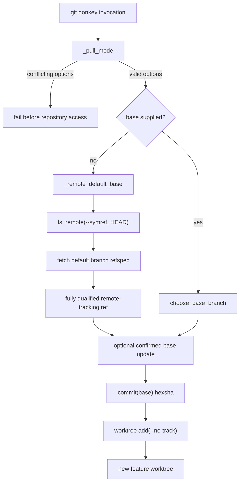

# Default bases and explicit pull modes

For screen readers: The following flowchart shows how `git donkey` validates
its options, selects a base branch, optionally updates that base, and creates
the new worktree.

_Figure 1: git-donkey base selection and worktree creation flow._

## Decision

An omitted `git donkey` base means the fetched default branch on the principal
remote, not a branch in the primary checkout. The principal remote remains the
first configured remote, preserving the existing discovery rule.

The workflow queries the remote's advertised symbolic `HEAD` and explicitly
fetches that branch into its fully qualified remote-tracking reference. This
avoids relying on a stale local `remote/HEAD` alias and supports repositories
whose normal fetch configuration excludes the default branch. Failure to
identify or fetch the default branch is an error, not permission to guess
`main` or use local work. An explicit base bypasses default-branch discovery.

Before creating a new branch, the selected base is resolved to a commit object
ID. Worktree creation uses that ID with `--no-track`, so a new feature branch
does not accidentally track the remote's default branch. Existing local and
remote feature branches retain their separate reuse and tracking behaviour.

## Local checkout updates

Fetching remote references is distinct from integrating changes into a local
checkout. No local base pull or update prompt occurs by default. Existing
`--no-pull` callers remain supported; that option now explicitly selects the
default behaviour.

`--pull-rebase` enables the previous behind-base confirmation workflow with
`git pull --rebase`. `--pull-ff` enables the same workflow with
`git pull --no-rebase --ff-only`, overriding configured rebase or merge
preferences. These flags and `--no-pull` are mutually exclusive, and conflicts
are rejected before repository access. A declined or non-interactive prompt
continues to skip the update.

An update may run only in the worktree recorded as holding that local base.
When an update is needed but no worktree holds the base, the operation fails
rather than pulling into an unrelated branch in the primary checkout. Local
bases without a remote counterpart retain the existing skip behaviour.

An omitted base continues to select the remote commit even when an opt-in
update also synchronizes its local counterpart. An explicit base, including
`.` for the calling worktree's branch, selects the local branch after any
confirmed update and therefore can include local commits.

## Verification contract

Real-repository tests cover non-`main` defaults, non-`origin` remotes, a stale
remote `HEAD`, narrow fetch configuration, and an unavailable advertised
default. They also verify preservation of local commits, the index, tracked
modifications, and untracked files during default worktree creation.

Pull-mode tests cover accepted and declined prompts, actual rebase and
fast-forward operations, divergent histories, hostile pull configuration,
and base branches held in another worktree. CLI tests exercise the Cyclopts
parser, including conflicting options. Unit tests cover advertisement parsing
and explicit mode selection.

The change does not alter remote selection, template overlays, `git track`,
`git plonk`, branch cleanup, or the confirmation policy for existing updates.
