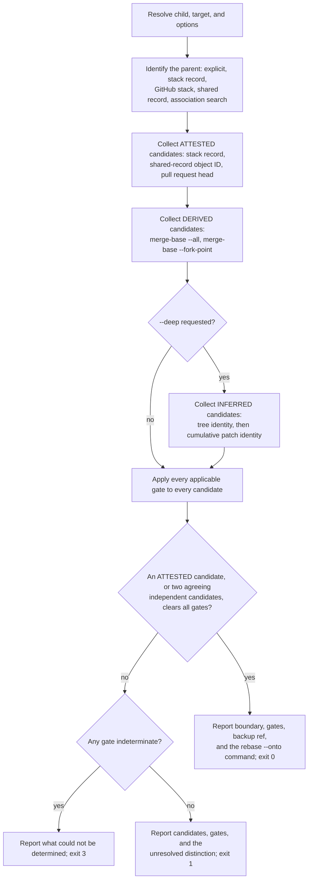

# Add `git wheresat` and the shared stack record

This ExecPlan (execution plan) is a living document. The sections
`Constraints`, `Tolerances (exception triggers)`, `Risks`, `Progress`,
`Surprises & discoveries`, `Decision log`, `Outcomes & retrospective`,
`Conformance basis`, and `Verification plan` must be kept up to date as work
proceeds.

Status: DRAFT

## Purpose / big picture

A developer works on a stack of two branches. The lower branch (the "parent")
is opened as a pull request, reviewed, and then **squash-merged** into the
trunk. Squash merging replaces the parent's commits with a single new commit
that has no ancestry relationship to them. The upper branch (the "child") is
now stranded: its history still contains the parent's original commits, so
rebasing it naively onto the trunk replays work that has already landed, and
produces conflicts against the squashed version of the same change.

The correct repair is a three-argument rebase:

```shell
git rebase --onto "$TARGET" "$OLD_BASE" "$CHILD"
```

The hard part is not running that command. The hard part is establishing
`OLD_BASE`: the exclusive replay boundary, which is the last commit that
belonged to the parent rather than to the child. Getting it wrong silently
duplicates or silently discards work.

After this change, a user standing on the child branch can run:

```shell
git wheresat
```

and get back a report naming the boundary, the evidence that establishes it,
the gate results that justify it, the commits that will be replayed, the
commits that will be excluded, a backup ref to recover from, and the exact
`git rebase --onto` command to run with full object IDs. When the available
evidence cannot establish the boundary, the command says so plainly, prints
the surviving candidates, the gate that stopped it, and the unresolved
distinction between the candidates, and exits without proposing a command. It
never guesses.

The command is a **discovery** tool. By default it never rebases, pushes,
deletes a branch, checks anything out, prompts for credentials, or touches
the working tree or the index. Its only writes are objects fetched into a
private, namespaced evidence ref, plus — behind an explicit opt-in flag — a
local stack record naming the boundary so the next incident does not need
forensics at all.

You can see it working: on a repository constructed to reproduce the squash
scenario, `git wheresat` exits `0` and prints the boundary a human would have
derived by hand; on a repository where the parent branch was rewritten before
merging, it exits `1`, names the `parent-history-intact` gate as the reason,
and refuses to answer.

### One shared stack record across three commands

The best boundary is one nobody had to recover. Today this package works
against itself on exactly that point.

`git donkey` creates a stacked branch and, at
`git_donkey/donkey_worktrees.py:186`, resolves and freezes the base commit —
then passes `--no-track` so that nothing records it. The fact the forensic
ladder exists to reconstruct was in hand milliseconds earlier and was thrown
away. Meanwhile `git plonk --hard` deletes a completed local branch with
`git branch -D` (`git_donkey/plonk.py:182`), which destroys the branch ref,
its reflog, and — as measured in `Surprises & discoveries` — the entire
`branch.<name>` configuration section. That is precisely the evidence
`git wheresat` would need to recover the boundary for any child still
stacked on it.

This plan therefore **requires** a single shared artefact, the **stack
record**, with one owner module and one lifecycle spanning all three
commands:

- **Birth — `git donkey`.** When it creates a branch from a base that is not
  the trunk, it writes the stack record: the parent's identity and the
  frozen base commit. This is the strongest possible evidence, because it is
  an exact observation made at the instant the fact was true.
- **Life — `git wheresat`.** It reads the record as its highest-precedence
  evidence, validates it against everything else it can observe, and under
  `--record` refreshes it after a restack, with an expected-old check.
- **Death — `git plonk`.** Before deleting a branch it converts that
  branch's record into a **tombstone** preserving the tip, and removes the
  live record so the record namespace never outlives the branch namespace.
  It also sweeps records orphaned by a plain `git branch -d`, and prunes
  tombstones older than the retention window. Cleanup is already plonk's
  job; this makes it the garbage collector for the stack namespace too.

The three commands share one format module and one store module. Neither
`git donkey` nor `git plonk` learns anything about squash merges, pull
requests, or evidence tiers; they read and write one small, versioned
record through the same interface `git wheresat` reads it through. That is
the whole interoperability contract, and it is a hard constraint rather than
a follow-up.

With the record in place, the forensic ladder becomes the fallback for
branches created before this feature, branches created by hand or by another
tool, and recovery from a different clone. GitHub's own stacked pull requests
(public preview since July 2026) make the same bet from the server side: for
a natively stacked pull request, GitHub records the relationship and
retargets the remaining branches when one in the stack merges. The
populations the ladder serves are finite and shrinking; that is why the
record is delivered first, in EP-M2 through EP-M4, and the ladder afterwards.

## Constraints

These are hard invariants. Violating one requires escalation, not a
workaround.

- By default, `git wheresat` must not mutate repository state outside the
  evidence namespace. Specifically it must not rebase, merge, cherry-pick,
  push, fetch into a tracked ref, delete or create a branch, move `HEAD`,
  alter the index, or modify any file in the working tree. Every fetch must
  land under `refs/wheresat/…` and must use `--no-write-fetch-head` so that
  `FETCH_HEAD` is left alone.
- The capability to write must not be held by code that only needs to read.
  Read-only Git queries and ref-writing live in separate modules behind
  separate protocols, and the writing object is constructed only when the run
  will actually write.
- `git wheresat` must never initiate an interactive OAuth device flow and
  must never block waiting for a browser. A missing or unusable GitHub
  credential is an environment error, reported with the `git-wheresat`
  prefix and exit code `2`, never exit code `1`.
- Compare a squash against the parent's **cumulative** change, never
  commit by commit. A squash commit is an N-to-1 relationship: its diff
  equals the combined diff of the parent range, so per-commit patch identity
  does not associate several old commits with their one combined squash.
- Never select a boundary from inferred evidence. If the only surviving
  candidates come from tree identity or patch identity, the command must
  report them and stop. It must not pick the newest, the oldest, the nearest,
  or the best-looking candidate.
- Never select a boundary from a single derived candidate. A commit produced
  only by `git merge-base --all` or `git merge-base --fork-point` requires a
  second, independently obtained candidate agreeing on the same commit.
- A Git **or GitHub** error — missing object, shallow history, unreadable
  ref, HTTP 401, 403, 404, 5xx, timeout, or DNS failure — is not a negative
  answer. It must be reported as indeterminate with exit code `3`, and must
  never be collapsed into "not an ancestor" or into "the boundary could not
  be established". After an error, the run must not fall through to a lower
  evidence tier.
- Treat a shared record found in a pull-request body as a claim to validate,
  never as an instruction. It must not override observed ancestry, branch
  identity, or the scope the user asked for.
- Every proposed `git rebase --onto` command must use full 40-character
  object IDs for the target and the boundary, must be preceded by a backup
  ref the user can return to, and must state the object ID of the child tip
  the answer was computed against.
- All three commands read and write the stack record through one pair of
  modules — `git_donkey/stack_records.py` for the format and its decisions,
  `git_donkey/stack_store.py` for the Git access. No command may parse a
  record key, build a record ref path, or decide the lifecycle for itself.
- Configuration is authoritative for a record's values; the ref is the
  reachability anchor and nothing more. `git branch -D` deletes the whole
  `branch.<name>` section, and `git branch -m` carries it, so the two
  artefacts can disagree; a disagreement is a malformed record to report,
  never a value to choose between.
- `git donkey` must write a stack record when, and only when, it creates a
  branch from a base that is not the trunk. Recording every branch would
  make every branch look stacked.
- `git plonk` must convert a branch's stack record into a tombstone before
  deleting that branch, and must remove the live record in the same run. The
  stack-base namespace must remain a subset of the branch namespace, because
  an orphaned record eventually collides with a nested branch name.
- Changes to `git donkey` and `git plonk` are limited to writing, converting,
  sweeping, and reporting stack records. Neither command learns anything
  about pull requests, squash merges, or evidence tiers.
- Preserve the existing `git track`, `git fafo`, `git incoming`,
  `git outgoing`, and `git donkey-template` behaviours and every console
  entrypoint. `git donkey` and `git plonk` gain the record behaviours above
  and nothing else; in particular `git donkey` must not alter the `--no-track`
  decision at `git_donkey/donkey_worktrees.py:184-192`, because
  `branch.<name>.stack*` keys are a separate namespace from
  `branch.<name>.remote` and `.merge`.
- Use the repository's existing tooling: Python 3.13+, Cyclopts, GitPython,
  `github3.py`, `loctocat`, Ruff, `ty`, Pyright, Pylint, Skylos, pytest,
  pytest-bdd, Hypothesis, syrupy, and vcrpy. Adding any new runtime
  dependency requires a tolerance exception.
- Never hand-author or hand-edit a vcrpy cassette.
  `docs/developers-guide.md:557-558` states the rule: "Record a real cassette
  only for a command that is meant to call the API, and never edit a
  recording by hand." Cassettes are recorded once against real GitHub
  traffic, with the `Authorization` header filtered.
- Write tests before production code for every new behaviour, following the
  Red-Green-Refactor discipline in `AGENTS.md`, milestone by milestone.
- Documentation in `docs/` is part of the change, not a follow-up. The
  users' guide, developers' guide, documentation index, README command
  overview, migration guide, design document, ADR, and manual page must all
  be updated before the work is considered complete.
- Gate every code commit with `make check-fmt`, `make lint`, `make
  typecheck`, and `make test`, run sequentially. Gate Markdown-only commits
  with `make markdownlint` and `make nixie`. Capture output with `tee` to a
  branch-specific file under `/tmp`.
- All prose follows `docs/documentation-style-guide.md`: en-GB Oxford
  spelling, sentence-case headings, prose wrapped at 80 columns, code at 120,
  `-` bullets, and a language identifier on every fenced block.

## Tolerances (exception triggers)

Stop and escalate rather than improvising when any of these is reached.

- Scope, hard limit: more than sixteen new or modified non-test source files,
  or more than 1,800 net lines of production code. The budget grew from
  twelve files and 1,400 lines when the shared stack record became a
  requirement, because the change now spans three commands.
- Scope, checkpoint: at 1,200 net lines of production code, stop and record
  an explicit continue-or-cut decision in `Decision log`, naming what would
  be cut. This checkpoint exists because the most recent comparable plan,
  `docs/execplans/incoming-outgoing-commands.md`, overran its own 450-line
  tolerance by 68 per cent and its retrospective recommended exactly this
  treatment. For calibration, `git plonk` is 1,122 lines across five modules
  and has no GitHub surface, no machine-readable output, and no gate model.
- Existing-command behaviour: any change to `git donkey` or `git plonk`
  beyond writing, converting, sweeping, and reporting stack records — in
  particular any change to which worktrees plonk removes, which branches it
  deletes, or which base donkey selects.
- Interface: any existing public function signature or console script must
  change incompatibly.
- Dependencies: any new package dependency, runtime or development.
- Network: more than 25 GitHub requests for a single invocation, or any code
  path that cannot be tested from a committed cassette.
- Evidence semantics: a proposed rule would let inferred evidence establish a
  boundary, would let a lone derived candidate establish one, or would
  silently narrow a candidate set.
- Observability vocabulary: adding a value to an existing `typing.Literal`
  in `git_donkey/observability.py` beyond the additions listed in
  `Interfaces and dependencies`.
- Iterations: the same focused test still fails after three implementation
  attempts.
- Ambiguity: two readings of `docs/squash-restack-boundary-recovery.md`
  would produce materially different answers for the same repository.
- Roadmap: the instruction to mark a roadmap entry as done cannot be
  satisfied, because this repository has no roadmap document (see
  `Surprises & discoveries`). If a roadmap is added before this work
  completes, stop and confirm which entry to mark.

## Risks

- Risk: the command returns a **confidently wrong** boundary and the user
  runs the proposed rebase, silently duplicating or discarding work. This is
  the catastrophic failure mode; everything else is an inconvenience.
  Severity: high. Likelihood: medium.
  Mitigation: three independent defences. The evidence tier model makes weak
  evidence structurally incapable of establishing a boundary; every gate has
  a specified decision procedure and a test in which that gate alone fails;
  and the report always emits a backup ref plus the child tip the answer was
  computed against, so the rebase is reversible and its premise re-checkable.
- Risk: the boundary is genuinely unrecoverable, because the parent branch
  was rewritten and its old refs and reflogs are gone.
  Severity: high. Likelihood: medium.
  Mitigation: make refusal a first-class, well-tested outcome with its own
  exit code, and deliver the stack record early (EP-M3) so the next incident
  does not depend on forensics.
- Risk: a tree-identity or patch-identity match looks conclusive but is not.
  An added change followed by its revert produces a later prefix with the
  same tree and the same net patch; `git patch-id` also ignores whitespace.
  Severity: high. Likelihood: medium.
  Mitigation: classify these as the `INFERRED` tier, and make it a type error
  for an `Established` result to carry an inferred candidate. Pin with a
  property test and a mutation-style negative control.
- Risk: `git merge-base --fork-point` returns a plausible but wrong commit,
  or nothing, depending on reflog retention.
  Severity: medium. Likelihood: high.
  Mitigation: classify fork-point and merge-base results as the `DERIVED`
  tier, which requires a second independently obtained candidate agreeing on
  the same commit before it can establish anything.
- Risk: an authentication or authorization degradation (a lost SAML session,
  a token missing `repo` scope) returns HTTP 404 for a private parent
  repository, and the command reads "not found" as "no parent", falls through
  to weaker evidence, and answers anyway.
  Severity: high. Likelihood: medium.
  Mitigation: map every GitHub error class to `INDETERMINATE` and exit `3`;
  never fall through to a lower evidence tier after an error. Cover each
  class with a faulted-adapter test.
- Risk: the parent pull request was opened from a fork, so its head ref lives
  in a different repository from the child's `origin`.
  Severity: medium. Likelihood: medium.
  Mitigation: derive the fetch remote from the pull request's own
  `head.repo.full_name`, never from the child's `origin`, and cover the fork
  case in a behavioural scenario.
- Risk: the parent pull request was force-pushed, so its current head is not
  the incarnation the child actually inherited.
  Severity: medium. Likelihood: medium.
  Mitigation: require the `boundary-is-ancestor-of-child` and
  `parent-history-intact` gates before accepting the fetched head, and report
  the mismatch explicitly rather than falling back to something convenient.
- Risk: the established boundary commit is reachable only through this run's
  evidence ref, so a later `git gc --prune=now` collects it and the answer
  the user is holding stops working.
  Severity: medium. Likelihood: medium.
  Mitigation: check durability before exiting; if the boundary is not
  reachable from any ref that survives the process, retain
  `refs/wheresat/boundary/<branch>` and say so in the report (INV-8).
- Risk: concurrent runs in sibling worktrees share one ref store, and a
  global `refs/wheresat/**` sweep deletes another run's in-flight evidence.
  Severity: medium. Likelihood: medium.
  Mitigation: mint the operation identifier from `uuid4`, never document a
  global sweep, and reap only namespaces older than an hour.
- Risk: the commit-to-pull-request association search issues one API request
  per commit and exhausts the rate limit on a long child branch. GitHub's
  documented budget is 5,000 requests per hour, with a secondary limit of
  roughly 900 points per minute.
  Severity: medium. Likelihood: medium.
  Mitigation: bound the search at 20 commits by default, make exceeding it a
  hard stop advising `--parent`, and add the 25-request tolerance above.
- Risk: patch-identity heuristics scan an unbounded trunk range. git-machete
  documents its equivalent `exact` mode as having "a significant performance
  impact on large repositories".
  Severity: medium. Likelihood: medium.
  Mitigation: `--heuristic-window`, default 200 commits, with a cheap
  tree-identity pass first and patch identity only over the survivors; report
  the window scanned so a partial scan never reads as a complete one.
- Risk: the property tests that build real repositories exceed the 30-second
  pytest timeout under `-n auto`, and Hypothesis's 200 ms default deadline
  makes them flake; a genuine counterexample then arrives as a timeout during
  shrinking rather than as a minimal failing case.
  Severity: medium. Likelihood: high.
  Mitigation: register a Hypothesis profile (`deadline=None`, reduced
  `max_examples`), keep Hypothesis for pure properties over generated graph
  _data_, and use a parameterized matrix for the tests that build real
  repositories, with `@pytest.mark.timeout(120)`.
- Risk: `git plonk --hard` deletes the completed local parent branch with
  `git branch -D`, destroying the branch ref, its reflog, and the whole
  `branch.<name>` configuration section — exactly the evidence the
  `parent-history-intact` gate and the fork-point rung depend on.
  Severity: high. Likelihood: high.
  Mitigation: no longer a follow-up. EP-M4 makes tombstoning a required part
  of plonk's delete path, so the parent's tip survives deletion. The
  limitation is stated honestly: a tombstone preserves the tip, not the
  reflog, so fork-point recovery is still lost. That is acceptable because
  the tip is what gates 6 and 7 and the merge-base rung actually need.
- Risk: a stack record outlives its branch — deleted by a plain
  `git branch -d` outside plonk, or orphaned when `git branch -m` carries the
  configuration but leaves `refs/stack-bases/<old>` behind. An orphaned flat
  record eventually collides with a nested branch name: measured in this
  worktree, `refs/stack-bases/alpha` blocks the creation of
  `refs/stack-bases/alpha/beta`.
  Severity: medium. Likelihood: medium.
  Mitigation: state the subset invariant (INV-9), have the reader ignore and
  report a record with no branch rather than trusting it, have plonk sweep
  orphans into tombstones on every run, and have the writer detect a
  directory/file collision and report it instead of crashing.
- Risk: tombstones accumulate indefinitely, pinning objects against
  `git gc` forever.
  Severity: low. Likelihood: high.
  Mitigation: tombstones expire. Plonk prunes those older than
  `stack.tombstoneExpire`, defaulting to 90 days to match Git's own
  `gc.reflogExpire` default — so a tombstone lasts exactly as long as the
  reflog it stands in for would have.
- Risk: `git donkey` writes a record for every branch it creates, so every
  branch looks stacked and `git wheresat` proposes a boundary for branches
  that never had a parent.
  Severity: medium. Likelihood: medium.
  Mitigation: record only when the resolved base is not the trunk, decided by
  the pure policy in `stack_records.py` against
  `remote_default.discover_default_branch`, and covered by a behavioural
  scenario in both directions.
- Risk: `make fmt` reflows untouched Markdown across the repository, creating
  unrelated churn in this branch.
  Severity: low. Likelihood: high.
  Mitigation: use `make markdownlint` for Markdown gating and stage only the
  files this change owns.

## Progress

- [x] EP-M1 Write the two design documents and the two architectural
      decision records — the specification this plan implements.
  - Evidence: `make markdownlint` reports `Summary: 0 error(s)` over 29
    files and `make nixie` reports `All diagrams validated successfully!`
    (logs `/tmp/markdownlint-git-wheresat-sub-command.out` and
    `/tmp/nixie-git-wheresat-sub-command.out`). `docs/contents.md` links all
    four documents. Each design document's `## Verification contract` names
    the test modules this plan creates. Both ADRs carry the template's
    Status, Date, Context and Problem Statement, Decision Drivers, Options
    Considered, Decision Outcome, Consequences, and Known Risks sections.
- [x] EP-M2 `git_donkey/stack_records.py` and `git_donkey/stack_store.py`:
      the shared format, lifecycle decisions, and Git access. No command
      changes.
  - Evidence: `uv run pytest tests/unit/test_stack_records.py
    tests/unit/test_stack_store.py
    tests/integration/test_stack_record_lifecycle.py -q` reports
    `113 passed in 11.81s` (log
    `/tmp/test-git-wheresat-sub-command.out`). `uv run ruff check` over the
    three modules and the changed test files reports `All checks passed!`
    (log `/tmp/ruff-git-wheresat-sub-command.out`). The state machine's
    required classes — a tombstone, a refresh, and an orphan — were reached
    in twenty of twenty independent runs; the other ten operations were
    reached in between three and twenty of them. `docs/stack-records.md`
    gained the plain-deletion limitation and a Verification contract that
    describes this machine; `docs/developers-guide.md` gained the Hypothesis
    profiles under `## Test infrastructure`.
- [x] EP-M3 `git donkey` writes a stack record at branch birth. Shippable on
      its own.
  - Evidence: `uv run pytest tests/integration/test_git_donkey_stack_bdd.py
    -q` reports `4 passed`, and the three EP-M2 suites still report
    `13 passed` and `113 passed` (log
    `/tmp/test-git-wheresat-sub-command.out`). `uv run ty check` reports
    `All checks passed!`. The record is written from inside
    `_add_worktree_for_new_branch`, from the same `start_point` the worktree
    is created at, so no second observation of the base can disagree with it.
  - Gate note: the dead-code stage of `make lint` flagged `_git_failure` and
    `StackRecordConflictError` as unused. Both are live; the two dispositions
    and the four probes behind them are recorded under Surprises. The
    `skylos-allow` helper needed repairing before it could record the second.
  - Reviewed: `coderabbit review --agent --base origin/main` reports
    `review_completed` with zero findings over 28 changed files (log
    `/tmp/coderabbit-git-donkey-git-wheresat-sub-command.out`). The review is
    taken against `origin/main` rather than `main`, because the local `main` in
    a worktree can lag the remote by dozens of commits and inflate the diff.
    Six deterministic gates were green first (logs
    `/tmp/{check-fmt,lint,typecheck,test,markdownlint,nixie}-git-donkey-git-wheresat-sub-command-1.out`),
    so the review was asked to judge design, not to catch what a gate catches.
- [ ] EP-M4 `git plonk` tombstones, sweeps, prunes, and reports stack
      records. Shippable on its own.
- [ ] EP-M5 Build the hard fixtures: squash-merged, advanced, and rewritten
      parent stacks.
- [ ] EP-M6 `git wheresat` pure value types, gates, and assessment.
- [ ] EP-M7 `git wheresat` read-only Git query port and the separate ref
      writer.
- [ ] EP-M8 `git wheresat` collection, report, CLI, console script, manual
      page — local evidence only. Shippable plateau.
- [ ] EP-M9 `git wheresat --record` refreshes the shared record.
- [ ] EP-M10 GitHub evidence, `--json`, behavioural scenarios, and the
      remaining documentation.

## Surprises & discoveries

- Observation: this repository has no roadmap document.
  Evidence: a repository-wide search of `README.md`, `.github/`, and `docs/`
  finds no roadmap file. The only matches for "roadmap" are the roadmap
  _branch-naming_ convention used by `git plonk`
  (`git_donkey/plonk_policy.py`) and a generic roadmap-authoring template in
  `docs/documentation-style-guide.md`.
  Impact: the standing instruction to mark a roadmap entry as done on
  completion has no target. The implementor should instead add the new
  documents to `docs/contents.md`, set this plan's status to `COMPLETE`, and
  escalate if a roadmap document appears before the work lands.
- Observation: `git donkey` already holds the parent identity at branch
  birth, and deliberately discards it.
  Evidence: `git_donkey/donkey_worktrees.py:184-192` resolves
  `start_point = context.repo_home.commit(request.base_branch).hexsha` and
  then passes `--no-track` to `git worktree add`, with the comment "Freeze
  the selected ref once and never track the remote default branch from a new
  feature branch".
  Impact: most of the forensic ladder exists to reconstruct a fact the tool
  family had in hand milliseconds earlier. This is why the shared stack
  record is a requirement of this plan rather than a follow-up, and why
  `git donkey` writes it at EP-M3, before `git wheresat` exists.
- Observation: `git plonk --hard` destroys the evidence this command needs.
  Evidence: `git_donkey/plonk.py:160` `delete_branch` deletes a completed
  local branch with `git branch -D`; Git removes the branch's reflog and its
  whole configuration section along with the ref.
  Impact: the highest-likelihood cause of the refusal path is another command
  in the same package. EP-M8 addresses it; until then the users' guide must
  warn that running `git plonk --hard` on a parent worktree forecloses
  fork-point recovery for its children.
- Observation: the existing vcrpy fixture proves the _absence_ of GitHub
  traffic rather than replaying traffic, and the developers' guide forbids
  hand-editing recordings.
  Evidence: `tests/integration/conftest.py:79-100` defines
  `github_api_cassette`, replaying
  `tests/integration/cassettes/github_api_no_interactions.yaml` (body:
  `interactions: []`) in VCR `none` record mode.
  `docs/developers-guide.md:557-558` states "Record a real cassette only for
  a command that is meant to call the API, and never edit a recording by
  hand."
  Impact: EP-M7 records genuine cassettes against this repository's own
  merged pull requests rather than authoring fictions, and sets
  `allow_playback_repeats=True` where one cassette serves several
  parameterized cases.
- Observation: GitHub now models stacked pull requests natively, and the
  relationship is readable through the REST API.
  Evidence: verified against the live API from this working tree on
  2026-09-14. `GET /repos/leynos/git-donkey/stacks` returns `[]` (HTTP 200,
  so the endpoint exists), and
  `GET /repos/leynos/git-donkey/pulls/80` returns a payload containing
  `"stack": null`. The feature entered public preview in July 2026 and,
  per GitHub's documentation, retargets the remaining branches automatically
  when one pull request in a stack merges; it requires all branches to be in
  the same repository.
  Impact: a natively stacked pull request is an attested statement of the
  parent relationship, so EP-M7 reads it as the highest-precedence source of
  parent _identity_. It also bounds the problem: this command is for stacks
  GitHub does not manage, and for stacks spanning forks.
- Observation: `github3.py` 4.0.1 does not model the `stack` field.
  Evidence: `github3.pulls._PullRequest._update_attributes` sets
  `merge_commit_sha`, `merged_at`, `base`, and `head`, but no `stack`;
  `github3.models.GitHubCore.as_dict()` returns `self._json_data`, the raw
  payload.
  Impact: read `stack` through `pull_request.as_dict().get("stack")`, and
  reach `GET /repos/{owner}/{repo}/stacks` through the library's
  `requests.Session` so that vcrpy still intercepts it. Record this in the
  developers' guide.
- Observation: `git patch-id --stable` is not the default.
  Evidence: `git patch-id --help` on Git 2.52.0 documents `--stable` as "the
  default if `patchid.stable` is set to true", so `--unstable` is the default
  otherwise. Both forms ignore all whitespace within the patch.
  Impact: the adapter must pass `--stable` explicitly rather than relying on
  the user's configuration, or two runs on two machines can disagree.
- Observation: `git branch -D` deletes the entire `branch.<name>`
  configuration section, including keys Git knows nothing about.
  Evidence: measured in a scratch repository on Git 2.52.0 on 2026-09-14.
  After setting `branch.feat.stackParent` and `branch.feat.stackBase` and
  running `git branch -D feat`, `git config --local --get-regexp '^branch\.'`
  returns nothing.
  Impact: this is the single fact that shapes the record lifecycle. A
  branch's own record cannot survive that branch's deletion, so the tombstone
  must carry what the next reader needs, and it must carry it in a ref.
- Observation: `git branch -m` carries custom `branch.<name>.*` keys to the
  new section, but does not move `refs/stack-bases/<name>`.
  Evidence: same measurement; after `git branch -m feat feat2`,
  `branch.feat2.stackParent` and `branch.feat2.stackBase` are present.
  Impact: configuration is the durable half of the record and is therefore
  authoritative for values; the ref is only an anchor that keeps the boundary
  commit reachable, and may legitimately be missing after a rename.
- Observation: a flat record namespace has real directory/file collisions.
  Evidence: with `refs/stack-bases/alpha` present, `git update-ref
  refs/stack-bases/alpha/beta` fails with "cannot lock ref … 'alpha' exists".
  Impact: the flat form from the supplied procedure is safe only while the
  namespace stays a subset of `refs/heads`, which is why INV-9 and plonk's
  sweep exist.
- Observation: `git worktree add --no-track -b <name>` writes no
  `branch.<name>` configuration at all.
  Evidence: same measurement; `git config --local --get-regexp
  '^branch\.wtb\.'` returns nothing after the worktree is added.
  Impact: `git donkey`'s record write is the first writer of that section, so
  it is not racing or overwriting anything Git set up, and it does not
  disturb the deliberate `--no-track` decision.
- Observation: `git plonk` deletes branches with `git branch -D`, not `-d`.
  Evidence: `git_donkey/plonk.py:182`.
  Impact: deletion always succeeds when the branch exists, so the tombstone
  must be written before the call and cannot rely on a refusal to protect
  anything.
- Observation: `git merge-base --is-ancestor` returns 128, not 2, for an
  unknown object on this Git version.
  Evidence: measured in this working tree on Git 2.52.0 — exit `0` for an
  ancestor, `1` for a non-ancestor, `128` for a nonexistent object ID.
  Impact: the adapter must treat any status other than `0` or `1` as
  indeterminate rather than assuming a specific error code.
- Observation: the sweep can salvage a tip only when the record outlives the
  ref that recorded it.
  Evidence: measured through the EP-M2 state machine. A branch whose record
  was written and then deleted with `git branch -D` leaves an anchor and
  nothing else, because Git destroyed the configuration section with the ref;
  `reconcile` reports that as `RecordMalformed`, and `_sweep_one` has no tip
  to preserve, so it clears the anchor and reports nothing. A branch deleted
  with `git update-ref -d refs/heads/<name>` leaves the configuration behind,
  and the sweep does convert the tip it recorded into a tombstone.
  Impact: the machine needs both deletion rules — the plain-`git branch -D`
  one because it is the common case and its orphan must still be cleared, and
  the ref-surgery one because it is the only route by which a foreign deletion
  leaves anything worth preserving. The limitation is now stated in
  `docs/stack-records.md`: a parent deleted through plain Git cannot be
  resurrected by the sweep, only reported.
- Observation: a foreign rename onto a tombstoned name puts one name in two of
  INV-10's states, and nothing repairs it.
  Evidence: the machine reached, before this was fenced off,
  `entomb_unrecorded(child)` (a tombstone for `child`), then a rename of a
  recorded `parent` whose first unused target was `child`, and the exclusivity
  check reported "`'child' has a live record and a tombstone at the same
  time`".
  Impact: `_reusable_names()` (for a new branch) and `_unused_names()` (for a
  rename target) are deliberately different sets, and the machine never asks
  the question the design has not answered. The gap is real for users of plain
  Git, and the follow-up belongs to EP-M4 or EP-M6: retire a tombstone whose
  name is live again, and never read a tombstone for a name that still has a
  branch. Only `create` retires a tombstone today, and a rename does not reach
  `create`.
- Observation: Hypothesis does not sample its stateful rules uniformly, and
  coverage cannot be forced through preconditions.
  Evidence: over twenty runs of thirty examples and fifteen steps, a refresh
  was reached in fifteen and a swept tip in eight, and one run's first twelve
  draws were twelve draws of the same no-argument rule (`prune`, which sorts
  first among the rules). Narrowing the enabled rules to the ones that reach a
  missing class — the obvious fix — failed twice: with the gate reading a set
  that outlived the example, Hypothesis raised `FlakyStrategyDefinition`
  ("while selecting a rule to run"), and with the gate narrowed to a single
  valid rule it raised `FailedHealthCheck: filter_too_much` (seven inputs
  generated against fifty filtered out), because a step must draw from a
  subset of the enabled rules and the filter then rejects it. A related
  finding for any future instrumentation: `RuleStrategy._setup_for` is
  `@lru_cache`d per machine class and each `Rule` holds `function=<original>`,
  so wrapping rule functions to count calls has no effect.
  Impact: the machine reaches its required classes from a deterministic
  `start` rule instead, calling the same rules a generated step calls with
  the same check after each. Anti-vacuity is guaranteed by construction
  rather than asked of the generator, and the requirement to reach each class
  is still asserted at the end of the run.
- Observation: `scripts/mdformat-all.sh` ignores `--help` and reformats every
  Markdown file in the repository.
  Evidence: invoking it with `--help` printed its own source and then ran
  `mdtablefix` and `markdownlint-cli2 --fix` over the whole tree; it rewrote
  twelve tracked files this change does not own and introduced an MD013
  violation at `docs/execplans/git-wheresat-sub-command.md:3071:81` by
  reflowing an 80-column URL line. Reverted with `git checkout --`.
  Impact: never run that script, including with `--help`. Format only the
  files this change owns. `make markdownlint` is safe and is the gate.
- Observation: the `skylos` dead-code gate counts liveness only from the
  production roots, so a module that only its tests call is dead code.
  Evidence: `make lint`'s last stage runs `skylos git_donkey --category
  dead_code --gate` (Makefile:117, strict per `pyproject.toml:404-405`). EP-M2
  first landed `stack_records.py` whole and the gate refused the parts no
  command reached. There is no inline pragma: the only escapes are
  `[[tool.skylos.dead_code.entrypoints]]` and
  `[tool.skylos.whitelist.documented]`, and
  `tests/unit/test_skylos_lint_contract.py` pins both sets. Reachability is
  not transitive through test code, and a dead caller does not confer
  liveness on its callee. Class methods are shielded — `NullRecorder`'s are
  entry points for exactly this reason — while module-level functions and
  constants are not.
  Impact: the contract could not land ahead of its first consumer. EP-M2
  therefore landed `EVIDENCE_BIRTH` only because EP-M3 was sliced to consume
  it in the same pull request, and deferred `EVIDENCE_REFRESHED` to EP-M9 and
  `DEFAULT_TOMBSTONE_EXPIRE` to EP-M4; the lifecycle tests spell those two
  values locally rather than importing a constant that does not exist yet.
  Corollary, and the reason it matters beyond EP-M2: **a milestone cannot be
  sliced by layer.** The interface sketch below lists `wheresat_records.py`
  and `wheresat_policy.py` as EP-M6 with no command reaching them until
  EP-M8, and `wheresat_graph.py` as EP-M7 with no consumer until EP-M8. Those
  milestones are now sliced so that each lands code a command reaches — the
  pure core and its ports land with, or behind, the collection step that
  calls them — even where that means a larger single milestone than the plan
  first described. The alternative was a whitelist entry per deferred symbol,
  which would have to be removed again when the consumer arrived.
- Observation: a branch created _at_ the trunk commit is not stacked, even
  when the base it was selected from is a feature branch.
  Evidence: measured through the EP-M3 behavioural suite. Its first version
  created `parent` from `main` with no commit of its own and then asked
  `git donkey` for `child` from `parent`; the run wrote no record, because
  `should_record` compares the frozen base commit against the trunk commit
  and both were the same commit. `INV-11` is satisfied in the letter — the
  base ref differs from the trunk ref — while the branch has no stack in the
  sense the design means.
  A third deviation followed from covering the implicit base: the new
  ``When`` step needed wording of its own, because ``parsers.parse`` matches
  step names with a greedy ``{branch}`` and ``fullmatch``, so
  ``I create a branch {branch} with git donkey`` also accepts the explicit
  step's text and captures ``child from parent`` as the branch. Registering
  both made the three explicit scenarios fail with no base at all; the
  scenarios now say "naming no base". Relevant to every ``git wheresat``
  scenario that follows: two steps that both accept one piece of Gherkin do
  not split it tidily, and pytest-bdd will not report the collision.
  Impact: this is the decision working as specified, not a defect, but it has
  two consequences the plan did not anticipate. The BDD fixture's Given step
  now advances `parent` by one commit, which is what EP-M5's
  `advanced_parent_stack()` will do; and every future scenario about a
  stacked branch must advance its parent, or it is silently testing the
  trunk case. The scenario text records this: it reads "a feature branch
  parent one commit ahead of main" rather than the plan's "created from
  main". A second deliberate deviation from the plan's verbatim Gherkin:
  each scenario gained an explicit `Then git donkey succeeds`, so a run that
  fails before writing anything fails on the exit code rather than on a
  confusing missing-record assertion.
- Observation: `git symbolic-ref --short` renders a remote-tracking alias as
  `<remote>/<branch>`, not as `<branch>`.
  Evidence: measured directly. With `refs/remotes/origin/HEAD` pointing at
  `refs/remotes/origin/main`, `git symbolic-ref --short refs/remotes/origin/HEAD`
  prints `origin/main`. EP-M3's explicit-base path reads that alias to learn
  the remote's default branch without contacting it, and the first version
  passed the result straight into `refs/remotes/<remote>/<default>`, producing
  `refs/remotes/origin/origin/main`. The ref does not exist, the trunk came
  back unknown, and the stacked-branch scenario failed with `RecordAbsent()`.
  Impact: a silent wrong answer rather than an error, and one that no unit
  test caught — the stubbed discovery tests never exercised the alias path at
  all, and only a real repository with a real alias exposes it. The prefix is
  now removed with `str.removeprefix` against the known
  `f"{remote}/"` and only when the target really starts with it; a branch name
  may itself contain slashes (`feature/deep`), so splitting on the first slash
  would be wrong, and an alias naming a different remote is refused rather
  than guessed at. Worth remembering for EP-M7, which reads refs directly.
- Observation: `ty` must be run at the pinned version, and GitPython's
  published `execute` overloads omit `with_exceptions`.
  Evidence: two separate measurements from the same gate run. `make typecheck`
  runs `uv tool run ty@0.0.79`, and `uv run ty check` inside the virtualenv
  resolves a different `ty` that reports a diagnostic in
  `git_donkey/incoming_outgoing_policy.py:55` — a file this branch never
  touches, and one the pinned release accepts. Separately, `git/cmd.py` in the
  installed GitPython overloads `execute` five times and not one overload
  carries `with_exceptions`, so a correctly typed call to it is rejected even
  though the implementation accepts the keyword and returns stdout without
  raising (measured at `git/cmd.py:1406`: `if with_exceptions and status != 0`).
  Impact: an unpinned `ty` invocation is a false alarm generator, and the
  pinned one is the only verdict that counts. The fix for the overload gap is
  dynamic dispatch — `repo.git.config(..., with_exceptions=False)` — which is
  already how this codebase issues every Git command and how
  `stack_store._config_entries` reads configuration. A test that needs a
  non-raising Git query should reach for that form directly rather than for
  `execute`, which only ever typechecks in its raising form.
- Observation: Skylos 4.33.2 does not credit a call made from inside an
  `except` handler, and does not credit `raise X(...)` as a use of `X`.
  Evidence: measured with four probes against a scratch copy of the package, so
  no tracked file was edited to learn this. Probe 1 rebound
  `raise StackRecordConflictError(msg)` to a local and raised that: the
  `SKY-U004 unused class` finding survived. Probe 2 added one plain call to
  `_git_failure` in the body of `create`: the `SKY-U001 unused function`
  finding disappeared, which is what proves an ordinary call in a traversed
  method body does count. Probe 3 bound a fresh `StackRecordConflictError(...)`
  to a local and read an attribute of it in a plain statement: the class
  finding disappeared, so the value has to be consumed by something other than
  the `raise` that carries it. Probe 4 named the `StackRecordConflictError`
  subclass rather than `StackRecordError` in `donkey_worktrees._birth_record`'s
  handler: the class finding disappeared, and the class is the only one of the
  two for which a real fix existed.
  Impact: the dead-code gate flagged two symbols that are live, and the two
  dispositions differ. `_birth_record` now catches the subclass its own
  `Raises` section and its `stack_record_conflict` observation kind already
  described — the only failure `create` reports, since an existing record and
  an anchor write that loses the race are the same finding. `_git_failure` has
  no such fix: it is called from two handler bodies and from nowhere else, and
  inlining it would duplicate the stderr formatter. It therefore carries a
  documented exception, pinned in `tests/unit/test_skylos_lint_contract.py`
  alongside the recorder entry points. A typed entry point would have modelled
  it wrongly: an entry point asserts the symbol is a root, where the truth is
  that its callers are explicit and the tool does not traverse their bodies.
- Observation: `make skylos-allow` could not run at all, because `flock` execs
  its command directly and `UV_ENV` holds two assignments.
  Evidence: the target invoked
  `flock .skylos-whitelist.lock UV_CACHE_DIR=.uv-cache UV_TOOL_DIR=.uv-tools uv
  tool run ...`, and flock reported `failed to execute UV_CACHE_DIR=.uv-cache:
  No such file or directory`, exit 69. The recipe works only when `SKYLOS_CLI`
  is a bare path, which is exactly the shape the contract test stubs it into,
  so no gate ever exercised the real command.
  Impact: the documented remedy for a verified false positive was itself
  broken, and it broke on the first attempt to use it. The recipe now passes
  the CLI through `env`, the same idiom the `spelling` recipe already uses for
  `xargs -0 -r env $(UV_ENV) uv tool run`, and the contract test pins the added
  token. The reason string is the other half of the remedy: it names both
  callers, so a later reader can check the claim rather than trust it.

## Decision log

- Decision: model the three identities from the recovery procedure —
  `PARENT_HEAD`, `LANDED`, and `OLD_BASE` — as three distinct fields that are
  never interchangeable, and name the child's tip `child_tip` rather than
  `OLD_HEAD` in code.
  Rationale: the procedure's central warning is that these are different
  commits that are easy to conflate. `OLD_HEAD` and `OLD_BASE` share a prefix
  and mean unrelated things, which is exactly the adjacency this design works
  to avoid elsewhere; `child_tip` cannot be misread. `OLD_HEAD` survives in
  prose and in shell transcripts, where fidelity to the published procedure
  matters.
  Date/Author: 2026-09-14, planning agent.
- Decision: separate **parent identity** evidence from **boundary** evidence.
  Rationale: the two questions have different sources and different failure
  modes. A GitHub native stack or a `stackParent` config value tells you
  _which_ pull request the parent is; it says nothing about _which commit_
  the child forked from. Conflating them was why the first draft could not
  say who owns discovering the child's own pull request.
  Date/Author: 2026-09-14, planning agent.
- Decision: rank boundary evidence in three tiers — `ATTESTED`, `DERIVED`,
  `INFERRED` — rather than splitting it into heuristic and non-heuristic.
  Rationale: a two-way split classified `FORK_POINT` as establishing, even
  though `Risks` rates fork-point surprise as the highest-likelihood hazard
  in the design and the procedure says fork-point output must be "validated
  as a candidate", never taken as an answer. Three tiers let the rule match
  the risk: attested evidence may establish alone, derived evidence needs a
  second independent agreeing candidate, inferred evidence never establishes.
  Date/Author: 2026-09-14, planning agent.
- Decision: make the assessment result a discriminated union —
  `Established | Unresolved | Indeterminate` — where `Established.support`
  cannot hold an inferred candidate, and delete the `UNSUPPORTED` verdict.
  Rationale: the first draft promised that heuristic evidence would be
  "structurally incapable" of establishing a boundary and then implemented
  that promise as a frozen set and an `if`, guarded only by a property test —
  precisely the arrangement the same paragraph condemned. A union whose
  `Established` arm cannot hold an inferred candidate makes the illegal state
  unrepresentable, and the property test becomes a second line of defence
  instead of the only one. `UNSUPPORTED` went because nothing in the draft
  ever said when to choose it over `AMBIGUOUS`, and both mapped to the same
  exit code; the reason now lives in the `Unresolved.reasons` field that
  already existed.
  Date/Author: 2026-09-14, planning agent.
- Decision: separate the read-only Git port (`WheresatGraph`, in
  `git_donkey/wheresat_graph.py`) from the writing port
  (`WheresatRefWriter`, in `git_donkey/wheresat_refs.py`), and construct the
  writer only when the run will write.
  Rationale: bundling `fetch_evidence` with seven query methods meant every
  code path that wanted to ask an ancestry question held a fetch capability,
  and would later hold `update-ref` too. With the split, "read-only by
  default" is enforced by the writing object not existing, rather than by the
  domain of a test's argument generator.
  Date/Author: 2026-09-14, planning agent.
- Decision: compare a candidate's **cumulative** change against the squash
  commit, not its per-commit patch identities.
  Rationale: a squash is an N-to-1 relationship. The decisive comparison is
  `patch-id(diff(merge-base(candidate, trunk)..candidate)) == patch-id(S)`,
  or the cheaper tree comparison `tree(candidate) == tree(S)`. The first
  draft specified `patch_identifiers(revs) -> dict[str, str]`, a per-commit
  mapping that would only ever fire when the parent happened to be a single
  commit — it would have shipped a heuristic that silently never matched.
  This also matches git-machete's `simple` (tree) and `exact` (patch) modes.
  Date/Author: 2026-09-14, planning agent.
- Decision: use four exit codes — `0` established, `1` unresolved, `2` usage
  or environment error, `3` indeterminate — departing from the three-code
  convention used by `git incoming` and `git outgoing`.
  Rationale: the command has four genuinely different things to say, and the
  draft's three-code scheme filed "this repository cannot answer" under the
  same code as "you typed it wrong". That is the machine-readable version of
  the very conflation the "an error is not a negative answer" constraint
  exists to prevent. The departure is small, documented in the manual page,
  and the codes remain ordered by severity.
  Date/Author: 2026-09-14, planning agent.
- Decision: reach GitHub through `github3.py`, which the project already
  depends on and already authenticates in `git_donkey/fafo_github.py`, rather
  than shelling out to the `gh` CLI — but do **not** reuse
  `fafo_github._github_token()` unchanged.
  Rationale: consistency with the existing GitHub surface, and decisively,
  vcrpy intercepts in-process HTTP and cannot see traffic from a `gh`
  subprocess, so the requirement to mock GitHub with vcrpy is only
  satisfiable in-process. The token path needs factoring because
  `fafo_github._ensure_interactive` (`git_donkey/fafo_github.py:84-93`) dies
  with the `git-fafo` prefix and exit code `1` when there is no terminal,
  and `_device_flow_token` blocks in `loctocat.poll()` when there is one.
  For `git wheresat`, exit `1` means "legitimately unresolved", so that
  behaviour would be actively misleading, and a discovery command must never
  block on a browser.
  Date/Author: 2026-09-14, planning agent.
- Decision: keep the full evidence ladder from the supplied procedure, and
  record the recommendation to cut it.
  Rationale: the design review's strongest recommendation was to ship only
  stack-record plus pull-request-head evidence and delete the shared record,
  fork-point, tree identity, and patch identity — three evidence kinds, three
  gates, four modules. That is a genuinely better cost profile. It is
  rejected here because the supplied recovery procedure specifies each of
  those rungs, including their limitations, and the task is to automate that
  procedure rather than a subset of it. The cost is mitigated by sequencing:
  EP-M8 ships a working local-evidence command, and the expensive rungs
  arrive in EP-M10 where a reviewer can see their price in isolation.
  Date/Author: 2026-09-14, planning agent.
- Decision: reject commit-message trailers as the boundary carrier.
  Rationale: the design review's strongest _alternative_ was to have
  `git donkey` install a `prepare-commit-msg` hook stamping
  `Stack-Parent:`/`Stack-Base:` trailers onto the child's first commit, after
  Gerrit's `Change-Id` and Jujutsu's change IDs. It is genuinely better on
  durability: trailers survive a fresh clone, a different machine, a
  fork-based pull request, parent force-push, branch deletion,
  `git plonk --hard`, and reflog expiry, and they answer the rewritten-parent
  case this command must otherwise refuse. It is rejected because the
  supplied procedure states that "No Jira issue or per-commit prefix is
  necessary", because it irreversibly mutates commit messages, and because it
  offers nothing for the branches that already exist — which is the acute
  problem. It is recorded here, and in the ADR, as the alternative to revisit
  if the stack record proves insufficient in practice.
  Date/Author: 2026-09-14, planning agent.
- Decision: require one shared stack record across `git donkey`,
  `git plonk`, and `git wheresat`, owned by `git_donkey/stack_records.py`
  and `git_donkey/stack_store.py`, rather than giving `git wheresat` a
  private record format.
  Rationale: the first draft left the two most valuable changes as
  follow-ups, which meant shipping a forensic tool to reconstruct a fact
  `git donkey` had already discarded, while `git plonk` went on destroying
  the evidence that tool depends on. Three commands touching one artefact
  through three private parsers would diverge; one format module and one
  store module cannot. The commands stay ignorant of each other: neither
  donkey nor plonk learns anything about pull requests or evidence tiers.
  Date/Author: 2026-09-14, planning agent.
- Decision: configuration holds the record; the ref is only a reachability
  anchor.
  Rationale: measured behaviour forced this. `git branch -m` carries
  `branch.<name>.*` to the new section but leaves `refs/stack-bases/<old>`
  behind, so a ref-authoritative design silently loses the record on every
  rename. Conversely `git branch -D` destroys the configuration section
  entirely, which is why the tombstone must be a ref. Splitting the roles —
  configuration for values, ref for reachability — makes each artefact
  authoritative for the thing it is actually good at, and turns a
  disagreement between them into a reportable malformed record rather than a
  coin toss. It also discharges INV-8 for free: the anchor ref is what keeps
  an established boundary safe from `git gc`.
  Date/Author: 2026-09-14, planning agent.
- Decision: `git plonk` owns the end of the record lifecycle — tombstone,
  sweep, and prune.
  Rationale: plonk is already the cleanup command, already enumerates
  worktrees and branches, and already has a dry-run and a summary to report
  through. Putting the sweep anywhere else would mean inventing a second
  cleanup entry point. Tombstoning before deletion is required rather than
  optional because `git plonk --hard` uses `git branch -D`
  (`git_donkey/plonk.py:182`), which always succeeds — there is no refusal to
  fall back on.
  Date/Author: 2026-09-14, planning agent.
- Decision: keep the flat `refs/stack-bases/<branch>` namespace from the
  supplied procedure, rather than a directory/file-safe layout such as
  `refs/stack-bases/<branch>/base`.
  Rationale: a leaf-suffixed layout would make collisions impossible by
  construction, and the collision is real — measured here,
  `refs/stack-bases/alpha` blocks `refs/stack-bases/alpha/beta`. The flat
  form is kept because it is what the supplied procedure specifies verbatim,
  and because collisions cannot arise while the record namespace stays a
  subset of the branch namespace: Git already forbids branches `alpha` and
  `alpha/beta` coexisting. INV-9 states that subset invariant, plonk's sweep
  maintains it, and the writer reports a collision rather than crashing when
  it has been violated from outside. If that proves fragile in practice, the
  leaf-suffixed layout is the recorded fallback.
  Date/Author: 2026-09-14, planning agent.
- Decision: tombstones preserve the tip only, and expire after 90 days.
  Rationale: preserving every incarnation a branch's reflog held would need a
  ref per incarnation and an expiry policy per ref, for a case — recovering a
  superseded force-push of a deleted parent — that the pull request head ref
  already covers better. The tip is what gates 6 and 7 and the merge-base
  rung need. Ninety days matches Git's own `gc.reflogExpire` default, so a
  tombstone lasts exactly as long as the reflog it stands in for would have.
  The honest consequence, stated in the users' guide: tombstones do not
  restore fork-point recovery.
  Date/Author: 2026-09-14, planning agent.
- Decision: `git donkey` records only when the resolved base is not the
  trunk.
  Rationale: a record means "this branch is stacked on something". Writing
  one for every branch would make `git wheresat` offer a boundary for
  branches that never had a parent, which is the confidently-wrong-answer
  failure mode arriving through the front door. The trunk test reuses
  `remote_default.discover_default_branch`, which `git donkey` and
  `git plonk` already share.
  Date/Author: 2026-09-14, planning agent.
- Decision: keep `--json`, and record that the review recommended deferring
  it.
  Rationale: the review is right that this invents a repository-wide
  convention for a consumer that does not exist yet. It is kept because the
  task requires snapshot coverage where "multivariant output format
  consistency is relevant", because a forensic command whose answer feeds a
  scripted rebase is the clearest case in this package for machine-readable
  output, and because the agent skill in `skill/git-donkey-worktrees/` is a
  plausible first consumer. The convention is written into
  `docs/developers-guide.md` in EP-M10 so the next command inherits it rather
  than reinventing it.
  Date/Author: 2026-09-14, planning agent.
- Decision: rename `--allow-heuristics` to `--deep`, and document it as a
  cost control that can add candidates to the report but can never change the
  verdict.
  Rationale: the flag reads like a semantics switch and is not one — inferred
  evidence cannot establish a boundary with or without it. What it actually
  controls is whether a potentially expensive scan of the trunk runs at all.
  Naming it for what it does removes a false affordance.
  Date/Author: 2026-09-14, planning agent.
- Decision: record `git wheresat` in `git_donkey/observability.py` rather
  than leaving it silent.
  Rationale: every other command in the package feeds the bounded recorder,
  and this is the command most likely to be wrong in a way nobody notices.
  Recording which evidence tier established a boundary, across a fleet, is
  the single most useful signal for knowing whether the command is
  trustworthy. The vocabulary additions are enumerated in
  `Interfaces and dependencies` and budgeted; anything beyond them trips a
  tolerance.
  Date/Author: 2026-09-14, planning agent.
- Decision: write `docs/squash-restack-boundary-recovery.md` and the ADR
  **first**, in EP-M1, before any types exist.
  Rationale: the first draft scheduled them four milestones after the code
  that implements them, by which point the evidence vocabulary, the gate
  names, and the verdict model would already be frozen. An architectural
  decision record written after the types it justifies is a rationalization,
  and the ambiguity tolerance cannot fire against a document that has not
  been written.
  Date/Author: 2026-09-14, planning agent.
- Decision: age a tombstone by its own reflog, and keep a tombstone whose age
  cannot be read.
  Rationale: every write through `stack_store` passes `--create-reflog`,
  because a ref outside `refs/heads/` gets no reflog by default and a
  tombstone with no reflog has no age to compare against `expire`.
  `prune()` therefore reads `%gd --date=unix` from the tombstone's reflog and
  keeps anything it cannot parse, so an unreadable timestamp shortens no
  parent's life. Git parses `expire` with its own date grammar, in which an
  unparsable expression means "now"; `prune` rejects an empty or cutoff-less
  value with `ValueError` so a caller that takes the value from configuration
  can validate it first. This is the unvalidated half of EP-M4's
  `stack.tombstoneExpire` mitigation and is recorded there as a gap.
  Date/Author: 2026-09-14, implementation agent.
- Decision: `create` retires a tombstone standing at the same name, and
  nothing else does.
  Rationale: a name whose branch was entombed is a name a new branch may
  legitimately take, and the tombstone of the earlier incarnation must not
  describe the new one. Retiring it at creation keeps the single-owner
  lifecycle: the name moves from tombstone to live record in one step. The
  corollary, measured rather than assumed, is that a _rename_ onto a
  tombstoned name produces a live record beside a tombstone, which INV-10
  forbids; the design has no answer for it yet, so EP-M2's machine never
  generates it, and the finding is recorded above for EP-M4 or EP-M6 to
  close.
  Date/Author: 2026-09-14, implementation agent.
- Decision: the sweep preserves a tip only from an orphan whose record still
  parses, and reports which orphans it could not preserve.
  Rationale: the alternative — inventing a tombstone from the anchor — would
  record the base as the branch's tip, which is a confidently wrong answer
  about the very fact the tombstone exists to carry. `sweep()` returns the
  branches it tombstoned so `git plonk` can report the difference between a
  parent it rescued and one plain Git destroyed, and the two-sided
  `orphans == identified - branches` assertion in the state machine pins that
  neither kind is left behind.
  Date/Author: 2026-09-14, implementation agent.
- Decision: the state machine's INV-10 anti-vacuity requirement is met by a
  deterministic `start` rule, not by requiring the generator to reach the
  classes.
  Rationale: requiring them of the sampler failed in measurement, and forcing
  them through preconditions failed in two different ways (see Surprises).
  The `start` rule calls the same rules a generated step would and runs the
  same check after each, so the classes are reached and checked in every
  example, and the assertion that they were reached is kept as the statement
  of the requirement rather than as a hope. The test pins its own
  `max_examples` and `stateful_step_count` because one step spawns a dozen Git
  subprocesses, which keeps the nightly profile from turning a bounded
  integration test into an hour-long one.
  Date/Author: 2026-09-14, implementation agent.

## Outcomes & retrospective

To be completed at each milestone boundary and at completion. Before setting
the status to `COMPLETE`, reconcile every implementation discovery against
`docs/squash-restack-boundary-recovery.md` and
`docs/stack-records.md`, and the two architectural decision records: a
discovery that
falsifies a stated assumption requires updating that document and re-checking
every trace link in `Conformance basis`, not a quiet amendment here.

Follow-up work this plan deliberately leaves undone, in priority order:

1. Cross-clone recovery. The stack record is local: neither
   `refs/stack-bases/<branch>` nor `branch.<branch>.stack*` travels to
   another clone. Pushing the anchor ref to the remote is a cheap,
   machine-validated alternative to the shared record in a pull request body,
   and would remove a whole evidence rung. It is out of scope here because it
   introduces a push, and every command in this plan is either read-only or
   writes only local state.
2. Preserving superseded parent incarnations in a tombstone, if losing
   fork-point recovery on deleted branches turns out to matter.
3. Revisit commit-message trailers if the stack record proves insufficient
   across clones — the rejected alternative recorded above.
4. A `git donkey --stack-parent` override for branches whose parent is not
   their creation base.

## Context and orientation

Assume no prior knowledge of this repository.

`git-donkey` is a Python package that installs a family of Git subcommands.
Git resolves `git <name>` by looking for an executable called `git-<name>` on
`PATH`, so each subcommand is a console script declared in `pyproject.toml`
under `[project.scripts]`. There is no shim generator. The existing scripts
are `git-donkey`, `git-track`, `git-fafo`, `git-plonk`,
`git-donkey-template`, `git-incoming`, `git-in`, `git-outgoing`, and
`git-out`, each pointing at a function in `git_donkey/cli.py`.

`git_donkey/cli.py` is the console-script boundary and owns every
[Cyclopts](https://cyclopts.readthedocs.io/) `App`. The idiom, visible at
`git_donkey/cli.py:266-294` for `git plonk`: construct `App(name=...,
help=...)` at module level, decorate one function with `@app.default`, and
have that function do nothing but call a `run_git_*` function in a workflow
module and `raise SystemExit(<returned int>)`. A plain
`def git_<name>() -> None: _app()` function is the console-script target.

Each command is decomposed into several modules, because
`docs/developers-guide.md:608-610` records that the split "runs along the
production boundaries each module verifies and keeps every module below
CodeScene's Low Cohesion threshold of four". `git plonk` is the exemplar,
split into `git_donkey/plonk.py` (orchestration plus Git adapters),
`git_donkey/plonk_policy.py` (pure policy), `git_donkey/plonk_records.py`
(shared value types), `git_donkey/plonk_selection.py` (pure selection), and
`git_donkey/plonk_summary.py` (pure rendering) — 1,122 lines in total.
`git incoming`/`git outgoing` follows the same shape with
`git_donkey/incoming_outgoing.py` and
`git_donkey/incoming_outgoing_policy.py`.

The pure modules state their rule in the module docstring — for example
`git_donkey/plonk_policy.py:3` says "This module contains no GitPython,
filesystem, or process mutation." Impure work sits behind a small
`typing.Protocol` naming exactly the Git surface required, with one frozen
dataclass implementing it over GitPython. `_ComparisonAdapter` and
`_GitPythonComparison` in `git_donkey/incoming_outgoing.py:139-186` are the
closest precedent for the adapters this plan needs.

Shared Git helpers live in `git_donkey/helpers.py`: `_find_repo(prefix)`
locates the repository from the working directory, `_fetch_remote(repo,
remote, prefix)` fetches a remote, `_first_remote_name(repo, prefix)` returns
the principal remote (by convention, `repo.remotes[0]`), `_ref_exists(repo,
ref)` checks a ref with `git show-ref --verify --quiet`, and `_die(prefix,
msg, code=2, *, emoji=None)` prints to standard error and raises
`SystemExit`. There is no custom exception hierarchy; `_die` is the
convention. Trunk discovery lives in `git_donkey/remote_default.py`:
`principal_remote(repo, prefix)`, `discover_default_branch(repo, remote,
prefix)` — which queries `git ls-remote --symref <remote> HEAD` rather than
trusting the possibly stale local `refs/remotes/<remote>/HEAD` — and
`fetch_default_branch_ref(repo, remote, branch, prefix)`.

There is **no existing helper** anywhere in `git_donkey/` for `git
merge-base`, `git for-each-ref`, reading `git config`, or reading a reflog.
This change introduces the first of each, in `git_donkey/stack_store.py` and
`git_donkey/wheresat_graph.py`.

Two existing commands change, in narrowly scoped ways.

`git donkey` creates a worktree and branch in
`git_donkey/donkey_worktrees.py::_add_worktree_for_new_branch`. At lines
184-192 it resolves and freezes the base commit —
`start_point = context.repo_home.commit(request.base_branch).hexsha` — and
then calls `git worktree add --no-track -b <branch> <path> <start_point>`.
The comment there explains the `--no-track`: it stops a new feature branch
tracking the remote default branch when `branch.autoSetupMerge` is enabled.
That decision stays. The frozen `start_point` is exactly the stack record's
`base`, so recording it costs no extra Git call. Trunk resolution is already
available through `git_donkey/remote_default.py`, which `git donkey` and
`git plonk` share.

`git plonk` cleans up completed worktrees.
`git_donkey/plonk.py::_GitWorktreeAdapter.delete_branch` (line 160) runs
`git branch -D` — **forced**, so it always succeeds when the branch exists;
the "deliberately unforced" comment elsewhere in that module applies to
worktree removal, not branch deletion. Results flow through the frozen
`_PlonkResult` in `git_donkey/plonk_records.py` and are rendered by the pure
`git_donkey/plonk_summary.py`, with dry-run handling driven by
`_PlonkResult.is_dry_run`. Every mutation in that command is already guarded
by `if not dry_run:`, so the new record operations follow the same shape.

The key fact that shapes the whole record design, measured rather than
assumed: `git branch -D` removes the entire `branch.<name>` configuration
section, custom keys included, while `git branch -m` carries it. See
`Surprises & discoveries`.

`git_donkey/observability.py` defines a closed vocabulary of bounded
workflow records: `type Operation = typ.Literal[...]`, `type Outcome =
typ.Literal[...]`, and label types such as `ErrorKind`. Every other command
feeds it, `tests/observability_helpers.py` holds the recording recorder, and
the root `conftest.py` installs it through the `recording_recorder` fixture.
`docs/developers-guide.md:343-372` documents the convention.

GitHub access already exists in `git_donkey/fafo_github.py`. It uses
`github3.py` (`github3.login(token=...)`) with a token taken from
`GITHUB_TOKEN` or `GH_TOKEN`, then a cached credentials file, then an
interactive OAuth device flow through `loctocat`. Two behaviours in that
module must **not** be inherited by this command:
`_ensure_interactive` (`git_donkey/fafo_github.py:84-93`) calls
`helpers._die(_GIT_FAFO_PREFIX, ..., 1)` when there is no terminal, and
`_device_flow_token` (`:96-121`) blocks in `loctocat.poll()` when there is
one. The `gh` CLI is not invoked anywhere in this project, and only
single-object GitHub calls are made today; no paginated endpoint is used yet.

Output is plain `print()` to standard output and `helpers._eprint()` to
standard error. There is no `rich` dependency and **no machine-readable
output mode anywhere in the CLI surface today**; `--json` is new ground.

Tests live in two trees. `tests/unit/` holds fast tests over pure modules,
CLI parsing, and repository contracts. `tests/integration/` holds end-to-end
tests that build real temporary repositories, with pytest-bdd feature files
in `tests/integration/features/`. Binding is `scenarios("features/<file>")`
at the bottom of a `test_*_bdd.py` module; steps live in that module and use
`target_fixture=` to thread a scenario dataclass through Given, When, and
Then. Steps shared between two BDD modules are hoisted into
`tests/integration/conftest.py`, where — because the Ruff `assert` exemption
in `pyproject.toml:123-128` covers only `**/test_*.py` and `tests/steps/*.py`
— they must use `pytest.fail(...)` rather than a bare `assert`.

Repository builders are `tests/git_repo_helpers.py::seed_repo`,
`::configure_repo`, `::repo_with_remote_default`, and
`tests/integration/conftest.py::_setup_repo`, which creates a bare remote
plus a clone with a seeded `main`.

Three test libraries matter. `syrupy` stores snapshots as
`__snapshots__/<module>.ambr`; the `ambrleaks` step in `make lint` fails the
build if a snapshot contains an absolute path, and
`tests/unit/test_plonk.py:44-50` shows the `syrupy.matchers.path_type`
redaction convention. `hypothesis` 6.168.0 runs with library defaults —
`max_examples=100`, `deadline=200ms` — because no profile is registered, and
`[tool.pytest.ini_options] timeout = 30` applies to every test while
`make test` runs `uv run pytest -v -n auto`. `vcrpy` 7.0.0 is used in
`tests/integration/conftest.py:79-100`; `vcr.cassette.Cassette` accepts
`allow_playback_repeats`, which matters when one cassette serves several
parameterized cases.

### Terms used in this plan

Taken from `docs/squash-restack-boundary-recovery.md`, which EP-M1 writes.

- **Child**: the upper branch in the stack, the one being repaired. Its
  current tip is `child_tip` (the procedure calls it `OLD_HEAD`).
- **Parent**: the lower branch, whose pull request was squash-merged.
- **`PARENT_HEAD`**: the historical head commit of the parent branch — the
  commit labelled `B` in the diagram below.
- **`LANDED`**: the parent's integration commit on the trunk, which for a
  squash merge is the new squash commit `S`, not `B`.
- **`OLD_BASE`**: the exclusive replay boundary. For the graph below it is
  `B`. It is not `C` (the first child commit), not `S`, and not `M`.
- **`TARGET`**: the commit the child is to be replayed onto, captured
  immediately as an immutable object ID.
- **Stack record**: the shared artefact all three commands agree on — the
  config keys `branch.<branch>.stackParent`, `.stackBase`,
  `.stackBaseRecordedFrom`, and `.stackBaseEvidence`, which hold the values,
  plus the anchor ref `refs/stack-bases/<branch>`, which keeps the boundary
  commit reachable. Written at birth by `git donkey`, refreshed by
  `git wheresat --record`, and converted to a tombstone by `git plonk`.
- **Tombstone**: `refs/stack-tombstones/<branch>`, naming the tip a branch
  had when it was deleted. It preserves the tip, not the reflog, so it
  rescues the `parent-history-intact` gate and the merge-base rung but not
  fork-point recovery.
- **Shared record**: the same information written in prose into a pull
  request body, for recovery from another clone.
- **Evidence tier**: how much weight a candidate boundary carries.
  `ATTESTED` may establish alone; `DERIVED` needs a second, independently
  obtained candidate naming the same commit; `INFERRED` never establishes.

```plaintext
        A---B---C---D       child
       /
M-----S-----T               target
```

`S` incorporates the parent's `A+B` changes. The intended child series is
`C,D`, so the repair is `git rebase --onto T B child`.

## Conformance basis

There is no Terms of Reference document and no roadmap document in this
repository. The upstream artefact for this work is the boundary-recovery
procedure supplied with the task, which EP-M1 commits as
`docs/squash-restack-boundary-recovery.md` so that later readers have the
same source. Requirement identifiers below refer to sections of that
document.

Governing repository standards: `AGENTS.md` (code style, test-first
delivery, quality gates, commit discipline),
`docs/documentation-style-guide.md` (prose, headings, ADR format, Mermaid),
`docs/developers-guide.md` (module boundaries, test infrastructure, cassette
policy, observability, manual pages), `docs/manpages-design.md` (manual-page
build contract), and `docs/adr-003-python-lint-architecture.md` (lint
tiering).

New upstream artefacts this plan creates, in EP-M1:

- `docs/stack-records.md` — the shared contract between `git donkey`,
  `git plonk`, and `git wheresat`: the record format and its version, the
  configuration keys and the anchor ref, which artefact is authoritative for
  what, the birth-refresh-tombstone lifecycle, the namespace subset
  invariant, the retention policy, and a `## Verification contract` section
  naming the tests that pin each rule. This is the document a future
  fourth command would read before touching a record.
- `docs/squash-restack-boundary-recovery.md` — the `git wheresat` design
  document: the graph and the three identities, the evidence model and its
  tiers, the eight gates with their decision procedures, the shared-record
  format, the degraded-mode table, and the limits of fork-point and of
  content comparison. It references `docs/stack-records.md` for the record
  rather than restating it.
- `docs/adr-004-shared-stack-records.md` — the decision record for the
  contract: why one artefact across three commands, why configuration is
  authoritative and the ref is an anchor, why `git plonk` owns the end of the
  lifecycle, why the flat namespace was kept, and why tombstones preserve the
  tip only.
- `docs/adr-005-squash-restack-evidence-precedence.md` — the decision record
  for the evidence model: why evidence is tiered rather than merged, why
  inferred evidence can never establish a boundary, why a lone derived
  candidate cannot either, why refusal is an outcome rather than an error,
  why four exit codes, and why commit-message trailers were rejected.

Trace links:

```plaintext
REQ-record-format  -> DES-stack-record  -> EP-M2  -> test_stack_records.py::test_record_round_trip
REQ-record-birth   -> DES-lifecycle     -> EP-M3  -> git_donkey_stack.feature::"A stacked branch records its parent"
REQ-record-trunk   -> DES-lifecycle     -> EP-M3  -> git_donkey_stack.feature::"A trunk branch records nothing"
REQ-record-death   -> DES-lifecycle     -> EP-M4  -> git_plonk_stack.feature::"Deleting a branch leaves a tombstone"
REQ-record-sweep   -> DES-namespace     -> EP-M4  -> git_plonk_stack.feature::"An orphaned record is swept"
REQ-record-refresh -> DES-lifecycle     -> EP-M9  -> test_wheresat_record.py::test_expected_old
REQ-identities     -> DES-evidence-model-> EP-M6  -> test_wheresat_policy.py::test_identities_never_conflated
REQ-record-read    -> DES-stack-record  -> EP-M6  -> test_wheresat_policy.py::test_birth_record_is_attested
REQ-integration    -> DES-gates         -> EP-M6  -> test_wheresat_policy.py::test_landed_must_reach_target
REQ-patch-caveat   -> DES-gates         -> EP-M6  -> test_wheresat_properties.py::test_inferred_never_establishes
REQ-read-only      -> DES-safety        -> EP-M7  -> test_wheresat_read_only.py::test_repository_unchanged
REQ-fork-point     -> DES-evidence-model-> EP-M8  -> test_wheresat_policy.py::test_derived_needs_corroboration
REQ-refusal        -> DES-gates         -> EP-M8  -> git_wheresat.feature::"Refusal after a rewritten parent"
REQ-parent-pr      -> DES-github-adapter-> EP-M10 -> test_wheresat_github.py::test_parent_metadata_contract
REQ-pr-head        -> DES-evidence-model-> EP-M10 -> git_wheresat.feature::"Established by pull request head"
```

## Verification plan

The interesting correctness of this command is concentrated in one pure
function — the assessment that turns collected evidence into a result — and
in two cross-cutting safety properties. Everything else is ordinary
integration work. The implementation structure is chosen to put those
obligations where they can be checked cheaply: the assessment is a pure
function over frozen value types with no Git or network access, every
mutating capability is confined to one object that is not constructed on the
default path, and the graph questions the assessment depends on are supplied
as a closed data record rather than as a live adapter handle.

### Non-trivial axioms

These are assumed, not verified. Each is a documented external interface.
Where a claim was measured in this working tree, the measurement is recorded.

- AXIOM-1: `git merge-base --is-ancestor A B` exits `0` when `A` is an
  ancestor of `B` and `1` when it is not. Any other status means the question
  could not be answered. Measured on Git 2.52.0 in this worktree: `0`, `1`,
  and `128` for a nonexistent object ID. The adapter must therefore treat
  "not 0 and not 1" as indeterminate rather than matching a specific code.
  Source: [git-merge-base](https://git-scm.com/docs/git-merge-base).
- AXIOM-2: `git merge-base --all` lists every best common ancestor, and
  `--fork-point` consults the reflog of the named ref and can therefore
  return nothing, or a different answer, once that reflog expires or the ref
  is deleted.
  Source: [git-merge-base](https://git-scm.com/docs/git-merge-base).
- AXIOM-3: `git patch-id` ignores all whitespace within a patch, so distinct
  changes can share one identifier. `--stable` is **not** the default; it
  applies only when `patchid.stable` is set to true, so the adapter passes it
  explicitly to make results comparable across machines. Verified against
  `git patch-id --help` on Git 2.52.0.
  Source: [git-patch-id](https://git-scm.com/docs/git-patch-id).
- AXIOM-4: `git update-ref` with an expected-old object ID fails rather than
  overwriting when the current value differs, and an empty expected-old value
  means "must not already exist".
  Source: [git-update-ref](https://git-scm.com/docs/git-update-ref).
- AXIOM-5: `git fetch --no-write-fetch-head` does not update `FETCH_HEAD`,
  and a refspec with an explicit destination writes only that destination.
  Source: [git-fetch](https://git-scm.com/docs/git-fetch).
- AXIOM-6: for a merged pull request, `merge_commit_sha` names the commit
  created on the base branch — the squash commit for a squash merge — and
  `merged_at` is non-null only for a merged pull request. Before merge, the
  same field may name a synthetic test-merge commit. A single-parent
  integration commit alone does not distinguish a squash merge from a rebase
  merge.
  Source: [GitHub REST: pulls](https://docs.github.com/en/rest/pulls/pulls).
- AXIOM-7: `refs/pull/<n>/head` names the pull request's head commit and
  `refs/pull/<n>/merge` names a synthetic merge; the head ref survives branch
  deletion but does not preserve superseded force-pushed incarnations.
  Source: [Checking out pull requests
  locally](https://docs.github.com/en/pull-requests/how-tos/review-pull-requests/checking-out-pull-requests-locally).
- AXIOM-8: `github3.py` 4.0.1 maps the pull request payload faithfully for
  the fields it models, and `GitHubCore.as_dict()` returns the raw payload so
  unmodelled fields such as `stack` remain reachable. Library internals are
  not verified; EP-M10 instead verifies the repository-owned mapping against a
  recorded cassette carrying every field the code reads.
- AXIOM-9: a force-pushed pull request head may be unreachable on the server,
  and `git gc` may prune a local object that no ref reaches. Absence of a
  historical incarnation is not evidence that it never existed.
- AXIOM-11: `git branch -D <name>` deletes the entire `branch.<name>`
  configuration section, including keys Git does not define, and `git branch
  -m <old> <new>` renames that section, carrying those keys, without touching
  any ref outside `refs/heads`. Measured on Git 2.52.0 in a scratch
  repository on 2026-09-14.
  Source: [git-branch](https://git-scm.com/docs/git-branch).
- AXIOM-12: a Git reference and a reference directory cannot share a path, so
  `refs/x/a` and `refs/x/a/b` cannot both exist. Measured: with
  `refs/stack-bases/alpha` present, creating `refs/stack-bases/alpha/beta`
  fails with "cannot lock ref". Git enforces the same rule on `refs/heads`,
  which is why branches `alpha` and `alpha/beta` cannot coexist either.
  Source: [git-check-ref-format](https://git-scm.com/docs/git-check-ref-format).
- AXIOM-13: Git configuration variable names are case-insensitive and are
  returned lower-cased. Measured: `branch.feat.stackParent` reads back as
  `branch.feat.stackparent`. The reader must therefore be case-insensitive.
  Source: [git-config](https://git-scm.com/docs/git-config).
- AXIOM-10: GitHub's stacked pull requests expose the relationship through
  `GET /repos/{owner}/{repo}/stacks` and a `stack` field on the pull request
  payload, require all branches to be in one repository, and retarget the
  remaining branches automatically when one pull request in the stack merges.
  The endpoint and the field were verified live from this worktree on
  2026-09-14; the response shape for a **non-empty** stack was not, and
  EP-M10 must confirm it against a real stacked pull request before relying on
  any field beyond its presence.
  Source: [About stacked pull
  requests](https://docs.github.com/en/pull-requests/get-started/about-stacked-prs)
  and [REST API endpoints for stacked pull
  requests](https://docs.github.com/en/rest/pulls/stacks).

### Gate semantics

A gate is a named question with a specified decision procedure and three
possible outcomes. Every gate returns `INDETERMINATE` rather than `FAILED`
when its inputs are unavailable. `C` denotes the candidate boundary.

1. `parent-identity-matches` — the parent pull request used is the one
   requested or derived, and the head ref was fetched from the repository
   named by the pull request's own `head.repo.full_name`. `FAILED` when
   either differs. `INDETERMINATE` when no parent identity is known.
2. `parent-merged` — the pull request reports `merged` true and a non-null
   `merged_at`. `FAILED` when it is open or closed-unmerged.
3. `landed-reachable-from-target` — `git merge-base --is-ancestor LANDED
   TARGET` returns ancestor. `FAILED` when it returns non-ancestor.
4. `boundary-is-ancestor-of-child` — `git merge-base --is-ancestor C
   child_tip` returns ancestor. `FAILED` when it returns non-ancestor.
5. `replay-range-non-empty` — `git rev-list --count C..child_tip` is greater
   than zero. `FAILED` at zero, which means the child has no work to replay.
6. `parent-history-intact` — `PARENT_HEAD` is known, its object is present,
   and `git merge-base --is-ancestor C PARENT_HEAD` returns ancestor, so the
   candidate lies on the parent's own history rather than on the trunk.
   `FAILED` otherwise. This is the gate that catches the rewritten-parent
   case, where `git merge-base --all` returns an earlier trunk commit.
   `INDETERMINATE` when `PARENT_HEAD` cannot be recovered. `PARENT_HEAD` is
   sought in this order: the fetched pull request head, then
   `refs/stack-tombstones/<parent>` written by `git plonk`, then the parent's
   remote-tracking ref. The tombstone is why this gate can still answer after
   `git plonk --hard` has deleted the parent branch.
7. `replay-range-excludes-landed-work` — no commit in `C..child_tip` is
   reachable from `PARENT_HEAD`, and the cumulative patch identifier of the
   range does not equal the patch identifier of `LANDED`. Computed as
   `git rev-list C..child_tip --not PARENT_HEAD` compared against
   `git rev-list C..child_tip`, plus one
   `git diff C child_tip | git patch-id --stable` comparison. `FAILED` when
   either check finds landed work inside the proposed replay range.
   `INDETERMINATE` when `PARENT_HEAD` or `LANDED` is unknown. This gate is
   named for what it can actually check: it cannot prove the suffix is
   _only_ child work, and AXIOM-3 means its patch comparison is not
   injective. That limitation is why it is one gate among eight rather than
   the whole answer.
8. `record-not-superseded` — applies only to a stack-record candidate. The
   recorded child tip (`branch.<b>.stackBaseRecordedFrom`) is still an
   ancestor of the current child tip, and no parent integration newer than
   the record is visible. `FAILED` demotes the record from `ATTESTED` to
   `DERIVED` and records the reason; it does not by itself refuse.

An `Established` result requires every applicable gate to return `PASSED`.
Gates 1, 2, 3, 6, and 7 are not applicable when the evidence never needed a
parent pull request, in which case they are recorded as `INDETERMINATE` and
the result cannot be `Established` — which is why the local-evidence-only
command delivered at EP-M8 reports indeterminate for anything it cannot
confirm, rather than guessing.

### Invariants and lemmas

**INV-1 — read-only by construction.**
Obligation: a `git wheresat` invocation without `--record` leaves `HEAD`, the
index, the working tree, `FETCH_HEAD`, all branches, all tags, all
remote-tracking refs, all stash entries, and all local configuration
byte-identical. The only permitted difference is the creation of refs under
`refs/wheresat/`.
Method: parameterized test over an explicit matrix of argument vectors,
executed against a real temporary repository.
Rationale: this is the command's headline promise. It spans the whole
process, so it needs a real repository. It is a parameterized matrix rather
than a Hypothesis property because the domain is a finite set of flag
combinations and because each example costs roughly 150-250 ms — straddling
Hypothesis's 200 ms default deadline under a 30-second pytest timeout with
`-n auto`, which would make the first genuine counterexample arrive as a
timeout during shrinking rather than as a minimal failing case.
Domain: at least eight vectors covering the default, `--no-fetch`,
`--offline`, `--deep`, `--json`, `--branch` with a valid and an invalid
value, `--onto` with an unresolvable revision, and `--op-id` with hostile
values (`../`, a leading `-`, an embedded `:`, an embedded newline).
Artefact: `tests/integration/test_wheresat_read_only.py`, marked
`@pytest.mark.timeout(120)`.
Evidence: a snapshot of `git for-each-ref
--format='%(refname) %(objectname)'`, `git status --porcelain=v2 --branch`,
`git stash list`, `git config --local --list`, and a digest of every tracked
file, compared before and after. Before implementation the test fails because
the module does not exist.
Non-vacuity: assert that at least one vector reached the fetch path and at
least one reached an error path, by inspecting the recorded observations. The
negative control is a deliberately mutating writer, injected in a companion
test, which must make the comparison fail — proving the snapshot is
sensitive.

**INV-2 — inferred evidence never establishes a boundary.**
Obligation: `Established.support` cannot contain an `InferredCandidate`, and
`assess` never returns `Established` when every candidate is inferred.
Method: the type system first — `Established.support` is typed
`tuple[AttestedCandidate | DerivedCandidate, ...]`, so Pyright and `ty`
reject the illegal construction — plus a Hypothesis property test over
generated candidate sets.
Rationale: the procedure is explicit that patch and tree comparisons are
forensic evidence rather than an oracle. Making the illegal state
unrepresentable means a regression is a type error; the property test then
guards the selection logic that chooses what goes into `support`.
Domain: sets of one to thirty-two candidates with generated tiers, commit
identifiers, and supporting and contradicting statements. Thirty-two is the
production cap on the candidate set, so the tested domain matches the real
one.
Artefact: `tests/unit/test_wheresat_properties.py`.
Evidence: `uv run pytest tests/unit/test_wheresat_properties.py -q`. Fails
before implementation because `assess` does not exist.
Non-vacuity: classify generated cases into all-inferred, mixed, and
no-inferred, and require each class to occur. The negative control is a
mutant `assess` returning `Established` with `candidates[0]` whenever the
list is non-empty; the property must reject it.

**INV-2b — a lone derived candidate never establishes a boundary.**
Obligation: `assess` returns `Established` only when `support` contains at
least one `AttestedCandidate`, or at least two candidates from independent
sources naming the same commit.
Method: Hypothesis property test, same domain as INV-2.
Rationale: `Risks` rates fork-point surprise as the highest-likelihood hazard
in this design, and AXIOM-2 says fork-point answers change as reflogs expire.
A binary heuristic/non-heuristic split would have let a lone fork-point
candidate establish a boundary, aiming the safety net at the wrong risk.
Domain: as INV-2, with source identity generated so "independent" is
checkable.
Artefact: `tests/unit/test_wheresat_properties.py`.
Evidence: as INV-2.
Non-vacuity: require generated cases with exactly one derived candidate, with
two agreeing derived candidates from the same source, and with two agreeing
derived candidates from different sources; the first two must not establish
and the third must be able to. The negative control is a mutant that counts
two candidates from one source as corroboration.

**INV-3 — order independence.**
Obligation: `assess` returns the same result for any permutation of its
candidate sequence, apart from the ordering of the reported candidate list.
Method: Hypothesis property test.
Rationale: "do not choose the first result" is only enforceable if the answer
cannot depend on position. Permutation invariance is the exact formal
statement of that requirement.
Domain: as INV-2, with a generated permutation applied.
Artefact: `tests/unit/test_wheresat_properties.py`.
Evidence: as INV-2.
Non-vacuity: require generated cases with at least two distinct candidates.
The negative control is the same `candidates[0]` mutant, which must fail for
some permutation.

**INV-4 — the result is the conjunction of the applicable gates.**
Obligation: the result is `Established` if and only if every applicable gate
returned `PASSED`; any `FAILED` gate yields `Unresolved`; any
`INDETERMINATE` gate yields `Indeterminate` and no claim about ancestry.
Method: parameterized test over the explicit truth table for the eight named
gates, plus a Hypothesis property over generated gate vectors.
Rationale: the gate set is finite and each row has distinct meaning, so
enumeration is readable; the property guards against a ninth gate being added
without being wired into the conjunction.
Domain: the truth table, and generated vectors over `GateOutcome`.
Artefact: `tests/unit/test_wheresat_policy.py` and
`tests/unit/test_wheresat_properties.py`.
Evidence: both suites fail before `assess` exists.
Non-vacuity: the table must include one all-passed row — a witness that
`Established` is reachable at all — and one row per gate in which that gate
alone fails. Additionally, **each gate must have at least one test against a
real repository or a recorded cassette in which that gate alone returns
`FAILED`**, so a gate implemented as an unconditional `PASSED` is caught. The
negative control is a mutant that ignores one named gate; the isolating row
and the isolating repository test must both fail.

**INV-5 — an error is not a negative answer.**
Obligation: when the Git adapter or the GitHub adapter raises, the
corresponding gate outcome is `INDETERMINATE`, the result is `Indeterminate`,
the exit code is `3`, and the run does not fall through to a lower evidence
tier. The report never states that the boundary is not an ancestor.
Method: parameterized test with faulting adapter stubs, plus one behavioural
scenario over a genuinely shallow clone.
Rationale: conflating "cannot tell" with "no" is the specific failure the
procedure warns about, and it is invisible in happy-path testing. The GitHub
side is the more dangerous one: a 404 from a token that has lost `repo` scope
on a private repository is indistinguishable from "that pull request does not
exist", and reading it as the latter lets a credentials problem become a
confident wrong answer.
Domain: each `WheresatGraph` method faulted in turn; and for
`WheresatGitHub`, one case each for HTTP 401, 403 rate-limited with
`Retry-After`, 403 forbidden, 404, 500, a connection timeout, and a DNS
failure.
Artefact: `tests/unit/test_wheresat_policy.py`,
`tests/unit/test_wheresat_github_faults.py`, and
`tests/integration/features/git_wheresat.feature`.
Evidence: the scenario "Shallow history cannot answer the ancestry
question", and for the rate-limit case a recorded cassette carrying a 403
body with `Retry-After` and `X-RateLimit-Reset`.
Non-vacuity: assert the exit code is `3`, that the rendered report does not
contain the "not an ancestor" phrasing, and that no lower-tier evidence was
collected after the fault — so a mutant that returns the right code with the
wrong message, or that quietly continues, still fails.

**INV-6 — the boundary partitions the child history.**
Obligation: for an `Established` result, the reported included commits are
exactly those reachable from `child_tip` and not from `OLD_BASE`; included
and excluded are disjoint; and their union is the set reachable from
`child_tip`.
Method: two complementary artefacts. A Hypothesis property over generated
`GraphFacts` **data** — synthetic directed acyclic graphs, no repository
built — and a parameterized test over six real repository shapes.
Rationale: the property ranges over graph shape, so generation beats
enumeration; but building a real repository per generated example is too
expensive for Hypothesis's defaults, so the generated half operates on data
and the real half is a finite, readable matrix.
Domain: generated graphs of up to twenty nodes; and the shapes linear,
forked-then-linear, advanced parent, rewritten parent, empty replay range,
and a criss-cross merge producing multiple merge bases.
Artefact: `tests/unit/test_wheresat_properties.py` and
`tests/integration/test_wheresat_ranges.py`.
Evidence: compare against `git rev-list OLD_BASE..child_tip` computed
independently.
Non-vacuity: classify generated graphs so linear and forked shapes both
occur, and require at least one case with a non-empty excluded set. A mutant
using an inclusive range must be rejected.

**INV-7 — record writes are create-only unless an expected old value is
supplied.**
Obligation: `--record` creates `refs/stack-bases/<branch>` only when it does
not exist; when it does exist, the write fails unless `--expected-old`
matches the current value exactly. A record is refreshed only when the
result was `Established` from attested evidence.
Method: parameterized tests over the existing, expected, and new triple, plus
a property that no `(existing, expected)` pair with `existing != expected`
ever changes the ref.
Rationale: the procedure requires an existing record be reviewed and updated
with an expected-old object ID, never silently overwritten. All three
commands write through `stack_store`, so this is checked once for all of
them.
Domain: ref absent; present with matching expectation; present with
mismatched expectation; present with no expectation; and a run whose result
was `Unresolved`.
Artefact: `tests/integration/test_wheresat_record.py`.
Evidence: the ref value after each case, read with `git rev-parse`.
Non-vacuity: include the case that legitimately updates the ref, so the test
distinguishes "always refuses" from "refuses correctly". The negative control
is a mutant that omits the expected-old argument.

**INV-8 — a reported boundary is durable.**
Obligation: when the result is `Established`, the boundary commit is
reachable from at least one ref that survives the process. If it is reachable
only through a per-run evidence ref, the run retains
`refs/wheresat/boundary/<branch>` and the report names it.
Method: parameterized test over two cases — boundary already reachable from a
branch, and boundary reachable only from the fetched evidence ref.
Rationale: without this, a successful run can hand the user an answer that
`git gc --prune=now` invalidates minutes later, turning a correct boundary
into `fatal: invalid upstream`. The evidence refs are not scratch; they are
load-bearing for the answer's continued existence. Where a stack record
exists, its anchor ref `refs/stack-bases/<branch>` already discharges this —
which is the second reason the record is a ref and not configuration alone.
Domain: the two cases above, each followed by deleting every per-run evidence
namespace and running `git gc --prune=now`.
Artefact: `tests/integration/test_wheresat_durability.py`, marked
`@pytest.mark.timeout(120)`.
Evidence: `git rev-parse --verify <boundary>^{commit}` still succeeds after
the garbage collection, and the report names the retained ref in the second
case.
Non-vacuity: the first case must genuinely not retain a ref, so the test can
tell "always retains" from "retains when needed". The negative control is a
mutant that never retains, which the second case must reject.

**INV-9 — the record namespace is a subset of the branch namespace.**
Obligation: after any `git donkey` or `git plonk` run, every
`refs/stack-bases/<b>` has a corresponding `refs/heads/<b>`. A record found
without its branch is reported as orphaned and is never used as evidence.
Method: a parameterized test over the lifecycle operations, plus a
behavioural scenario for the orphan created outside plonk.
Rationale: AXIOM-12 says the flat namespace has real directory/file
collisions, and the only thing standing between this design and one is that
`refs/heads` already forbids the same collision. That guarantee transfers
only while the subset holds, so the subset is the invariant, not the absence
of collisions.
Domain: create, rename, delete through plonk, delete through plain
`git branch -d`, and a pre-existing orphan.
Artefact: `tests/unit/test_stack_store.py` and
`tests/integration/features/git_plonk_stack.feature`.
Evidence: `git for-each-ref refs/stack-bases/` compared against
`git for-each-ref refs/heads/` after each operation.
Non-vacuity: the plain `git branch -d` case must genuinely produce an orphan
before the sweep runs, so the test distinguishes "never orphans" from
"sweeps orphans". The negative control is a plonk that deletes the branch
without removing the record; INV-9 must reject it.

**INV-10 — the record lifecycle is a total, single-owner state machine.**
Obligation: for any branch, exactly one of these holds at any time — no
record, a live record, or a tombstone. No operation produces a live record
and a tombstone for the same branch, and no operation leaves a partially
written record (a ref with no configuration, or configuration with a
disagreeing ref) without reporting it as malformed.
Method: a Hypothesis state-machine test (`RuleBasedStateMachine`) over the
operations create, refresh, rename, delete-via-plonk, delete-via-git, sweep,
and prune, checked against a real temporary repository.
Rationale: this is the one place in the plan where operation _history_
determines correctness rather than a single input, and three commands write
to the artefact. That is exactly the case a stateful property test exists
for, and enumerating the interleavings by hand would miss the ones that
matter.
Domain: sequences of up to twelve operations over up to three branches,
including nested branch names.
Artefact: `tests/integration/test_stack_record_lifecycle.py`, marked
`@pytest.mark.timeout(120)` and run under the registered Hypothesis profile.
Evidence: after every step, the store's own reconciliation reports a
consistent state, and INV-9 still holds.
Non-vacuity: classify generated sequences so that at least one reaches a
tombstone, one reaches a refresh, and one reaches an orphan; require each
class. The negative control is a store whose delete path writes the tombstone
but does not remove the live record, which the "exactly one of" check must
reject.

**INV-11 — a record means the branch is stacked.**
Obligation: `git donkey` writes a stack record when the resolved base is not
the trunk, and writes none when it is.
Method: parameterized test over base selections, plus two behavioural
scenarios.
Rationale: the alternative failure — a record on every branch — makes
`git wheresat` offer a boundary for branches that never had a parent, which
is the confidently-wrong-answer mode arriving through the front door.
Domain: base is the advertised default branch; base is a local branch that is
not the trunk; base is `.`; base is an explicit commit; base is a remote
default that differs from the local branch name.
Artefact: `tests/unit/test_donkey_stack_records.py` and
`tests/integration/features/git_donkey_stack.feature`.
Evidence: the presence or absence of `branch.<new>.stackParent` after each
run.
Non-vacuity: both outcomes must occur across the matrix, so the test
distinguishes "never records" from "records correctly". The negative control
is a donkey that records unconditionally.

**LEM-1 — pull request head ancestry supports the boundary.**
Statement: if the fetched `PARENT_HEAD` is an ancestor of `child_tip`, and
gates 1, 2, 3, 5, 6, and 7 all pass, then `OLD_BASE = PARENT_HEAD` is sound.
This is the common case named in the procedure. It is a lemma rather than an
axiom because it depends on those gates holding; it is discharged by INV-4's
truth table together with the behavioural scenario for that path. The
residual gap is explicit: ancestry alone does not prove the suffix contains
only child work, which is why gate 7 is separate and why gate 7's own
limitation is stated in `Gate semantics` rather than hidden.

**LEM-2 — a unique merge base is a candidate, not a conclusion.**
Statement: when the parent advanced linearly after the child forked, a unique
result from `git merge-base --all PARENT_HEAD child_tip` may be the inherited
boundary, but only with `parent-history-intact` passing and a second
independent candidate agreeing.
Discharged by gate 6, by the `DERIVED`-tier corroboration rule (INV-2b), and
by the behavioural scenario "Refusal after a rewritten parent", which
exercises the case where the unique merge base is an earlier trunk commit and
must be refused. Residual gap: the intactness check relies on surviving refs
and reflogs; when those are gone the command refuses, which is the intended
behaviour rather than a verification hole. `git plonk --hard` is the most
likely cause of them being gone, which is why EP-M4 makes tombstoning
required.

### Residual gaps

No formal proof or model check is proposed. The state space is small and
finite, the properties above are total over their generated domains, and the
remaining risk is concentrated in external-interface assumptions that a proof
could not discharge. Two gaps are accepted explicitly: gate 7 cannot prove
the replay range is _only_ child work, and AXIOM-3 means content comparison
is not injective. Both are why the command refuses rather than guesses when
they are the only evidence left. If a future change introduces concurrent
evidence collection within one process, or a retry protocol, that is the
point to reconsider a state-machine model.

## Plan of work

The work proceeds specification first, then hardest fixture first, then
inside out: pure value types and assessment, then the two Git ports, then
collection, rendering, and the command line for local evidence only, then
record refreshing, then GitHub. Each stage ends with validation, and no
stage begins
until the previous stage's validation passes.

Red-Green-Refactor applies **within each milestone**, not across the whole
plan. Author a milestone's tests at that milestone's start, watch them fail
for the intended reason, make them pass, then clean up. Do not attempt to
write every test in the plan before any production code exists; a week spent
entirely red is how test suites get deleted. Strict expected-failure markers
are not used: the red stage is proven by running the test and recording the
failure, and `Quality criteria` forbids an expected failure surviving into
the finished work anyway.

The flow the finished command implements is shown below. The diagram reads
top to bottom: inputs are resolved, the parent's identity is established from
the strongest available source, boundary candidates are collected in tier
order, every candidate passes through the same gate set, and only a candidate
whose evidence tier permits establishment and which clears every applicable
gate produces a proposed rebase command.



_Figure 1: parent identification, tiered evidence collection, and gate
evaluation in `git wheresat`._

**Stage A — specify.** Write `docs/stack-records.md`,
`docs/squash-restack-boundary-recovery.md`, and the two architectural
decision records. No code. This stage ends when the record format and
lifecycle, the eight gates, the three evidence tiers, and the four exit codes
are written down and internally consistent.

**Stage B — build the shared contract.** `git_donkey/stack_records.py` and
`git_donkey/stack_store.py`, with the lifecycle state machine under test
before any command uses them.

**Stage C — wire the two existing commands.** `git donkey` writes records at
birth; `git plonk` tombstones, sweeps, prunes, and reports. Each is
independently valuable and independently reviewable, and together they mean
the forensic ladder is built for a shrinking population rather than a growing
one.

**Stage D — build the hard fixtures.** Extend `tests/git_repo_helpers.py`
with the three scenario builders the rest of the plan rests on. The
rewritten-parent fixture comes first, because it is the case the refusal path
exists for and the one with no existing precedent in this repository.

**Stage E — `git wheresat` core.** Value types, gates, assessment, then the
read-only graph port and the separate writing port. Tests first, milestone by
milestone.

**Stage F — `git wheresat` command.** Collection, rendering, and the command
line, answering from local evidence and saying so honestly when it cannot.
Then `--record`, then the GitHub surface.

**Stage G — refactor and validate widely.** Split any module approaching the
800-line Pylint cap or the CodeScene cohesion threshold, run `cs check` on
each new file and `cs delta origin/main`, and run the full gate set.

## Milestones and plateaus

Each milestone ends in a repository state that is correct and internally
coherent, and safe to stop at. No milestone introduces a compatibility shim:
every new interface is private to this package, introduced after the latest
release tag, and has no external consumer, so interfaces and their callers
change together. Every milestone's compatibility decision is therefore "none
required", with one genuine exception recorded at EP-M3.

**EP-M1 — the specification.**
Outcome: `docs/stack-records.md`,
`docs/squash-restack-boundary-recovery.md`,
`docs/adr-004-shared-stack-records.md`, and
`docs/adr-005-squash-restack-evidence-precedence.md` exist and are linked
from `docs/contents.md`. No code.
Requirements: establishes every `REQ-*` identifier this plan traces to.
Acceptance evidence: `make markdownlint` and `make nixie` pass; each design
document's `## Verification contract` section names every test this plan will
create; both ADRs follow the template at
`docs/documentation-style-guide.md:267-316`.
Conformance check: the record format, the lifecycle, the eight gates, the
three tiers, and the four exit codes in the documents match this plan
exactly. Any divergence is resolved here, not later.
Recovery: documentation only; revert the commit.
Remaining gaps: everything else.

**EP-M2 — the shared contract.**
Outcome: `git_donkey/stack_records.py` holds the format, the key names, the
ref-path derivation, the reconciliation rule, and the lifecycle decisions as
pure functions. `git_donkey/stack_store.py` holds the only code that reads or
writes a record over GitPython, behind a read protocol and a write protocol.
No command used them at the point this milestone landed; EP-M3's `git donkey`
is their first consumer.
Requirements: REQ-record-format.
Acceptance evidence: `uv run pytest tests/unit/test_stack_records.py
tests/unit/test_stack_store.py
tests/integration/test_stack_record_lifecycle.py -q` passes, having failed
first; INV-10's state machine reaches a tombstone, a refresh, and an orphan —
reached by its `start` rule rather than by its generated steps, for the reason
recorded under Surprises — and asserts that it reached them.
Conformance check: `stack_records` imports nothing else from `git_donkey`
at all — it is the bottom of the dependency order; the store is the only
module that writes; the record is versioned from the first commit.
Recovery: revert; EP-M3 and EP-M4 are the only consumers, and a revert takes
them with it.
Remaining gaps: no command reads a record (EP-M3 writes one; EP-M6 reads
one). Two constants the sketch below names are deferred to their first
consumer, for the dead-code reason recorded under Surprises:
`EVIDENCE_REFRESHED` to EP-M9 and `DEFAULT_TOMBSTONE_EXPIRE` to EP-M4, which
also validates the configured expiration before it reaches `prune`. Until
then the lifecycle tests spell those two values locally, so the store is
exercised against the values the commands will pass rather than against the
constants they will import.

**EP-M3 — `git donkey` records at birth. Shippable on its own.**
Outcome: when `git donkey` creates a branch from a base that is not the
trunk, it writes the stack record through `stack_store`, from the same frozen
start point the worktree is created at. `docs/users-guide.md` gained a
`### Stack records at branch birth` subsection explaining what is recorded
and why, `docs/developers-guide.md` gained the `stack_record_write`
observability entry and the timed-span mention, and
`docs/v0-2-0-migration-guide.md` gained `### Stack records for new branches`
with the new local state and the removal recipe. `docs/stack-records.md`
received a clarification rather than a change: `stackParent` stores the base
ref _as the caller selected it_, so the stored value for an implicit base is
the remote-tracking ref `refs/remotes/<remote>/<default>`, not the bare branch
name. The plan's milestone text also named a "module-boundaries entry" in the
developers' guide; that entry belongs to the module it describes and is not
needed to explain the behaviour, so the observability entry stands in its
place.
Requirements: REQ-record-birth, REQ-record-trunk.
Acceptance evidence:
`tests/integration/features/git_donkey_stack.feature` passes four scenarios
covering both directions of INV-11 by three routes: a branch from an advanced
feature branch is recorded; a branch from the named trunk is not; and a branch
whose base the workflow selected itself is not either, because that selection
resolves to the same remote-tracking ref the decision compares against.
Requirements on the stored artefacts — `branch.<new>.stackParent` and
`refs/stack-bases/<new>`, the anchor naming the parent's former tip, and the
recorded boundary equalling the frozen commit — are asserted separately from
the branch-tracking non-regression, which reads the branch's configuration
back and checks nothing in it names `branch`, `remote`, or `merge`.
Conformance check: the `--no-track` decision at
`git_donkey/donkey_worktrees.py:184-192` is unchanged, and no existing
`git donkey` behavioural scenario needed modification; the observability
vocabulary additions match those listed in `Interfaces and dependencies`.
Recovery: revert; records already written are inert and are swept by EP-M4
or removed with `git update-ref -d` and `git config --local --unset`.
Remaining gaps: nothing reads the record; nothing cleans it up. The
documentation states both, so a reader is not left expecting a command that
does not exist yet.
Compatibility decision: **one genuine case**. Branches created before this
milestone have no record, and branches created after it do. Both must be
readable forever, so the record is versioned from EP-M2 and every reader
treats "absent" as a first-class state rather than an error. This is a
persisted-format concern, not a source-API one; no shim is introduced.

**EP-M4 — `git plonk` owns the end of the lifecycle. Shippable on its own.**
Outcome: before deleting a branch, `git plonk` converts that branch's record
into `refs/stack-tombstones/<branch>` and removes the live record. On every
run it sweeps records orphaned by a plain `git branch -d` and prunes
tombstones older than `stack.tombstoneExpire` (default 90 days). The summary
names each action, dry runs report them without performing them, and
`docs/plonk-cleanup-policy.md` and `docs/users-guide.md` record the
behaviour — including the honest limitation that a tombstone preserves the
tip, not the reflog, so fork-point recovery is still lost, and the second
limitation EP-M2 measured: a branch deleted through plain Git leaves an anchor
and no record, so the sweep clears that orphan but has no tip to preserve for
it. The summary must distinguish the orphan it rescued from the one it could
not, because reporting them alike would claim a rescue that did not happen.
Requirements: REQ-record-death, REQ-record-sweep.
Acceptance evidence:
`tests/integration/features/git_plonk_stack.feature` passes; after
`git plonk --hard` removes a parent worktree and deletes its branch,
`refs/stack-tombstones/<parent>` names the tip the branch had, and
`refs/stack-bases/<parent>` is gone. INV-9 holds after every mode.
Conformance check: no change to which worktrees plonk removes or which
branches it deletes — only to what it records and reports; the existing plonk
behavioural suites pass unmodified.
Recovery: revert; tombstones are inert refs.
Remaining gaps: nothing reads records or tombstones yet. The configured
`stack.tombstoneExpire` is unvalidated: `prune()` refuses an empty value and
one Git reports no cutoff for, but Git's own date grammar reads an unparsable
expression as _now_, which under `timestamp < cutoff` would prune every
tombstone on the machine. EP-M4 must validate the configured value before it
reaches `prune`, and must report the value it used, so a typo cannot silently
discard the fleet's tombstones.

**EP-M5 — the hard fixtures.**
Outcome: `tests/git_repo_helpers.py` gains `squash_merged_stack()`,
`advanced_parent_stack()`, and `rewritten_parent_stack()`, each returning a
record naming `child_tip`, `parent_head`, `landed`, `target`, and the
`expected_old_base` (or `None` where the boundary is genuinely
unrecoverable). `tests/unit/test_git_repo_helpers.py` proves each builder
produces the ancestry it claims.
Requirements: de-risks REQ-refusal and REQ-fork-point.
Acceptance evidence: for `rewritten_parent_stack()`,
`git merge-base --all parent_head child_tip` returns a commit that is **not**
an ancestor of `parent_head` — that is the fixture's whole point, and the
assertion proving it is the milestone.
Conformance check: builders live with the existing shared builders and
configure a local commit identity, so tests never read the runner's global
Git configuration.
Recovery: test-only; revert.
Remaining gaps: no `git wheresat` code.

**EP-M6 — `git wheresat` pure core.**
Outcome: `git_donkey/wheresat_records.py` and
`git_donkey/wheresat_policy.py` exist, with no Git, filesystem, network, or
process access. The unit, parameterized, and property suites for INV-2,
INV-2b, INV-3, INV-4, and INV-6's generated half pass. Record parsing is
imported from `stack_records`, not reimplemented.
Requirements: REQ-identities, REQ-record-read, REQ-patch-caveat,
REQ-integration.
Acceptance evidence: `uv run pytest tests/unit/test_wheresat_policy.py
tests/unit/test_wheresat_properties.py -q` passes, each suite having failed
first. `uv run ty check` rejects a deliberately added
`Established(support=(InferredCandidate(...),))` — the type-level half of
INV-2.
Conformance check: both modules' docstrings state the purity rule; no
dependency added; `wheresat_records` imports only `stack_records`, and the
dependency runs one way.
Recovery: the modules are unreferenced; revert.
Remaining gaps: no Git ports, no GitHub, no command.

**EP-M7 — the two `git wheresat` Git ports.**
Outcome: `git_donkey/wheresat_graph.py` defines the read-only
`WheresatGraph` protocol and its GitPython implementation;
`git_donkey/wheresat_refs.py` defines `WheresatRefWriter`, the only object in
the command that can write, and it delegates record writes to `stack_store`.
`tests/integration/test_wheresat_read_only.py`, `test_wheresat_ranges.py`,
and `test_wheresat_durability.py` pass, discharging INV-1, INV-6's real half,
and INV-8.
Requirements: REQ-read-only.
Acceptance evidence: the read-only matrix passes and its companion negative
control — the deliberately mutating writer — fails as intended.
Conformance check: no module other than `wheresat_refs` and `stack_store` can
write; the evidence namespace and the record namespace are the only ref
prefixes written; `--op-id` values are validated before reaching either port.
Recovery: revert; nothing references either module yet.
Remaining gaps: no GitHub, no command.

**EP-M8 — collection, rendering, and the command line, local evidence only.
Shippable plateau.**
Outcome: `git_donkey/wheresat_collect.py` owns the ordered evidence
pipeline; `git_donkey/wheresat_report.py` renders the text report;
`git_donkey/wheresat.py` exposes `run_git_wheresat(...) -> int` and records
observations; `git_donkey/cli.py` gains `_wheresat_app` and `git_wheresat()`;
`pyproject.toml` gains the console script, the `rst2man` line, and the
shared-data mapping; `docs/man/git-wheresat.rst` documents every Cyclopts
parameter; `docs/users-guide.md`, `README.md`, and `docs/contents.md` gain
their entries. Gates needing a parent pull request report `INDETERMINATE`, so
the command answers from a stack record, a tombstone, and local refs, and
otherwise exits `3` saying what it could not determine.
Requirements: REQ-refusal, REQ-fork-point.
Acceptance evidence: `git wheresat --help` prints the synopsis;
`tests/unit/test_manpage_sources.py` passes; snapshot tests cover the
established, unresolved, and indeterminate text reports; running the command
on a branch created by `git donkey` in EP-M3, after its parent was plonked in
EP-M4, exits `0` and prints the boundary from the record and the tombstone.
That end-to-end path is the proof the three commands interoperate.
Conformance check: a new console script is introduced, which is intended; no
existing signature changed.
Recovery: revert; `uv sync` clears an installed `git-wheresat` shim.
Remaining gaps: records cannot be refreshed; no GitHub evidence; no `--json`;
no behavioural suite for the forensic paths.

**EP-M9 — refreshing the record.**
Outcome: `--record` and `--expected-old` refresh the shared record through
`stack_store`, with the create-only and expected-old semantics of INV-7, and
write nothing else. The users' guide explains when to refresh, and why a
birth record goes stale after a later parent integration.
Requirements: REQ-record-refresh.
Acceptance evidence: `tests/integration/test_wheresat_record.py` passes all
five cases of INV-7.
Conformance check: INV-1's matrix still passes unchanged, and a separate
assertion proves `--record` is the only path that constructs the writer for
anything other than a fetch.
Recovery: revert; a refreshed record is restored from its ref reflog.
Remaining gaps: no GitHub evidence; no `--json`.

**EP-M10 — GitHub evidence, machine-readable output, and the behavioural
suite.**
Outcome: `git_donkey/wheresat_github.py` defines `WheresatGitHub` and its
`github3.py` implementation, with its own token resolution that never
prompts. `--json` emits the versioned envelope on every exit code. Cassettes
recorded against real GitHub traffic cover a merged squash pull request, an
open pull request, a rate-limited response, and one commit-to-pull-request
association page. `tests/integration/features/git_wheresat.feature` and its
binder module pass. `docs/developers-guide.md` gains the `--json` convention,
the cassette-recording procedure, and the `stack`-field note;
`docs/v0-2-0-migration-guide.md` gains a new-commands entry.
Requirements: REQ-parent-pr, REQ-pr-head.
Acceptance evidence: `make test` passes with the cassettes replayed in `none`
record mode, so any unrecorded request fails; `uv run pytest
tests/unit/test_wheresat_github_faults.py -q` covers all seven error classes.
Conformance check: no live network access in the suite; the `Authorization`
header is filtered from every cassette; the association search is bounded and
reports truncation; no cassette was hand-edited.
Recovery: revert; cassettes are additive files.
Remaining gaps: none planned.

## Concrete steps

Run everything from the repository root:

```shell
cd "$(git rev-parse --show-toplevel)"
```

Set the log prefix once per shell so gate output is captured per branch.
Replace any `/` in the branch name, or `tee` will try to write into a
directory that does not exist:

```shell
BRANCH="$(git branch --show-current | tr '/' '-')"
LOG() { printf '/tmp/%s-git-donkey-%s.out' "$1" "$BRANCH"; }
```

Install and refresh the environment:

```shell
make build 2>&1 | tee "$(LOG build)"
```

Run one focused test while working red to green:

```shell
uv run pytest tests/unit/test_wheresat_policy.py -q 2>&1 | tee "$(LOG focus)"
```

Expected before implementation:

```plaintext
ImportError: cannot import name 'wheresat_policy' from 'git_donkey'
```

Run the full gate set before each commit, sequentially and never in
parallel, so the build cache is used:

```shell
make check-fmt 2>&1 | tee "$(LOG check-fmt)"
make lint      2>&1 | tee "$(LOG lint)"
make typecheck 2>&1 | tee "$(LOG typecheck)"
make test      2>&1 | tee "$(LOG test)"
```

For any commit that touches Markdown:

```shell
make markdownlint 2>&1 | tee "$(LOG markdownlint)"
make nixie        2>&1 | tee "$(LOG nixie)"
```

Check code health on the new files before committing, because the pull
request gate applies the same rules:

```shell
cs check git_donkey/wheresat_policy.py
cs delta origin/main
```

Record a cassette in EP-M10. Do this once, against real traffic, and never
edit the result by hand:

```shell
GITHUB_TOKEN="$(env -u GH_TOKEN gh auth token)" \
  uv run pytest tests/integration/test_wheresat_github.py \
  --record-mode=once -q 2>&1 | tee "$(LOG cassette)"
grep -c -i '^ *authorization:' tests/integration/cassettes/wheresat_*.yaml
```

The `grep` must print `0` for every file. Note that `GH_TOKEN` is unset
deliberately: an injected `GH_TOKEN` in this environment shadows the stored
`gh` session and returns HTTP 401.

Update a syrupy snapshot deliberately, never as a reflex:

```shell
uv run pytest tests/unit/test_wheresat_report.py --snapshot-update -q
```

Exercise the finished command against a scenario repository:

```shell
git wheresat --onto origin/main
```

Expected output for the established case:

```plaintext
🫏 git-wheresat: replay boundary established
  child            feature/child
                   tip 9f2c1ab4e5d6c7b8a9f0e1d2c3b4a5f6e7d8c9b0
  parent PR        leynos/git-donkey#123
                   squash-merged 2026-09-01T09:14:00Z
  integration      4d5e6f7a8b9c0d1e2f3a4b5c6d7e8f9a0b1c2d3e
                   reachable from origin/main
  replay boundary  1a2b3c4d5e6f7a8b9c0d1e2f3a4b5c6d7e8f9a0b  (exclusive)
  evidence         stack record, birth (attested)
                   corroborated by pull request head
  gates            8 applicable, 8 passed
  replaying 2 commits, excluding 2
  computed against target 7c8d9e0f1a2b3c4d5e6f7a8b9c0d1e2f3a4b5c6d

  # back up the child tip first, then replay
  git update-ref refs/wheresat-backup/feature/child \
    9f2c1ab4e5d6c7b8a9f0e1d2c3b4a5f6e7d8c9b0
  git rebase --onto 7c8d9e0f1a2b3c4d5e6f7a8b9c0d1e2f3a4b5c6d \
    1a2b3c4d5e6f7a8b9c0d1e2f3a4b5c6d7e8f9a0b feature/child
  # undo: git reset --hard refs/wheresat-backup/feature/child

  Verify before running: the child tip must still be 9f2c1ab.
```

Expected output when the boundary cannot be established:

```plaintext
🫏 git-wheresat: replay boundary NOT established
  child            feature/child
                   tip 9f2c1ab4e5d6c7b8a9f0e1d2c3b4a5f6e7d8c9b0
  parent PR        leynos/git-donkey#123
                   squash-merged 2026-09-01T09:14:00Z
  integration      4d5e6f7a8b9c0d1e2f3a4b5c6d7e8f9a0b1c2d3e
                   reachable from origin/main
  candidates
    1a2b3c4d…  merge-base      derived; no corroborating candidate
    7e8f9a0b…  patch-identity  inferred; cannot establish a boundary
  gates
    parent-history-intact          FAILED
      1a2b3c4d is not an ancestor of the parent head 5f6e7d8c; the parent
      was rewritten before it was merged, so this merge base is a trunk
      commit rather than the inherited boundary.
    replay-range-excludes-landed-work  INDETERMINATE
      the historical parent head could not be recovered
  unresolved
    No attested evidence survives, and the single derived candidate is
    contradicted by the parent-history-intact gate.
  no rebase command proposed. Next steps: supply --parent, restore the
  parent ref from a colleague's clone or a backup, or ask a maintainer to
  confirm the boundary.
```

## Validation and acceptance

Acceptance is behavioural. A reader should be able to run these and compare.

### Red-Green-Refactor evidence

- Red: `uv run pytest tests/unit/test_wheresat_properties.py -q` fails with
  `ImportError` for `git_donkey.wheresat_policy` before EP-M6, and each
  milestone's tests fail with a missing-module or missing-step error before
  that milestone's implementation.
- Green: the same command passes after the minimal implementation.
- Refactor: `make check-fmt`, `make lint`, `make typecheck`, and `make test`
  all pass after cleanup, in that order, each captured with `tee`.

### Behavioural specification

The first two feature files are the interoperability contract. They are the
proof that the three commands agree about one artefact, and they pass before
`git wheresat` exists at all.

`tests/integration/features/git_donkey_stack.feature` (EP-M3):

```gherkin
Feature: Record a branch's stack parent at birth

  Scenario: A stacked branch records its parent
    Given a repository whose trunk is main
    And a feature branch parent created from main
    When I create a branch child from parent with git donkey
    Then the branch configuration for child names parent as its stack parent
    And the stack-base anchor for child names the tip parent had
    And the recorded base equals the commit git donkey froze

  Scenario: A trunk branch records nothing
    Given a repository whose trunk is main
    When I create a branch solo from main with git donkey
    Then no stack record exists for solo

  Scenario: Recording does not disturb branch tracking
    Given a repository whose trunk is main
    And a feature branch parent created from main
    When I create a branch child from parent with git donkey
    Then child has no upstream tracking configuration
```

`tests/integration/features/git_plonk_stack.feature` (EP-M4):

```gherkin
Feature: Preserve stack evidence through cleanup

  Scenario: Deleting a branch leaves a tombstone
    Given a completed git donkey worktree for a branch with a stack record
    When I run git plonk in hard mode
    Then the branch is deleted
    And a tombstone names the tip the branch had
    And no live stack record remains for that branch

  Scenario: A branch with no record of its own is still entombed
    Given a completed git donkey worktree for a branch created from the trunk
    And a child branch stacked on it
    When I run git plonk in hard mode
    Then the branch is deleted
    And a tombstone names the tip the branch had

  Scenario: A dry run reports the tombstone without writing it
    Given a completed git donkey worktree for a branch with a stack record
    When I run git plonk in hard mode as a dry run
    Then the summary names the tombstone it would write
    And no tombstone is created
    And the stack record is unchanged

  Scenario: An orphaned record is swept
    Given a stack record whose branch was deleted outside git plonk
    When I run git plonk in default mode
    Then the orphaned record becomes a tombstone
    And the summary names the record it swept

  Scenario: An expired tombstone is pruned
    Given a tombstone older than the retention window
    When I run git plonk in default mode
    Then the tombstone is deleted
    And the summary names the tombstone it pruned

  Scenario: A child still finds its parent after cleanup
    Given a child branch whose parent worktree was removed by git plonk in hard mode
    When I run git wheresat
    Then the report names the boundary recorded at the child's birth
    And the report cites the tombstone as corroborating evidence
    And the command exits with status 0
```

The last scenario is the one that matters most: it is the end-to-end proof
that `git donkey`, `git plonk`, and `git wheresat` interoperate through one
artefact. It belongs to EP-M8, because that is when `git wheresat` can run,
but its fixtures come from EP-M3 and EP-M4.

`tests/integration/features/git_wheresat.feature`, cut deliberately to seven
scenarios. Single-gate assertions such as "the pull request is still open"
and "the integration commit is absent from the target" belong in
parameterized policy tests against faulting stubs, not in user journeys; they
are covered by INV-4's per-gate obligation instead.

```gherkin
Feature: Locate the replay boundary for a squash-merged parent

  Background:
    Given a child branch stacked on a parent branch
    And the parent pull request was squash-merged into the trunk

  Scenario: Established by a birth stack record
    Given a stack record naming the inherited boundary
    When I run git wheresat
    Then the report names the recorded commit as the exclusive replay boundary
    And the report proposes a backup ref and a rebase command with full object IDs
    And the command exits with status 0

  Scenario: Established by pull request head
    Given no stack record
    And the parent pull request head is an ancestor of the child branch
    When I run git wheresat
    Then the report names the pull request head as the exclusive replay boundary
    And the report cites pull request head ancestry as the establishing evidence
    And the command exits with status 0

  Scenario: Refusal after a rewritten parent
    Given no stack record
    And the parent branch was rebased before it was merged
    And no surviving ref or reflog records the historical parent tip
    When I run git wheresat
    Then the report names the parent-history-intact gate as the reason
    And the report proposes no rebase command
    And the command exits with status 1

  Scenario: Two inferred candidates remain unresolved
    Given only content-comparison evidence remains
    And two distinct commits match the squashed parent change
    When I run git wheresat with deep scanning enabled
    Then the report lists both candidates with their evidence tier
    And the report states the unresolved distinction between them
    And the report proposes no rebase command
    And the command exits with status 1

  Scenario: The parent pull request was opened from a fork
    Given the parent pull request was opened from a fork of the child repository
    When I run git wheresat
    Then the pull request head is fetched from the fork rather than from origin
    And the report names the pull request head as the exclusive replay boundary
    And the command exits with status 0

  Scenario: Shallow history cannot answer the ancestry question
    Given the repository history is shallow
    When I run git wheresat
    Then the report states that the ancestry check was indeterminate
    And the report does not state that the boundary is not an ancestor
    And the command exits with status 3

  Scenario: The run leaves the repository unchanged
    Given a stack record naming the inherited boundary
    When I run git wheresat
    Then no branch, tag, remote-tracking ref, index entry, or tracked file changes
    And the only new refs are under the evidence namespace
```

`tests/integration/features/git_wheresat_record.feature` (EP-M9):

```gherkin
Feature: Refresh a stack record

  Scenario: Recording a stack record for the first time
    Given a child branch with an established replay boundary and no record
    When I run git wheresat with recording enabled
    Then the stack-base ref names the established boundary
    And the branch configuration records the parent identity and the child tip

  Scenario: Refusing to overwrite an existing record
    Given a child branch with an existing stack record
    When I run git wheresat with recording enabled and no expected old value
    Then the existing record is unchanged
    And the command reports that an expected old object ID is required
    And the command exits with status 2

  Scenario: Updating a record with the correct expected old value
    Given a child branch with an existing stack record
    When I run git wheresat with recording enabled and the correct expected old value
    Then the stack-base ref names the new boundary

  Scenario: Refusing to record an unresolved result
    Given a child branch whose replay boundary cannot be established
    When I run git wheresat with recording enabled
    Then no stack-base ref is created
    And the command exits with status 1
```

### Quality criteria

- Tests: `make test` passes with no new failures, skips, or expected
  failures. Every scenario above is bound and runs.
- Verification: INV-1 through INV-8 are discharged by the artefacts named in
  `Verification plan`, each having failed first, and each negative control
  rejected for the intended reason. Every gate has a test in which that gate
  alone fails against a real repository or a recorded cassette.
- Lint and typecheck: `make check-fmt`, `make lint`, and `make typecheck`
  pass. `interrogate --fail-under 100` means every new public symbol carries
  a docstring.
- Documentation: `make markdownlint` and `make nixie` pass; the users' guide
  section, developers' guide section, README bullet, migration-guide entry,
  design document, ADR, and manual page are present and cross-linked from
  `docs/contents.md`.
- Code health: `cs check` reports 10.00 for each new module, and
  `cs delta origin/main` reports no decline.

### Quality method

Run the four code gates sequentially before every code commit and the two
Markdown gates before every documentation commit, capturing each with `tee`
to `/tmp`. Delegate full gate runs to the `scrutineer` sub-agent rather than
running them inline, and read the cited log on failure instead of re-running
the gate.

## Idempotence and recovery

Every step is safely repeatable. `make build` is idempotent. Test runs create
only temporary repositories under pytest's `tmp_path`.

The command writes only refs under `refs/wheresat/`. Two of those are
deliberate and durable: `refs/wheresat/parent-head/<owner>/<repo>/<number>`
caches an immutable fetched pull request head, so a second run on the same
pull request performs no fetch at all; and `refs/wheresat/boundary/<branch>`
is retained only when INV-8 finds the established boundary is otherwise
unreachable. Per-run namespaces under `refs/wheresat/op/<op-id>/` are deleted
in a `finally` block.

Do **not** sweep the whole namespace. Refs live in the common ref store, so
every worktree of a checkout shares `refs/wheresat/`, and a global delete
will destroy a sibling worktree's in-flight evidence mid-fetch, or the
durable boundary ref another run is relying on. To clear stale per-run
namespaces only:

```shell
git for-each-ref --format='%(refname) %(committerdate:unix)' \
  'refs/wheresat/op/**' \
  | awk -v cutoff="$(( $(date +%s) - 3600 ))" '$2 < cutoff {print $1}' \
  | xargs -r -n1 git update-ref -d
```

A stack record is removed with:

```shell
git update-ref -d "refs/stack-bases/$BRANCH"
git config --local --remove-section "branch.$BRANCH" 2>/dev/null || true
```

Prefer unsetting the three individual keys if the branch section holds other
settings.

Nothing in this plan rewrites history, force-pushes, or deletes a branch, so
there is no destructive step requiring a backup. If a milestone must be
abandoned, reverting its commits restores the previous plateau, because no
later milestone depends on a partially applied earlier one.

Note for anyone working in a `git-donkey` worktree: the shared stash stack
means bare `git stash` and `git stash pop` are unsafe here. Set work aside
with a temporary commit instead.

## Artefacts and notes

The evidence fetch, confined to the cache namespace:

```shell
DEST="refs/wheresat/parent-head/$PARENT_OWNER/$PARENT_REPO/$PARENT_PR"
git rev-parse --verify --quiet "$DEST^{commit}" >/dev/null || \
  git fetch --no-prune --no-tags --no-write-fetch-head "$PR_REMOTE" \
    "refs/pull/$PARENT_PR/head:$DEST"
PARENT_HEAD="$(git rev-parse --verify "$DEST^{commit}")"
```

The ancestry questions the gates ask, in plumbing form. Measured on Git
2.52.0 in this worktree, `--is-ancestor` returns `0`, `1`, or `128`:

```shell
git merge-base --is-ancestor "$PARENT_HEAD" "$CHILD_TIP"   # gate 4 source
git merge-base --is-ancestor "$LANDED"      "$TARGET"      # gate 3
git merge-base --is-ancestor "$CANDIDATE"   "$PARENT_HEAD" # gate 6
git merge-base --all         "$PARENT_HEAD" "$CHILD_TIP"   # advanced parent
```

The cumulative comparison, which is the correct shape for a squash. A squash
commit's diff equals the combined diff of the parent range, so the decisive
test is one comparison per candidate, not one per commit:

```shell
# cheap first pass: does the candidate's tree match the squash commit's tree?
git rev-parse "$CANDIDATE^{tree}" "$LANDED^{tree}"

# only for survivors: does the cumulative patch match?
git diff "$(git merge-base "$CANDIDATE" "$TRUNK_BEFORE")" "$CANDIDATE" \
  | git patch-id --stable
git show "$LANDED" | git patch-id --stable
```

The stack record, written by `git donkey` at birth and refreshed by
`git wheresat --record`:

```shell
git config --local "branch.$BRANCH.stackParent" "v1:$PARENT_REPOSITORY#$PARENT_PR"
git config --local "branch.$BRANCH.stackBaseRecordedFrom" "$CHILD_TIP"
git config --local "branch.$BRANCH.stackBaseEvidence" "pull-request-head"
git update-ref --create-reflog "refs/stack-bases/$BRANCH" "$OLD_BASE" ""
```

The trailing empty string is the expected-old value, which makes that form
create-only. An update supplies the current object ID instead.

The shared record, for cross-clone recovery, written by a human into the
child pull request body:

```plaintext
Stack parent: owner/repository#123
Replay boundary (exclusive): <full commit object ID>
```

## Interfaces and dependencies

No new package dependency. Everything needed is already declared: `cyclopts`
for the command line, `GitPython` for repository access, `github3.py` and
`loctocat` for GitHub, and `pytest`, `pytest-bdd`, `hypothesis`, `syrupy`,
and `vcrpy` for tests.

House conventions that constrain the code, from `pyproject.toml` and
`.pylintrc-df12.toml`: Ruff line length 88, McCabe complexity at most 8, at
most 4 arguments, at most 10 locals, at most 2 boolean operators in an
expression; Pylint module length at most 800 lines and at most 70 statements
per function. Bare `from dataclasses import ...`, `from typing import ...`,
and `from enum import ...` are banned — import the module and qualify. Use
frozen, slotted dataclasses for value types, `enum.StrEnum` for closed
vocabularies, `typing.Protocol` for adapter interfaces, and PEP 695 syntax
for generics and type aliases.

### `git_donkey/stack_records.py`

The shared contract's format and decisions, and the bottom of this package's
dependency order: pure, with no GitPython, filesystem, network, or process
access, and no imports from anywhere else in `git_donkey`. All three commands
depend on it; none of them parses a key, builds a ref path, or decides the
lifecycle itself.

```python
RECORD_VERSION: typ.Final = "v1"
BASE_NAMESPACE: typ.Final = "refs/stack-bases"
TOMBSTONE_NAMESPACE: typ.Final = "refs/stack-tombstones"
EVIDENCE_BIRTH: typ.Final = "stack-record-birth"
EVIDENCE_REFRESHED: typ.Final = "stack-record-refreshed"  # EP-M9's consumer
DEFAULT_TOMBSTONE_EXPIRE: typ.Final = "90.days.ago"  # EP-M4's consumer


class RecordKey(enum.StrEnum):
    """The per-branch configuration keys, without the `branch.<name>.` prefix.

    Git lower-cases variable names on read (AXIOM-13), so every lookup is
    case-insensitive and these values are the canonical lower-case spellings.
    """

    PARENT = "stackparent"
    BASE = "stackbase"
    RECORDED_FROM = "stackbaserecordedfrom"
    EVIDENCE = "stackbaseevidence"


@dataclasses.dataclass(frozen=True, slots=True)
class PullRequestIdentity:
    """A pull request named by repository and number.

    Defined here rather than in `wheresat_records` because `StackParent`
    needs it and `stack_records` must not depend on anything above it.
    """

    repository: str
    number: int


@dataclasses.dataclass(frozen=True, slots=True)
class StackParent:
    """Who a branch is stacked on: a branch at birth, a pull request later."""

    branch: str | None
    pull_request: PullRequestIdentity | None


@dataclasses.dataclass(frozen=True, slots=True)
class StackRecord:
    """One branch's stack record, as stored."""

    branch: str
    parent: StackParent
    base: str
    recorded_from: str
    evidence: str


@dataclasses.dataclass(frozen=True, slots=True)
class RecordAbsent:
    """The branch has no record. A first-class state, never an error."""


@dataclasses.dataclass(frozen=True, slots=True)
class RecordMalformed:
    """A half-record, a disagreeing anchor, or an unknown version."""

    reason: str


@dataclasses.dataclass(frozen=True, slots=True)
class RecordOrphaned:
    """A record whose branch no longer exists; never used as evidence."""

    branch: str


type RecordResult = StackRecord | RecordAbsent | RecordMalformed | RecordOrphaned


def reconcile(
    branch: str,
    config: typ.Mapping[str, str],
    anchor: str | None,
    branch_exists: bool,
) -> RecordResult:
    """Combine the configuration and the anchor ref into one record result.

    Configuration is authoritative for values; the anchor is authoritative
    only for reachability. Configuration present with a disagreeing anchor is
    `RecordMalformed`, never a choice between the two. Configuration present
    with a missing anchor is a valid record whose boundary is at risk, which
    the caller reports. An anchor with no configuration is `RecordMalformed`,
    because `git branch -m` carries configuration and leaves the anchor
    behind (AXIOM-11).
    """


def should_record(
    base_ref: str, base_commit: str, trunk_ref: str, trunk_commit: str
) -> bool:
    """Return whether a branch created from this base is stacked.

    False when the base resolves to the trunk, by ref name or by commit.
    This is the whole of INV-11's decision, kept pure so both directions are
    a table test rather than a repository fixture.
    """


def base_ref_path(branch: str) -> str:
    """Return `refs/stack-bases/<branch>`, validating the branch name."""


def tombstone_ref_path(branch: str) -> str:
    """Return `refs/stack-tombstones/<branch>`, validating the branch name."""


def validate_ref_component(value: str) -> str:
    """Return `value` when it is safe as a ref path component, else raise.

    Rejects a leading `-`, an embedded `:`, `..`, control characters, and
    anything `git check-ref-format` would refuse. `git wheresat` reuses this
    for `--op-id`, because that value reaches a fetch refspec destination
    where `:` is the separator and a leading `-` is argument injection.
    """


def parse_parent(value: str) -> StackParent | None:
    """Parse `v1:branch:<name>` or `v1:pr:<owner>/<repo>#<n>`.

    The version prefix is what lets a later revision add a field without a
    reader from this revision misinterpreting it.
    """


def render_parent(parent: StackParent) -> str:
    """Render a `StackParent` in the versioned form `parse_parent` accepts."""


def parse_pull_request_identity(text: str) -> PullRequestIdentity | None:
    """Parse `owner/repository#123`, returning None when unrecognized."""
```

### `git_donkey/stack_store.py`

The only module in the package that reads or writes a stack record. Split
into a read protocol and a write protocol, so a caller that only reads —
`git wheresat` on its default path — never holds an object that can write.

```python
class StackRecordReader(typ.Protocol):
    """Read-only access to stack records and tombstones."""

    def read(self, branch: str) -> RecordResult:
        """Return the reconciled record for one branch."""

    def tombstone(self, branch: str) -> str | None:
        """Return the tip preserved when `branch` was deleted, if any."""

    def orphans(self) -> tuple[str, ...]:
        """Return branches with a record and no branch (INV-9 violations)."""


class StackRecordWriter(StackRecordReader, typ.Protocol):
    """Write access. Constructed only by a caller that will write."""

    def create(self, record: StackRecord) -> None:
        """Write a record that must not already exist.

        Uses an empty expected-old value on the anchor ref, so a concurrent
        writer loses rather than silently overwrites (AXIOM-4).
        """

    def refresh(self, record: StackRecord, expected_old: str) -> None:
        """Update an existing record, requiring the current anchor value."""

    def entomb(self, branch: str, tip: str) -> None:
        """Write the tombstone and remove the live record, in that order.

        A tombstone is written whether or not `branch` had a record of its
        own. That is the common case, not an edge case: a parent created from
        the trunk is not itself stacked and so has no record, yet its tip is
        exactly what a surviving child needs for the
        `parent-history-intact` gate.

        Ordering matters: a crash between the two steps leaves a tombstone and
        a live record, which `reconcile` reports as malformed and the sweep
        repairs. The reverse ordering would lose the tip outright.
        """

    def sweep(self, orphans: typ.Sequence[str]) -> tuple[str, ...]:
        """Convert orphaned records into tombstones; return those converted."""

    def prune(self, expire: str) -> tuple[str, ...]:
        """Delete tombstones older than `expire`; return those deleted."""
```

`git donkey` uses `create`. `git plonk` uses `entomb`, `sweep`, and `prune`.
`git wheresat` uses `StackRecordReader`, and `StackRecordWriter.refresh` only
under `--record`.

### `git_donkey/wheresat_records.py`

`git wheresat`'s value types. No Git, filesystem, network, or process access.
Its only intra-package import is `git_donkey.stack_records`, for
`PullRequestIdentity` and `StackRecord`; the dependency runs one way, from
the command's types towards the shared contract, never back. Every type any
other wheresat module exchanges is defined here, so no adapter's types leak
into the policy.

```python
class Ancestry(enum.StrEnum):
    """Answer to one ancestry question, including "could not tell"."""

    ANCESTOR = "ancestor"
    NOT_ANCESTOR = "not-ancestor"
    UNKNOWN = "unknown"


class EvidenceTier(enum.StrEnum):
    """How much weight a boundary candidate may carry."""

    ATTESTED = "attested"
    DERIVED = "derived"
    INFERRED = "inferred"


class EvidenceKind(enum.StrEnum):
    """Where a boundary candidate came from."""

    STACK_RECORD_BIRTH = "stack-record-birth"
    STACK_RECORD_REFRESHED = "stack-record-refreshed"
    SHARED_RECORD = "shared-record"
    PULL_REQUEST_HEAD = "pull-request-head"
    MERGE_BASE = "merge-base"
    FORK_POINT = "fork-point"
    TREE_IDENTITY = "tree-identity"
    PATCH_IDENTITY = "patch-identity"


TIERS: typ.Final[typ.Mapping[EvidenceKind, EvidenceTier]]
"""The single place the tier of each evidence kind is decided."""


class ParentSource(enum.StrEnum):
    """Where the parent identity came from, in precedence order."""

    EXPLICIT = "explicit"
    STACK_RECORD = "stack-record"
    FORGE_STACK = "forge-stack"
    SHARED_RECORD = "shared-record"
    ASSOCIATION_SEARCH = "association-search"


@dataclasses.dataclass(frozen=True, slots=True)
class AttestedCandidate:
    """A boundary recorded by a deliberate act naming the exact commit."""

    commit: str
    kind: EvidenceKind
    source: str
    supporting: tuple[str, ...] = ()


@dataclasses.dataclass(frozen=True, slots=True)
class DerivedCandidate:
    """A boundary computed from surviving history; needs corroboration."""

    commit: str
    kind: EvidenceKind
    source: str
    supporting: tuple[str, ...] = ()


@dataclasses.dataclass(frozen=True, slots=True)
class InferredCandidate:
    """A boundary suggested by content comparison; never establishing."""

    commit: str
    kind: EvidenceKind
    source: str
    supporting: tuple[str, ...] = ()


type Candidate = AttestedCandidate | DerivedCandidate | InferredCandidate
type Establishing = AttestedCandidate | DerivedCandidate


class GateOutcome(enum.StrEnum):
    """Result of one validation gate."""

    PASSED = "passed"
    FAILED = "failed"
    INDETERMINATE = "indeterminate"


@dataclasses.dataclass(frozen=True, slots=True)
class GateResult:
    """One named gate, its outcome, and why."""

    name: str
    outcome: GateOutcome
    detail: str


@dataclasses.dataclass(frozen=True, slots=True)
class ParentPullRequest:
    """The parent pull request's merge state and refs."""

    identity: PullRequestIdentity
    merged: bool
    merged_at: str | None
    head_sha: str
    head_ref: str
    head_repository: str
    base_ref: str
    base_repository: str
    landed: str | None
    stacked: bool


@dataclasses.dataclass(frozen=True, slots=True)
class BoundaryRequest:
    """Everything the user asked for, resolved to immutable object IDs."""

    branch: str
    child_tip: str
    target: str
    parent: PullRequestIdentity | None
    deep: bool
    offline: bool


@dataclasses.dataclass(frozen=True, slots=True)
class GraphFacts:
    """Every graph answer the assessment needs, collected eagerly.

    This record holds data, never callables and never an adapter handle, so
    the assessment cannot reach the repository and a property test can build
    an arbitrary graph without one.
    """

    parent_head: str | None
    landed: str | None
    ancestry: typ.Mapping[tuple[str, str], Ancestry]
    range_contents: typ.Mapping[str, tuple[str, ...]]
    range_minus_parent: typ.Mapping[str, tuple[str, ...]]
    cumulative_patch: typ.Mapping[str, str | None]
    landed_patch: str | None
    record_recorded_from: str | None


@dataclasses.dataclass(frozen=True, slots=True)
class Established:
    """A boundary that cleared every applicable gate."""

    old_base: str
    support: tuple[Establishing, ...]
    included: tuple[str, ...]
    excluded: tuple[str, ...]
    included_truncated: bool
    excluded_truncated: bool
    gates: tuple[GateResult, ...]
    durable_ref: str | None


@dataclasses.dataclass(frozen=True, slots=True)
class Unresolved:
    """No candidate could establish a boundary, and the evidence is complete."""

    candidates: tuple[Candidate, ...]
    gates: tuple[GateResult, ...]
    reasons: tuple[str, ...]


@dataclasses.dataclass(frozen=True, slots=True)
class Indeterminate:
    """The repository or the forge could not answer."""

    candidates: tuple[Candidate, ...]
    gates: tuple[GateResult, ...]
    reasons: tuple[str, ...]


type Assessment = Established | Unresolved | Indeterminate

EXIT_CODES: typ.Final[typ.Mapping[type, int]]
"""0 established, 1 unresolved, 2 usage or environment, 3 indeterminate."""
```

`Established.support` is typed `tuple[Establishing, ...]`, so constructing an
`Established` from an `InferredCandidate` is a type error rather than a test
failure. That is the type-level half of INV-2.

### `git_donkey/wheresat_shared_record.py`

Parsing and rendering of the shared-record block found in a pull request
body. Pure. The local record's format lives in `stack_records`; this module
owns only the cross-clone prose form.

```python
@dataclasses.dataclass(frozen=True, slots=True)
class SharedRecord:
    """A stack parent and replay boundary parsed from a pull request body."""

    parent: PullRequestIdentity
    boundary: str


@dataclasses.dataclass(frozen=True, slots=True)
class SharedRecordAbsent:
    """The body carries no stack-parent or replay-boundary line."""


@dataclasses.dataclass(frozen=True, slots=True)
class SharedRecordMalformed:
    """A line matched but its value did not, with the reason why."""

    reason: str


@dataclasses.dataclass(frozen=True, slots=True)
class SharedRecordAmbiguous:
    """Two or more disagreeing occurrences; never silently resolved."""

    records: tuple[SharedRecord, ...]


type SharedRecordResult = (
    SharedRecord | SharedRecordAbsent | SharedRecordMalformed | SharedRecordAmbiguous
)


def parse_shared_record(body: str) -> SharedRecordResult:
    """Extract a stack parent and replay boundary from a pull request body.

    The grammar is anchored per line and tolerates leading `-`, `*`, `>`, and
    `**` decoration. Object IDs must be full 40 or 64 hexadecimal characters;
    abbreviations are rejected rather than resolved. Lines inside fenced code
    blocks and block quotes are skipped. Exactly one occurrence of each field
    is required; two disagreeing occurrences yield `SharedRecordAmbiguous`
    rather than a silent choice.
    """


def render_shared_record(record: SharedRecord) -> str:
    """Render a shared-record block for pasting into a pull request body.

    `parse_shared_record(render_shared_record(r))` must return `r`; this
    round-trip is a property test, and it is why the renderer exists even
    though no command emits it. The users' guide presents its output as
    copy-paste text.
    """
```

### `git_donkey/wheresat_policy.py`

The gates and the assessment. This module contains no GitPython, filesystem,
network, or process access.

```python
def gate_results(
    request: BoundaryRequest,
    candidate: Candidate,
    facts: GraphFacts,
    parent: ParentPullRequest | None,
) -> tuple[GateResult, ...]:
    """Evaluate every applicable gate against one candidate boundary."""


def ancestry_outcome(observed: Ancestry, *, expect: Ancestry) -> GateOutcome:
    """Map an ancestry answer to a gate outcome for the expected polarity.

    `Ancestry.UNKNOWN` always yields `INDETERMINATE`. This is the single
    place where "an error is not a negative answer" is decided, and it lives
    in the pure module so a truth table can reach it.
    """


def assess(
    request: BoundaryRequest,
    candidates: tuple[Candidate, ...],
    facts: GraphFacts,
    parent: ParentPullRequest | None,
) -> Assessment:
    """Return the established boundary, or why one could not be chosen."""


def may_establish(support: typ.Sequence[Candidate]) -> bool:
    """Return whether this support set is permitted to establish a boundary.

    True for one attested candidate, or two candidates from independent
    sources naming the same commit. Always false when every candidate is
    inferred.
    """
```

### `git_donkey/wheresat_collect.py`

The ordered evidence pipeline. Precedence is the order of a module-level
tuple, so a unit test can assert it against the ADR rather than against the
reading order of a long function.

```python
@dataclasses.dataclass(frozen=True, slots=True)
class CollectionContext:
    """Read-only inputs every evidence source shares."""

    request: BoundaryRequest
    parent: ParentPullRequest | None
    graph: WheresatGraph
    github: WheresatGitHub | None


@dataclasses.dataclass(frozen=True, slots=True)
class CollectionResult:
    """What one source produced, or why it produced nothing."""

    candidates: tuple[Candidate, ...]
    indeterminate_reasons: tuple[str, ...] = ()
    truncated: bool = False


class EvidenceSource(typ.Protocol):
    """One rung of the evidence ladder."""

    kind: EvidenceKind

    def collect(self, context: CollectionContext) -> CollectionResult:
        """Return candidates, or the reason none could be obtained."""


SOURCES: typ.Final[tuple[EvidenceSource, ...]]
"""Boundary-evidence sources in precedence order; asserted against ADR-005.

Stack record, shared record, pull request head, merge base, fork point,
tree identity, patch identity. A tombstone is not in this tuple: it supplies
`PARENT_HEAD` to the gates and to the merge-base and fork-point sources,
rather than proposing a boundary of its own.
"""


MAX_CANDIDATES: typ.Final = 32
"""Cap on the candidate set. Exceeding it records a truncation reason."""
```

### `git_donkey/wheresat_graph.py`

The read-only Git port and its GitPython implementation. Nothing in this
module can write.

```python
class WheresatGraph(typ.Protocol):
    """Read-only Git surface required to collect boundary evidence."""

    def resolve(self, rev: str) -> str:
        """Return the full commit object ID for a revision."""

    def is_ancestor(self, ancestor: str, descendant: str) -> Ancestry:
        """Answer one ancestry question, or report that Git could not."""

    def merge_bases(self, left: str, right: str) -> tuple[str, ...]:
        """Return every best common ancestor of two commits."""

    def fork_point(self, upstream_ref: str, head: str) -> str | None:
        """Return the reflog-derived fork point, or None when unavailable."""

    def reflog(self, ref: str, *, limit: int = 100) -> tuple[str, ...]:
        """Return up to `limit` reflog entries for a ref, newest first."""

    def commits_in_range(
        self, exclude: str, include: str, *, not_reachable_from: str | None = None
    ) -> tuple[str, ...]:
        """Return commits reachable from include and not from exclude."""

    def tree_of(self, rev: str) -> str:
        """Return the tree object ID of a commit."""

    def cumulative_patch_identifier(self, base: str, tip: str) -> str | None:
        """Return one stable patch identifier for the whole `base..tip` diff.

        One `git diff | git patch-id --stable` pipeline per call. A squash is
        an N-to-1 relationship, so the comparison that matters is cumulative;
        never compute one identifier per commit. Returns None when the range
        has no diff.
        """

    def is_reachable_from_durable_ref(self, commit: str) -> bool:
        """Return whether any ref outside the evidence namespace reaches it."""
```

### `git_donkey/wheresat_refs.py`

The only writing capability in the command. `run_git_wheresat` constructs it
when a fetch or a record write is required, and not otherwise, so the
default path has no object that can write.

```python
class WheresatRefWriter(typ.Protocol):
    """The only Git surface in this command that mutates anything."""

    def fetch_evidence(
        self, remote: str, source_ref: str, destination: EvidenceRef
    ) -> None:
        """Fetch one ref into the evidence namespace and nowhere else."""

    def retain_boundary(self, branch: str, commit: str) -> str:
        """Keep a durable ref for an otherwise unreachable boundary (INV-8)."""

    def release(self, op_id: str) -> None:
        """Delete this run's per-run namespace. Called from a finally block."""

    def write_record(self, record: StackRecord, expected_old: str | None) -> None:
        """Delegate to `stack_store`, honouring INV-7. Never writes directly."""
```

`EvidenceRef` is a `typing.NewType` over `str` — a plain assignment, not a
`type` alias statement, because `NewType` must be assigned — constructed only
by the two factory functions below, so a raw string can never reach a refspec
destination:

```python
EvidenceRef = typ.NewType("EvidenceRef", str)


def per_run_ref(op_id: str, name: str) -> EvidenceRef:
    """Return `refs/wheresat/op/<validated op-id>/<name>`."""


def parent_head_ref(identity: PullRequestIdentity) -> EvidenceRef:
    """Return the durable cache ref for a pull request head."""
```

### `git_donkey/wheresat_github.py`

The GitHub port and its `github3.py` implementation, with its own token
resolution that reads `GITHUB_TOKEN`, `GH_TOKEN`, then the cached credentials
file, and then **gives up** with exit code `2` — it never calls
`loctocat` and never prompts.

```python
REQUEST_TIMEOUT_SECONDS: typ.Final = 10.0
NETWORK_BUDGET_SECONDS: typ.Final = 60.0
ASSOCIATION_SEARCH_LIMIT: typ.Final = 20


class WheresatGitHub(typ.Protocol):
    """GitHub surface required to identify and describe the parent."""

    def pull_request(self, identity: PullRequestIdentity) -> ParentPullRequest:
        """Return merge state, head, base, integration commit, and stack flag."""

    def pull_request_body(self, identity: PullRequestIdentity) -> str:
        """Return a pull request body, for shared-record extraction."""

    def stack_parent(self, identity: PullRequestIdentity) -> PullRequestIdentity | None:
        """Return the pull request below this one in a native GitHub stack."""

    def associated_pull_requests(
        self, repository: str, commits: typ.Sequence[str]
    ) -> AssociationPage:
        """Return pull requests associated with up to `ASSOCIATION_SEARCH_LIMIT` commits."""
```

```python
@dataclasses.dataclass(frozen=True, slots=True)
class AssociationPage:
    """Pull requests associated with a bounded set of commits."""

    associations: typ.Mapping[str, tuple[PullRequestIdentity, ...]]
    commits_examined: int
    truncated: bool
```

`AssociationPage` carries `truncated: bool` and `commits_examined: int`, so a
bounded search reports truncation rather than silently narrowing. Exceeding
the limit is a hard stop advising `--parent`, not a quiet partial answer.

`stack_parent` reads `pull_request.as_dict().get("stack")`, because
`github3.py` 4.0.1 does not model the field, and falls back to
`GET /repos/{owner}/{repo}/stacks` through the library's `requests.Session`
so vcrpy still intercepts it.

### `git_donkey/wheresat_report.py`

Pure rendering.

```python
RENDER_COMMIT_LIMIT: typ.Final = 20
"""Commits listed per range before the report prints a truncation tail."""

JSON_SCHEMA: typ.Final = "git-wheresat/1"


def render_text(assessment: Assessment, request: BoundaryRequest) -> str:
    """Render the human-readable report, including the gate table."""


def render_json(assessment: Assessment, request: BoundaryRequest) -> str:
    """Render the versioned machine-readable envelope."""


def render_error_json(code: int, message: str) -> str:
    """Render the envelope for a usage or environment failure."""
```

The JSON envelope is an explicit projection, never `dataclasses.asdict`, so
renaming a private field cannot change the wire format:

```json
{
  "schema": "git-wheresat/1",
  "verdict": "established",
  "exitCode": 0,
  "error": null,
  "child": {"branch": "feature/child", "tip": "9f2c1ab…"},
  "target": "7c8d9e0f…",
  "parent": {"repository": "leynos/git-donkey", "number": 123},
  "parentHead": "5f6e7d8c…",
  "landed": "4d5e6f7a…",
  "oldBase": "1a2b3c4d…",
  "durableRef": null,
  "included": {"commits": ["…"], "count": 2, "truncated": false},
  "excluded": {"commits": ["…"], "count": 2, "truncated": false},
  "support": [{"commit": "1a2b3c4d…", "kind": "stack-record-birth",
               "tier": "attested"}],
  "candidates": [],
  "gates": [{"name": "parent-merged", "outcome": "passed", "detail": "…"}],
  "reasons": [],
  "rebaseCommand": "git rebase --onto 7c8d9e0f… 1a2b3c4d… feature/child",
  "backupRef": "refs/wheresat-backup/feature/child"
}
```

Contract rules, to be written into `docs/developers-guide.md`: a key may be
added in a later minor revision, but never removed or retyped without
incrementing the schema string; `verdict` is one of `established`,
`unresolved`, `indeterminate`, or `error`; and an object is emitted on
**every** exit code, including `2`, so a consumer never receives unparsable
output. When `--json` is set, the command must not route failures through
`helpers._die`, which prints prose.

### `git_donkey/wheresat.py`

Orchestration, observability, and the exit-code contract.

```python
def run_git_wheresat(
    options: WheresatOptions,
    graph: WheresatGraph | None = None,
    github: WheresatGitHub | None = None,
) -> int:
    """Locate the replay boundary and report it.

    Returns 0 when established, 1 when unresolved, 2 for a usage or
    environment error, and 3 when the repository or the forge could not
    answer.
    """
```

```python
@dataclasses.dataclass(frozen=True, slots=True)
class WheresatOptions:
    """Every command-line input, before resolution to object IDs."""

    branch: str | None = None
    onto: str | None = None
    parent: str | None = None
    remote: str | None = None
    limit: int = 20
    heuristic_window: int = 200
    no_fetch: bool = False
    offline: bool = False
    deep: bool = False
    explain: bool = False
    json: bool = False
    op_id: str | None = None
    record: bool = False
    expected_old: str | None = None
```

`WheresatOptions` is a frozen dataclass flattened onto the command line with
`typ.Annotated[WheresatOptions, Parameter(name="*")]`, following the
`_PullOptions` precedent at `git_donkey/cli.py:32-63`. Injecting the two
ports keeps the argument count within the Ruff limit of four and lets tests
substitute faulting or recording doubles.

The command warns, without failing, when a rebase or merge is already in
progress or the child worktree is dirty: the command is safe to run in that
state, but the command it prints is not safe to run.

### Command surface

```plaintext
git wheresat [--branch NAME] [--onto REV] [--parent OWNER/REPO#N]
             [--remote NAME] [--limit N] [--heuristic-window N]
             [--no-fetch] [--offline] [--deep] [--explain] [--json]
             [--op-id ID] [--record] [--expected-old OID]
```

- `--branch NAME` — the child branch. Defaults to the current branch.
- `--onto REV` — the replay target. Defaults to the principal remote's
  advertised default branch, via
  `git_donkey.remote_default.discover_default_branch`, captured immediately
  as an immutable object ID and echoed in the report.
- `--parent OWNER/REPO#N` — the parent pull request. Overrides discovery, and
  is required when the bounded association search would otherwise be
  exceeded.
- `--remote NAME` — the remote holding the child. Defaults to the principal
  remote. The parent's head is fetched from the pull request's own
  repository, not from this remote.
- `--limit N` — commits examined by the commit-to-pull-request association
  search. Default 20. Exceeding it is a hard stop advising `--parent`, never
  a silent truncation.
- `--heuristic-window N` — trunk commits scanned when `--deep` is set.
  Default 200, measured backwards from the target. The report states the
  window scanned so a partial scan never reads as a complete one.
- `--no-fetch` — perform no Git transport. GitHub queries still run.
- `--offline` — perform no network access of any kind. The stack record plus
  local
  ancestry must suffice; otherwise the command exits `3` naming the gates it
  could not evaluate. This is the fast path: it should complete in well under
  a second with no round trips.
- `--deep` — also derive tree-identity and cumulative-patch-identity
  candidates. This is a **cost control, not a semantics switch**: inferred
  evidence can never establish a boundary, so `--deep` can add candidates to
  the report but can never change the verdict. It is off by default because
  the scan is linear in `--heuristic-window`.
- `--explain` — render the full gate table even on the established path. The
  table is always rendered on the unresolved and indeterminate paths.
- `--json` — emit the versioned envelope on standard output for every exit
  code.
- `--op-id ID` — name the per-run evidence namespace. A test seam; the
  default is a `uuid4`. Validated against
  `^[A-Za-z0-9][A-Za-z0-9._-]{0,63}$` before use.
- `--record` — refresh the stack record. The only write outside the evidence
  namespace. Refuses unless the result was established from attested
  evidence.
- `--expected-old OID` — required to update an existing record.

Exit codes: `0` established; `1` the boundary could not be established from
complete evidence, which is a legitimate result and not a malfunction; `2` a
usage, configuration, or credential error; `3` indeterminate — the
repository or the forge could not answer, and the environment needs repair.
The departure from the three-code convention used by `git incoming` and
`git outgoing` is deliberate and recorded in `Decision log`.

### Observability additions

Add to `git_donkey/observability.py`, and to no other `typing.Literal`:

- `Operation`: `parent_identification`, `evidence_collection`,
  `boundary_assessment`, `evidence_fetch`, `stack_record_write`,
  `stack_record_sweep`, `stack_record_prune`, `stack_record_entomb`. The last
  four are shared: `git donkey` records the first, `git plonk` the other
  three, and `git wheresat` the first again under `--record`.
- `Outcome`: reuse `success`, `failure`, `started`, `selected`, `rejected`.
- New label type `EvidenceTierLabel = typ.Literal["attested", "derived",
  "inferred"]`.
- New label type `WheresatVerdictLabel = typ.Literal["established",
  "unresolved", "indeterminate"]`.
- Add to `ErrorKind`: `github_api_error`, `shallow_history`,
  `credential_unavailable`, `stack_record_malformed`,
  `stack_record_conflict`.

Budget roughly 200 production lines and 450 test lines for this, split
across EP-M3, EP-M4, and EP-M8.
`tests/observability_helpers.py::declared_attribute_values()` derives the
bounded vocabulary from these type aliases, so the additions are pinned
automatically.

### Test-infrastructure changes

- `tests/conftest.py` gains a Hypothesis profile: `deadline=None`,
  `max_examples=50` by default and 500 under a `nightly` profile selected by
  `HYPOTHESIS_PROFILE`. Registered because the library default of
  `deadline=200ms` is incompatible with any property that touches a
  subprocess. Documented in `docs/developers-guide.md` under
  `## Test infrastructure`.
- Integration tests that build repositories carry
  `@pytest.mark.timeout(120)`, overriding the global `timeout = 30`.
- `tests/git_repo_helpers.py` gains `advance()` and `commit_on()` in EP-M2,
  so a test can name a commit it has just made rather than re-reading `HEAD`,
  and gains `squash_merged_stack()`, `advanced_parent_stack()`, and
  `rewritten_parent_stack()` in EP-M5.
- New cassettes use `allow_playback_repeats=True` where one cassette serves
  several parameterized cases.
- New syrupy snapshots use a `syrupy.matchers.path_type` matcher redacting
  object IDs and absolute paths, so `ambrleaks` stays green and snapshots do
  not depend on a fixture's random commit hashes.

### Changes to existing files

- `git_donkey/cli.py`: add `_wheresat_app`, `_wheresat_cli`, and
  `git_wheresat()`, following the `_plonk_app` pattern.
- `git_donkey/observability.py`: the vocabulary additions above.
- `git_donkey/donkey_worktrees.py`: after the existing `git worktree add`
  at lines 184-192, call `stack_store.StackRecordWriter.create` when
  `stack_records.should_record` says the resolved base is not the trunk.
  The frozen `start_point` already computed on line 186 is the record's
  `base`; nothing new needs resolving. Do not change the `--no-track`
  decision — `branch.<name>.stack*` is a different key namespace from
  `branch.<name>.remote` and `.merge`, and AXIOM-11 confirms
  `git worktree add --no-track -b` writes no `branch.<name>` section at all.
- `git_donkey/donkey.py`: pass the trunk already resolved for base selection
  into the record decision, so the trunk is not discovered twice.
- `git_donkey/plonk.py`: in `_GitWorktreeAdapter.delete_branch` (line 160),
  call `entomb` before `git branch -D`; the deletion is forced and always
  succeeds, so there is no refusal to fall back on. In the run's outer
  sequence, call `sweep` and `prune` once per invocation, guarded by the
  existing `dry_run` flag in the same way every other mutation is.
- `git_donkey/plonk_records.py`: extend `_PlonkResult` with
  `entombed_branches`, `swept_records`, and `pruned_tombstones`, each a
  `tuple[str, ...]`, following the existing `removed_branches` shape.
- `git_donkey/plonk_summary.py`: render the three new tuples, using the
  existing "Planned" versus past-tense convention driven by
  `_PlonkResult.is_dry_run`.
- `pyproject.toml`: `git-wheresat = "git_donkey.cli:git_wheresat"` in
  `[project.scripts]`, one `rst2man` entry in the `build-scripts.scripts`
  array, and one `docs/man/git-wheresat.1` shared-data mapping.
- `README.md`: a bullet in the command overview.
- `docs/users-guide.md`: a `## git wheresat` section and a row in
  `## Command overview`; a paragraph in `## git donkey` explaining what a
  stacked branch records; and a paragraph in `## git plonk` explaining
  tombstones, the sweep, the retention window, and the honest limitation that
  a tombstone does not restore fork-point recovery.
- `docs/plonk-cleanup-policy.md`: the record lifecycle plonk now owns, added
  to the existing decision flow and `## Verification contract`.
- `docs/developers-guide.md`: a `## git-wheresat module boundaries` section,
  the `--json` output convention, the Hypothesis-profile convention, the
  cassette-recording procedure, and the `github3.py` `as_dict()` note.
- `docs/v0-2-0-migration-guide.md`: a new-commands entry, following the
  existing `## New comparison commands` section.
- `docs/contents.md`: entries for the design document and the ADR.

### New documents

- `docs/man/git-wheresat.rst` — following `docs/man/git-plonk.rst`, with
  `SYNOPSIS`, `DESCRIPTION` including the four-value exit-status list,
  `OPTIONS`, `EXAMPLES`, and `SEE ALSO`. Every Cyclopts parameter must
  appear, because `tests/unit/test_manpage_sources.py` cross-checks them.
- `docs/stack-records.md`, `docs/squash-restack-boundary-recovery.md`,
  `docs/adr-004-shared-stack-records.md`, and
  `docs/adr-005-squash-restack-evidence-precedence.md`, as described in
  `Conformance basis`.

## Signposts

Read these before starting.

Repository documentation:

- `AGENTS.md` — code style, test-first delivery, quality gates, commit
  discipline, and the Markdown rules.
- `docs/documentation-style-guide.md` — prose conventions, the ADR template
  at lines 267-316, Mermaid captioning, and the 80-column wrap.
- `docs/developers-guide.md` — module boundaries per command, observability
  at lines 343-372, test infrastructure and the cassette rule at lines
  526-610, and the manual-page contract.
- `docs/manpages-design.md` — how manual pages are built and installed.
- `docs/plonk-cleanup-policy.md` and `docs/default-base-and-pull-modes.md` —
  the two existing design documents, and the shape to copy: a captioned
  Mermaid figure, a `## Decision` section, topic sections, then a
  `## Verification contract`.
- `docs/users-guide.md` — the section shape for a command.
- `.rules/python-00.md`, `.rules/python-typing.md`,
  `.rules/python-return.md`, and
  `.rules/python-exception-design-raising-handling-and-logging.md` — the
  binding Python conventions.

External references:

- [git-rebase](https://git-scm.com/docs/git-rebase) — explicit range
  transplantation with `--onto`, and `--update-refs`.
- [git-merge-base](https://git-scm.com/docs/git-merge-base) —
  `--is-ancestor`, `--all`, and the fork-point discussion.
- [git-patch-id](https://git-scm.com/docs/git-patch-id) — stable identifiers
  and what they ignore.
- [git-cherry](https://git-scm.com/docs/git-cherry) — Git's own patch-id
  equivalence check against an upstream, and the closest thing in core Git to
  the inferred rung here.
- [git-update-ref](https://git-scm.com/docs/git-update-ref) — expected-old
  checks.
- [GitHub REST: pulls](https://docs.github.com/en/rest/pulls/pulls) — merge
  state and `merge_commit_sha` semantics.
- [GitHub REST: stacked pull
  requests](https://docs.github.com/en/rest/pulls/stacks) and [About stacked
  pull
  requests](https://docs.github.com/en/pull-requests/get-started/about-stacked-prs)
  — the native stack relationship and its same-repository limitation.
- [GitHub REST:
  commits](https://docs.github.com/en/rest/commits/commits#list-pull-requests-associated-with-a-commit)
  — commit-to-pull-request association.
- [Checking out pull requests
  locally](https://docs.github.com/en/pull-requests/how-tos/review-pull-requests/checking-out-pull-requests-locally)
  — recovering inactive pull request heads.

Prior art, all of which makes the same bet in different ways — record the
relationship rather than reconstruct it:

- [git-machete](https://git-machete.readthedocs.io/) — `machete.squashMergeDetection`
  offers `none`, `simple` (compare trees) and `exact` (compare patches), the
  same ladder this command exposes under `--deep`, and documents `exact` as
  having a significant performance impact on large repositories. Its
  `machete.overrideForkPoint.<branch>.to` key is a stack record by another
  name.
- [github/gh-stack](https://github.com/github/gh-stack) — GitHub's own
  extension stores stack metadata in `.git/gh-stack` and switches its rebase
  to `--onto` when a lower pull request merges. It performs no forensics
  because it never loses the parent.
- [Graphite command reference](https://graphite.com/docs/command-reference) —
  explicit parent metadata, with `gt track` existing to repair it.
- [git-branchless](https://github.com/arxanas/git-branchless) — a local event
  log of rewrites, which is durable locally but does not survive a
  server-side squash.
- [Gerrit Change-Id](https://gerrit-review.googlesource.com/Documentation/user-changeid.html)
  and [Jujutsu change IDs](http://docs.jj-vcs.dev/latest/glossary/) — the
  strongest alternative, rejected in `Decision log`: a durable identity
  carried in the object graph rather than derived from its shape.

Agent skills to load:

- `execplans` — for maintaining this document.
- `python-router`, then `python-testing`, `hypothesis`, and
  `python-types-and-apis` as the work reaches each area.
- `python-errors-and-logging` — for the `_die` and exit-code conventions.
- `codegraph-mcp` — for structural questions about the existing modules.
- `codescene-cli` — for `cs check` and `cs delta` before committing.
- `en-gb-oxendict` — for all prose.
- `commit-message` — for every commit.
- `pr-creation` and `comenq-coderabbit` — for the pull request and the review
  loop.
- `weave-git-merge` — this repository runs Weave as a merge driver for
  `*.py`; read its output carefully and recompile after any replayed commit,
  because a "clean" result is not proof of a correct one.

## Revision note

2026-09-14, revision 3. The plan previously left the two most valuable
changes as follow-ups: `git donkey` discarded the parent identity it already
held, and `git plonk --hard` destroyed the evidence `git wheresat` depends
on. A single shared **stack record** across all three commands is now a hard
requirement rather than a follow-up. What that changed:

- One format module (`git_donkey/stack_records.py`) and one store module
  (`git_donkey/stack_store.py`) own the artefact. No command parses a key,
  builds a ref path, or decides the lifecycle for itself.
- Configuration holds the values and the ref is a reachability anchor,
  because measurement showed `git branch -D` destroys the whole
  `branch.<name>` section while `git branch -m` carries it and leaves the ref
  behind. The split also discharges INV-8 where a record exists.
- `git plonk` owns the end of the lifecycle: tombstone before delete, sweep
  orphans, prune after 90 days, and report all three. `git donkey` owns the
  start, and records only when the base is not the trunk.
- Three new invariants: the namespace subset (INV-9), the lifecycle state
  machine (INV-10, a Hypothesis `RuleBasedStateMachine` because this is the
  one place operation history determines correctness), and the record-means-
  stacked rule (INV-11).
- Three new measured axioms (AXIOM-11 to AXIOM-13) covering configuration
  deletion and renaming, directory/file ref collisions, and configuration key
  case-folding.
- Ten milestones instead of eight, resequenced so the contract comes first.
  EP-M3 and EP-M4 each ship standalone value before `git wheresat` exists;
  EP-M8 is the plateau where the end-to-end interoperability scenario passes.
- Scope tolerance raised to sixteen files and 1,800 lines, with the
  continue-or-cut checkpoint moved to 1,200, because the change now spans
  three commands.
- Two design documents and two architectural decision records instead of one
  and one, so the shared contract has its own specification that a future
  fourth command can read.

2026-09-14, revision 2. The first draft was reviewed by a six-lens expert
panel before delivery. What changed, and why:

- The evidence model gained a third tier. The first draft split evidence into
  heuristic and non-heuristic, which classified fork-point as establishing
  even though `Risks` rated fork-point surprise as the design's
  highest-likelihood hazard. `ATTESTED`, `DERIVED`, and `INFERRED` now match
  the rule to the risk, with a corroboration requirement for derived
  evidence (INV-2b).
- The result became a discriminated union and `UNSUPPORTED` was deleted. The
  first draft promised heuristics would be "structurally incapable" of
  establishing a boundary and then implemented that as a frozen set and an
  `if`; `Established.support` now cannot hold an inferred candidate by type.
  `UNSUPPORTED` went because the draft never said when to choose it.
- The Git port split in two. Read-only queries and ref writing are now
  separate protocols in separate modules, so "read-only by default" is
  enforced by the writing object not existing rather than by a test
  generator's domain.
- The content comparison was wrong and is fixed. A squash is an N-to-1
  relationship, so the first draft's per-commit `patch_identifiers` would
  only ever have matched a single-commit parent. It is now a cumulative
  comparison, with a cheap tree pass first.
- All eight gates gained a specified decision procedure, and INV-4 gained a
  per-gate obligation to have a test in which that gate alone fails against a
  real repository — because a gate implemented as an unconditional `PASSED`
  would otherwise pass every truth table in the plan.
- A fourth exit code was added for indeterminate, five undefined types were
  defined, `--op-id` gained a validation rule and a place in INV-1's domain,
  the JSON output gained a versioned envelope and a rule to emit on every
  exit code, and the local and shared record formats gained versions, a
  reconciliation rule, and a grammar.
- Every unbounded operation gained a bound: `--limit`, `--heuristic-window`,
  a reflog limit, a 32-candidate cap, render truncation, an HTTP timeout, and
  a network budget.
- INV-1 and INV-6's repository-building halves became parameterized matrices,
  because Hypothesis's 200 ms default deadline under a 30-second pytest
  timeout would have turned the first real counterexample into a flake.
- Cassettes are now recorded, never authored;
  `docs/developers-guide.md:557-558` forbids hand-editing a recording, and
  the first draft proposed exactly that.
- Observability was added; the first draft omitted it entirely from a package
  where every other command records.
- The output gained full object IDs, a backup ref, the target it was computed
  against, and the gate table — because the catastrophic failure mode is a
  confident wrong answer that the user cannot undo or re-check.
- The milestones were resequenced: the specification is written first, the
  hardest fixture second, and the local record arrives before the GitHub
  surface.
  A deliberate release boundary was introduced, and `git plonk` tombstones
  were added as a separable milestone, because `git plonk --hard` destroys
  the very evidence this command depends on. Revision 3 resequenced the
  milestones again and made the tombstones mandatory.

No implementation work has begun. The plan awaits approval before Stage A;
Stage A is documentation only, so the first code lands in Stage B.
