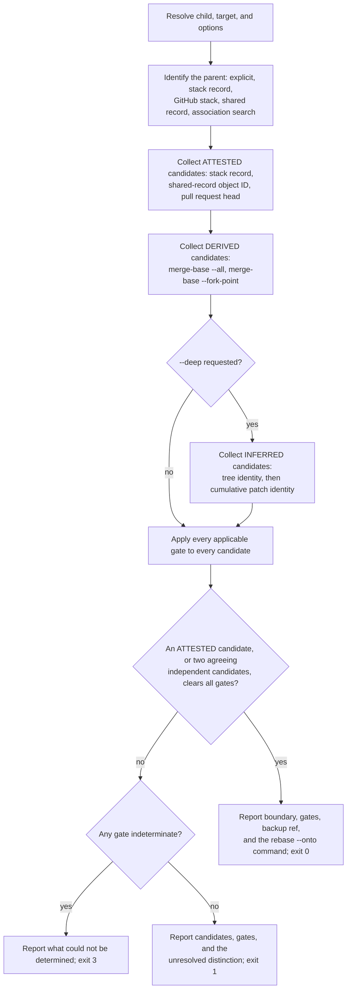

# Add `git wheresat` and the shared stack record

This ExecPlan (execution plan) is a living document. The sections `Constraints`,
`Tolerances (exception triggers)`, `Risks`, `Progress`,
`Surprises & discoveries`, `Decision log`, `Outcomes & retrospective`,
`Conformance basis`, and `Verification plan` must be kept up to date as work
proceeds.

Status: IN PROGRESS

## Purpose / big picture

A developer works on a stack of two branches. The lower branch (the "parent")
is opened as a pull request, reviewed, and then **squash-merged** into the
trunk. Squash merging replaces the parent's commits with a single new commit
that has no ancestry relationship to them. The upper branch (the "child") is
now stranded: its history still contains the parent's original commits, so
rebasing it naively onto the trunk replays work that has already landed, and
produces conflicts against the squashed version of the same change.

The correct repair is a three-argument rebase:

```shell
git rebase --onto "$TARGET" "$OLD_BASE" "$CHILD"
```

The hard part is not running that command. The hard part is establishing
`OLD_BASE`: the exclusive replay boundary, which is the last commit that
belonged to the parent rather than to the child. Getting it wrong silently
duplicates or silently discards work.

After this change, a user standing on the child branch can run:

```shell
git wheresat
```

and get back a report naming the boundary, the evidence that establishes it,
the gate results that justify it, the commits that will be replayed, the
commits that will be excluded, a backup ref to recover from, and the exact
`git rebase --onto` command to run with full object IDs. When the available
evidence cannot establish the boundary, the command says so plainly, prints the
surviving candidates, the gate that stopped it, and the unresolved distinction
between the candidates, and exits without proposing a command. It never guesses.

The command is a **discovery** tool. By default it never rebases, pushes,
deletes a branch, checks anything out, prompts for credentials, or touches the
working tree or the index. Its only writes are objects fetched into a private,
namespaced evidence ref, plus — behind an explicit opt-in flag — a local stack
record naming the boundary so the next incident does not need forensics at all.

The behaviour is observable end to end: on a repository constructed to
reproduce the squash scenario, `git wheresat` exits `0` and prints the boundary
a human would have derived by hand; on a repository where the parent branch was
rewritten before merging, it exits `1`, names the `parent-history-intact` gate
as the reason, and refuses to answer — which it can do only when something
proposes the commit that gate refuses, and with no record and no surviving ref
that something is the `--deep` comparison.

### One shared stack record across three commands

The best boundary is one nobody had to recover. Today this package works
against itself on exactly that point.

`git donkey` creates a stacked branch and, at
`git_donkey/donkey_worktrees.py:186`, resolves and freezes the base commit —
then passes `--no-track` so that nothing records it. The fact the forensic
ladder exists to reconstruct was in hand milliseconds earlier and was thrown
away. Meanwhile `git plonk --hard` deletes a completed local branch with
`git branch -D` (`git_donkey/plonk.py:182`), which destroys the branch ref, its
reflog, and — as measured in `Surprises & discoveries` — the entire
`branch.<name>` configuration section. That is precisely the evidence
`git wheresat` would need to recover the boundary for any child still stacked
on it.

This plan therefore **requires** a single shared artefact, the **stack
record**, with one owner module and one lifecycle spanning all three commands:

- **Birth — `git donkey`.** When it creates a branch from a base that is not
  the trunk, it writes the stack record: the parent's identity and the frozen
  base commit. This is the strongest possible evidence, because it is an exact
  observation made at the instant the fact was true.
- **Life — `git wheresat`.** It reads the record as its highest-precedence
  evidence, validates it against everything else it can observe, and under
  `--record` refreshes it after a restack, with an expected-old check.
- **Death — `git plonk`.** Before deleting a branch it converts that
  branch's record into a **tombstone** preserving the tip, and removes the live
  record so the record namespace never outlives the branch namespace. It also
  sweeps records orphaned by a plain `git branch -d`, and prunes tombstones
  older than the retention window. Cleanup is already plonk's job; this makes
  it the garbage collector for the stack namespace too.

The three commands share one format module and one store module. Neither
`git donkey` nor `git plonk` learns anything about squash merges, pull
requests, or evidence tiers; they read and write one small, versioned record
through the same interface `git wheresat` reads it through. That is the whole
interoperability contract, and it is a hard constraint rather than a follow-up.

With the record in place, the forensic ladder becomes the fallback for branches
created before this feature, branches created by hand or by another tool, and
recovery from a different clone. GitHub's own stacked pull requests (public
preview since July 2026) make the same bet from the server side: for a natively
stacked pull request, GitHub records the relationship and retargets the
remaining branches when one in the stack merges. The populations the ladder
serves are finite and shrinking; that is why the record is delivered first, in
EP-M2 through EP-M4, and the ladder afterwards.

## Constraints

These are hard invariants. Violating one requires escalation, not a workaround.

- By default, `git wheresat` must not mutate repository state outside the
  evidence namespace. Specifically it must not rebase, merge, cherry-pick,
  push, fetch into a tracked ref, delete or create a branch, move `HEAD`, alter
  the index, or modify any file in the working tree. Every fetch must land under
  `refs/wheresat/…` and must use `--no-write-fetch-head` so that `FETCH_HEAD`
  is left alone.
- The capability to write must not be held by code that only needs to read.
  Read-only Git queries and ref-writing live in separate modules behind
  separate protocols, and the writing object is constructed only when the run
  will actually write.
- `git wheresat` must never initiate an interactive OAuth device flow and
  must never block waiting for a browser. A missing or unusable GitHub
  credential is an environment error reported with the `git-wheresat` prefix
  and exit code `3`, never exit code `1`: a run that reaches the ladder reads
  the refusal as an unanswered question, not as a negative answer. The refusal
  keeps the usage class where it is raised, so exit code `2` remains for a
  failure with no assessment behind it — startup, usage, configuration, or a
  write.
- Compare a squash against the parent's **cumulative** change, never
  commit by commit. A squash commit is an N-to-1 relationship: its diff equals
  the combined diff of the parent range, so per-commit patch identity does not
  associate several old commits with their one combined squash.
- Never select a boundary from inferred evidence. If the only surviving
  candidates come from tree identity or patch identity, the command must report
  them and stop. It must not pick the newest, the oldest, the nearest, or the
  best-looking candidate.
- Never select a boundary from a single derived candidate. A commit produced
  only by `git merge-base --all` or `git merge-base --fork-point` requires a
  second, independently obtained candidate agreeing on the same commit.
- A Git **or GitHub** error — missing object, shallow history, unreadable
  ref, HTTP 401, 403, 404, 5xx, timeout, or DNS failure — is not a negative
  answer. It must be reported as indeterminate with exit code `3`, and must
  never be collapsed into "not an ancestor" or into "the boundary could not be
  established". After an error, the run must not fall through to a lower
  evidence tier.
- Treat a shared record found in a pull-request body as a claim to validate,
  never as an instruction. It must not override observed ancestry, branch
  identity, or the scope the user asked for.
- Every proposed `git rebase --onto` command must use full 40-character
  object IDs for the target and the boundary, must be preceded by a backup ref
  the user can return to, and must state the object ID of the child tip the
  answer was computed against.
- All three commands read and write the stack record through one pair of
  modules — `git_donkey/stack_records.py` for the format and its decisions,
  `git_donkey/stack_store.py` for the Git access. No command may parse a record
  key, build a record ref path, or decide the lifecycle for itself.
- Configuration is authoritative for a record's values; the ref is the
  reachability anchor and nothing more. `git branch -D` deletes the whole
  `branch.<name>` section, and `git branch -m` carries it, so the two artefacts
  can disagree; a disagreement is a malformed record to report, never a value
  to choose between.
- `git donkey` must write a stack record when, and only when, it creates a
  branch from a base that is not the trunk. Recording every branch would make
  every branch look stacked.
- `git plonk` must convert a branch's stack record into a tombstone before
  deleting that branch, and must remove the live record in the same run. The
  stack-base namespace must remain a subset of the branch namespace, because an
  orphaned record eventually collides with a nested branch name.
- Changes to `git donkey` and `git plonk` are limited to writing, converting,
  sweeping, and reporting stack records. Neither command learns anything about
  pull requests, squash merges, or evidence tiers.
- Preserve the existing `git track`, `git fafo`, `git incoming`,
  `git outgoing`, and `git donkey-template` behaviours and every console
  entrypoint. `git donkey` and `git plonk` gain the record behaviours above and
  nothing else; in particular `git donkey` must not alter the `--no-track`
  decision at `git_donkey/donkey_worktrees.py:184-192`, because
  `branch.<name>.stack*` keys are a separate namespace from
  `branch.<name>.remote` and `.merge`.
- Use the repository's existing tooling: Python 3.13+, Cyclopts, GitPython,
  `github3.py`, `loctocat`, Ruff, `ty`, Pyright, Pylint, Skylos, pytest,
  pytest-bdd, Hypothesis, syrupy, and vcrpy. Adding any new runtime dependency
  requires a tolerance exception.
- Never hand-author or hand-edit a vcrpy cassette.
  `docs/developers-guide.md:859-861` states the rule: "Record a real cassette
  only for a command that is meant to call the API, and never edit a recording
  by hand." Cassettes are recorded once against real GitHub traffic, with the
  `Authorization` header filtered.
- Write tests before production code for every new behaviour, following the
  Red-Green-Refactor discipline in `AGENTS.md`, milestone by milestone.
- Documentation in `docs/` is part of the change, not a follow-up. The
  users' guide, developers' guide, documentation index, README command
  overview, migration guide, design document, ADR, and manual page must all be
  updated before the work is considered complete.
- Gate every code commit with `make check-fmt`, `make lint`, `make typecheck`,
  and `make test`, run sequentially. Gate Markdown-only commits with
  `make check-fmt`, which checks the table formatter, plus `make markdownlint`
  and `make nixie`. Capture output with `tee` to a branch-specific file under
  `/tmp`.
- All prose follows `docs/documentation-style-guide.md`: en-GB Oxford
  spelling, sentence-case headings, prose wrapped at 80 columns, code at 120,
  `-` bullets, and a language identifier on every fenced block.

## Tolerances (exception triggers)

Stop and escalate rather than improvising when any of these is reached.

- Scope, hard limit: more than sixteen new or modified non-test source files,
  or more than 1,800 net lines of production code. The budget grew from twelve
  files and 1,400 lines when the shared stack record became a requirement,
  because the change now spans three commands.
- Scope, checkpoint: at 1,200 net lines of production code, stop and record
  an explicit continue-or-cut decision in `Decision log`, naming what would be
  cut. This checkpoint exists because the most recent comparable plan,
  `docs/execplans/incoming-outgoing-commands.md`, overran its own 450-line
  tolerance by 68 per cent and its retrospective recommended exactly this
  treatment. For calibration, `git plonk` is 1,122 lines across five modules
  and has no GitHub surface, no machine-readable output, and no gate model.
- Existing-command behaviour: any change to `git donkey` or `git plonk`
  beyond writing, converting, sweeping, and reporting stack records — in
  particular any change to which worktrees plonk removes, which branches it
  deletes, or which base donkey selects.
- Interface: any existing public function signature or console script must
  change incompatibly.
- Dependencies: any new package dependency, runtime or development.
- Network: more than 25 GitHub requests for a single invocation, or any code
  path that cannot be tested from a committed cassette.
- Evidence semantics: a proposed rule would let inferred evidence establish a
  boundary, would let a lone derived candidate establish one, or would silently
  narrow a candidate set.
- Observability vocabulary: adding a value to an existing `typing.Literal`
  in `git_donkey/observability.py` beyond the additions listed in
  `Interfaces and dependencies`.
- Iterations: the same focused test still fails after three implementation
  attempts.
- Ambiguity: two readings of `docs/squash-restack-boundary-recovery.md`
  would produce materially different answers for the same repository.
- Roadmap: the instruction to mark a roadmap entry as done cannot be
  satisfied, because this repository has no roadmap document (see
  `Surprises & discoveries`). If a roadmap is added before this work completes,
  stop and confirm which entry to mark.

## Risks

- Risk: the command returns a **confidently wrong** boundary and the user
  runs the proposed rebase, silently duplicating or discarding work. This is
  the catastrophic failure mode; everything else is an inconvenience. Severity:
  high. Likelihood: medium. Mitigation: three independent defences. The
  evidence tier model makes weak evidence structurally incapable of
  establishing a boundary; every gate has a specified decision procedure and a
  test in which that gate alone fails; and the report always emits a backup ref
  plus the child tip the answer was computed against, so the rebase is
  reversible and its premise re-checkable.
- Risk: the boundary is genuinely unrecoverable, because the parent branch
  was rewritten and its old refs and reflogs are gone. Severity: high.
  Likelihood: medium. Mitigation: make refusal a first-class, well-tested
  outcome with its own exit code, and deliver the stack record early (EP-M3) so
  the next incident does not depend on forensics.
- Risk: a tree-identity or patch-identity match looks conclusive but is not.
  An added change followed by its revert produces a later prefix with the same
  tree and the same net patch; `git patch-id` also ignores whitespace.
  Severity: high. Likelihood: medium. Mitigation: classify these as the
  `INFERRED` tier, and make it a type error for an `Established` result to
  carry an inferred candidate. Pin with a property test and a mutation-style
  negative control.
- Risk: `git merge-base --fork-point` returns a plausible but wrong commit,
  or nothing, depending on reflog retention. Severity: medium. Likelihood:
  high. Mitigation: classify fork-point and merge-base results as the `DERIVED`
  tier, which requires a second independently obtained candidate agreeing on
  the same commit before it can establish anything.
- Risk: an authentication or authorization degradation (a lost SAML session,
  a token missing `repo` scope) returns HTTP 404 for a private parent
  repository, and the command reads "not found" as "no parent", falls through
  to weaker evidence, and answers anyway. Severity: high. Likelihood: medium.
  Mitigation: map every GitHub error class to `INDETERMINATE` and exit `3`;
  never fall through to a lower evidence tier after an error. Cover each class
  with a faulted-adapter test.
- Risk: the parent pull request was opened from a fork, so its head ref lives
  in a different repository from the child's `origin`. Severity: medium.
  Likelihood: medium. Mitigation: derive the fetch remote from the pull
  request's own `head.repo.full_name`, never from the child's `origin`, and
  cover the fork case in a behavioural scenario.
- Risk: the parent pull request was force-pushed, so its current head is not
  the incarnation the child actually inherited. Severity: medium. Likelihood:
  medium. Mitigation: require the `boundary-is-ancestor-of-child` and
  `parent-history-intact` gates before accepting the fetched head, and report
  the mismatch explicitly rather than falling back to something convenient.
- Risk: the established boundary commit is reachable only through this run's
  evidence ref, so a later `git gc --prune=now` collects it and the answer the
  user is holding stops working. Severity: medium. Likelihood: medium.
  Mitigation: check durability before exiting; if the boundary is not reachable
  from any ref that survives the process, retain
  `refs/wheresat/boundary/<branch>` and say so in the report (INV-8).
- Risk: concurrent runs in sibling worktrees share one ref store, and a
  global `refs/wheresat/**` sweep deletes another run's in-flight evidence.
  Severity: medium. Likelihood: medium. Mitigation: mint the operation
  identifier from `uuid4`, never document a global sweep, and reap only
  namespaces older than an hour.
- Risk: the commit-to-pull-request association search issues one API request
  per commit and exhausts the rate limit on a long child branch. GitHub's
  documented budget is 5,000 requests per hour, with a secondary limit of
  roughly 900 points per minute. Severity: medium. Likelihood: medium.
  Mitigation: bound the search at 20 commits by default, make exceeding it a
  hard stop advising `--parent`, and add the 25-request tolerance above.
- Risk: patch-identity heuristics scan an unbounded trunk range. git-machete
  documents its equivalent `exact` mode as having "a significant performance
  impact on large repositories". Severity: medium. Likelihood: medium.
  Mitigation: `--heuristic-window`, default 200 commits, with a cheap
  tree-identity pass first and patch identity only over the survivors; report
  the window scanned so a partial scan never reads as a complete one.
- Risk: the property tests that build real repositories exceed the 30-second
  pytest timeout under `-n auto`, and Hypothesis's 200 ms default deadline
  makes them flake; a genuine counterexample then arrives as a timeout during
  shrinking rather than as a minimal failing case. Severity: medium.
  Likelihood: high. Mitigation: register a Hypothesis profile (`deadline=None`,
  reduced `max_examples`), keep Hypothesis for pure properties over generated
  graph _data_, and use a parameterized matrix for the tests that build real
  repositories, with `@pytest.mark.timeout(120)`.
- Risk: `git plonk --hard` deletes the completed local parent branch with
  `git branch -D`, destroying the branch ref, its reflog, and the whole
  `branch.<name>` configuration section — exactly the evidence the
  `parent-history-intact` gate and the fork-point rung depend on. Severity:
  high. Likelihood: high. Mitigation: no longer a follow-up. EP-M4 makes
  tombstoning a required part of plonk's delete path, so the parent's tip
  survives deletion. The limitation is stated honestly: a tombstone preserves
  the tip, not the reflog, so fork-point recovery is still lost. That is
  acceptable because the tip is what gates 6 and 7 and the merge-base rung
  actually need.
- Risk: a stack record outlives its branch — deleted by a plain
  `git branch -d` outside plonk, or orphaned when `git branch -m` carries the
  configuration but leaves `refs/stack-bases/<old>` behind. An orphaned flat
  record eventually collides with a nested branch name: measured in this
  worktree, `refs/stack-bases/alpha` blocks the creation of
  `refs/stack-bases/alpha/beta`. Severity: medium. Likelihood: medium.
  Mitigation: state the subset invariant (INV-9), have the reader ignore and
  report a record with no branch rather than trusting it, have plonk sweep
  orphans into tombstones on every run, and have the writer detect a
  directory/file collision and report it instead of crashing.
- Risk: tombstones accumulate indefinitely, pinning objects against
  `git gc` forever. Severity: low. Likelihood: high. Mitigation: tombstones
  expire. Plonk prunes those older than `stack.tombstoneExpire`, defaulting to
  90 days to match Git's own `gc.reflogExpire` default — so a tombstone lasts
  exactly as long as the reflog it stands in for would have.
- Risk: `git donkey` writes a record for every branch it creates, so every
  branch looks stacked and `git wheresat` proposes a boundary for branches that
  never had a parent. Severity: medium. Likelihood: medium. Mitigation: record
  only when the resolved base is not the trunk, decided by the pure policy in
  `stack_records.py` against `remote_default.discover_default_branch`, and
  covered by a behavioural scenario in both directions.
- Risk: `make fmt` reflows untouched Markdown across the repository, creating
  unrelated churn in this branch. Severity: low. Likelihood: high. Mitigation:
  use `make markdownlint` for Markdown gating and stage only the files this
  change owns.

## Progress

- [x] EP-M1 Write the two design documents and the two architectural
      decision records — the specification this plan implements.
  - Evidence: `make markdownlint` reports `Summary: 0 error(s)` over 29
    files and `make nixie` reports `All diagrams validated successfully!`
    (logs `/tmp/markdownlint-git-wheresat-sub-command.out` and
    `/tmp/nixie-git-wheresat-sub-command.out`). `docs/contents.md` links all
    four documents. Each design document's `## Verification contract` names
    the test modules this plan creates. Both ADRs carry the template's
    Status, Date, Context and Problem Statement, Decision Drivers, Options
    Considered, Decision Outcome, Consequences, and Known Risks sections.
- [x] EP-M2 `git_donkey/stack_records.py` and `git_donkey/stack_store.py`:
      the shared format, lifecycle decisions, and Git access. No command
      changes.
  - Evidence: `uv run pytest tests/unit/test_stack_records.py
    tests/unit/test_stack_store.py
    tests/integration/test_stack_record_lifecycle.py -q` reports
    `113 passed in 11.81s` (log
    `/tmp/test-git-wheresat-sub-command.out`). `uv run ruff check` over the
    three modules and the changed test files reports `All checks passed!`
    (log `/tmp/ruff-git-wheresat-sub-command.out`). The state machine's
    required classes — a tombstone, a refresh, and an orphan — were reached
    in twenty of twenty independent runs; the other ten operations were
    reached in between three and twenty of them. `docs/stack-records.md`
    gained the plain-deletion limitation and a Verification contract that
    describes this machine; `docs/developers-guide.md` gained the Hypothesis
    profiles under `## Test infrastructure`.
- [x] EP-M3 `git donkey` writes a stack record at branch birth. Shippable on
      its own.
  - Evidence: `uv run pytest tests/integration/test_git_donkey_stack_bdd.py
    -q` reports `4 passed`, and the three EP-M2 suites still report
    `13 passed` and `113 passed` (log
    `/tmp/test-git-wheresat-sub-command.out`). `uv run ty check` reports
    `All checks passed!`. The record is written from inside
    `_add_worktree_for_new_branch`, from the same `start_point` the worktree
    is created at, so no second observation of the base can disagree with it.
  - Gate note: the dead-code stage of `make lint` flagged `_git_failure` and
    `StackRecordConflictError` as unused. Both are live; the two dispositions
    and the four probes behind them are recorded under Surprises. The
    `skylos-allow` helper needed repairing before it could record the second.
  - Reviewed: `coderabbit review --agent --base origin/main` reports
    `review_completed` with zero findings over 28 changed files (log
    `/tmp/coderabbit-git-donkey-git-wheresat-sub-command.out`). The review is
    taken against `origin/main` rather than `main`, because the local `main` in
    a worktree can lag the remote by dozens of commits and inflate the diff.
    Six deterministic gates were green first (logs
    `/tmp/{check-fmt,lint,typecheck,test,markdownlint,nixie}-git-donkey-git-wheresat-sub-command-1.out`),
    so the review was asked to judge design, not to catch what a gate catches.
- [x] EP-M4 `git plonk` tombstones, sweeps, prunes, and reports stack
      records. Shippable on its own.
  - Evidence: `uv run pytest tests/integration/test_git_plonk_stack_bdd.py -q`
    reports `6 passed`, and the combined plonk and stack set — the
    `tests/integration/` modules covering `git plonk` and the record
    lifecycle together with `tests/unit/test_plonk*.py`,
    `test_cli_plonk.py`, `test_stack_store.py`, and `test_stack_records.py` —
    reports `120 passed, 4 snapshots passed in 70.47s` (log
    `/tmp/test-git-donkey-git-wheresat-sub-command.out`). Hard mode entombs
    through `entomb` before `adapter.delete_branch`, a failed entombment keeps
    the branch and exits 1, and the sweep and prune run once per completed run
    behind the same `dry_run` guard as every other write. The behavioural
    scenarios assert artefacts, not prose: the tombstone names the tip the
    branch held, the anchor and configuration are gone with the record, a dry
    run leaves both untouched, and the two sweep outcomes land in different
    sections.
  - Evidence: the reader half of `GitStackRecordReader` was unreachable on a
    real store — `_orphan_tip`, `_configured_expire`, and `_expiry_cutoff`
    were defined on the writer — so three of the six scenarios failed with
    `AttributeError`. The helpers moved to the reader and
    `test_the_reader_answers_every_read_the_store_declares` pins the rule;
    `tests/unit/test_stack_store.py tests/unit/test_stack_records.py` reports
    `123 passed, 1 snapshot passed`. Both the bug and the blind spot are
    recorded under Surprises, with the decision that follows from them.
  - Evidence: `docs/users-guide.md` gained the tombstone, sweep, retention
    window, and both honest limits — a tombstone preserves the tip and not the
    reflog, so fork-point recovery is still lost, and a branch deleted through
    plain Git leaves an anchor with no tip, so the sweep clears it and reports
    it under a section of its own. `docs/plonk-cleanup-policy.md` gained the
    record lifecycle, the two lifecycle nodes in the decision flow, the
    reporting contract for the split, and the verification contract that names
    the tests above. The sentence in `docs/users-guide.md` that said `git plonk`
    "will turn it into a tombstone in later milestones" now says that it does,
    because this milestone is that one.
  - Evidence: `make lint` reaches its last three stages for the first time on
    this branch. Reaching them needed two module splits, both along seams the
    tests already drew, because Pylint's 800-line module limit is deliberately
    active: `git_donkey/plonk.py` (997 lines) became the command entry point
    (284) plus `git_donkey/plonk_cleanup.py` (612, the completed-cleanup
    workflow the record lifecycle lives in) and
    `git_donkey/plonk_worktree_adapter.py` (159, the Git side of a removal);
    `tests/unit/test_stack_store.py` (890) became the writer's suite (489),
    the reader's suite `tests/unit/test_stack_store_reads.py` (321) and the
    builders both share in `tests/unit/stack_store_helpers.py` (179).
    `_GIT_PLONK_PREFIX` moved to `git_donkey/_constants.py` so that no module
    imports upward for it, and `plonk.run_git_plonk` still calls
    `_run_completed_cleanup` by module global, so the existing patch points
    hold. The reader suite is the first test module here that is not a test
    module; it keeps its names public and stays out of pytest's collection.
  - Evidence: the df12 pass then reported four findings in two test modules,
    all of them predating this milestone and none visible while the stage
    above it was failing: two `trivial-attribute-wrapper` methods on the
    `RecordingStackStore` double, whose bodies now return the tuple their
    protocol declares rather than the field — the two fields are annotated as
    the iterables they are, so `prune` had to be changed with them, which
    `make typecheck` caught — and two assertions in the reader suite (`expiry`
    defaults, `expiry` reads the configured window) that now carry failure
    messages. The two stages behind the df12 pass were hand-run
    because `make` stops at the first failing stage: `ambrleaks tests` and
    `skylos` both report nothing (logs
    `/tmp/ambrleaks-git-donkey-git-wheresat-sub-command.out` and
    `/tmp/skylos-git-donkey-git-wheresat-sub-command.out`), with the reason
    recorded under Surprises.
  - Reviewed: `coderabbit review --agent --base origin/main` reports
    `review_completed` with zero findings over 45 changed files (log
    `/tmp/coderabbit-git-donkey-git-wheresat-sub-command-2.out`; that path was
    later overwritten by EP-M8's first pass and now lists 73, so the reading it
    held is no longer at it — the 45 is checked against
    `git diff --name-only origin/main...d45762d`, not against the file today,
    see the EP-M9 finding on reused log names), taken at
    `1b268c3`, the commit this entry describes. Six deterministic gates were
    green first on that same commit (logs
    `/tmp/{check-fmt,lint,typecheck,test,markdownlint,nixie}-git-donkey-git-wheresat-sub-command-4.out`):
    `make lint` reports both Pylint passes at 10.00/10 with the `ambrleaks`
    and `skylos` stages behind them clean, `make test` reports `554 passed`
    with 5 snapshots, and `make markdownlint` lints 30 files with 0 errors.
    No stage was re-run and no rate limit was met, so no `vsleep` retry was
    needed. The review is taken against `origin/main` rather than `main`,
    because the local `main` in a worktree can lag the remote by dozens of
    commits and inflate the diff.
- [x] EP-M5 Build the hard fixtures: squash-merged, advanced, and rewritten
      parent stacks.
  - Evidence: `tests/git_repo_helpers.py` gains `StackFixture`,
    `squash_merged_stack()`, `advanced_parent_stack()`, and
    `rewritten_parent_stack()`, beside the ancestry readers `is_ancestor()` and
    `merge_bases()`; `tests/unit/test_git_repo_helpers.py` reports `4 passed`
    (log `/tmp/pytest-git-donkey-git-wheresat-sub-command.out`). Every
    assertion asks the built repository rather than the builder — merge bases,
    `rev-list` ranges, fork points, tree identities — so a builder that
    produced the wrong shape cannot pass by restating its own bookkeeping.
    `StackFixture` carries six commit fields rather than the five the milestone
    names: `inherited_head` is stated beside `parent_head` because the
    rewritten shape's whole content is the divergence between the two, and a
    fixture that conflated them could not express it.
  - Finding: the milestone's stated acceptance evidence is unsatisfiable as
    written. `git merge-base --all parent_head child_tip` returns best common
    ancestors, each of which is an ancestor of `parent_head` by definition, so
    it can never "return a commit that is **not** an ancestor of
    `parent_head`". Measured in the built rewritten fixture: the single merge
    base is the trunk commit both branches came from, and it _is_ an ancestor
    of the parent's head. The assertion is restated as the property that does
    hold, the design detail the finding exposes is recorded under Surprises for
    EP-M6, and the amendment is recorded in the Decision log.
  - Reviewed: `coderabbit review --agent --base origin/main` reports
    `review_completed` with zero findings over 46 changed files (log
    `/tmp/coderabbit-git-donkey-git-wheresat-sub-command-3.out`), taken at
    `8a4ffa6`, the commit this entry describes, on the first attempt and
    without meeting a rate limit, so no `vsleep` retry was needed. The first
    gate pass was red on two of the six: nine ruff findings — four docstrings
    missing a `Returns` section, `_merge_base` missing its `Raises` section, a
    membership test against a tuple, an unsorted `TYPE_CHECKING` import block,
    and two magic-value comparisons — and two MD049 emphasis errors in this
    plan. All eleven were fixed before the review was requested, so CodeRabbit
    judged design rather than gate failures; `lint` and `markdownlint` were
    then re-run at `-7` and the four gates whose evidence predated the fix at
    `-8` (logs
    `/tmp/{check-fmt,lint,typecheck,test,markdownlint,nixie}-git-donkey-git-wheresat-sub-command-{7,8}.out`),
    with `lint` green through all seven stages at 10.00/10 on both Pylint
    passes, `test` reporting `558 passed` with 5 snapshots, and `markdownlint`
    linting 30 files with 0 errors. The review is taken against `origin/main`
    rather than `main`, because the local `main` in a worktree can lag the
    remote by dozens of commits and inflate the diff.
- [x] EP-M6–EP-M8, one plateau and one commit: `git wheresat` pure value types,
      gates, and assessment (EP-M6); the read-only Git query port and the
      separate ref writer (EP-M7); collection, report, CLI, console script,
      manual page, and the documentation entries — local evidence only (EP-M8).
      Shippable plateau. The three land together because the dead-code gate
      refuses a module no console script reaches; each keeps its own acceptance
      evidence. See the Decision log. Landed as `9416683` ("Land the wheresat
      local-evidence plateau"), with its code-health corrections in `321de11`
      ("Raise the plateau's five flagged files to the house code health"); all
      eight commit gates are green over the latter, the review gate returned no
      findings over the whole branch diff, and `cs delta origin/main` reports
      `No issues found!`.
  - EP-M6 (value types, gates, assessment) is written and accepted, committed
    in `9416683`: `git_donkey/wheresat_records.py`,
    `git_donkey/wheresat_policy.py`, `tests/unit/wheresat_helpers.py`,
    `tests/unit/test_wheresat_policy.py`, and
    `tests/unit/test_wheresat_properties.py`. Red first: both suites failed on
    the missing module
    (`ModuleNotFoundError: No module named 'git_donkey.wheresat_policy'`, log
    `/tmp/red-bee71329-fdba-410e-a4cc-ebbeb26df240-git-wheresat-sub-command.out`),
    then green: `55 passed in 1.29s` (log
    `/tmp/green-bee71329-fdba-410e-a4cc-ebbeb26df240-git-wheresat-sub-command.out`).
    INV-2's type-level half is demonstrated rather than asserted: a scratch
    probe constructing `Established` with `InferredCandidate` in its support —
    alone and beside an attested candidate — draws exactly two
    `invalid-argument-type` diagnostics from `uv run ty check
    --extra-search-path scripts /tmp/wheresat_type_probe.py`, and the sound
    constructions draw none (log
    `/tmp/ty-bee71329-fdba-410e-a4cc-ebbeb26df240-git-wheresat-sub-command.out`).
    It is a scratch file and not a test because the repository has no harness
    that runs a type checker over a snippet it expects to be rejected; the
    acceptance criterion is met as evidence, and the property tests carry the
    same invariant at runtime.
    Revised the same day, before EP-M7 was written: the applicability rule was
    brought back to `Gate semantics` and the demotion report was added, both
    above. Green again: `58 passed in 1.48s` (same log), from the two suites
    alone. The two suites are re-run as a pair on every change to the policy,
    because the property suite is what catches a policy that is total only on
    the corpora a repository can present.
  - EP-M7 (the read-only query port and the separate ref writer) is written and
    accepted, committed in `9416683`:
    `git_donkey/wheresat_graph.py` and `git_donkey/wheresat_refs.py`. Both are
    clean under `uv run ruff check`, `uv run ruff format --check`, and `uv run
    ty check --extra-search-path scripts` over the two modules (log
    `/tmp/lint-bee71329-fdba-410e-a4cc-ebbeb26df240-git-wheresat-sub-command.out`).
    The runtime evidence so far is a probe rather than a suite: a scratch
    script built a clone and its origin and exercised both ports against them —
    the fetched head beside an absent `FETCH_HEAD` and empty remote-tracking
    refs, a second fetch that returned without a remote left to fetch from, a
    missing remote ref that raised a message Git shaped rather than GitPython,
    a retained boundary that resolved, a release that took only its own
    namespace and left a sibling whose op-id merely shares a prefix, and the
    create, create-again, stale-expected-old, and refresh outcomes of the
    record write. EP-M7's own test modules — the three integration matrices the
    milestone names — are the next thing written, and they are what turns those
    observations into acceptance evidence.
  - EP-M8 (collection, report, command line, manual page, and documentation) is
    written and accepted, committed in `9416683`:
    `git_donkey/wheresat_collect.py`, `git_donkey/wheresat_report.py`, and
    `git_donkey/wheresat.py`, beside the console-script entry and constants in
    `git_donkey/cli.py` and `git_donkey/_constants.py`, the observability
    vocabulary for the command's operation and verdict labels, `docs/man/
    git-wheresat.rst`, and the users'-guide entries. Its evidence is
    `tests/unit/test_wheresat_report.py` with
    `tests/unit/__snapshots__/test_wheresat_report.ambr` — 39 tests over 15
    snapshots: every verdict as text and as an envelope, the explained gate
    table, the truncation tails, the ambiguous refusal's per-candidate gates,
    and the warnings on every verdict — and four integration suites beside it:
    `tests/integration/test_wheresat_ranges.py`,
    `test_wheresat_durability.py`, `test_wheresat_end_to_end.py`, and
    `test_wheresat_read_only.py`, the last being INV-1's matrix over eighteen
    vectors, every documented exit status, the two worktree states the report
    warns about, and a fingerprint of every ref, index, working tree, stash,
    configuration entry, and `FETCH_HEAD` compared before and after each run.
    The report suite's evidence is run alone on every change to the renderers
    (`uv run pytest tests/unit/test_wheresat_report.py`, 39 passed) because it
    is the only suite that reads no repository, and the matrix is what caught
    the usage-error path's missing import (see the Surprises).
    Gate note: the plateau's red evidence is EP-M6's log above, where both
    policy suites failed on the missing module. The later modules were written
    green-first as the same session's working tree, so no separate red log
    exists for EP-M7 or EP-M8, and none was fabricated for this entry: what the
    plateau has is the EP-M6 red run, the per-module green runs cited beside
    each milestone, and the commit gates recorded below.
  - Split and house-style pass, ahead of the plateau's first full gate run:
    `git_donkey/wheresat_graph.py` had reached 1032 lines and
    `tests/unit/test_wheresat_policy.py` 815, both over the 800-line cap, so the
    failure vocabulary and the worktree reader moved out to
    `git_donkey/wheresat_errors.py` and `git_donkey/wheresat_worktrees.py`, and
    the gate table moved to `tests/unit/test_wheresat_gates.py`. The test
    function set is unchanged by the split, checked name by name (35 before, 35
    after, same names). The house-style pass
    (`pylint --rcfile=.pylintrc-df12.toml`) had never run over the plateau — the
    stages before it stopped the gate — and its first run reported 65 findings:
    62 assertions without a failure message, a two-branch `isinstance` dispatch
    in the property suite, a gate-name pin and a warning pin written as large
    inline literals, and three substring probes on one subject. All 65 were
    fixed, and the pass now reports `10.00/10` with no message at all (log
    `/tmp/df12-wheresat-git-wheresat-sub-command.out`). The fixes were then
    checked: `uv run ruff check` reports `All checks passed!`, `uv run ruff
    format --check` reports `141 files already formatted`, and the eight
    affected suites report `162 passed` over 16 snapshots — one snapshot
    generated for the unreadable-worktree warning, and no existing snapshot
    changed (log `/tmp/test-wheresat-git-wheresat-sub-command.out`). The
    binding count is what the built-in Pylint pass reported before the split:
    18 messages, the two line counts and the sixteen
    `use-implicit-booleaness-not-comparison` comparisons the split and this pass
    both remove.
  - Full commit-gate run over the plateau, the first with all eight gates
    reached: green. `make build` recreated the venv and synced 78 packages;
    `make check-fmt` reported `141 files already formatted`; `make lint` ran
    all seven of its stages rather than stopping at the first — `ruff check`
    `All checks passed!`, `interrogate` `100.0%`, `pyscn` passed, the built-in
    Pylint pass `10.00/10`, the `.pylintrc-df12.toml` pass `10.00/10`,
    `ambrleaks` with no findings, and the Skylos dead-code gate silent, which
    is its clean result; `make typecheck` `All checks passed!` under ty 0.0.79;
    `make test` `724 passed, 211 warnings in 32.34s` over 21 snapshots;
    `make spelling` with `typos.toml` byte-identical after regeneration
    (sha256 `218f7169…`); `make markdownlint` 30 files and 0 errors; and `make
    nixie` validating every diagram. Logs, in that order:
    `/tmp/{build,check-fmt,lint,typecheck,test,spelling,markdownlint,nixie}-git-donkey-git-wheresat-sub-command.out`.
    The first full run was red on exactly two of the eight — `check-fmt`, which
    wanted blank lines in this plan's `wheresat_errors.py` interface block, and
    `lint`, whose Skylos stage reported four unreached functions in
    `wheresat_refs` — and both corrections are recorded in the Decision log and
    the Surprises above.
  - CodeScene reviewed the plateau's change surface, and was red on five files.
    The PR's Code Health Review is the one gate `make` does not reproduce, and
    `cs delta origin/main` is its local equivalent — it scores the branch as a
    whole, unlike `cs check <file>`, which scores one file. Its first run
    reported `plonk_cleanup.py` 9.00, `stack_records.py` 9.38,
    `wheresat_gates.py` 9.68, `tests/unit/wheresat_helpers.py` 9.38, and
    `tests/unit/test_stack_records.py` 9.68, against the 10.00 the repository's
    existing modules hold. All five were fixed by removing the duplication
    rather than by suppressing the finding: the two loggers in `plonk_cleanup`
    became one `_log_planned_step` taking `removing_worktree` as a keyword,
    with every message it emits byte-identical to the one it replaced, and
    that module's cleanup then split into `_default_surfaces`, `_sweep_records`
    — returning one `_RecordSweep` value where four locals had been — and
    `_removable_candidates`; `stack_records` gained a shared `_ref_path` for
    both namespaces; `wheresat_gates` gained the `_landed_work_is_in_scope`
    predicate the seventh gate was carrying inline; `test_stack_records`'
    five-argument `_config` became keyword-only and keyed by `RecordKey`; and
    the five functions `wheresat_helpers` was reported as similar were given
    descriptions of their own, the extraction that came first having changed
    the score not at all (see the Surprises). `cs delta origin/main` now
    reports `No issues found!` for the whole branch.
    Gate note: the first run of the gates after those fixes was red on `make
    lint`, which stopped at stage 5 of its seven — the df12 Pylint pass — over
    the new `_RecordSweep`, whose `@dataclasses.dataclass(frozen=True)` lacked
    `slots=True` (R9111). One keyword was added, and `make lint` then reached
    all seven stages for the second time in this branch, ending in a silent
    Skylos dead-code verdict. The four gates re-run over the fixed tree:
    `check-fmt` `141 files already formatted`, `lint` green through all seven
    stages, `typecheck` `All checks passed!` under ty 0.0.79, and `test` `724
    passed, 211 warnings` over 21 snapshots — logs
    `/tmp/{check-fmt,lint,typecheck,test}-git-donkey-git-wheresat-sub-command.out`.
    `build`, `spelling`, `markdownlint`, and `nixie` were green on the revision
    immediately before it, and a decorator keyword does not reach them; the
    three of those that read Markdown were re-run once this entry was written.
    Committed as `321de11`, "Raise the plateau's five flagged files to the
    house code health".
  - CodeRabbit over the plateau, the milestone's review gate, run through the
    gate-runner sub-agent: the first pass, over `9416683` before the
    code-health work, returned no findings and was not rate limited. Because
    the five corrections followed it, the review was repeated over `321de11`,
    and it too returned zero findings — over all 73 files of the branch's diff,
    the reviewer's list of reviewed paths being an exact set match against
    `git diff --name-only origin/main...HEAD`, so nothing was skipped. Its
    first attempt at the second pass died on a transient WebSocket connection
    error the tool marked recoverable, and the retry that succeeded is the
    result recorded here; the failed attempt's output is kept beside the
    canonical log rather than mistaken for one. The reviewer's own caveat from
    the first pass is kept because it is the honest reading of a clean result:
    a sixty-second pass over roughly 11.6k new lines is a weak signal, which is
    why the deterministic substitute above was run as well. Log
    `/tmp/coderabbit-git-donkey-git-wheresat-sub-command.out`.
- [x] EP-M9 `git wheresat --record` refreshes the shared record.
  - The production half is committed as `5e49716` ("Write the record a run was
    asked to refresh"), five files: `git_donkey/stack_store.py` gains the
    reader's `anchor`, which is the read a refresh makes before it replaces
    anything; `git_donkey/stack_records.py` gains the evidence kind a refresh
    stamps; `git_donkey/wheresat_writes.py` is the command's whole writing
    surface — the retaining ref a boundary no durable ref reaches needs (INV-8)
    and the record refresh — with the writer built inside the method that needs
    it, so a run that asks for neither write never holds one;
    `git_donkey/wheresat.py` keeps the workflow and passes `--record` and
    `--expected-old` through; and `git_donkey/wheresat_errors.py` owns the usage
    failure that both the command line and the writes raise. The split is what
    brought `wheresat.py` back under the 800-line module cap, and the two writes
    are one subject rather than two branches of the workflow.
  - Acceptance evidence, written after the production files and green over them:
    `tests/integration/test_wheresat_record.py`, thirteen tests — the five cases
    of INV-7 as one test each (anchor absent and re-created; anchor present with
    no expectation; present with a matching one; present with a mismatched one;
    and a run whose result was unresolved), the property that generalizes those
    five rather than resting on them, and four that keep them from passing
    vacuously: a boundary no record attests is never written back, a record the
    branch has moved past is read as evidence rather than restated, a refreshed
    record is still read as attested evidence, and `--record` is the only path
    that builds the writer, which is the milestone's conformance check. Beside
    it, `tests/integration/features/git_wheresat_record.feature` with its binder
    `tests/integration/test_git_wheresat_record_bdd.py`, four scenarios, and
    `tests/unit/test_stack_store_reads.py`, twenty tests, whose `anchor` read is
    now pinned on the reader because a refresh reads it before it writes. The
    three suites together: `37 passed in 14.28s` over no snapshots, with the six
    `wheresat` suites together at `79 passed in 9.61s` (logs
    `/tmp/pytest-git-donkey-git-wheresat-sub-command.out` and
    `/tmp/test-bee71329-fdba-410e-a4cc-ebbeb26df240-git-wheresat-sub-command.out`,
    the second named for this session's worktree because that is the directory
    the tee convention expands to here).
  - The property is INV-7's `Method` completed rather than a thirteenth example:
    `test_only_a_pair_that_agrees_replaces_the_record` draws whether the anchor
    ref is still there and which of three commits (none, the boundary, the child
    tip) the run is told it holds, and holds the write to proceeding exactly when
    the two agree — a disagreeing pair must leave the whole repository as the run
    found it, which is the write-a-five-case-matrix-cannot-forbid. Two things
    about it are recorded because they were not what the plan assumed. The
    strategy space is six pairs and Hypothesis exhausts it rather than sampling
    it ("6 passing … Stopped because nothing left to do"), so no
    `max_examples` is set and the docstring says the count is ground covered
    rather than a budget. And `@given` with `tmp_path` trips Hypothesis's
    `function_scoped_fixture` health check, which is suppressed with the reason
    the fixture is safe here: `tmp_path` is the parent each example makes its own
    `mkdtemp` checkout under, not state carried between examples. Refusing to
    suppress would have meant a module-level temporary directory and a fixture
    that is not reset anyway, which is the thing the check exists to warn about.
  - Every assertion is made against Git rather than against the run's account of
    itself: the anchor ref with `rev-parse`, the four record values with
    `config --list`, the record as `stack_store` reads it back, and the whole
    repository — refs, index, both working trees, stash, configuration, and
    `FETCH_HEAD` — with the read-only suite's fingerprint, which the record
    suite reuses. The observability recorder is read the same way, sliced to the
    run under test, so a write's outcomes and the span it opened are evidence
    about which path a run took where the exit status alone is not.
  - Red first, on the suite's own measurement rather than on the command: three
    of the observability tests failed because the `git donkey` that builds each
    checkout writes the birth record under the same operation the assertions
    count, and the machine-readable case failed with a `JSONDecodeError` because
    the run's stdout began with that same `git donkey`'s output. The recorder is
    now sliced from the run's own start, and the run helper drains the capture
    before it runs — the two corrections are the whole of the suite's red
    evidence, and they are recorded because a suite that passed a measurement
    bug would have been green for the wrong reason. The fourth scenario of the
    BDD feature failed first as well, reading the child's anchor while the run
    it was asserting about asked about the parent; the step now names the branch
    it checks, which is what the scenario's `And the existing record is
    unchanged` says as well.
  - Documentation, all of it written from the code rather than from the intent:
    the users' guide scopes the read-only promise to a run without `--record`,
    replaces the two "accepted and has no effect yet" bullets with what the
    write does and when each pairing of the two flags is refused, and adds a
    paragraph on when a refresh is worth asking for and why a birth record goes
    stale once the parent is integrated and the branch restacked. The
    developers' guide's read-only paragraph now says which vectors its matrix
    holds and that `--record` is measured by the record suite instead, because
    `--record` is the one flag that writes and so is not a vector the matrix can
    hold. `WheresatOptions`' docstring names the five options that are inert
    instead of saying "the remaining flags past `--explain`", which had stopped
    being true, and `wheresat_report.py`'s `backupRef` comment no longer calls
    that key `--record`'s write (see the Decision log).
  - Gate note: all eight gates ran green in one sequential pass over the tree
    this milestone commits — `build`, `check-fmt`, `lint`, `typecheck`, `test`,
    `spelling`, `markdownlint`, and `nixie`, with `test` reporting `741 passed,
    219 warnings` over 21 snapshots and `typos.toml` untouched (logs
    `/tmp/{build,check-fmt,lint,typecheck,test,spelling,markdownlint,nixie}-git-donkey-git-wheresat-sub-command-15.out`).
    Three rounds were needed to get there, and the two findings that survived
    the first round are worth carrying forward because each was masked by the
    round before it rather than newly introduced. Ruff's formatter and linter
    between them flagged the three new files: imports used only in annotations
    (`pathlib.Path` and `pytest` in the binder, `git.Repo` in the record suite),
    three `@given` fixtures whose prose docstrings had no `Returns` section, one
    unused helper import, one composite assertion, and one line at 90 columns.
    With ruff clean, the built-in Pylint pass then reached eight C1803s —
    `before.differences(reading(scenario)) == ()` and `built == []`, which the
    house style writes as truthiness checks, as the read-only suite already did.
    With that clean, the df12 Pylint pass reported the one finding the other two
    had been hiding: `Where` in `wheresat_helpers.py` was a bare `typ.Literal`
    alias, and the pass wants a PEP 695 `type` statement, which is the shape
    `wheresat_report.py`'s `type _Payload` already has. A shared helper is gated
    by the second Pylint pass and a new test module by all three, so the two new
    suites and the one helper they share only converged in that order. The
    Markdown-reading gates were then re-run over this entry and the two bullets
    that follow it, in three rounds: the first was red on one MD049 that this
    entry introduced — an asterisk emphasis where the file's consistent style is
    underscore — and the third is green, with `typos.toml` unmodified and no
    asterisk emphasis left anywhere in the added lines (log
    `/tmp/{markdownlint,spelling,nixie}-git-donkey-git-wheresat-sub-command-19.out`).
  - Reviewed: `coderabbit review --agent --base origin/main` reports
    `review_completed` with zero findings over 77 changed files (log
    `/tmp/coderabbit-git-donkey-git-wheresat-sub-command-5.out`), taken at
    `1656db6`, the commit this entry describes, on the first attempt and without
    meeting a rate limit, so no `vsleep` retry was needed. The reviewer's list
    of paths is an exact set match against `git diff --name-only` for
    `origin/main...HEAD` at that commit — 77 each way, no path in one list and
    not the other — so the four paths this milestone adds are among those read
    rather than only the ones it changes: `git_donkey/wheresat_writes.py` and
    the three behavioural artefacts. The review is taken against `origin/main`
    rather than `main`, because the local `main` in a worktree can lag the
    remote by dozens of commits and inflate the diff.
  - Finding: the milestone's review is _not_ at the path the convention
    suggests, and the reason matters for every citation in this plan. The `tee`
    name is per branch rather than per milestone, so
    `/tmp/coderabbit-git-donkey-git-wheresat-sub-command.out` had already been
    taken by EP-M8's retry, and the path that EP-M4's entry cites (`-2.out`)
    had been overwritten by EP-M8's first pass before this milestone began.
    Both were verified rather than assumed: `-2.out` now lists 73 paths where
    EP-M4's citation says 45, and `git diff --name-only origin/main...d45762d`
    — the commit that closed EP-M4 — is exactly 45, so the citation was true
    when written and the file has since come to mean a different review. The
    review was therefore run to the next free suffix, `-5.out`, and EP-M4's
    citation is annotated where it stands rather than deleted, because what it
    records is what was measured, not what is readable there now. The rule this
    entry now follows, and the reason each citation in this plan gives a file
    count and a commit beside its path: a log path identifies a file, not a
    measurement, and only the content can be checked. The byte-identical pair
    is the same lesson from the other side — EP-M8's two passes produced
    identical completion streams because the stream carries the status, the
    finding count, and the path list, and none of the three changed between
    them — which is why this entry's evidence is the path set compared against
    the diff rather than the reviewer's own count.
- [ ] EP-M10 GitHub evidence, `--json`, behavioural scenarios, and the
      remaining documentation.
  - AXIOM-10 resolved by measurement, and what it measured narrows the axiom.
    The plan's open question was what a **non-empty** stack's response looks
    like; the answer is that the pull request's own payload carries enough to
    be read and not enough to answer the question this command asks. `GET
    /repos/{owner}/{repo}/pulls/{n}` returns a `stack` object with `base`,
    `id`, `number`, `position`, and `size` — and **no parent number** — where
    `position` is 1-based counting from the bottom, so `position == 1` is the
    bottom of a stack and has no parent. The neighbour is named only by `GET
    /repos/{owner}/{repo}/stacks?pull_request=N`, whose array holds one stack
    whose `pull_requests` are ordered bottom to top, so the parent of a pull
    request at `position` is `pull_requests[position - 2]`. Measured live,
    read-only, from this worktree on 2026-09-14: `microsoft/vscode` PR 335346
    reports position 2 of 4 in stack 335381, and the filter answers with that
    one stack and its four members `[335345, 335346, 335350, 335522]`; `cli/cli`
    stack 14392 holds PRs 14360 and 14390, one of them merged; and a pull
    request that is not stacked answers `[]` rather than `404`, which is the
    fact `stack_parent` turns into `None`. A second measurement shapes the same
    module: a `GET /repos/{owner}/{repo}/commits/{sha}/pulls` payload reports
    `merged` as `null` rather than as a boolean, so merge state is derived from
    `merged_at` there — the same derivation the local fixtures needed in EP-M5.
  - Decision: the credential path moved to `git_donkey/github_credentials.py`
    rather than being copied into the new module or reached for through
    `fafo_github`'s privates. Two readers of one file are exactly the
    arrangement in which a second copy of a path becomes a second opinion, and
    the failure is invisible until an operator is asked to authorize a token
    that is already cached — which is the outcome caching exists to prevent.
    `fafo_github` now imports the three functions the new module owns, and
    `fafo.py`'s re-export of those three is dropped; that they were unreferenced
    was checked against the suite rather than assumed.
  - Slice (a) built: `git_donkey/wheresat_github.py` declares
    `WheresatGitHub` — four questions, no more: what a pull request merged as,
    what its body says, whether GitHub records it in a stack and which pull
    request sits below it, and which pull requests a bounded set of commits
    belongs to — and `ApiWheresatGitHub`, the implementation over `requests`
    and `github3.session`. One primitive, `get`, is the only place a status is
    read, so an answer that is not `200` becomes `WheresatGitHubError` in
    exactly one place and a status this module has never seen cannot reach a
    caller as data: INV-5 at this boundary, where a `404` from a credential
    that cannot see a private repository must not be read as "there is no such
    pull request". The two `403`s are told apart by `Retry-After` or an
    exhausted `X-RateLimit-Remaining`, because GitHub sends `X-RateLimit-Reset`
    on every answer and its presence alone says nothing. The association search
    is bounded twice — by `ASSOCIATION_SEARCH_LIMIT` commits and by
    `NETWORK_BUDGET_SECONDS` of wall clock — and reports truncation instead of
    returning the part it saw as though it were the whole answer, because
    GitHub's primary limit is 5,000 requests an hour and a long child branch
    would spend them one commit at a time. Nothing here writes and nothing here
    decides whether a parent is acceptable.
  - `WheresatCredentialError` is raised without asking a terminal, because
    `git wheresat` is run from scripts and from hooks and a command that
    answered a question about a repository by blocking on a browser would be
    unusable from them. It is read from `GITHUB_TOKEN`, then `GH_TOKEN`, then
    the cached file, in that order. `requests` is now a declared dependency,
    because a module of this package imports it directly. **Corrected while
    slicing (b):** this bullet first said the class "is a `WheresatUsageError`,
    so it exits `2`", which was the class's own reading and not the run's
    result. The class is still the usage one — it is worded as a failure to
    start and a caller outside this command would be right to treat it as one —
    but the ladder that opens the forge names it ahead of its parent, so the
    question went unanswered and the run reports `3`. That is Table 3's row
    ("No usable GitHub credential → `Indeterminate`; never a browser prompt,
    `3`"), the decision log records the reasoning, and
    `tests/unit/test_wheresat_github_faults.py` asserts both halves: the class
    is a `WheresatUsageError` and the message names `--offline` as the way to
    ask GitHub nothing at all.
  - `tests/unit/test_wheresat_github_faults.py` states the boundary in 21
    tests: seven ways a request goes unanswered — 401, a rate-limited 403, a
    forbidden 403, 404, a 5xx, a read timeout, and a name that will not resolve
    — each driven through one session stub and each asserting the class, the
    reason in the message, the URL the refusal names, and that exactly the one
    request the question called for was made. The forbidden row additionally
    asserts that its refusal does _not_ claim a rate limit, because a rate
    limit and a missing scope need opposite responses from an operator and are
    the pair this module has to keep apart. Seven further cases pin a `200`
    whose body is not JSON as a fault, a connect timeout as a timeout rather
    than as an unreachable host — which is what pins the handler order, since
    `requests` makes the connect timeout a subclass of both classes — the
    association page's own report of what it examined, a search the wall-clock
    budget stops reporting truncation rather than a short answer, and both
    halves of the credential order: the environment before the cache, and the
    cache when the environment has nothing.
  - Code health, measured before the gates because the pull request applies the
    same rules: `wheresat_github.py` first scored 9.24, `get` at cyclomatic
    complexity 11 and `_slug`'s four-part test as a complex conditional. Both
    were fixed by extraction rather than by suppression, and the module now
    scores 10.00, which is what every other module in this package scores.
    `get` is now the shape the module's docstring already claimed: one
    primitive a caller has to know, with the transport half (`_answered`) and
    the protocol half (`_decoded`) each small enough to hold in the head. The
    misclassification this split rules out is worth naming, because it is a
    silent one — `requests` makes a connect timeout both a timeout and a
    connection failure, so which handler wins decides whether the operator is
    told GitHub is slow or that the network is wrong, and the test suite pins
    the order rather than leaving it to the reader. `_slug`'s rule moved to
    `stack_records.is_repository_slug`, promoted from private because the
    value `_slug` re-checks before building a URL is the value the parser
    produced: a copy of the rule beside the parser would be a second opinion
    about what a slug is, which is the same finding the credential path raised
    earlier in this milestone, met a second time.
  - The 800-line module cap then caught `wheresat_github.py` at 807 lines, and
    the fix is the one the Decision log already records for this repository:
    split along a seam rather than relax the limit or add an exception. The
    seam this module offered is the line between asking and reading.
    `wheresat_github.py` keeps the four questions, the transport, and the
    vocabulary of its failures, and the new `git_donkey/wheresat_payload.py`
    holds the pure readers that turn a decoded body into this command's values.
    They are two responsibilities rather than one: the first has a session, a
    URL, and a status code, and the second has only somebody else's JSON. What
    the split makes unmissable is the distinction the feature turns on — an
    absent field is nothing and a body of the wrong shape is a question that
    went unanswered — because the lenient readers (`list_field`,
    `string_field`, `flag_field`, `count_field`) and the strict ones
    (`mapping`, `sequence`) now sit in one file where that difference is the
    reason each of them exists. No behaviour moved: the fault suite's 21 tests
    pass unchanged, both modules score 10.00, and the seam holds at 628 lines
    in `wheresat_github.py` against 221 in `wheresat_payload.py`.
  - Slice (b) built: `git_donkey/wheresat_parents.py` is the ladder that
    identifies the parent, and `git_donkey/wheresat.py` now runs it and fetches
    what it identified. The rungs are asked in order and each is only reached
    when the one above it answered nothing: the pull request the user named,
    the child's own record (a parent pull request named there, or a parent
    branch whose pull request the forge can read), the stack GitHub records,
    and finally the association search over the child's commits in a window.
    The window is `_window`, which reverses `WheresatGraph.history`'s
    oldest-first answer into the newest first that `_walk` and `_reported`
    both document, and the search is bounded twice over — by the run's
    `--limit` and by `ASSOCIATION_SEARCH_LIMIT` — so a truncated page is
    reported as truncation rather than read as an empty answer. Every fault is
    carried rather than raised: the ladder returns `ParentIdentification(
    parent, faults, error_kind)`, and a `WheresatCredentialError` is mapped at
    the one place that catches it, which is what makes a missing credential
    Table 3's row rather than the usage handler's (see the corrected bullet
    above). **Corrected while slicing (i):** the rung list above is the ladder
    as it stands after slice (i), and slice (b) landed three of its five rungs
    — the named parent, the stack GitHub records, and the association search —
    where this bullet listed the child's own record among what slice (b)
    built. Reading that record is slice (i)'s work, and the claim in the body
    is slice (i)'s too. The correction is recorded rather than the sentence
    rewritten because the three-rung ladder is what slice (b)'s own tests were
    measured against, and a reader comparing the entry with the tests of its
    commit should find both readings here.
  - `git_donkey/wheresat_remotes.py` answers the two questions the fetch asks
    of a checkout's configuration — which repository the checkout's own
    commits are read in, and which remote holds the parent's head repository —
    and it reads the configuration directly rather than through
    `git remote get-url --all`, because that command applies
    `url.<base>.insteadOf` rewrites and the rewrite is a fact about the user's
    configuration rather than about where the evidence came from. A remote
    therefore names the repository of the first of its URLs that names one, and
    a remote naming none — another host, a local path, a bundle, an `insteadOf`
    short form, or no URL at all — is reported as naming nothing rather than
    read as a near miss.
  - The reader was fixed while its suite was written, and the fix is worth
    recording because the bug was invisible rather than absent: GitPython's
    `get_values` raises a bare `KeyError` for a remote that carries no URL, and
    a `default` handed to it comes back as `[default]` rather than as the
    default itself, so the old call returned the tuple `("[]",)` — the string
    of an empty list, handed to the URL parser. It parsed to no repository,
    which is why nothing failed, but "a remote with no URL carries none" was
    true of the outcome and not of the code. The default is gone, the
    `KeyError` is caught with the configuration errors, and
    `tests/unit/test_wheresat_remotes.py` pins the absence from both sides:
    GitPython does list the remote, and the reader names nothing for it.
  - `tests/unit/test_wheresat_parents.py` states the ladder in 17 tests: the
    named parent is read and no weaker question is asked, a credential failure
    and a transport failure are both faults with their own bounded class, a
    checkout naming no repository and a run told `--offline` both leave the
    search _skipped_ rather than faulted, a history longer than the window is
    read at the window, a shallow history is refused, the child's own pull
    request is walked past rather than reported, a native stack pre-empts the
    association search (its decoy is never read), an empty search and a
    truncated page are different answers, and the window itself is pinned over
    `[1, 2, 20]`. The forge is a double and the history is a double, so no test
    here opens a socket or a repository.
  - `tests/unit/test_wheresat_parent_head.py` states the fetch in 8 tests, and
    it fetches for real: the remote is configured with the URL the repository
    has on GitHub and a `url.<path>.insteadOf` rewrite sends Git to a
    repository built beside the checkout, which is the arrangement that lets a
    test exercise the transport without a network while the configuration
    reader — which ignores rewrites, by design — still sees the URL it is
    meant to decide from. The cases are the pull request's own ref before the
    head branch (with a decoy commit on the branch, so the rung order is read
    from the commit the cache holds), the fork case where only the branch
    exists, a head that moved between the payload and the fetch, a remote
    holding neither ref (whose refusal carries each attempt's own words), a
    stale cache entry replaced rather than reported, and — the case the cache
    exists for — a second run that answers with the remote _removed_, which is
    what the fetch's write-before-read ordering buys.
  - Gap recorded, not yet closed: the procedure's gate 6 seeks `PARENT_HEAD`
    as the fetched pull request head, then the tombstone, then the parent's
    remote-tracking ref, and `wheresat_collect._parent_head` implements the
    first two only. The third rung is the one a checkout has without either:
    a parent that was never plonked and a child that names no parent pull
    request. Until it is implemented, such a run finds no parent head, and a
    gate is applicable by the run's inputs rather than by what collection
    brought back (`Gate semantics` below): with no
    `PARENT_HEAD`, gate 6 is **not applicable** rather than indeterminate, and
    gates 3 and 7 are inapplicable too, because a parentless run has no parent
    to ask about and no boundary for a landing to cross. The run is judged on
    gates 4, 5, and 8 instead, so the missing rung makes the judgement
    _permissive_: the rewritten-parent case gate 6 exists to catch goes
    unnoticed rather than leaving the run unresolved. That is the opposite of
    the conservative direction, and it is why the rung is owed rather than
    optional. **Closed**: `wheresat_graph.remote_tracking_ref` asks in the
    order the branch itself (when what is in hand is already a full ref path),
    `refs/remotes/<branch>`, then `refs/remotes/<remote>/<branch>` for each
    remote in Git's own configuration order, and answers with the ref _name_
    rather than the object ID it names, because the name is what says where the
    head was read from. A candidate that does not resolve is an absence and a
    candidate Git cannot read is a fault, which is the split the rung above it
    already made. `wheresat_collect`'s ladder is now tombstone, then
    remote-tracking ref, with a rung that finds nothing falling through to the
    next and a rung that faults stopping the ladder and returning the reason;
    both modules' docstrings say so, including the module docstring that had
    named only the tombstone. Measured rather than assumed: with the new rung
    neutered the positive case renders `not applicable parent-history-intact`
    with the same boundary, and with it in place the row reads `passed`, so the
    test's claim is about the rung and not about the fixture. Nine tests in
    `tests/integration/test_wheresat_remote_tracking_ref.py` pin the candidate
    order (two remotes added in non-alphabetical order, so an alphabetical
    answer fails), the ref-name return, the absence-versus-fault split, the
    fall-through, and the two command-level cases read through `--explain`.
    The syntax-check segment is also a gate in its own right here: the suite
    has no `__init__.py`, so two modules sharing a basename are a collection
    error rather than a styling question, and the integration file was named
    `test_wheresat_parent_head.py` beside the unit suite of that name until a
    combined run refused to collect. It is
    `test_wheresat_remote_tracking_ref.py` because a unique basename is what
    pytest needs and because the rung, not the head, is what it is about.
  - Slice (c) is landed. The Replay block prints a backup ref under
    `refs/wheresat-backup/<branch>`, the `git rebase --onto` command with the
    target and the boundary as full 40-character object IDs, an undo line
    naming the same ref, and a closing premise — `the child tip must still be
    <abbreviated tip>` — with each command on one unwrapped line so that it is
    one paste rather than a line broken by the terminal. The envelope gained
    `backupRef`, filled only by a run that established a boundary, because a
    run that established none proposes no replay and has no ref to name; the
    key stays declared in the empty payload so the key set is one shape, and no
    key was added, so `git-wheresat/1` stands. Fifteen report snapshots were
    regenerated, and the end-to-end acceptance asserts the token tuples exactly
    — the `git update-ref` with the full child tip, the rebase with both full
    IDs, and the undo line — rather than matching substrings.
  - Slice (d) is built: the deep comparison, the `heuristic_window` plumbing,
    and the two suites that state what it answers.
    `git_donkey/wheresat_deep.py` holds `scan`, which reads the target's newest
    `window` commits in one listing, indexes them, and runs the two passes;
    `Twin` is one child commit and the target commit it matched, and `Scan` is
    both passes' twins plus the caveats the bound forced.
    `wheresat_deep` also owns the candidate half — `scan_for` decides whether
    the request asked for a comparison at all, and `tree_candidates` /
    `patch_candidates` turn each pass's twins into candidates naming the child
    commit and saying which comparison matched it — while `wheresat_collect`
    holds two rungs, `_tree_identity_evidence` and `_patch_identity_evidence`,
    that do nothing but hand `context.scan` to one of the two. `KINDS`
    lets `_asked_for` leave both rungs _absent_ rather than inert when
    `--deep` was not given, so a run without the flag asks the target's
    history nothing at all. `BoundaryRequest.heuristic_window` has no default
    and is threaded from the option through the run's request. The parent's
    head and its recovery ladder moved out of `wheresat_collect` into
    `git_donkey/wheresat_heads.py` in the same pass, to bring the collection
    module back under the eight-hundred-line cap the lint gate enforces. What
    is deliberately not here — the cassettes, the behavioural scenario in
    `git_wheresat.feature`, and INV-1's fetch-path non-vacuity assertion in the
    read-only matrix — is still owed and is listed below.
  - The comparison is measured from both sides.
    `tests/unit/test_wheresat_deep.py`
    states it in 14 tests over a double that records every question put to it:
    which commits a twin names and in whose order, that the change pass is
    reached only for the commits the tree pass left unmatched, that the two
    sides of the change comparison are different diffs, that the window is read
    once and one commit past its bound, that a window which cut the scan, a
    window of nothing, and a history the repository refused are each one caveat
    and never a fault, and that a target commit can answer for one child commit
    only. `tests/integration/test_wheresat_deep_comparison.py` states it in 7
    tests over real repositories: a child commit the trunk landed whole is a
    tree twin, a child commit no tree matched is matched by its change, a
    window that reached the root compares it without complaint, a window that
    cut the scan short says so and changes nothing, a run without the flag puts
    no question about the trunk's history, and — the shape the whole slice
    turns on — the two runs' envelopes differ in nothing a verdict rests on
    while the deep run's adds the twin as an inferred candidate. The suite
    names the target by object ID rather than by branch wherever the twin must
    be _visible_, because a named branch hands the fork-point rung a reflog
    that establishes the boundary, and an established run reports no candidates
    at all: the twins are then present and unread, which is a weaker assertion
    than the one these tests need.
  - One property of the shape is worth stating because it looks like a gap and
    is not: since a tree twin is named by the child's commit and the target's,
    and both are inferred evidence, a deep run can add candidates and can never
    change the verdict. The bound's case pins that from the outside — the deep
    and shallow runs' exit codes and every non-evidence key are asserted equal
    — and the reason is the policy's, not the comparison's.
  - Cassettes, the `git_wheresat.feature` scenarios, the option documentation
    that still calls these options inert, and the `--parent` documentation are
    what EP-M10 still owes; the remaining slices are unchanged.
  - The first full gate run over slices (a) and (b) found three mechanical
    faults and nothing else: `check-fmt`, `lint`, and `markdownlint` failed
    while `build`, `typecheck`, `test` (801 passed, 21 snapshots), `spelling`,
    and `nixie` passed. Two are the kind a gate exists for — FURB188 on the
    hand-rolled suffix trim in `stack_records.repository_from_remote_url`, now
    `str.removesuffix`, and two files ruff would reformat — and the third is a
    reminder rather than a defect: the plan's own prose had picked up 14
    asterisk emphases against this repository's `consistent-emphasis` setting,
    all in text written for this milestone. The lint gate stops at its first
    failing recipe, so the ruff finding also meant interrogate, pyscn, pylint,
    ambrleaks and skylos were unmeasured in that run; the re-run is what
    covers them.
  - The last of those stages took four rounds to reach, because `make lint`
    stops at its first failing recipe and each fix uncovered the next stage's
    findings. The remaining two were pylint's seven C1803/C1804
    implicit-booleaness findings in the three new suites (now falsy checks with
    the same messages) and, finally, three `SKY-U001` dead-code findings in
    `wheresat_github.py`. The skylos three are a static-dispatch limit rather
    than dead code, and the evidence is worth recording because it is the
    reason the exceptions are documented rather than the helpers deleted:
    skylos's `--json` report shows it _does_ record the call sites —
    `_slug.called_by` lists `_pull_path`, `_commit_pulls_path` and
    `ApiWheresatGitHub._stack_members` — while crediting no reference to them,
    and it classifies _every_ method of `ApiWheresatGitHub` as `uncertain` with
    `no_refs`. The client is reached through the `WheresatGitHub` protocol, and
    a call on a Protocol-typed parameter is not a reference skylos follows, so
    nothing below those methods is credited either. The contrast that confirms
    it is in the same file: `_decoded` is named by a docstring
    cross-reference, which is a reference skylos does count, and that alone
    keeps `_decoded` — and, transitively, `_status_reason` and
    `_forbidden_reason` — alive. Two probes settled the fix: declaring
    `ApiWheresatGitHub` an entrypoint root does not rescue its methods, while
    the three documented whitelist entries do. The entries were added with
    `make skylos-allow`, which appends rather than replaces, so a second run
    for the same symbol leaves a duplicate key — worth knowing before running
    it twice for one name.
  - The suite came green at the fifth round, over one unchanged tree: `test`
    (801 passed, 21 snapshots), `lint` (all seven stages, both pylint configs at
    10.00/10), `check-fmt`, `typecheck`, `markdownlint`, `spelling` and
    `nixie`, with `build` exercised as `make test`'s prerequisite. Two of the
    rounds existed only because `make lint` stops at its first failing recipe
    and because the determinism checks are gates in their own right —
    `tests/unit/test_skylos_lint_contract.py` failed the moment the three
    exceptions appeared in `pyproject.toml` without being added to its
    consciously-approved set, which is the contract working as intended: the
    whitelist cannot grow without a test that says so.
  - The CodeRabbit review over the pushed commit found one real defect that
    the deterministic gates could not: `GitWheresatGraph.history` passed
    `--max-count=<n>` _after_ `--end-of-options`, so Git refused the whole
    listing (`fatal: option '--max-count=2' must come before non-option
    arguments`, status 128) rather than bounding it. The path is live — the
    association search reads the child's history with a window — but every
    test of that ladder hands it a fake graph, which answers whatever it is
    asked, so no test put the question to a command line. The bound now
    travels before the separator, and
    `tests/integration/test_wheresat_ranges.py::test_the_history_limit_keeps_the_newest_commits`
    puts it to a real repository: the bounded listing is asserted against
    `git rev-list` computed in the test, and the commits kept are asserted to
    be the ones nearest the tip. Lesson: a fake port that accepts an argument
    the real one rejects hides a transport fault, and an option only `--deep`
    reaches still needs one test with a real command line behind it.
  - The review's remaining 35 findings reduce to 26 concerns, and the ones
    acted on beside the critical defect are: the duplicated `_reported` in
    `wheresat_refs` (now imported from `wheresat_errors`, as
    `wheresat_worktrees` already did), the deprecated `typ.Mapping` and
    `typ.Sequence` annotations in two suites (now `cabc`, which the same files
    already alias), the local `_REQUIRED_SOURCES` in
    `test_wheresat_properties` (now the shared constant the policy suite
    imports, so one threshold is stated once), the redundant `isinstance` in
    `_below_the_child`, the two ADR dates that carried a trailing full stop
    against their own `YYYY-MM-DD` format, `in_directory`'s hand-rolled
    `os.chdir` (now `contextlib.chdir`, which restores the directory on the
    same terms), and the stale "no implementation work has begun" paragraph.
    The rest are style preferences this repository has decided against, and
    each is rebutted in the pull request rather than actioned: `MappingProxyType`
    over two module-level lookup tables that nothing mutates, promoting
    `wheresat_gates`' private helpers to public names, grouping three
    module-level tests into a class, and an upper bound on `requests` where the
    repository's policy is a floor.
  - CodeScene raised three change packets over the same branch, and all three
    are landed: the nested conditional in `wheresat_parents._walk` is flat, with
    the second child-head association short-circuiting before the stack
    question; `wheresat_writes` has one `_observe` that takes the operation,
    `_RECORD_OPERATION` or `_FETCH_OPERATION`, and no `_observe_fetch`; and
    `WheresatRefWriter.fetch_evidence` is 57 lines, with the fetch call and its
    status translation moved to `_fetch_into_evidence_ref`. The three preserve
    policy, Git options, outcomes, and error text exactly, which the packets
    required and the diff bears out. The walk gained the regression test it
    lacked — two associations naming the child's branch must produce one stack
    lookup, not two — and the whole tree passes all eight gates
    (808 passed, 21 snapshots) after `check-fmt` asked for the new
    assertion's wrapping.
  - Still to action from the same review, in the order they were triaged: the
    `TypedDict` behind `parent_pull_request`'s `**overrides`, whose `object`
    annotation erases the key set at every one of its seven call sites; the URL
    built in `ApiWheresatGitHub` from a repository slug validated only as two
    non-empty components, which accepts `..` and a `?`; the worktree-creation
    handler, where a record-write `ValueError` is reported as a failed
    worktree; the tombstone-plus-live-record window an interrupted `entomb`
    leaves, which `docs/plonk-cleanup-policy.md` claims the next sweep clears
    and which nothing clears; and the option text in `docs/man/git-wheresat.rst`
    and `docs/users-guide.md` that still describes `--limit`, `--no-fetch`,
    `--offline`, and a named `--parent` as inert.
  - All five of those are now closed, and the closures are worth stating
    because two of them were closed by correcting a claim rather than a
    behaviour. The `TypedDict` is `ParentPullRequestOverrides`, unpacked with
    `typ.Unpack` at both helper signatures, so a misspelled key is a static
    error instead of a runtime surprise. `ApiWheresatGitHub` percent-encodes
    each path component and refuses `.` and `..` outright, so a slug cannot
    walk out of the path it is joined into. `_write_birth_record` reports a
    record the store would not write as what it is — a branch that exists with
    no record, which is not a failed worktree — and dies with the store's own
    message. The tombstone-plus-live-record window is documented as benign
    rather than repairable: the sweep resolves only records whose branch is
    gone, so clearing a live branch's record in the name of tidying up would
    destroy the only attestation of that branch's boundary and leave the branch
    in place, and the state resolves itself in whichever direction the branch's
    fate takes. The claim in `docs/plonk-cleanup-policy.md` that the next sweep
    clears it was the defect, not the sweep's behaviour, and
    `test_a_tombstone_beside_a_live_branch_survives_a_sweep` now pins the
    benign state: the branch keeps its record and its anchor, the tombstone
    stands, and the sweep reports no orphan. The option text is the one item
    left, and it belongs with slice (e) below, because it can only be corrected
    against the behaviour `--deep` and the window plumbing give those options.
  - The same review's remaining style findings are rebutted rather than
    actioned, and this round adds three names to that list for the reason the
    first four were already on it. `MappingProxyType` over two module-level
    lookup tables nothing mutates, promoting `wheresat_gates`' private helpers
    to public names, grouping three module-level tests into a class, and an
    upper bound on `requests` where the repository's policy is a floor were
    rebutted in the previous round. Joining them: promoting
    `wheresat_collect._asked` and `_Fault` for the same reason (the repository
    imports a sibling module's private helper deliberately, and renaming them
    would say the two callers are a public interface when they are one
    implementation split across two files); recommending the sweep reconcile a
    live record that has a tombstone, which the paragraph above answers on the
    merits; and reading the report's replay block as needing to stay inside
    `COMMIT_ABBREVIATION`, which the requirement for pasteable full object IDs
    overrides.
  - Two CodeScene findings and one review finding were cleared together, and
    the way they interlock is worth recording. The review asked that the
    resolved target path be computed once in the request flow rather than
    twice, which `run_git_donkey` did: it recomputed
    `(context.worktrees_root / branch_name).resolve()` after
    `_create_worktree` had already resolved the same path to build the
    request. `_create_worktree` now resolves the path, builds the request from
    it, and returns it, so the caller overlays and reports the directory that
    was actually created rather than a path it derived a second time.
  - Paying for that fix is where the second finding came from.
    `git_donkey/donkey.py` sat at 799 lines against Pylint's 800-line module
    cap (`pyproject.toml:207`), so eleven more breached it, and the recorded
    decision for a module over the cap is to split along an existing seam
    rather than relax the limit or add an exception. The seam here is the
    observations themselves: fifteen call sites built their `Observation` by
    hand, in two repeated shapes. They are now two helpers,
    `_record_outcome(operation, outcome, error_kind=None)` for worktree
    creation and the template overlay, and
    `_record_base_update(outcome, pull_mode, base_kind, *, error_kind=None)`
    for the four base-update sites in `_update_base_branch_in_worktree` and
    the three in `_maybe_update_base_branch`, in the shape
    `wheresat_writes._observe` established. Nothing observable changed: every
    site passes the operation, outcome, pull mode, base kind, and error kind
    it already passed, and omitting `error_kind` is what the field's default
    already did. The four `pull_mode_selection` observations are left alone
    because they carry a pull mode and no base kind, so neither helper
    describes them, and widening one to take a field a single operation uses
    would trade this duplication for a worse one. The module is 775 lines and
    `cs check` scores it 10.00.
  - The third finding was CodeScene's Large Method over
    `test_the_boundary_comes_back_from_the_record_and_the_tombstone`, at 77
    lines against a threshold of 70. It asserted two separate claims in one
    body, so the claims are now the helpers they were already describing:
    `_assert_the_evidence_names` pins the exit status, the streams, the commit
    count, the boundary and target detail lines, and the attested and derived
    evidence rows; `_assert_the_plan_is_pasteable` pins the backup ref, the
    full-object-ID replay, its undo, the premise, and the included tip. Both
    take the scenario, the run, and the run's output split into token rows, so
    a failure still reports against the run's own streams. The test body is
    those two calls, and `cs check` scores the file 10.00.
  - `make test` is red at the time of writing, by environment rather than by
    change, and the evidence is stated here so a later reader does not read it
    as a regression. Five deterministic gates pass on this exact tree:
    `make check-fmt`, `make lint` (all seven stages, no early abort),
    `make typecheck`, `make markdownlint` including the `mdlint` stage that
    previous runs never reached, and `make nixie`. `make test` reported
    `1 failed, 858 passed` twice, and both failures were a 120-second
    `pytest-timeout` expiry inside a Git subprocess — once in
    `tests/git_repo_helpers.py:104` spawning `git commit`, and once in
    `subprocess._fork_exec` spawning `git for-each-ref` — under
    `test_the_lifecycle_never_leaves_a_branch_in_two_states`, a Hypothesis
    test whose file this branch does not modify, in a module whose two
    implicated files are unmodified in the working tree. The same suite passed
    859 tests in 16.9 seconds earlier the same day, and the machine ran at a
    load average of 110 to 136 throughout both failures. The timeout landing
    in a different frame each time is what contention looks like, not what a
    defect looks like. This gate must be re-run to green before the branch is
    offered for review; no other gate needs re-running for the failing change,
    because there is none. **Re-run green**: `make test` reports `864 passed`
    in 142.24 seconds at a load average of 32.98, the five tests slice (f)
    adds among them, so the red above is recorded as the environment it was
    and the gate is closed.
  - Slice (f) is landed. `tests/integration/test_wheresat_github.py` states the
    parent-metadata contract in five tests against recordings of real GitHub
    traffic, and both recordings are committed under
    `tests/integration/cassettes/`. The metadata recording holds seven
    interactions: this repository's merged squash pull request #93, its open
    pull request #82, `microsoft/vscode` pull request #335346 with the stack
    that holds it, and one commit's association page. Nothing about the
    contract is asserted from a double, because a double written by the same
    hand as the reader cannot show a renamed field or a merge state GitHub
    reports as `null`; the merged pull request is asserted with both object IDs
    — the branch tip under `head.sha` and the squash under `merge_commit_sha`,
    which are different commits — and the open pull request proves the flag,
    not the commit, decides.
  - The refusal is recorded, and recording it is the one part of this milestone
    that cannot be done for free. GitHub answers a request whose endpoint
    allowance the credential has spent with `403` and
    `X-RateLimit-Remaining: 0`, so the recording was made by spending
    `/search/code`'s ten-requests-per-minute allowance with the credential and
    asking an eleventh time; that endpoint was chosen because its allowance is
    per-credential and costs one minute, where the core 5,000-per-hour
    allowance and the anonymous per-IP allowance are both shared with every
    other agent on this machine and were left alone. The recording is of a
    `403` with no `Retry-After`, so the branch the code takes is the exhausted
    remaining count, and the test asserts both halves of the discrimination:
    that the refusal says "rate limited" and that it does not say "scopes".
    It keeps its own cassette and its own fixture, whose docstring states the
    cost, so that re-recording it is a deliberate act rather than a side effect
    of refreshing the others.
  - `tests/integration/conftest.py` now builds every recorder through one
    `_recorder(record_mode)` whose `filter_headers` names the `authorization`
    header — the set was widened to the four-header one in the seventh review
    round, below — so no recording can carry the token a request was made
    with, and it gained `wheresat_parent_metadata_cassette` and
    `wheresat_rate_limited_cassette`.
    `github_api_cassette` keeps a fixed `none` mode rather than taking
    `--record-mode`, because that cassette's subject is the _absence_ of API
    traffic and a recording pass that could write into it would let a command
    that started calling the API record the call instead of failing the test
    that forbids it.
  - The stacked pull request is `microsoft/vscode` #335346, at position 2 of a
    four-deep stack, so the pull request below it is #335345; the fixture was
    measured live again before the test depending on it was written, because a
    stack that has since been rebased or closed would have turned the test into
    an assertion about GitHub's history rather than about this reader. The test
    also asserts that the recording holds _no_ `/stacks?pull_request=93`
    request, which is the property that an unstacked pull request costs no
    stack question — pinned negatively, because `Cassette.requests` returns
    what the recording holds rather than what a run asked for, so counting
    requests proves nothing about a run.
  - All six gates pass on the slice (f) tree — `make check-fmt`, `make lint` in
    all seven stages, `make typecheck`, `make markdownlint`, `make nixie`, and
    `make test` at 864 passed — and `cs check` scores the three touched Python
    modules 10.00. The conformance check the milestone names was run against
    both recordings: `grep -c -i '^ *authorization:'` prints `0` for each, and
    neither holds a `Set-Cookie`, a token prefix, or any other credential
    material, nor was either edited by hand.
  - Slice (g) is begun, and its first piece is landed: the
    `PULL_REQUEST_HEAD` rung exists in `git_donkey/wheresat_collect.py` and is
    the second entry of `SOURCES`. It reads the context and nothing else —
    `context.parent` for the identity to label the candidate with and
    `context.parent_head` for the commit — so it answers with no forge, no
    repository, and no network in reach, which is what the Decision entry above
    records. It reads as two guards rather than one disjunction because they
    are two different reasons to say nothing: no pull request with a head in
    hand, and a head that arrived with a ref and therefore belongs to the rungs
    that answer for refs. `tests/unit/test_wheresat_collect.py` pins the four
    cases, and each of the three that can be made to fail was measured failing
    before it was believed: with the `head.ref` guard deleted the ref-backed
    case proposes a candidate of `pull-request-head` kind, and with the rung
    dropped from `SOURCES` three of the four fail — which is what makes the
    module a test of the ladder rather than of a private function.
  - The rung's prose was updated with it, and both places said something the
    code had stopped saying. The module docstring's list of rungs gained the
    head; the `SOURCES` note said "the shared record and the pull request head
    need a forge to read, and this version reads no forge", which was true of
    the design and false of the rung — the head the run fetched is already in
    hand by the time a rung runs. The note now says what the rung is for (a
    forge naming a commit is scarcer than a record naming one, and this rung is
    the case the milestone exists for), how it answers with the forge out of
    reach, and why a ref-backed head is silent here. `wheresat_payload` joins
    the module's imports for `identity_text`, which is the one function that
    decides how a pull request is written for an operator; the label is
    therefore the same string the parent-consulting report prints.
  - Slice (g)'s behavioural half is landed: the seven scenarios live in
    `tests/integration/features/git_wheresat.feature`, bound by
    `tests/integration/test_git_wheresat_bdd.py` over the journeys
    `tests/integration/wheresat_scenarios.py` builds. Each `Then` is read from
    Git, from the report's tokenized tables, or from the observations the run
    recorded, rather than from the run's account of itself, so the feature file
    measures the command instead of restating it. The journeys are built per
    example rather than shared, because several of them end in a fetch that
    writes a cache ref.
  - The Gherkin was amended three times once the shapes were measured, and none
    of the three could have been foreseen from the sketch: scenario 3 runs with
    `--deep` (only the content comparison proposes the commit whose refusal is
    the scenario's `Then`), scenario 4 is the rewritten shape with a child that
    restores the incoming content (two inferred candidates have to clear every
    applicable gate), and four scenarios name the parent pull request in their
    `When` (the head, and the evidence refs a fetch writes, are what they
    assert). The measurements, the reasons, and the alternatives that were
    rejected are in the Surprises and the Decision log; every other `Given`,
    `Then`, and exit status is as planned.
  - `tests/integration/wheresat_scenarios.py` is a third helper module beside
    `wheresat_helpers.py`, because the feature file needs a shape that lives
    above a checkout: a scenario, the commits the journey is about, the forge
    that answers for it, and the working tree a run is made from. It joins
    `wheresat_helpers.py` in being a module pytest does not collect, so its own
    checks raise `AssertionError` directly.
  - The INV-1 matrix gained the assertions EP-M10 owed it, and they are what
    separates "the flag left the repository alone" from "the flag controlled
    anything". A `--deep` run is asserted to collect evidence at the inferred
    tier where the default run collects none, read from the observations each
    run records; and a named parent is measured over a journey whose forge
    answers, once with a fetch — `parent_identification found`,
    `evidence_fetch success`, the head cached under the evidence namespace, the
    run established, and the fingerprint's only difference that ref — and once
    with `--no-fetch` against a cold cache, where the run records
    `evidence_fetch not_requested`, exits `3`, prints the reason naming the
    flag, and writes no ref at all. The two tests share a fixture definition
    but not a journey, which is what the Surprises entry above is about.
  - The suite's seams were pulled up with them rather than duplicated:
    `wheresat_helpers.working_tree` resolves which of a scenario's two working
    trees a run is made from, `run_wheresat_at` runs from one of them (draining
    the capture first, so the `git donkey` that built the fixture is not read
    as the run's output), and `Journey.run` is what a test over a journey
    calls. `run_wheresat_in` had reached five parameters, so it now delegates
    to the pair rather than carrying its own copy of the rule, and no test
    builds its own answer to "which working tree".
  - Review round: `coderabbit review --agent --base origin/main` reports
    `review_completed` with 19 findings over the tree at `cbd3797` (log
    `/tmp/coderabbit-git-donkey-git-wheresat-sub-command-7.out`), taken on
    2026-09-15 on the first attempt and without meeting a rate limit, so no
    `vsleep` retry was needed. The 19 are 3 major, 10 minor, and 6 trivial, and
    every one was actionable: all 19 are applied in this revision. The
    reviewer's path list is an exact set match against
    `git diff --name-only origin/main...HEAD` at that commit — 107 paths each
    way — which is what says the review read the commit rather than the working
    tree this round had already begun to rewrite, and why what follows is a
    second revision of the same files rather than an answer to a moving target.
  - The three major findings were the parts of this milestone a gate cannot
    see, and two of them were mistakes made here rather than inherited. The
    double that guards hard mode's ordering rule asked whether _anything_ had
    been entombed rather than whether _this branch_ had, so a sweep that
    silently dropped one branch's tombstone would have passed a test named for
    the rule it broke; `EntombFirstAdapter.delete_branch` now names the branch,
    and the new `ForgetfulStackStore` double — which accepts one branch's
    tombstone and writes none — with
    `test_hard_mode_refuses_a_branch_whose_own_tip_was_not_preserved` is what
    makes the difference measurable rather than asserted. The reader that finds
    the worktree holding a branch resolved a relative `gitdir:` target against
    the _process's_ directory, so a linked worktree Git wrote with
    `git worktree add --relative-paths` was read at a path that does not exist
    and reported as an idle one; the target now resolves against the `.git`
    entry's own directory, and `tests/unit/test_wheresat_worktrees.py` builds
    exactly that shape from a repository the test fabricates (the Surprises
    entry below records what GitPython does with the same path, which is why
    that test commits through Git rather than through the ref API). The
    developers' guide was missing a bullet for five modules this milestone
    added; each now has one, and the section names the failure vocabulary, the
    parent-head ladder, and the deep comparison among what the package holds.
  - The remaining sixteen are one bound, one wording, and fourteen shapes. The
    users' guide lost an ambiguous "however it is named" and one bullet that ran
    past 80 columns; `pyproject.toml` gained an upper bound on `requests`
    (`>=2.32.0,<3.0`, with the one-line `uv.lock` refresh that follows from it);
    `_empty_payload` derives its two empty ranges from `_json_range` rather than
    restating that function's keys; `wheresat_payload.associated` documents the
    `WheresatGitHubError` it propagates; and three docstrings, three
    annotations, and two assertion messages now say what the code does. The
    first of the two worth naming is the fingerprint suite's stash edit, which
    was aimed at the reading labelled `refs` — a reading a stash moves as a side
    effect, because `git for-each-ref` lists `refs/stash` with the rest — so the
    edit passed while leaving the reading built for it, `stashes`, measured by
    nothing; that is the hole the control's own docstring says it exists to
    close. The second is the end-to-end boundary assertion, which promised the
    answer named the boundary "in full" while comparing against the abbreviation
    the report prints. The -ise/-ize family was settled the way the repository
    already spells it: `authorize` in the three files that carried the -ise
    form, the one message in `fafo_github.py` included.
  - The round adds one path the reviewed set does not contain —
    `tests/unit/test_wheresat_worktrees.py` — because the review's subject was
    the commit, and the regression that file pins was found while answering a
    finding rather than by reading a file the reviewer had read. It is therefore
    the one artefact here whose account is this plan's and not the reviewer's.
  - Gate note: all eight gates ran green in one sequential pass over the tree
    this entry commits — `build`, `check-fmt`, `lint`, `typecheck`, `test`,
    `spelling`, `markdownlint`, and `nixie`, with `test` reporting `887 passed,
    233 warnings` over 21 snapshots and `lint`'s seven stages all clean (ruff,
    interrogate at 100%, pyscn, both pylint passes at 10.00, ambrleaks, and
    skylos with no findings). `typos.toml` is byte-identical before and after
    the spelling gate, so nothing was regenerated and nothing is committed as
    generator output, and the untracked test file this round adds is collected
    by that run, whose one case passes (logs
    `/tmp/{build,check-fmt,lint,typecheck,test,spelling,markdownlint,nixie}-git-donkey-git-wheresat-sub-command-133.out`).
    The three Markdown-reading gates were then re-run over this entry and the
    two sections it adds to, which is what covers the prose below rather than
    the pass above it. The first re-run was red on one `typos` finding this
    prose introduced, because the entry named the -ise form it was describing;
    the sentence now names the form without spelling it, and the second run
    reports the tree clean (logs
    `/tmp/{markdownlint,spelling,nixie}-git-donkey-git-wheresat-sub-command-135.out`).
  - Slice (h) is landed: `git_donkey/wheresat_shared_record.py` owns the prose
    form a pull request body may carry — a `Stack parent:` line and a
    `Replay boundary (exclusive):` line — and
    `tests/unit/test_wheresat_shared_record.py` states it in 28 cases over
    fourteen tests, the last of them the `@given` round trip that ties the
    parser to the renderer. Lines inside a
    fenced block are quoted material and are skipped; leading Markdown
    decoration is removed before a label is matched, so a bulleted, quoted, or
    emboldened record is a claim like any other; and a body supporting several
    readings yields one reading per distinct pair of a named parent and a named
    boundary, never a choice between them. Two defects in the draft this
    revision lands were caught by its own suite rather than by a gate, which is
    the reason the suite was written before the module was trusted: the
    constant naming the decoration characters was never applied, so a bulleted
    or quoted label was prose and four parametrized cases said so, and the
    half-record table paired each line with the label it _did_ carry rather
    than the one it was missing, which would have pinned the opposite of the
    module's rule. `stack_records._is_object_id` is public as `is_object_id`
    for this module's sake, so the two forms of a boundary are held to one
    grammar instead of to a copy of it.
  - Decision: `stack_records.is_object_id` is promoted rather than restated in
    `wheresat_shared_record`.
    Rationale: the local record's boundary and the shared record's boundary are
    one grammar — 40 or 64 hexadecimal characters, abbreviations refused rather
    than resolved — and a second copy is a second opinion that would accept
    what the other refuses. The promotion also makes the two readers agree in
    what an operator is told: a boundary outside the grammar produces the same
    sentence in both places. The function is public but unexported, which is
    the shape `is_repository_slug` already has for the same reason.
    Date/Author: 2026-09-15, implementation agent, EP-M10.
  - Slice (i) is landed: the ladder's fourth rung reads the shared record the
    child's own pull request body carries, and the concern the plan recorded
    for that rung — one record read by two phases, this ladder for a parent it
    may name and collection for the boundary — is answered by reading it once
    and handing the reading on. `ParentIdentification` gained a `shared_record`
    field carrying the `SharedRecordResult`, `CollectionContext` gained the
    same field, and both phases therefore act on one reading rather than on two
    that could differ. The read happens inside `_walk`, after GitHub's own
    stack has answered nothing and before the walk continues to the commits the
    child inherited — the order the module docstring now fixes: a stack the
    forge maintains is a statement about the child, a body is a claim its
    author made, and a claim is read only when there is no statement to read.
  - The three reads the ladder walks with are bundled as
    `LadderReads(graph, records, opener)` and handed to `identify_parent` as one
    keyword, and the decision to skip the forge moved up into `identify_parent`
    with them. Both moves were forced and both are recorded as decisions below:
    `_searched` had reached seven returns with the skip inside it and four
    parameters without it, and taking the skip out left a non-optional `opener`
    for every rung below it, so no rung can ask whether a forge exists — the
    run decided that before any rung was walked.
  - An unreadable _local_ record and an unusable _shared_ one are reported by
    different phases, and the rule is the same one read from both sides:
    whichever phase owns the reading is the phase that reports it. `_record`
    answers `RecordAbsent` for a record that will not open, because the rung
    that owns a clone's record is the collection phase's, which reports it once
    as `stack_record_malformed`; a body read by the ladder has no second
    reader, so a `SharedRecordMalformed` or `SharedRecordAmbiguous` claim stops
    the ladder under that same kind, naming the reason or every reading the
    body supports. Choosing one of several readings is the resolution ADR-005
    forbids, and a body whose readings disagree is exactly the case this
    command must not settle.
  - `tests/unit/test_wheresat_parents_child.py` states the new rung in eight
    tests: the child's own record naming a pull request pre-empts the search, a
    record naming a branch leaves the search to answer, a record that cannot be
    read does not fault the ladder, no record is read when the run may not ask
    the forge, the body's parent answers when no stack does, a body that claims
    nothing leaves the walk to continue, a body that cannot be read stops the
    ladder, and a body supporting two readings names every one of them. The
    `Forge` double gained `bodies` and `bodies_read`, so a test that reaches
    the child pull request has to say what its body holds — a question the test
    did not provide for is a defect in the test — and the stack-answering test
    asserts `bodies_read == []`, which is what proves the stronger rung
    pre-empts the body read rather than merely answering first. The module is
    the child's half of a suite that was drawn apart for its code health, which
    is recorded under Progress below; the eight tests are the same eight, and
    the ladder's own module still holds the sixteen that read the forge.
  - Slice (j) is landed: `git_donkey/wheresat_collect.py` reports the shared
    record the ladder read as a rung of its own, second in `SOURCES` after the
    stack record and before the fetched head. The rung asks nothing — the claim
    arrives on the context — so a run that has since lost its forge, and one
    that was never given a forge to open, both still report the boundary the
    body named. No vocabulary was added for it: `EvidenceKind.SHARED_RECORD`
    already existed in the attested tier, and an attested candidate establishes
    a boundary on its own, which is what makes the prose form a substitute for
    the record rather than a hint at one. The rung is silent for a body nobody
    read and for either refused reading, both reported where they were found,
    so one unusable claim is never reported twice.
  - The collect suite gained three tests and adjusted three. A claim of
    `SharedRecord` yields exactly one attested candidate naming the claimed
    boundary and the body's pull request; the absent reading yields no
    candidate, no fault, and still records an attested rung that answered
    nothing; and each refused reading yields no candidate and a fault list
    identical to the same run's with no reading at all — the comparison is
    against a second run rather than against the empty tuple, so the test says
    "the same faults" rather than "no faults", which is the claim actually
    being made. The three tests that read the attested rung sequence gained the
    new rung's `empty`, which is how the suite distinguishes a rung that was
    asked and answered nothing from one that is not in the list. The module's
    own docstring was rewritten with the rung: it had described one subject —
    the fetched head — and now describes both, which is what a reader arriving
    at the file needs first.
  - The developers' guide gained the rung in both of the bullets it belongs to,
    and one of the two was stale in the direction that matters: the
    `wheresat_parents` bullet still said "four rungs" and named the shared
    record not at all, and the `wheresat_collect` bullet listed the rungs it
    asks — which the head rung had already made wrong, since the head is read
    between the record and the merge base. Both now list five and seven entries
    respectively, in the order the code holds them, and the parents bullet
    records why the claim is read once and handed on. The spec blocks in this
    plan's Interfaces section were left as designed rather than rewritten to
    the as-built signature, which is the convention every slice since (a) has
    followed: that section is the design record and these Progress bullets are
    the build record.
  - Code health over the three slices' surface, taken before the review is
    asked for rather than after it, found two modules below the 10.00 this
    repository's files hold. Both were repaired by removing what the finding
    named. `git_donkey/wheresat_facts.py` scored 9.38 on Overall Code
    Complexity — a mean cyclomatic complexity of 4.07 across fourteen
    functions, against a threshold of four — and the repair is the extraction
    the two range listings had been asking for: `_range_of` puts one range
    question, with `not_reachable_from` as a keyword, so the listing and the
    listing without the parent's history call one function rather than
    carrying the same `ask`, fault check, and `CommitRange` construction
    twice. The module is 10.00 again, with one more function and no change to
    what any gate reads. `tests/unit/wheresat_helpers.py` scored 9.38 on Code
    Duplication over the two gate readers `failed_gates` and
    `undecided_gates`; each now states the fact that belongs to it — what a
    refusal is worth to the run, what an undecided gate says less of — and the
    fact they shared moved to `_gates_with`, which is the function that
    decides it. That is the lever this file needed in EP-M9 applied to the
    pair that survived it (see Surprises): what was duplicated was a sentence,
    and what it described was already one computation.
  - The ladder's suite was drawn apart, and the drawing was forced by a
    measurement rather than by taste. The module the ladder's tests had grown
    into scored 9.38 — a line-count penalty at first — and the doubles and
    builders it drove the ladder with were carried into
    `tests/unit/wheresat_parents_helpers.py` (434 lines, 10.00) to bring it
    inside the file limit. That left it scoring 8.03 instead, on CodeScene's
    Low Cohesion, which is the LCOM4 measure at a threshold of four: the tests
    that remained connect to each other through nothing at all, and twenty-four
    of them count as twenty-four components. Probes were run before anything
    else was moved, and three facts came back: the tests in such a module are
    each their own component, imported names do not join them, and a local
    definition they call does join them. Splitting the eight tests that read
    what the child itself carries into
    `tests/unit/test_wheresat_parents_child.py` (342 lines, 10.00) left the
    ladder's own module at 489 lines and sixteen tests, also 10.00. The helper
    module is named for the suites it serves and carries public names, the
    shape `tests/unit/wheresat_helpers.py` and
    `tests/unit/stack_store_helpers.py` already have: it is not a test module,
    pytest does not collect it, and its own checks raise rather than assert.
    The split is not a loss of coverage — twenty-four `def test_` functions
    before and after, twenty-six collected cases, all passing.
  - `git_donkey/wheresat.py`'s `_session` had reached 71 lines, which is past
    the point a reader can hold one function, and the shared record gave it
    one more value to hand on. Resolving the question — the branch, the
    target, and the tip as the repository has them — moved out of it, and
    `_session` is now the two validators, the resolution, the walk, and the
    session it returns, which is the order the docstring states. That
    resolution then left the module altogether for
    `git_donkey/wheresat_request.py`, which is the split recorded below; the
    same values are read in the same order from the same ports, which is what
    the read-only suite's matrix measures.
  - `cs delta origin/main`, the local equivalent of the pull request's Code
    Health Review, reports `No issues found!` over the whole branch with those
    four repairs in place and nothing else changed on the surface it scores
    (log `/tmp/cs-delta-git-donkey-git-wheresat-sub-command.out`).
  - The pylint step of `make lint` refuses a module longer than 800 lines
    (`max-module-lines` in `pyproject.toml`), and the three slices above pushed
    two modules past it: `git_donkey/wheresat_parents.py` at 823 and
    `git_donkey/wheresat.py` at 815. Both were split at a seam that runs one
    way and adds no import cycle, because the alternative — trimming prose from
    modules whose docstrings are their specification — would pay for the gate
    with the thing the gate exists to protect.
  - `git_donkey/wheresat_ladder.py` (184 lines) takes the ladder's vocabulary:
    `ParentIdentification`, `LadderReads`, `SearchBounds`, the two observations
    a rung can record (`answered` and `faulted`), and the two constants behind
    them. `git_donkey/wheresat_parents.py` (681 lines) keeps the policy — which
    question is put, in what order, and what an unanswered one means — and
    imports the vocabulary, so a rung answers the same way whichever question it
    asked. The three names the suite already builds are re-exported by the
    policy module, so no caller and no test changed.
  - `git_donkey/wheresat_request.py` (391 lines) takes the options vocabulary
    and every question resolution performs: `WheresatOptions`,
    `DEFAULT_OPTIONS`, `validate_op_id`, `validate_record_options`, `resolve`,
    and `object_id`.
    `git_donkey/wheresat.py` (566 lines) is left with the run itself — the
    ladder, the assessment, the exit status, and the bounded observations. The
    options moved because they _are_ what the run was asked, and the module that
    resolves them is the only one that reads them field by field; the
    command-line wrapper in `git_donkey/cli.py` spreads
    `wheresat_request.DEFAULT_OPTIONS` for the same reason.
  - `wheresat.WheresatOptions` stays reachable, because the suite states a run
    through the `wheresat` module and the class it states one with now lives
    elsewhere. The re-export is named in `wheresat.__all__`, which is the shape
    `git_donkey/fafo.py:75` already has for names ruff's `TC001` would otherwise
    call typing-only: the name is bound at runtime for callers and not for this
    module, and `__all__` is how that is said. Renaming the suite's forty-odd
    call sites was the alternative and was rejected — the tests are about the
    command, and the command's own module is where they should find its options.
  - The parents suite's `Records` double is cast to the port it stands in for,
    `stack_store.StackRecordReader`, in
    `tests/unit/wheresat_parents_helpers.py`. The cast is what that module's
    docstring already claimed — the doubles are cast to their ports rather than
    completed — and `ty` refused the earlier form because a double is not an
    implementation of the reader a walk is handed.
  - Findings from the same gate round are this repository's own rules read
    back. Four assertions across the two parents suites compared a list to `[]`
    where the claim was that nothing was read, which pylint refuses as `C1803`;
    each is now a truthiness assertion with its message unchanged, so the claim
    is stated in the form the gate reads. One word in this plan was spelled the
    en-GB way, which the spelling gate refuses because `typos.toml` carries the
    en-GB to en-US table for exactly that word, and the plan is the only
    Markdown that changed, so it was the only file the gate could have been
    reporting; the word now carries the en-US spelling. The second pass then
    refused the same rule again, this time broken by the bullet above that
    explained it: a planning note recording a spelling rule must not spell the
    form the rule refuses, which is the second time this plan has learned that
    (the first is recorded beside the slice that wrote the sentence now naming
    the form without spelling it).
  - The pylint stages behind `make lint`'s first failing recipe had never run
    over this tree, and reaching them found two rules the builtin pass does not
    carry. `git_donkey/wheresat_parents.py`'s fourth rung dispatched on the
    claim it had parsed with three `isinstance` checks, which the df12 pass
    refuses as `R9101` and asks to be a `match`; it now is one, with a case per
    reading and the identified parent's own case last, which is the shape
    `_named` in the same module and `_record_evidence` in
    `git_donkey/wheresat_collect.py` already have. And the child suite's test
    that a body supporting two readings names both probed the one refusal with
    three substring assertions, which is `R9109`: the sentence an operator is
    told is pinned whole as a snapshot now, because which two readings
    disagreed and why this run will not choose between them is the claim, and
    three probes can only say that each expected part is somewhere in it.
  - The same round's Markdown pass reported `MD049` twice on one line of the
    bullet above that explains the re-export: prose that quotes a word back is
    apt to reach for the asterisk form for emphasis, and this plan sets
    `consistent` emphasis, so every emphasis in it is an underscore. The
    sentence now uses the underscore form, and the plan has one fewer place
    where the two conventions can disagree.
  - Gate note: `uv run pytest` over the five suites the four repairs touch —
    `test_wheresat_facts`, `test_wheresat_gates`, `test_wheresat_policy`,
    `test_wheresat_parents`, and `test_wheresat_parents_child` — reports
    `88 passed`, and `uv run ruff format --check` and `uv run ruff check` over
    the two repaired modules report `1 file already formatted` and
    `All checks passed!` (log
    `/tmp/ruff-format-git-donkey-git-wheresat-sub-command.out`). The eight
    commit gates are run over the whole tree before these bullets are
    committed, and the review is asked for only after they are green.
  - `cs delta origin/main` named one file once the new modules were tracked:
    `git_donkey/wheresat_shared_record.py` sat at Code Health 9.53, with a
    `Complex Method` on `parse_shared_record` and a `Bumpy Road Ahead` on
    `_claims`. No commit gate reads code health, so this is the one signal the
    branch would have carried into the PR unexplained. The reader's three jobs
    are now three functions: `_claims` walks the body and reads each line twice
    — once for each label, through `_read_parent` and `_read_boundary` —
    `_identified` says what the claims make of a record, `_missing_line` names
    the line a half-written body did not write, and `_readings` pairs each
    parent with each boundary. The module is back to 10.00 and the branch
    reports no issues at all.
  - `docs/developers-guide.md` carries the split the way it carries the rest of
    the command: a bullet of its own for `git_donkey.wheresat_ladder` and one
    for `git_donkey.wheresat_request`, each stating what the module owns rather
    than what moved out of where, and the `git_donkey.wheresat` bullet now says
    the run keeps the exit status and the observations instead of claiming a
    resolution it no longer performs. The same pass adds the bullet for
    `git_donkey.wheresat_shared_record`, which owns the body grammar, and the
    collector's bullet now names all seven of its rungs, adding the shared
    record and the head the run fetched for the parent to the five it stated.
  - Review round: `coderabbit review --agent --base origin/main` reports
    `review_completed` with 29 findings over the tree at `50a46c8` (log
    `/tmp/coderabbit-git-donkey-git-wheresat-sub-command-140.out`), taken on
    2026-09-15 on the first attempt and without meeting a rate limit, so no
    `vsleep` retry was needed. The 29 are 4 major, 7 minor, and 18 trivial, and
    they are 22 distinct requests rather than 29: seven pairs ask for one
    change twice, in the two places the change appears, which is a shape the
    earlier rounds did not have. All 29 are answered in this revision except
    the one the last bullet here records as impossible.
  - The four major findings were each a hazard rather than a style matter.
    `_tombstone_timestamp` read a reflog with no handler at all, so a tombstone
    another process deleted between the sweep's listing and its read ended the
    run with a `GitCommandError`; it now absorbs Git's status 128, which is
    what it exits with when it cannot resolve the ref it was handed, and
    re-raises every other refusal rather than reporting it as an age nobody can
    read. The finding asked for the broader reading — catch the exception and
    return `None` — and the narrow form is the one that says which refusal an
    age is allowed to absorb, which is why it is the form kept; the test that
    pins it deletes the ref between the listing and the read, so the case is
    the one the finding named rather than a double standing in for it.
    `git_donkey/wheresat_payload.py` and `git_donkey/wheresat_writes.py` each
    annotated a value with a `typing` abstract collection where this repository
    reads `collections.abc` through a `TYPE_CHECKING` guard, which is the rule
    the third module of the three — `tests/unit/wheresat_variants.py` — was
    already breaking in its spoiler table; all three now name `cabc`, with the
    `typing` import kept only where a `typ.cast` or an override still needs it.
    `tests/integration/test_wheresat_read_only.py` carried a second copy of the
    runner and the reading its sibling suites already shared, and the copy had
    drifted: its `_run_in` drained nothing before the run, so a `git donkey`
    that built the fixture could be read as the run's own output. The local
    copy is gone and the shared `run_wheresat_in` and `reading` are what the
    module calls, which is the seam the fingerprint round already pulled up.
  - The remaining findings are shapes rather than behaviours, and the two the
    plan had to give up something for are worth naming. `wheresat_parents.py`'s
    claim rung returned from inside a `match` with no tail, so a reading it did
    not name would have answered `None` where the type promises an
    identification; the claimed parent's read is now `_claimed_parent`, and the
    `match` ends with the explicit `return None` the finding asked for, which
    is also what `ty` wanted. And the truncation suite's four renderings were
    asserted in a loop, which gave each one the snapshot of the position it was
    asserted in: reorder the loop and every case is compared against another
    case's rendering. The four are now named cases in a mapping and the test is
    `parametrize`d over its keys, so the snapshot file holds
    `[long-replay-range]`, `[outranked-candidate]`, `[truncated-history]`, and
    `[truncated-replay-range]` rather than four positional suffixes — the diff
    to the `.ambr` is 35 lines and touches only `# name:` lines. The history
    double the ladder's suite drives its window with answered with the oldest
    commits where the real reader answers with the newest, which is the wrong
    end of a squash, and now takes the window from the tip with `limit` of zero
    kept as its own case; the relative-worktree case is skipped below Git 2.48,
    which is when `worktree add --relative-paths` was added, so a Git that
    ignored the option fails as unsupported rather than as a wrong answer; and
    four names the suites reached past their owners for — `failure_line`,
    `branch_head`, `per_run_ref`, and `tombstone_log` — are public, which is
    what each call site already spelled them as.
  - Two documents stated something the code does not do, and both were written
    by this plan rather than inherited. The `entomb` docstring in the Interfaces
    section said a crash between the tombstone and the record's removal leaves a
    state `reconcile` reports as malformed and the sweep repairs; the ordering
    is the reverse of that — a crash leaves a tombstone beside a live record on
    a branch that still exists, the sweep resolves only records whose branch is
    gone and so leaves it alone, and `reconcile` reads the configuration and the
    anchor and never consults a tombstone at all. The state is benign, and the
    docstring now says so while keeping the ordering rule and the reason for it.
    The `parent-history-intact` gate in
    `docs/squash-restack-boundary-recovery.md` stated its passing and
    indeterminate conditions and never its failing one, which left the gate
    that catches a rewritten parent as the only gate of the eight without a
    stated refusal; it now says that the gate fails when
    `PARENT_HEAD` is known and present and the candidate is not an ancestor of
    it. The removal recipe was then made the same in the three documents that
    carry it — `docs/stack-records.md` and
    `docs/v0-2-0-migration-guide.md` both lead with the four `--unset` calls the
    record's own writer performs and keep `--remove-section` as the labelled
    shortcut for a section holding nothing else — because the guide had led with
    the shortcut and the design document with the unsets, and the two were one
    reading away from contradicting each other.
  - One finding could not be actioned, and the reason is a gate rather than a
    preference. Two of the 29 (the pair that is one request) ask for an explicit
    bare `return` at the end of `pytest_addoption` in `conftest.py`. Ruff's
    `PLR1711` refuses exactly that — `useless-return: Useless return statement
    at end of function` — for a function annotated `-> None`, so the request and
    `make lint` are mutually exclusive and the gate wins: adding the `return`
    would fail a deterministic check every run, and the finding is dismissed
    with this reason in the row-by-row reply rather than obeyed. The function
    body is three lines — parse, add the option, end — and there is nothing for
    an explicit return to make clearer.
  - Gate note: the eight commit gates are run over this revision before the
    review round is closed, and the row-by-row reply to the reviewer is sent
    only once they are green. That run found two defects in this revision's own
    new code, and both were local to the batch that answered the round.
    `stack_store.py` grew from 771 lines to 807 against pylint's
    `max-module-lines` of 800, because `_tombstone_timestamp`'s guard arrived
    with a docstring that restated the module's own `Notes` paragraph — that a
    tombstone whose age cannot be read is retained rather than guessed at was
    already said once, at the top of the file, and the method docstring said it
    again; the duplicate is gone, the method keeps its Parameters, Returns, and
    Raises sections, and the module is 798 lines. That number is recorded
    rather than hidden: two lines of headroom means the next addition of any
    size to this module is a split at a seam, which is the precedent
    `wheresat_parents.py` and `wheresat.py` already set, not another trim of
    the prose that specifies it. The second defect was pylint's `C1803` against
    the test that pins the guard, which compared `expired(EXPIRE)` with an
    empty tuple where the falsiness of the tuple is the whole assertion; it now
    asserts that falsiness directly. Because `make lint` stops at the first
    failing recipe, gates 4 to 8 had not run when pylint refused the revision,
    so their status was unknown rather than passing, and they are re-run over
    the fixed tree rather than assumed from an earlier revision.
  - Reconciliation: the pull request was unmergeable — ten commits behind
    `origin/main` — and the merge is `a161557`. What landed upstream reaches
    this work three ways, and each was read rather than discovered in CI. The
    estate Markdown baseline (upstream `#93`) replaces `mdformat-all` with
    `mdtablefix` 0.6.0 plus `markdownlint-cli2 --fix`, so every document this
    plan owns was reflowed by it; the guide's cassette rule and this plan's own
    records survive the reflow word for word, which is checked by comparing the
    word sequences before and after against the merge base rather than by
    reading the diff. The package version becomes 0.2.0, the release the
    migration guide already names, so the outstanding bump recorded here as
    unfinished is closed upstream rather than by this branch. And the
    development dependencies take `vcrpy` 8 and `syrupy` 6: `vcrpy` 8 changes
    only the Python and urllib3 versions it supports, so the recorded cassettes
    stand, and `syrupy` 6's dataclass and JSON-date serialization changes do
    not reach snapshots that hold strings, dicts, and lists. `make test`
    reports 934 passed with 22 snapshots passing over the merged tree.
  - The reflow then exposed two defects in `mdtablefix` 0.6.0, both of them in
    text the same run had just wrapped, and both are repaired here rather than
    committed as noise. `--ellipsis` converts the periods of an ellipsis inside
    an inline code span that `--wrap` has split across two lines, so three
    spans came back as `origin/main…HEAD`, `App(name=…, help=…)`, and
    `typ.Literal[…]`, each holding one ellipsis character where the periods had
    been. Four spans were repaired, and the two the wrapper keeps splitting are
    made split-proof instead: `origin/main...HEAD` is written as a single
    space-free span it cannot break inside, and the elision in the quoted
    `flock` command is moved out of the code span and into the sentence.
    `--renumber` reads a line-initial `69.` that wrapping produced as an
    ordered-list marker, which turned a recorded `exit 69` into `exit 1` on a
    line renumbered to `1.`; that is a wrong fact rather than a formatting
    preference, and the text reads `exit 69 (EX_UNAVAILABLE)` now, which no
    list marker can be mistaken for. Every document the baseline formats is
    exposed to the same two rules, and the repairs here are limited to the
    files this plan owns.
  - The merged tree is gated and the reconciliation is done. Evidence: over
    `124024d`, a descendant of the merge, all eight Makefile targets pass —
    `make test` reports 934 passed with 22 snapshots, `make lint`'s seven
    stages are clean, both pylint passes at 10.00, and `cs delta origin/main`
    reports "No issues found!" — with each log under
    `/tmp/<gate>-git-donkey-git-wheresat-sub-command.out`. Every discovery in
    the Surprises section was then read against the four design documents, and
    the four statements it falsifies are corrected in the documents themselves:
    the trunk criterion in ADR-004, the contract, and the users' guide, and
    gate 6, gate 7's third check, and the degraded-mode table's `--record`
    remedy in the boundary-recovery design. The `Conformance basis` trace links
    were re-checked row by row in the same pass: fourteen of fifteen resolve as
    written, and `REQ-record-refresh` now names the refresh test that exists.
    The review round is what remained open, and the bullets below close it.
  - Review round: `coderabbit review --agent --base origin/main` reports
    `review_completed` with 32 findings over the tree at `124024d` (log
    `/tmp/coderabbit-git-donkey-git-wheresat-sub-command.out`), taken on
    2026-09-15 on the first attempt and without meeting a rate limit, so no
    `vsleep` retry was needed. The 32 are 6 major, 15 minor, and 11 trivial,
    and they are 23 distinct requests: nine pairs ask for one change twice, in
    the two places the change appears. Twenty-two requests are actioned in this
    revision — one of the 32 findings asking for the Markdown-only gate to run
    `make fmt` is actioned as `make check-fmt`, because a gate that rewrites
    the tree cannot report a difference — and one is dismissed on evidence.
    Every finding was verified against the shipped code before it was answered
    rather than answered from the review text.
  - Four of the six majors are declarations the Interfaces section had
    outgrown, and each was read from the shipped code rather than from the
    finding text: `GateResult` gained `applicable`, `BoundaryRequest` gained
    `heuristic_window`, `run_git_wheresat` gained the keyword-only `*` with
    `repo` beside `graph`, and `SOURCES` gained a docstring that stops calling
    itself a ranking. A fifth stale declaration was found beside them while
    those four were being checked, though no finding named it:
    `ParentPullRequest` had lost `head_fetched_from`, the field gate 1 exists
    to compare against the head's own repository, and the sketch omitted it.
    `SOURCES` is the one worth naming: the plan declared it as a precedence
    order, while the shipped tuple labels each rung's observation and
    establishment is decided by the evidence tier in `wheresat_policy`, never
    by a rung's position — which the collector's own docstring had already
    been corrected to say and the plan's lead-in had not. The lead-in now says
    what the tuple says.
  - The sixth major is the removal recipe. The plan unset three configuration
    keys where the record has four, so a reader following it left
    `stackBaseEvidence` behind on a branch whose record the recipe claimed to
    have removed; `docs/stack-records.md` and the migration guide already lead
    with all four `--unset` calls, so the plan was the outlier rather than the
    documents being incomplete. The recipe names all four keys now, and the
    branch section it leaves is the one the guide's own shortcut describes.
  - The credential contract took a decision rather than a correction. The
    plan's invariant said a missing credential exits `2`, and the users'
    guide's Table 1 agreed with it, while `wheresat_parents._forge` has caught
    `WheresatCredentialError` where the forge is opened and reported it as an
    unanswered question; `wheresat_errors`'s own docstring and the
    boundary-recovery design both already said `Indeterminate` and `3`. The
    code and the two documents that agreed with it are the ones kept: `3` for a
    credential the ladder reached, because the run cannot tell whether a parent
    pull request exists rather than knowing that none does, and `2` for a
    failure with no assessment behind it at all. The plan's invariant,
    `EXIT_CODES`'s docstring, `EXIT_USAGE`'s docstring, and Table 1 now all say
    so, which is what makes the contract one contract.
  - The one dismissal is the cassette, and the reason is a rule rather than a
    preference. The finding asks for the recording behind
    `tests/integration/test_wheresat_github.py` to be sanitized of GitHub
    user-specific data. The traffic is public repository metadata for
    `leynos/git-donkey`, which is what a reader without a credential would
    fetch; `tests/integration/conftest.py` filters the `authorization` header
    and the three OAuth headers the API answers with at record time, so no
    recording can carry a token; and the edit itself is
    what the project forbids — `docs/developers-guide.md` says a cassette is
    recorded once against real traffic "and never edit a recording by hand",
    and the test module's own docstring repeats the rule. A hand-sanitized
    cassette would be the defect the rule exists to prevent, which is why the
    finding is dismissed rather than obeyed.
  - The disposition is recorded here and posted on the pull request, because
    the reviewer was a command-line run whose findings have no thread to answer
    in. Every actioned finding names the file it changed in that reply, so a
    reader can check the claim against the diff rather than against this
    paragraph.
  - The merge is what changed the Markdown gate, and the first revision it
    gated was this one. `origin/main`'s `02ab4e9` ("Adopt the estate Markdown
    formatting baseline", PR #93) added `mdtablefix --check` to `make
    check-fmt`, and the branch merged it in `a161557` — after the round-3 gates
    were run and after the review round was taken. So `check-fmt` checked
    Python only for every earlier gate run on this branch, and the first
    Markdown gate over the plan reflowed four paragraphs: three this round's
    findings touched, and the "Quality method" paragraph, which has been in the
    plan since `02f8a82` and was never canonical under the new check. Every
    reflow is word-identical — the paragraphs keep their text and change only
    where the lines break — and the same gate held this round's prose to the
    estate's en-GB _Oxford_ convention, which prefers `-ize` endings. Both are
    recorded rather than silently taken: a reader of the round-3 reply's "the
    eight gates were run clean" needs to know the gate set itself was still
    moving under the branch.
  - A third defect in this round's own edits was found the same way, and it
    teaches the baseline bullet's lesson in miniature: a gate that has not run
    over a revision is not evidence about it. The refusal `spoiled` gained
    this round — for the finding that asked the helper to refuse an outcome it
    cannot spoil — raised its `AssertionError` with an inline f-string, which
    `TRY003` refuses at the raise site and `EM102` refuses again for the
    f-string itself, so `make lint` was red on the first run that reached the
    line. Every other refusal in the tree builds its message first and raises
    the variable, so the repair is the convention this line had missed rather
    than a new one, and the words are unchanged. It is recorded here because
    the round's fixes were committed without a green gate behind them: the run
    taken over `50a46c8` was stopped when the tree moved under it, and its
    replacement over `251a510` was stopped before it reached `make lint`, so
    the reply that answers the review round was written against a revision
    whose gates were still to come.
  - Review round: `coderabbit review --agent --base origin/main` reports 18
    findings over the tree at `453f052` (log
    `/tmp/coderabbit-git-donkey-git-wheresat-sub-command-453.out`, the
    agent-mode stream, whose 18 `finding` records are the same 18 kept as
    `/tmp/coderabbit-findings-453.jsonl` for triage), taken on 2026-09-16. The
    18 are 5 major, 8 minor, and 5 trivial, and they are 13 distinct requests:
    five of them are raised twice, once in each of the two places the same
    change is visible. All 13 are actioned and none is dismissed, so this is
    the first review round on the branch with no finding left unchallenged.
    Every request was verified against the shipped code before it was answered,
    which matters more here than in the previous round: one major described a
    defect in code rather than a stale declaration in the plan.
  - The defect is the stack-member read.
    `ApiWheresatGitHub._stack_members` returned each member that was a `dict`
    and dropped the rest, where `stack_parent` finds a pull request's neighbour
    by that tuple's positions: a member this version could not read did not
    shorten the answer, it moved every pull request above the gap, so the run
    named a different pull request — or the child itself — as its parent and
    reported nothing. The members are read through the module's `mapping`
    helper now, which refuses with `WheresatGitHubError`, and
    `test_a_stack_member_this_version_cannot_read_refuses` drives the child at
    position three of four with the unreadable member first. The decisive case
    was measured against the unfixed adapter before the fix was written,
    because the first version of the test put the child at the end of the
    stack, where the old code refused for an unrelated reason — a position past
    the end of a shortened list — and the test would have passed without
    proving anything. The old form returns `{'number': 80}` for the decisive
    case, which is the child named as its own parent with nothing raised.
  - Three majors were the Interfaces section describing a port the milestone
    had outgrown, and each was read from the shipped module rather than from
    the finding text — the same shape as the four declaration majors of the
    previous round. The `WheresatGraph` sketch stopped at `resolve` and
    `is_ancestor` and now declares five more of the port's questions:
    `history`, `worktree_state`, `ref_name`, `symbolic_ref`, and
    `remote_tracking_ref`. The three ref questions are load-bearing rather than
    optional, because the section itself claims the port's method set is
    unchanged; the paragraph added beside them says what they answer, which is
    where a revision's name came from rather than what it is.
    `WheresatVerdictLabel` named three words where the envelope carries four,
    and the type and the wire value are bound together now by rendering the
    fourth through a constant typed as the label. The record recipe wrote three
    of the four values the reader requires, leaving
    `branch.$BRANCH.stackBase` out — the same omission the previous round found
    in the _removal_ recipe, which is evidence that the two recipes were
    written from one incomplete list rather than from two independent slips.
  - The credential contract took a second pass rather than a new decision. The
    previous round corrected the invariant, `EXIT_CODES`'s docstring and Table
    1; this round found the same mistake in the GitHub port's paragraph and in
    the exit-code entry, where a credential the run could not obtain was still
    associated with status `2`. Both sites now state what the code does: the
    port raises `WheresatCredentialError`, the ladder reports a
    `credential_unavailable` fault, the run reaches no verdict about the
    boundary, and the command exits `3`. The rule the two rounds converge on is
    worth writing once: `2` is a failure decided at the command-line boundary
    with no assessment behind it, and a question the procedure asked and could
    not answer is `3` however it arose.
  - Gate 6's definition carried two overlapping outcomes, a "`FAILED`
    otherwise" fallback closing a definition that had already reserved
    `INDETERMINATE` for an unrecoverable `PARENT_HEAD`. The outcomes are
    mutually exclusive now, and the wording matches the shipped gate: `FAILED`
    only on an answered, non-ancestor question, never on evidence the run does
    not have, which is the property the plan's own rewritten-parent scenario
    turns on.
  - The gates found one defect, and it is the interesting one because the
    milestone had no room for it: `make lint` was red on the first run over
    this round's edits with `git_donkey/wheresat_graph.py:1:0: C0302: Too many
    lines in module (802/800)`. The memo field and the docstring around it took
    the module from 778 lines to 802, and `max-module-lines = 800` leaves no
    margin for prose. The docstring was tightened to the three things a reader
    of that method needs — why the answer is remembered, what is returned, and
    what is refused — and the module is 799 lines. The lesson generalizes:
    modules in this package sit at the cap by design, so a change that adds a
    field and a method's prose has to pay for itself in the same file. Two more
    defects were caught by the round's own checks before the gate run: a
    targeted `uv run ruff check` found the missing numpydoc `Returns` and
    `Raises` sections in `_is_shallow` and in
    `tests/unit/wheresat_parents_helpers.py`'s `associated_pull_requests`, and
    `make check-fmt` reflowed the plan after an edit through `mdtablefix
    --in-place --wrap --renumber --breaks --ellipsis --fences`.
  - The nine checks are green over `72217a8`, the commit the round's fixes are
    pushed as: `test` reports 956 passed with 22 snapshots (one test more than
    the previous round's 955, which is the stack-member regression), `lint`
    completes all seven stages with both pylint configs at 10.00/10,
    `typecheck` is clean under `ty` 0.0.79, `check-fmt` reports 174 files
    formatted and 29 unchanged, `markdownlint` lints 30 files with 0 errors,
    `nixie` validates every diagram, `spelling` passes, and
    `cs delta origin/main` reports no issues. `build` and the first
    `check-fmt` ran before the trim described above; `check-fmt` was re-run
    over the trimmed tree with the same counts, and `build` reads the packaging
    metadata, which the trim does not touch. The first pass also had to be
    stopped after the lint failure, so its later gates were unmeasured over
    that revision and are covered by the run over this one.
  - The disposition is posted on the pull request (round 5,
    `#issuecomment-5689082804`), each finding naming the file it changed, so a
    reader can check the claim against the diff rather than against this
    paragraph.

  - Review round: `coderabbit review --agent --base origin/main` reports 17
    findings over the tree at `2d35e37` (log
    `/tmp/coderabbit-git-donkey-git-wheresat-sub-command-6.out`, the agent-mode
    stream whose 17 `finding` records are kept as
    `/tmp/coderabbit-findings-6.jsonl` for triage), taken on 2026-09-16 between
    00:47 and 00:58 in one attempt and without meeting a rate limit. The 17 are
    2 major, 8 minor, and 7 trivial, and they are 12 distinct requests: five of
    them are raised twice, once in each of the two places the same change is
    visible. All 12 are actioned and none is dismissed, so this is the second
    round on the branch with no finding left unchallenged. Every request was
    verified against the shipped code before it was answered, and two of the
    twelve needed that check made against a rule or a second document rather
    than against the code the finding named.
  - The docstring major was read too narrowly, and that is the round's first
    lesson. The finding names a window —
    `tests/unit/wheresat_parents_helpers.py:167-172`, around `Records.read` —
    and asks for the public methods and functions of the affected helpers; the
    first pass expanded the thirteen functions around that window and left
    three module-level helpers (`boundary_request`, `search_bounds`, and
    `Run.reads`) as one-line summaries. Sixteen functions of the module carried
    a one-line summary before the change, which is what the sentence asked for
    and what the window did not show, and the three are expanded in `4ced60f`:
    `Parameters` and `Returns` for the builders, and a `Raises` section for the
    five doubles that answer an unasked question with a refusal. A finding's
    line window locates the complaint and its sentence states the scope, and
    where the two disagree the sentence is the request.
  - The second major is the spoiler table's type, and the reason to believe it
    is the reason it was fixed. `_SPOILERS` was declared as
    `cabc.Callable[..., Case]`, and an ellipsis accepts every signature there
    is: a spoiler taking `failed` positionally, or not taking it at all, was
    registered with the table none the wiser, and the mismatch would have
    surfaced as a `TypeError` from inside whichever `spoiled` call happened to
    draw that row. `_Spoiler` is a protocol whose `__call__` takes the
    keyword-only `failed` that `spoiled` passes, so every row is checked at
    registration, and naming `collections.abc` for `Callable` made that import
    typing-only, which moved it under the `TYPE_CHECKING` guard the rest of the
    repository reads it through.
  - The credential reader took the decision the finding asked for rather than
    the smallest edit that would silence it. `write_token` writes UTF-8 and
    `read_token` read the file back with the machine's locale encoding, so a
    credential file holding a byte that locale cannot decode raised
    `UnicodeDecodeError` out of the reader: an unreadable credential ended the
    run as an unhandled failure rather than being the absent token the contract
    calls it. The reader decodes as UTF-8 and answers `None` for bytes that are
    not it, which is the answer it already gives a file it cannot open, and a
    regression test writes a file that is not UTF-8 and asserts a token that is
    not there. The two halves of that file's contract are one encoding now.
  - The exit-status defect was found a second time, in another document that
    states it. Round 5 corrected the plan's invariant, `EXIT_CODES`'s
    docstring, `EXIT_USAGE`'s docstring, and the users' guide's Table 1; this
    round found the same claim standing in the migration guide, where a
    credential error was still listed among the status `2` cases.
    `WheresatCredentialError`'s own docstring and the users' guide both say `3`,
    so the guide is what moved, and status `2` keeps its meaning of a usage or
    environment error. The claim is stated in five places and took two rounds
    because the first corrected four of them, which is the lesson: a claim
    corrected where it was found is corrected in one place, and the rest are
    found by looking for them.
  - Three requests were the suite telling the truth about what it ran. The
    refused-run case read its vector for the options and then ran without the
    vector's `where`, so it invoked the shared runner in the default working
    directory while every sibling case ran where its row said; both fields come
    from the row now. The worktree suite asked Git for its version at import
    and marked itself with a `skipif`, so a machine whose Git is missing or
    refuses to run failed at collection — a question that could not be put,
    reported as a broken module — and the version is asked for in an autouse
    fixture now. The deep comparison's double listed a bounded history as
    `self.commits[-limit:]`, where `commits[-0:]` is the whole list: a case
    asking for a bound of zero compared against a history of every commit,
    which is the reading the bound exists to deny and the one the ladder's own
    double already refuses.
  - The recording procedure now says what the parent-metadata cassette depends
    on, which is what the two findings naming that test module ask for. The
    paragraph at `docs/developers-guide.md:906-916` names the public-preview
    Stacks API and the pull request `stack` field, names the two
    `microsoft/vscode` pull requests the recording holds, says what has to
    still be true for a re-recording, and says why no test depends on it: the
    suite replays the committed cassette in the default `none` record mode, so
    the cases keep passing once the live stack moves on and fail only when the
    reader starts asking a question the recording cannot answer.
  - The remaining three are shapes. `VERDICT_WORDS` and `_HEADLINES` are
    `types.MappingProxyType` now, matching `TIERS` and `EXIT_CODES`, so the
    `Final` declaration is true of a mutation rather than only of a rebinding.
    The two properties that draw a subset of a listing share one mask helper,
    so the two cannot come to choose their subsets by different rules. And
    `_recorded` reads the port's answer with a `match` over its own types, so
    the branch that offers the record-less advice is the branch that recognizes
    an absence.
  - The `cabc` request is the one that needed an argument rather than a
    reading, and the argument is recorded so the next reader need not rebuild
    it. More modules of this tree write `typ.Mapping` than `cabc.Mapping` —
    fourteen against seven — so the request reads like a preference, and the
    neighbouring annotations are evidence against it. It is the house rule
    nevertheless, recorded at :1831-1836 from round 4 and already applied in
    `wheresat_payload.py` and `wheresat_writes.py`, and `stack_records.py` is
    the third module brought to it: the six annotations and their docstring
    type lines name `cabc` there now, with `typing` kept for the guard itself
    and the module's `typ.Final`.
  - The nine checks are green over `06b8f23`, which is what the fixes for the
    twelve requests are pushed as, and over `4ced60f`, which finishes the
    docstring pass: `test` reports 957 passed with 22 snapshots (one more than
    round 5's 956, which is the credential regression), `lint` completes all
    seven stages with both pylint configs at 10.00/10, `typecheck` is clean
    under `ty` 0.0.79, `check-fmt` reports 174 files formatted and 29
    unchanged, `markdownlint` lints 30 files with 0 errors, `nixie` validates
    every diagram, `spelling` passes, `build` is a no-op, and
    `cs delta origin/main` reports no issues, each log under
    `/tmp/<gate>-git-donkey-git-wheresat-sub-command.out`. The run was taken
    over the working tree before it was split into commits, and the tree was
    byte-identical before and after it — the pre- and post-run `git status`
    snapshots match, and no gate rewrote a tracked file — so every commit in
    the split inherits a green run over its own content.
  - The disposition is posted on the pull request (round 6,
    `#issuecomment-5689368044`), each request naming the file it changed, so a
    reader can check the claim against the diff rather than against this
    paragraph.

  - Review round: `coderabbit review --agent --base origin/main` reports 11
    findings over the tree at `7fda7c1`, the log
    `/tmp/coderabbit-git-donkey-git-wheresat-sub-command-7.out` holding the
    agent-mode stream whose 11 `finding` records were kept as
    `/tmp/coderabbit-findings-7.jsonl` for triage. The run was taken on
    2026-09-16 between 01:20 and 01:31, in one attempt, without meeting a rate
    limit, over 115 reviewed files. The 11 are 7 minor and 4 trivial, and they
    are nine distinct requests: two of them are raised twice, once for each of
    the two places the same change is visible. All nine are actioned. One
    finding is split — its code change is taken and its second half declined —
    and the reason is a rule this repository already records rather than a
    judgement about the finding.
  - The pull-request number's parser was asked a question about digits and
    answered it with `str.isdigit`, which is not a question about ASCII. A
    superscript two is a digit by that method, and `int("²")` raises
    `ValueError`: `parse_parent("v1:pr:owner/repository#²")` raised out of a
    parser whose docstring promises `None` for unrecognized text, so a stored
    value nobody could have written deliberately could end a run as an
    unhandled failure. An Arabic-Indic three is also a digit there, and
    `int("٣") == 3`, so `#٣` was _accepted_ as the pull request numbered three:
    the one method gave a crash for one Unicode digit and a number for
    another, which is what makes it the wrong question. The whole of the text
    is matched against `0*[1-9][0-9]*` now, so the answer is ASCII decimal or
    nothing, and there is no `int` call left to raise.
  - The two findings on that function disagree, and the disagreement is this
    round's first lesson: the sketch in one of them rejects leading zeros and
    the sentence of the other asks that `001` be _preserved_. The sentence is
    the request and the shipped behaviour is the tie-breaker — `int("001")` is
    one, which is what the old expression accepted and what a record written
    by hand may hold — so leading zeros are part of the form. The fix is
    pinned by two rows in
    `test_unparsable_parent_values_are_rejected_rather_than_guessed`
    (`superscript-number` and `arabic-indic-number`, both of which the old
    implementation failed) and by
    `test_a_number_with_a_leading_zero_is_still_a_number`, which also records
    the asymmetry a reader will otherwise trip over: `#001` parses as the
    count one and a later render writes it back as `#1`, because rendering is
    what writes a number and `int` is what reads one.
  - The remote-URL reader compared its host with `!=`, so the same repository
    was named by `https://github.com/owner/name` and unnamed by
    `https://GitHub.com/owner/name`. A host name is case-insensitive and a
    remote is configured by hand, so the comparison lower-cases the host it
    read, and the docstring says why. Both spellings the parser reads are in
    `tests/unit/test_wheresat_remotes.py`'s `_GITHUB_SPELLINGS` now, the
    scp-like one with its capitals in the host rather than in the path, so the
    two branches of the parser are each covered by a spelling whose host case
    differs from the constant it is compared against.
  - The cassette request is the split one, and the rule is what split it. The
    recorder filtered only `authorization`, so a future recording could carry
    the three OAuth headers GitHub's API answers with; `filter_headers` names
    all four of them now, and the helper's docstring says what each is and why
    the metadata is filtered alongside the credential: none of the three
    proves access, but together they name the client and the allowance it was
    granted, which is a description of the recording's author that a recording
    has no reason to hold. The half of the request that asked for the
    committed recording to be re-recorded or sanitized is not taken, and the
    reason is the rule two paragraphs above the recorder's own subject in
    `docs/developers-guide.md`: a recording is never edited by hand. It is also
    not needed — `vcrpy` applies the filter when a request is written and
    again before an interaction is matched, it can only ever _remove_ headers,
    and matching is on method and URL — so the committed recording replays
    exactly as it was taken, and the guide's paragraph now names the
    four-header set and says in one sentence why a recording made before the
    filter grew is left as it was recorded rather than repaired. The two
    statements of the old one-header set elsewhere in this Progress section
    are corrected in the same commit as this entry, because a claim the review
    found in one place is a claim to look for everywhere.
  - Four requests are shapes. `tests/unit/plonk_cleanup_helpers.py`'s doubles
    annotated abstract collections through `typing`, and the module is brought
    to the house rule as `stack_records.py` was in round 6: the eight
    annotations name `collections.abc` there now — the base class's three
    parameters and two generator returns, the subclass's parameter, and the
    two candidate parameters — because a rule applied to the subclass and not
    to the class it extends is a rule a reader has to hold in their head.
    `typing` stays for the `TYPE_CHECKING` guard and the module's `typ.cast`
    calls. `tests/integration/wheresat_helpers.py`'s `reading` and
    `configuration` gained the `Returns` sections the module's other public
    readers already carry, `git_donkey/wheresat_report.py`'s `_listed` returns
    its slice of `RENDER_COMMIT_LIMIT` directly rather than through a local
    used once, and `git_donkey/donkey.py`'s `_remote_head_alias` gained the
    `Parameters` section its two siblings already had.
  - Two findings are the estate's spelling in Python prose, which the spelling
    gate does not read: `make spelling` runs the shared dictionary over
    `git ls-files '*.md'` and nothing else. They are actioned anyway — the
    estate's en-GB _Oxford_ dictionary prefers `-ize`, which round 5 recorded,
    and the two words this round changed carried the `-ise` spelling of
    `generalize` and of `recognizable` instead — and running that same
    dictionary by hand over the branch's Python sources is what showed the two
    are not alone: it reports 52 flags across 26 Python files. Those are left
    where they stand, because the gate's scope is Markdown and several of the
    flags are identifiers in four test names, which would be renamed for a
    spelling's sake alone, or text in files this branch never touched. One of
    the flags is neither: a comment in `tests/unit/wheresat_helpers.py`, a file
    this branch adds, misspells `inapplicable`, and it is corrected here rather
    than left for a round that cannot see it. The line between the two is worth
    stating once: prose this branch wrote is corrected, a repository-wide sweep
    of files it did not touch is not, and a rename of a test is not a spelling
    fix.
  - The nine checks are green over the tree the fixes were made in, which is
    what they are pushed as: `test` reports 962 passed with 22 snapshots (five
    more than round 6's 957 — two more rows in the unparsable-parent table, the
    new leading-zero case, and two more spellings in the remote-URL corpus),
    `lint` completes all seven stages with both pylint configs at 10.00/10,
    `typecheck` is clean under `ty` 0.0.79, `check-fmt` reports 174 files
    formatted and 29 unchanged, `markdownlint` lints 30 files with 0 errors,
    `nixie` validates every diagram, `spelling` passes, `build` is a no-op, and
    `cs delta origin/main` reports no issues, each log under
    `/tmp/<gate>-git-donkey-git-wheresat-sub-command.out`. The run was taken
    over the working tree before it was split into commits, and the tree was
    byte-identical before and after it, so every commit in the split inherits a
    green run over its own content.
  - The first run of those checks was red twice, and each failure is this
    round's second lesson. `make check-fmt` failed on
    `docs/developers-guide.md` with `+4 -4` from `mdtablefix`, which was
    re-wrapping the very paragraph this round added there: `mdtablefix --wrap`
    fills to its own width, so a paragraph wrapped by hand to eighty columns is
    not yet a formatted paragraph. The fix is `mdtablefix`'s own output applied
    to that file, and the diff is the evidence that it is enough — nothing
    outside the added paragraph moved, so the paragraph was the only thing
    wrong and the rewrite is confined to it rather than spread over the 28
    files already unchanged.
  - `make markdownlint` failed on this plan, on the entry being written here.
    The entry was inserted where the Progress section ends, and the insertion
    consumed the blank line that separated the list from the heading that
    follows it, so the list was not surrounded by blank lines (MD032) and the
    heading had none above it (MD022). The blank line is restored. The general
    form is worth keeping: a paragraph appended by hand to a list owns the
    blank lines around it, and the gate that says so is a Markdown gate, which
    runs over prose rather than over the Python the round was about.
  - The disposition is posted on the pull request (round 7,
    `#issuecomment-5689745494`), each request naming the file it changed and
    the one request that was partly declined naming the rule that declined it,
    so a reader can check the claim against the diff rather than against this
    paragraph.

  - Review round: `coderabbit review --agent --base origin/main` reports 19
    findings over the tree at `37cf673` (log
    `/tmp/coderabbit-git-donkey-git-wheresat-sub-command-8.out`, the agent-mode
    stream whose 19 `finding` records are kept as
    `/tmp/coderabbit-findings-8.jsonl` for triage), taken on 2026-09-16 in one
    attempt and without meeting a rate limit, over the 115 files the review
    reports. The 19 are 7 minor and 12 trivial, and they are 14 distinct
    requests: five of them are raised twice, once in each of the two places the
    same change is visible. All 14 are actioned, and one of them is answered a
    second time: round 7's answer to the recorder finding could not work, and
    the reason is a rule of `vcrpy` rather than a judgement about the finding.
  - The recorder finding is this round's first lesson, and it is a lesson about
    the previous round's answer rather than about the recording. Round 7 met
    the finding by adding `x-oauth-client-id`, `x-oauth-scopes`, and
    `x-accepted-oauth-scopes` to `filter_headers`, which cannot work: `vcrpy`
    feeds that list to `_build_before_record_request`, so it reaches a
    _request_, and a header GitHub sends in an _answer_ was never in its reach.
    The three are dropped by a `before_record_response` hook now, which `vcrpy`
    applies as an interaction is written and again as a cassette is loaded, and
    `filter_headers` is back to the credential it can remove.
    `test_a_recording_does_not_say_which_client_made_the_requests` asserts that
    no interaction the suite replays carries any of the three, which is the
    property the tests depend on and the check the round-7 answer could not
    have passed.
  - The half of that finding that asks for the recording itself to be
    regenerated is taken rather than declined, and what makes it safe to take
    is the procedure the module documents: the previous file was moved aside,
    so `--record-mode=once` — which replays what a file already holds — had
    nothing to replay, and the module was run against the live Stacks API with
    a credential the runner holds. Seven interactions came back, which is the
    same seven request URIs in the same order as the file they replace, so the
    recording still answers exactly the questions the tests put; none of the
    seven carries any of the three as a header name, the fourteen mentions that
    remain being GitHub's own policy values — `X-OAuth-Scopes` and
    `X-Accepted-OAuth-Scopes` inside `Access-Control-Expose-Headers`, and the
    word `Authorization` inside `Vary` — and no token-like string appears in the
    file at all. The module then replays against it in `--record-mode=none`,
    the mode the suite is committed in, which is what shows the file holds
    every question the tests ask rather than the ones the recording pass
    happened to hear.
  - `wheresat_rate_limited.yaml` is left as it was recorded, and the two
    occurrences it still holds on disk are the cost of that decision rather
    than an oversight. Making it again means spending the `search/code`
    allowance on purpose before the `403` can be recorded, which the developer's
    guide names as a deliberate cost rather than a side effect of running a
    command; the hook drops the two headers as the recording is loaded, so no
    test reads them, and the next deliberate re-record writes them out. A
    recording is never edited by hand, which is what makes "leave it and wait"
    the answer rather than a sanitation pass.
  - Both halves of that finding also make a claim wrong in two places, and both
    are corrected in the round that found them: the developer's guide's
    recording procedure and the recorder test's docstring said the recordings
    on disk _still carry_ the three headers, which was true of both files when
    it was written and is true of one of them now. Each says a recording on
    disk "may still carry them" and names the rate-limit recording as the one
    left as it was recorded. This is the second round on the branch to find a
    claim standing in more than one document, and the lesson round 6 recorded
    is what found them: a claim corrected where it was found is corrected in
    one place, and the rest are found by looking for them.
  - `git_donkey/wheresat_request.py`'s `--onto` branch asked the graph which
    ref a target names and let whatever came back through, so a graph that
    could not answer raised `WheresatGraphError` out of a resolution whose
    sibling branch had already learned to report the same fault as a usage
    error: `git wheresat --onto` over an unreadable ref ended in a traceback
    rather than in the documented usage-error envelope. The call is wrapped and
    the fault re-raised as `WheresatUsageError` naming the target, with the
    graph's error kept as its cause, which is the shape the `object_id` branch
    beside it uses.
  - A refused birth-record write could leave the `stack_record_write` step in
    `started` with no outcome after it, which is the observability contract's
    own failure mode: a reader of the log sees a step that began and never
    finished. All three shapes a refusal arrives in — the store's own error,
    the `ValueError` its ref-path validation raises, and an unwrapped
    `GitCommandError` — record a terminal `failure` now, and `_refusal_kind`
    gives each its kind. `StackRecordConflictError` keeps
    `stack_record_conflict`, which is what tells a branch that already has a
    record from one that could not be recorded; a store error that is not a
    conflict is recorded with no kind, because the vocabulary has no member for
    "the write did not happen" and the step's outcome already carries it.
    `tests/integration/test_stack_record_lifecycle.py` drives each refusal
    through a real repository.
  - `git_donkey/wheresat_records.py` annotated a mapping through
    `typing.Mapping`, a deprecated alias of `collections.abc.Mapping`, and the
    branch had converted some annotations and left the rest. Fifty-five
    annotations across fourteen files are converted, each file gaining the
    `collections.abc as cabc` import inside its `TYPE_CHECKING` guard, which is
    what the `TC` codes ask of a name that only ever appears in an annotation.
    The review named three files; the other eleven are the same spelling in a
    sibling module, and the count is here because it is the argument for the
    wider sweep: a rule applied to one file and not to the file beside it is a
    rule the next reader has to reconstruct.
  - The parent-and-child snapshot's case built both readings from one boundary,
    so a body that carried a single boundary through every reading would have
    passed. It names two parents and two boundaries now — four readings — and
    the snapshot is re-recorded from the new body rather than edited, because a
    snapshot is a recording of what the reader does. A boundary per parent is
    not expressible in the recorded grammar, since the readings are the cross
    product of the parents claimed and the boundaries claimed, so it is the
    second boundary that makes each reading independently checkable.
  - The deep comparison's five refusal questions were bare strings used as
    mapping keys, so a typo in a key was not a failure but a question that
    quietly had no refusal. They are a `_Question(enum.StrEnum)` now, and
    `_refuse` takes a member, so a name that is not one of the five cannot be
    passed at all.
  - Five smaller requests are the suite saying what it meant. The four statuses
    both wheresat suites compared as integers are one `Status(enum.IntEnum)` in
    `tests/integration/wheresat_helpers.py`, and the process exit code still
    compares equal to a member because it is one. The two ref readers in that
    package are one helper, with the caller whose absence semantics need the
    empty string saying so at the call site, and the two association doubles
    that built the same "examined one commit and found nothing" page delegate
    to `examined_and_found_none`, which is where a truncated search is told
    apart from a complete one. The failed-gate handling in the BDD module
    checks that the line under a failure exists before it reads it, so a gate
    that reports a refusal with no detail line raises the assertion its message
    was written for rather than an `IndexError`. The twelve module-level
    read-only cases are three classes — the same twelve tests, under names that
    say what each group holds — and the unused `_FETCH_HEAD` constant is gone.
  - This plan's own EP-M10 "Remaining gaps" bullet claimed the text report
    abbreviates object IDs while only the envelope carries them in full. The
    report renders the rebase plan with the target, the boundary, and the child
    tip in full, so the bullet says that instead of listing a gap that was
    closed, and the two traceability rows naming tests that became methods are
    corrected in the same commit.
  - The first gate run over the tree these fixes were made in was red in five
    gates, and every one of them is accounted for. Two failed on this round's
    own work: the new assertion in `tests/unit/test_donkey_base.py` read a
    `base` attribute of the stack context that does not exist, which
    `make typecheck` and `make test` both failed on, and the paragraph added to
    this plan failed `make check-fmt`, where `mdtablefix` reported `+9 -8`, and
    `make markdownlint`, which found the 85-column line a hand wrap had left.
    Both are fixed, and this section is `mdtablefix`'s own output. The fifth was
    `make lint`, and it failed twice over: `git_donkey/stack_store.py` had
    reached 801 lines against a limit of 800, one line over, added by the
    `TYPE_CHECKING` import the `collections.abc` sweep needed, and a double in
    `tests/unit/test_wheresat_request.py` ended with a `return None` its own
    annotation already admits. Neither file is one the review named; both are on
    this branch, and the gates they fail are the branch's to keep green.
  - The second `make lint` pass raised a diagnostic the first did not, and the
    reason is the recipe rather than the diagnostic: `make lint` runs its stages
    in order and stops at the first that fails, so the first pass's
    `too-many-lines` and `useless-return` failures meant the second pylint
    configuration never ran over the tree at all. It read the `isinstance`
    chain in `_refusal_kind` as dispatch a `match` states more plainly
    (`R9101 prefer-structural-pattern-matching`); the chain is a `match` over
    the same classes in the same order now, so the kind each failure records is
    unchanged. A gate that stops at its first failing stage leaves the stages
    after it unmeasured, which is the thing to remember before a green re-run of
    one stage is read as a green gate.
  - The nine checks are green over the tree the fixes were made in, which is
    what they are pushed as: `test` reports 967 passed with 22 snapshots, five
    more than round 7's 962 — three new cases, the two target-resolution cases
    in `tests/unit/test_wheresat_request.py` and the recorder-header
    assertion, and two more rows in the refused-birth table, which covers four
    refusals rather than two. `lint` completes all seven stages with both
    pylint configs at 10.00/10, `typecheck` is clean under `ty` 0.0.79,
    `check-fmt` reports 175 files formatted and 29 unchanged, `markdownlint`
    lints 30 files with 0 errors, `nixie` validates every diagram, `spelling`
    passes, `build` is a no-op, and `cs delta origin/main` reports no issues,
    each log under `/tmp/<gate>-git-donkey-git-wheresat-sub-command.out`. The
    run was taken over the working tree before it was split into commits, and
    the tree was byte-identical before and after it, so every commit in the
    split inherits a green run over its own content. This entry and the
    reference correction above it land after that run, because both were
    written once the round's numbers were known; the delta they add is
    Markdown, and the Markdown gates are re-run over it.
  - The disposition is posted on the pull request (round 8,
    `#issuecomment-5690350245`), each request naming the file it changed and the
    one request round 7 answered wrongly saying what the right answer is, so a
    reader can check the claim against the diff rather than against this
    paragraph.

  - Review round: `coderabbit review --agent --base origin/main` was invoked
    twice over the tree at `a3e6039`: once to completion, reporting 11 findings
    over 8 files (log
    `/tmp/coderabbit-git-donkey-git-wheresat-sub-command-9.out`, the agent-mode
    stream whose 11 `finding` records are kept as
    `/tmp/coderabbit-findings-9.jsonl` for triage), and once earlier, cut off
    at the command's ten-minute cap having already reported 19 findings over
    18 files. Both streams are triaged, and the round's set is the 30 rows over
    21 distinct files that the two hold — 2 major, 13 minor, and 15 trivial —
    taken on 2026-09-16 without meeting a rate limit. Every request is actioned
    but one, which is declined below with the evidence for it.
  - The first lesson is about how the round was gathered rather than about any
    finding. A completed run of this command is not the whole finding set, and
    nothing in its exit status says so: the completed stream's 11 rows over 8
    files and the cut-off stream's 19 over 18 come to 30 rows over 21 distinct
    files, so triaging only the run that finished would have left most of the
    cut-off stream unanswered and would have looked exactly like a clean round.
    The cap is the command's, and the count it reports is a prefix of what it
    found rather than a total.
  - The round's two majors are both an answer that would have been silent
    rather than wrong. `git_donkey/wheresat_graph.py` passed `--no-ext-diff`
    but not `--no-color` to the `git diff` whose output `git patch-id` reads,
    so a caller whose configuration colours a pipe would have handed the
    identifier computation escape sequences and received nothing back: the
    comparison that decides whether a squash landed would have had no answer to
    give. Adding the flag put the module at 802 lines against 800, and the
    paragraph stating why is how it came back under: the budget made the
    explanation shorter, not vaguer.
  - The second major read the child tip from the bare branch name, where Git's
    precedence rules decide what answers, so a tag, or a file, carrying the
    branch's name would have been read as the branch. `refs/heads/<branch>` is
    resolved instead, which is the branch `--branch` means and the ref the
    record's anchor is built from.
  - `--branch` is validated through `stack_records.validate_ref_component`, the
    same function birth applies to a branch name, so a name no record's ref may
    carry is a `WheresatUsageError` naming the rule it broke, raised before
    anything is read rather than as a `ValueError` from the collection phase
    reaching the operator once evidence was already being read. The two paths
    cannot drift, because they are one function.
  - `git_donkey/plonk_cleanup.py` had the same hole with a name read out of the
    record namespace rather than off the command line: `refs/stack-bases/-x` is
    a ref Git will itself write, and the anchor path built from it raises
    `ValueError`. A dry run reads every orphan's anchor through the same
    reader, so both halves are wrapped and the refusal stops the run as a
    failure before a single worktree is removed.
  - `--offline` was decided after the named-parent rung, so a run that may not
    ask the forge was still reading a `--parent` from it: a parent the user
    named is read from the forge as any other is, so the decision is taken
    before every rung. The two rungs that hold an opener no longer accept
    `None`, which makes the "skipped" answer reachable on one path rather than
    two.
  - Two smaller source findings are about a resource and a derivation. The
    repository opened to read a worktree's state is opened in a `with` block
    and read inside it, so its handles are released once both reads have
    answered. The parent-history gate's "what the parent lacks" is read from
    `without_parent` rather than from the range listing, which is the
    subtraction the gate is named for.
  - The suites lose their second copies. `ref_value` and `config_section` have
    one implementation in `tests/git_repo_helpers.py`, with `config_section`
    taking the prefix it reads below, and both suites call it. The scenario
    module's own `forget_record` is gone, and what it did is why: it unset a
    _prefix_ of the branch section, so a key whose name merely began the way a
    record key does would have gone with it, where the shared helper unsets
    each of the four by name and deletes the anchor. Four assertions stop
    naming what they should read: the abbreviated commit via
    `COMMIT_ABBREVIATION`, the expected status via `Status`, the run's streams
    drained before the run so a `git donkey` message cannot stand in for one of
    its own, and the two fixtures' attributes documented as the shared dataclass
    convention asks. The refusal double passes `GitCommandError`'s text through
    `stderr=` rather than through the position that reads like a status, the
    property tests' three dictionaries are annotated with `collections.abc`
    rather than with bare builtins, the `--branch` refusal is pinned where the
    request is built rather than at the store that would have found it later,
    and the record suite's own account of how many cases it holds matches what
    it collects.
  - Two documents were corrected, and one of them is this plan. The manual page
    ran a closing literal straight into the next emphasis marker, which Docutils
    reads as one unterminated expression, and the plan's recipe for removing a
    stack record unset the whole `branch.<name>` section, taking whatever else
    Git and the user had put there with it; the four record keys are unset
    individually now, and section removal is offered as the shortcut it is. A
    review reads the plan as well as the code, which makes this the second round
    running whose findings include this file's own text.
  - The `ref_name` return is declined, and the reason is a gate rather than a
    preference: the estate's pylint configuration enables `useless-return` at
    `pyproject.toml:283`, and commit `45eef3b` on this branch deleted exactly
    that statement — a `return None` under an annotation that already admits it
    — to get `make lint` green. Adding it back would fail the gate the review
    is handed a green run of, and the method's body already says what it
    answers. Round 10 asks for it again, and round 10's entry below records the
    shape that answers both: an explicit `return` taken before the `raise`,
    rather than after it.
  - `make lint` stopped at its first failing stage three times over, and each
    stop hid the next: `wheresat_graph.py` at 802 lines (C0302, built-in
    pylint); then the two `UnnameableStackStore` methods that only forwarded to
    a private helper (R9104 `trivial-attribute-wrapper`, the df12 pylint
    configuration); then, once those were declared static, `ty` refusing the
    override for the Liskov rule the instance method it overrides states. The
    final shape is two instance methods that build their message through a
    private static helper and raise it, which is what all three checkers accept
    at once. Two of the three are on files the review never named; they are on
    this branch, and the branch keeps its own gates green either way. Round 8's
    lesson is what this round re-ran: a gate that stops at its first failing
    stage leaves every stage after it unmeasured, so a green re-run of one stage
    is not a green gate.
  - The nine checks are green over the tree the fixes were made in, which is
    what round 9 is pushed as: `test` reports 971 passed with 22 snapshots, four
    more than round 8's 967; `lint` completes all seven stages with both pylint
    configurations at 10.00/10; `typecheck` is clean under `ty` 0.0.79;
    `check-fmt` reports 175 files formatted with `mdtablefix` unchanged;
    `markdownlint` lints 30 files with 0 errors; `nixie` validates every
    diagram; `spelling` passes; `build` checks 78 packages; and
    `cs delta origin/main` reports no issues, each log under
    `/tmp/<gate>-git-donkey-git-wheresat-sub-command.out`.
  - The disposition is posted on the pull request (round 9,
    `#issuecomment-5690832724`), naming for each request the file it changed
    and, for the one that is declined, the gate that declines it, so a reader
    can check the claim against the diff rather than against this paragraph.

  - Review round: `coderabbit review --agent --base origin/main` reports 14
    findings over the tree at `7795307` (log
    `/tmp/coderabbit-git-donkey-git-wheresat-sub-command-10.out`, the agent-mode
    stream whose 14 `finding` records are kept as
    `/tmp/coderabbit-findings-10.jsonl` for triage), taken on 2026-09-16 in one
    attempt and without meeting a rate limit, over the 122 files the review
    reports. The 14 are 5 major, 4 minor, and 5 trivial, and they are 9
    distinct requests: five of them are raised twice, once in each of the two
    places the same change is visible. All nine are actioned.
  - The round's first major is a commit that could be recorded at one place and
    started from another. `git donkey` resolved the base's commit twice — once
    to decide whether the branch is stacked, and again by name inside the step
    that created it — and a base branch can move in between, because a push
    from somewhere else does exactly that. The record's whole claim rests on
    those two being the same commit. The base is resolved once now, after the
    pull that may have moved it, and the ref and its commit travel together in
    `_Base`: that pair is what the stack decision weighs against the trunk,
    what the worktree request carries, and what the birth record is written
    from.
  - The same finding has a second half, and it is the reason the first half
    matters: whether a base _is_ the trunk is no longer decided by name. A
    local `main` carrying unpushed work is not the commit the remote-tracking
    ref of that name holds, so a branch cut from it is stacked, and the two
    refs go to the comparison that sees it. Both halves are tested where they
    can be observed: a unit case names the trunk as the base and asserts the
    commit comparison still records it, and an integration case moves the base
    branch inside the step that ensures it is available, asserting that the
    worktree's tip and the record's boundary are both the commit resolved before
    the move — resolving by name instead fails that assertion on the tip.
  - A pull request's payload is read once, however many questions ask for it.
    Whether a pull request merged, what its body says, and where it sits in a
    stack are three facts one resource holds, and the adapter asked for it once
    per question, against a forge allowance the credential shares with
    everything else it does. `ApiWheresatGitHub` keeps the payloads it has read,
    keyed by the pull request they describe, and `_payload` answers every reader
    from that cache; the field is excluded from equality and from the
    representation because it is what the adapter has been asked rather than
    what it is. The recordings cannot show the saving, since VCR replays a
    response as often as it is asked for, so the test counts what was played
    instead: three questions about one stacked pull request and the stack below
    it cost two requests, and the same test with the cache bypassed reports
    four.
  - The rollback is the round's third major and it is about a state readers
    call malformed. A create published its anchor and then wrote the four
    configuration values one at a time, so a refusal part way through left the
    anchor in place beside an incomplete set of values; a refresh did the same
    to a record that was already valid. Both put back what they found now. The
    anchor is written first because Git's own compare-and-swap is what enforces
    the create-only and expected-old conditions, so each failure path undoes the
    anchor under the commit it wrote — deleted for a create, moved back for a
    refresh — and restores the values the branch had. The repair is best effort,
    because the caller is already being told its write failed and a second error
    would replace that one.
  - The write half of the store moved to `git_donkey/stack_writes.py` to make
    room for that rollback without pushing the store past the 800-line budget,
    and the split turned out to be a design one rather than a size one: the two
    modules are the read half and the write half of one store, each caller holds
    whichever half it uses, and a caller that only reads holds a reader it
    cannot write through. The writer protocol and the Git-failure prose moved
    with the writes, so no private name crosses between the halves. Each
    rollback path is pinned by a test that fails when the undo is removed.
  - The `--json` promise now holds where it was most likely to break. An
    argument the parser refuses never reaches the run, so `git-wheresat` writes
    that envelope at the console-script boundary, from the raw arguments rather
    than from the parsed options, because the question is asked exactly when
    parsing has failed. The scan stops at `--`, after which a token is
    positional; a later flag overrides an earlier one, as it does in Cyclopts;
    `--json=false`, `--json=0`, and `--no-json` are not a request for the
    envelope, and the set of spellings Cyclopts reads as false was read from the
    installed parser rather than assumed. The status is the usage status rather
    than the `1` Cyclopts exits with, because `1` is this command's answer for a
    boundary the evidence refused and no parser established one. A run that did
    not ask for the envelope keeps Cyclopts' diagnostic and status, as every
    other console script here does, and both halves are pinned at that
    boundary: seven cases in `tests/unit/test_cli_wheresat.py` drive the
    function `git_wheresat` hands the process arguments to, and read the streams
    the envelope and the panel are written to.
  - The unrecorded explicit base is documentation the round asked for twice, in
    the users' guide and the migration guide both. Recording compares against
    the trunk from local refs only, and a base named explicitly is qualified
    against the remote's own ``refs/remotes/<remote>/HEAD`` alias, so a
    repository without that alias leaves a branch cut from a reachable
    non-trunk base unrecorded; `git wheresat` then establishes the boundary from
    the surviving evidence, and `git remote set-head <remote> --auto` restores
    the alias. Both documents say so now, which is the third round running whose
    findings include a caveat standing in more than one place.
  - Four smaller requests are shapes. The cleanup helper's summary said it
    returns the Git surfaces a run cleans through while its Returns section had
    named the record surface beside them for as long as both have been there, so
    the summary says both. `ParentPullRequestOverrides` declares `landed`, which
    the builder has been passing through `replace` all along: the TypedDict is
    what makes a misspelt or mistyped override a type error rather than a
    silently ignored keyword. The `skylos-allow` recipe's comment moved above
    its target, because a comment inside a recipe is echoed by make before each
    line it describes and it explains the target's exported variables rather
    than any one line of its body. And the `ref_name` return that round 9
    declined comes back here; the answer is the shape that satisfies both
    rounds, with the explicit `return` taken before the `raise` rather than as
    the function's last statement.
  - What the gates found first arrived one failure at a time, and the reason is
    the target: `make lint` runs its seven stages as separate recipe lines and
    stops at the first one that fails, so each fix revealed only the stage
    behind it. It stopped four times. The first was stage one, `ruff check`,
    over `docstring-missing-exception` for the refusal the rollback helper in
    `tests/unit/test_stack_store.py` raises, which a `Raises` section now
    names. The second was stage one again, over `magic-value-comparison` for
    the literal window the new console-script case compared against, a named
    constant now. The third was stage four, the built-in pylint pass, over
    `C1804` on three empty-stream comparisons in that same test file. The
    fourth was stage five, the df12 profile, over `C9102` on six of the file's
    assertions — the rule wants every one of them to say what it means — and
    the run that cleared it reached `ambrleaks` and `skylos` for the first
    time. The run between those was red in two more gates and one dependency:
    `check-fmt` wanted `mdtablefix`'s own reflow of the paragraph the users'
    guide had just gained, which is a wrap a hand wrap cannot guess, and
    `spelling` flagged `--no-color` in this plan's own prose, because the
    estate's dictionary no longer skips inline code, so the flag is named in
    `typos.local.toml` as the entry beside it names `color`.
    `make markdownlint` takes `spelling` as a prerequisite, so its red line
    that run was that dependency rather than a result of its own — the shape of
    round 8's lesson, one target further out. Every one of the six is this
    round's own work, and each is a gate doing its job over code written after
    the review rather than a defect the review missed.
  - The nine checks are green over the tree the fixes were made in, which is
    what round 10 is pushed as: `build` resolved 80 packages and checked 78;
    `check-fmt` found 177 files already formatted and `mdtablefix` left its 29
    unchanged; `lint` reached all seven of its stages, with the built-in and
    df12 pylint passes both at 10.00/10 and `ambrleaks` and `skylos` clean over
    `tests` and `git_donkey`; `typecheck` passed under ty 0.0.79; `test`
    reported 983 passed, 233 warnings and 22 snapshots in 19.51 seconds;
    `spelling` was clean and its helper tests passed 16 at 93.75% coverage;
    `markdownlint` linted 30 files with 0 errors; `nixie` validated 6 diagrams;
    and `cs delta origin/main` found no issues over the branch including its
    uncommitted changes. This entry, including this bullet and the one above
    it, is Markdown written once those numbers were known, so the Markdown
    gates are re-run over it.

  - Review round: `coderabbit review --agent --base origin/main` reports 21
    findings over the tree at `b7f9f77` (log
    `/tmp/coderabbit-git-donkey-git-wheresat-sub-command-11.out`, the agent-mode
    stream whose 21 `finding` records are kept as
    `/tmp/coderabbit-findings-11.jsonl` for triage), taken on 2026-09-16 in one
    attempt and without meeting a rate limit, over the 127 files the review
    reports. The 21 are 1 major, 13 minor, and 7 trivial, and they are 16
    distinct requests: five of them are raised twice, each pair over the same
    lines. All sixteen are actioned.
  - The round's one major is a question answered for the wrong repository. The
    ladder's forge stands in for GitHub in the tests, and it answered by pull
    request _number_: `Forge.payloads`, `Forge.stacks`, and `Forge.bodies` were
    keyed by `identity.number`, and the doubles recorded what they had been
    asked in `read` and `bodies_read` as numbers too. A number names a pull
    request only within its repository, and the ladder crosses repositories by
    construction — `pull_identity` reads a stack member's number under the
    identity's own repository slug, and the association search may find a pull
    request whose head lives in a fork — so the double could have answered a
    question about `acme/widget#41` with the fixture built for another
    repository's 41 and the suite would have reported the ladder correct. Every
    mapping and both recordings are keyed by
    `stack_records.PullRequestIdentity` now, and every fixture key and
    assertion in `test_wheresat_parents.py` and
    `test_wheresat_parents_child.py` was converted with them. The one thing
    that stayed a number is a `shared_body(...)` argument, because a body is
    prose and spells a number: that is the format under test rather than the
    double's index. The association search keeps its repository string, since
    that is what the port is asked with.
  - A stack member that names no pull request is now refused where it is
    resolved. `stack_parent` read the member below the position through
    `pull_identity`, which answers `None` both for a member that names no
    number and for the bottom of a stack, and `None` is also how this adapter
    says GitHub records no stack at all. Reading the two alike would report a
    parent this run never found, or silently name a different pull request than
    the one below, so the member is refused instead: the refusal names the pull
    request and the position the nameless member occupies in the stack it came
    from, which is the same discipline `_stack_members` already applies to a
    member it cannot read at all — an unreadable member is refused rather than
    dropped, because dropping one shifts every position above it. The case
    pinning it was the round's one test that had to be rewritten rather than
    adjusted, and the reason is a fixture bug it exposed: the
    neighbouring case for an unreadable member passed its stack as a bare
    object, so `sequence` refused the shape before the member was ever reached
    and the test asserted a message it would have printed for any body at all.
    Both cases route through a list of stacks now, which is what the endpoint
    answers and what makes them about the member rather than the envelope.
  - Two exception handlers that classified by `isinstance` are ordered `except`
    clauses. The credential path is a usage failure everywhere else in the
    command and a fault here, and it was told apart from a transport failure by
    asking each caught exception what class it was; the same shape appeared
    again where a shallow clone's refusal had to be told from any other graph
    failure. Both now put the narrower exception first and let the order carry
    the meaning, which is what the hierarchy already says and what the reader of
    a `try` sees without following the ladder of `isinstance` calls. In the
    second, `ShallowHistoryError` is listed before the `WheresatGraphError` it
    subclasses, because a handler for the superclass would otherwise swallow it.
  - The round's smaller requests are ten shapes. `_claims` documents which
    label a line gives its value to, and the docstring now says that a label is
    claimed only where a line starts with it — so a body writing both labels on
    one line gives the first the value and the second nothing — rather than
    promising that each label is read independently of the other, which is what
    the old text said and what `_value` does not do. `Case` and
    `ParentPullRequestOverrides` gained the `Attributes` sections the estate's
    style gives a dataclass's fields, and
    `Forge.associated_pull_requests` gained the `Parameters` section naming the
    repository slug and the commits it is asked with. The history double records
    each requested revision beside the limits and windows it already recorded,
    and three cases now assert that the walk reads from the child's own tip:
    the one that walks past the child's pull request, the one that reads a
    second pull request the child branch heads, and the one the adapter's
    ceiling caps — each of which would pass with the walk started from the
    wrong commit before. `_OBJECT_IDS` draws its 40-character branch from
    `string.hexdigits`, so the property that a shared record's boundary is a
    full object ID is exercised over the uppercase half of Git's alphabet as
    well. The deep-comparison case that pins a window caveat asserts the token
    rather than the digit, so window 1 can no longer be satisfied by window 10.
    The rewritten-parent-stack fixture exports the child file it commits as
    `CHILD_FILE`, which is what the scenario that removes it names. The
    lifecycle suite takes the refresh evidence kind and the tombstone
    expression from `stack_records` rather than respelling them, which is what
    the comment beside them claimed to be waiting for and is now true. The base
    case that builds its own trunk uses the module's `_TRUNK` fixture. And the
    users' guide scopes the read-only ref guarantee to a run without
    `--record`, because a run given it also refreshes the branch's stack record
    and may recreate that record's `refs/stack-bases/<branch>` anchor.
  - One request is a descriptor rather than a document. `write_token` writes
    through a `tempfile.mkstemp` file beside the credential and unlinks it when
    the write fails, but unlinking a name does not release the bytes behind it:
    a failure between `mkstemp` and `os.fdopen` left the descriptor open, so the
    token stayed readable through the removed file until the process ended. The
    descriptor is closed on that path now, and the case that makes `os.fdopen`
    refuse records the descriptor the write was handed and asserts it is closed.
    That assertion was checked against the defect rather than the fix: with the
    close removed the case fails on exactly that line, and the shipped tree is
    the run that passes it.
  - Two spellings are the estate's own: the review asked for the oxendict
    `-ize` forms of two words that had been written with the other en-GB
    ending, in `wheresat_facts.py` and `wheresat_records.py`, and the tree
    spells them `memoized` and `recognizable` now. The dictionary behind the
    spelling gate does carry that preference — the same word written the other
    way is corrected when the gate sees it — but the gate spells only the
    tracked Markdown files, so a word in Python source is outside its reach.
    This is the one class of finding in the round that no gate would have
    raised, and the reason is a target's scope rather than a gap in its rules.
  - The gate run over the fixes found two red gates, and both were this round's
    own work rather than anything the review missed. `make lint` stopped at its
    first stage, ruff, over a line 102 characters long where the limit is 88:
    the `stacks` entry this round added to the forge double's `Attributes`
    section spells its type in full, and that type is wrapped across lines now,
    which is how the annotation on the field itself already spells it. `make
    check-fmt` wanted `mdtablefix`'s own reflow of the users' guide bullet this
    round rewrote, so the wrap is the tool's rather than a hand wrap that
    guesses at it — round 10's lesson, arriving one round later.
  - The nine checks are green over the tree the fixes were made in, which is
    what round 11 is pushed as, at `7660f92`: `build` resolved 80 packages and
    checked 78; `check-fmt` found 177 files already formatted and `mdtablefix`
    left its 29 unchanged; `lint` reached all seven of its stages, with the
    built-in and df12 pylint passes both at 10.00/10 and `ambrleaks` and
    `skylos` clean; `typecheck` passed under ty 0.0.79; `test` reported 985
    passed, 233 warnings and 22 snapshots in 19.15 seconds; `spelling` was clean
    and its helper tests passed 16 at 93.75% coverage; `markdownlint` linted 30
    files with 0 errors; `nixie` validated its 6 diagrams over the 29 files it
    visited; and `cs delta origin/main` found no issues over the branch. This
    entry, including this bullet, is Markdown written once those numbers were
    known, so the Markdown gates are re-run over it.
  - The disposition is posted on the pull request (round 11,
    `#issuecomment-5691509452`), naming for each request the file it changed
    and what changed there, so a reader can check the claim against the diff
    rather than against this paragraph.

  - Review round: `coderabbit review --agent --base origin/main` reports 9
    findings over the tree at `5bf03a7` (log
    `/tmp/coderabbit-git-donkey-git-wheresat-sub-command-12.out`, the
    agent-mode stream whose 9 `finding` records are kept as
    `/tmp/coderabbit-findings-12.jsonl` for triage), taken on 2026-09-16 in
    one attempt and without meeting a rate limit, over the 127 files the
    review reports. The 9 are 1 major, 3 minor, and 5 trivial, and they are 7
    distinct requests: two of them are raised twice, each pair over the same
    lines. All seven are actioned, six of them literally and one in
    substance, which is the subject of a bullet below.
  - The round's one major is an interrupt the credential write could not
    clean up after. `write_token` cleaned up from an `OSError` handler, and a
    write can stop for something that is not a filesystem failure at all — an
    interrupt most of all — so a token already written to the temporary file
    was left in the clear beside the credential it was to replace until the
    process ended. The cleanup is a `finally` now, reached however the write
    stopped, and the descriptor close stays where it belongs: it is this
    call's to make only when `os.fdopen` refused before it took the descriptor
    over. The case that pins it makes the rename raise `KeyboardInterrupt` and
    asserts both halves: the temporary name is gone, and the credential is
    still the previous one, because the interrupt arrived before the rename
    could publish the new token. It was checked against the defect rather than
    the fix — with the cleanup back in the `OSError` handler the case fails on
    the stray temporary file. The round's other request against the same lines
    asks for the same change, so the major and one minor are one fix.
  - The one request whose form is declined is a suppression spelling. The
    review asked that two existing suppressions be rewritten as `# noqa: S404`
    and `# noqa: S603`, each with its justification moved to the line above.
    The justification move is implemented, and it is what the request was
    really about: both justifications had been written at the end of the line
    they explain, which is what pushed the subprocess call's line past the
    column limit. The spelling is not: this repository's ruff configuration
    turns on the preview rule `RUF105` — the one that reports a `noqa` comment
    used in place of `ruff: ignore` — so a `# noqa:` comment is itself a lint
    failure here. The tree keeps `# ruff: ignore[<rule-name>]`, and names the
    rules rather than their codes, because that is the form the rest of the
    repository's suppressions are in.
  - The status dispatch is a `match`, and the four statuses it names are
    members of a private enum. The request asked for the dispatch by name; the
    names cannot stay bare module constants, because a `case` written as a
    bare name is a capture pattern, which matches every status and leaves
    every case below it unreachable, so the names a case compares against have
    to be dotted. They are `_Status` members now — an `IntEnum`, so the
    messages that spell the status still render `HTTP 401` and the range guard
    still compares against `500`.
  - The identity helper moved to the module that owns the format.
    `identity_text` was `wheresat_payload`'s and `wheresat_gates` had a copy
    of its own; how a pull request is spelled is the shared record's business
    rather than the payload reader's, so the function sits beside
    `PullRequestIdentity` in `stack_records` now and every caller goes through
    it — the gates, the reports, the writes, the shared-record renderer, and
    the payload reader that used to define it. The gate that compares a
    resolved parent to the one that was asked for spells both the way the
    report that quotes them does.
  - The round's three smaller requests are shapes. The assessment case
    asserted that a _value_ of `EXIT_CODES` is one of its values, which is
    true of whatever the mapping holds; it asserts that the verdict's type is
    a key of the mapping now, which is the claim its message makes. The
    fixture writer in `tests/git_repo_helpers.py` names the encoding its bytes
    are written in, as the rest of that file's file access does. And the
    scenario that leaves two inferred candidates unresolved runs the step that
    builds the restored checkout before the step that reads the evidence, so
    the claim that only a content comparison can name the lost boundary is
    made about the repository the run actually uses.
  - One sub-request of the status-dispatch finding is reversed on the evidence
    of a gate, and it is the only part of the round that is. The review asked
    for the `is not None` comparison before the server-error range to be
    removed as unnecessary, and the first version of the fix removed it; `make
    typecheck` then refused the guarded case, because `requests` types a
    status code as optional and `status >= _Status.SERVER_ERROR` is therefore
    a comparison against `None` as far as ty 0.0.79 is concerned. The guard is
    back inside the case, with a comment saying why, so the next round does not
    ask for its removal again. The failure was a regression rather than a
    long-standing one and the red log is kept at
    `/tmp/typecheck-red-r12-git-donkey-git-wheresat-sub-command.out`; the
    runtime suite passed 986 cases with the guard gone, so the type checker
    was the only thing that could have caught it. That is the round's own
    lesson about the class of finding a review cannot be trusted on alone: a
    claim that a comparison "can never fail" is a claim about a type, and this
    estate has a gate that reads types.
  - The nine checks are green over the tree the fixes were made in, which is
    what round 12 is pushed as, at `6404544`: `build` resolved 80 packages and
    checked 78; `check-fmt` found 177 files already formatted and `mdtablefix`
    left its 29 unchanged; `lint` reached all seven of its stages, with the
    built-in and df12 pylint passes both at 10.00/10 and `ambrleaks` and
    `skylos` clean; `typecheck` passed under ty 0.0.79 with no diagnostics, the
    red run being the one the bullet above describes; `test` reported 986
    passed, 233 warnings and 22 snapshots; `spelling` was clean and its helper
    tests passed 16 at 93.75% coverage, with the regenerated `typos.toml`
    byte-identical to the one it replaced; `markdownlint` linted 30 files with
    0 errors; `nixie` validated its 6 diagrams over the 29 files it visited;
    and `cs delta origin/main` found no issues over the branch. This entry,
    including this bullet, is Markdown written once those numbers were known,
    so the Markdown gates are re-run over it.
  - The disposition is posted on the pull request (round 12,
    `#issuecomment-5691812275`), naming for each request the file it changed
    and what changed there, so a reader can check the claim against the diff
    rather than against this paragraph.

  - Review round: `coderabbit review --agent --base origin/main` reports 10
    findings over the tree at `94563f0` (log
    `/tmp/coderabbit-git-donkey-git-wheresat-sub-command-13.out`, the
    agent-mode stream whose 10 `finding` records are kept as
    `/tmp/coderabbit-findings-13.jsonl` for triage), taken on 2026-09-16 in
    one attempt and without meeting a rate limit, over the 127 files the
    review reports. The 10 are 2 minor and 8 trivial, and unlike round 12 no
    two of them name the same lines, so every request is one disposition:
    ten requests, ten changes. All ten are actioned, nine of them literally
    and one in substance, which is the subject of a bullet below.
  - The first minor is a unit fixture that read the runner's Git. The
    repository `_repository` builds in `tests/unit/test_donkey_base.py` put
    its seed commit on whatever branch `init.defaultBranch` names, and one
    case reads a local `main`; the fixture now renames the branch
    `Repo.init` started on to `main` once the commit is made, and says so in
    its docstring, so the case is answered by the fixture rather than by the
    environment it happens to run in.
  - The second minor is the record-refresh paragraph in
    `docs/users-guide.md`, which described restating without saying for
    which record. It separates the two now: restating and writing back apply
    to a record that is still current, and a stale record is not written
    back at all — the local run answers from the surviving history, which is
    nobody's declaration, and warns that nothing was recorded, so what a
    reader finds under a restacked branch is the claim written at birth,
    unchanged. That is what `record()` and the `RECORD_NOT_SUPERSEDED` gate
    already do.
  - Three duplicated constants moved to the module that owns the package's
    shared names. `GIT_ANSWERED_YES`, `GIT_ANSWERED_NO`, `REF_NAME_FORMAT`
    and `WHERESAT_OPERATION_NAMESPACE` are in `git_donkey/_constants.py`
    now, beside the command prefixes that were already there; the per-run
    prefix is derived from the namespace name —
    `f"{WHERESAT_OPERATION_NAMESPACE}/"` — rather than restated, so the two
    spellings of one namespace that the request named cannot drift apart.
    `wheresat_graph`, `wheresat_refs`, `wheresat_worktrees` and
    `stack_store` import the names. Moving names is only as complete as the
    last reader: the durability suite imported the private
    `_OPERATION_NAMESPACE` this deleted, which no compile check can see, so
    the change was finished by grepping the tree for every name it removed.
    That suite keeps its own `_ANSWERED_YES` and `_REF_NAME_FORMAT`
    deliberately — it reads refs as a black box, and a reading that shares
    its spelling with the code under test can agree with it by
    construction.
  - Two test helpers gained the shape their callers were repeating.
    `tests/integration/wheresat_helpers.py` names the worktree root once, in
    `worktree_root(checkout)`, which the scenario property and the
    end-to-end suite's `_commit_work` both call, so a suite that reads a
    worktree cannot disagree with the scenario that reports one about where
    it is. `Fingerprint.differences` reports a reordering as one: two
    readings holding the same entries in a different order produced an empty
    removed list and an empty added list, which read as a difference with
    nothing to show, and read `reordered` now.
  - The fork journey stopped rewriting the journey it was built from.
    `tests/integration/wheresat_scenarios.py` had assigned to
    `journey.forge.pull`, which is the squash journey's own forge and not
    the fork journey's to change; it hands `dataclasses.replace` a
    replacement `ScriptedForge` now, so the squash journey is left as
    `squashed` built it. In the same module the graft scenario's check that
    the boundary fell outside the shallow history was a substring test over
    `rev_list`'s output; it splits that output into revisions and asks
    whether the boundary is among them, with `--end-of-options` so a
    ref-shaped argument cannot be read as an option.
  - The record suite's reader matches on the type it asked for. `_stored` in
    `tests/integration/test_wheresat_record.py` asserts with a
    `StackRecord` class pattern and reports anything else through
    `pytest.fail`, which is the shape the rest of that module's readers use.
  - The one request whose form is adapted is the entombment case. The review
    asked for the completed lifecycle's outcome to be asserted rather than
    the `EntombFirstAdapter` double's `AssertionError`, and for
    `result.failed_entombments` to be asserted only if the store double
    raises for the omitted record. Both halves are done by making the double
    the store production has: `RecordingStackStore(entomb_failures=…)`
    raises `stack_store.StackRecordError`, which is the error
    `plonk_cleanup._entomb_branch` catches to report `entomb_failed`, so the
    case asserts the run's own `failed_entombments` for the refused branch,
    that no tombstone names its tip, that the refused branch is still there,
    and that its sibling is not — the refusal reaches one branch.
    `ForgetfulStackStore`, which modelled a store that silently drops a
    write and cannot exist here, is retired; the adapter double stays as the
    backstop it was.
  - The status comparison is the enum's at each site that compares one. The
    two `run.exit_code == 0` assertions in the end-to-end suite are
    `Status.ESTABLISHED` now, the `Status` the helper module already
    exports. The third bare zero in that file is left alone, and the reason
    is the shape of the value rather than the size of the change: it is
    `plonk.run_git_plonk`'s return, the process status of a `git plonk`
    sweep rather than a `git wheresat` result, and `Status` names this
    command's lifecycle, not that one's.
  - The nine checks are green over the tree the fixes were made in, which is
    what round 13 is pushed as, at `7a4aebb`: `build` resolved 80 packages
    and checked 78; `check-fmt` found 177 files already formatted and
    `mdtablefix` left its 29 unchanged; `lint` reached all of its stages,
    with `interrogate` at 100.0%, the built-in and df12 pylint passes both at
    10.00/10, `pyscn` passed, and `ambrleaks` and `skylos` clean; `typecheck`
    passed under ty 0.0.79 with no diagnostics; `test` reported 986 passed,
    233 warnings and 22 snapshots in 18.00 seconds; `spelling` was clean and
    its helper tests passed 16 at 93.75% coverage, with the regenerated
    `typos.toml` byte-identical to the one it replaced; `markdownlint` linted
    30 files with 0 errors; `nixie` validated every diagram over the 29 files
    it visited; and `cs delta origin/main` found no issues over the branch.
    No gate modified a tracked file, and no gate was red this round, which is
    what distinguishes it from round 12. This entry, including this bullet,
    is Markdown written once those numbers were known, so the Markdown gates
    are re-run over it.
  - The disposition is posted on the pull request (round 13,
    `#issuecomment-5692012580`), naming for each request the file it changed
    and what changed there, so a reader can check the claim against the diff
    rather than against this paragraph.

  - Review round: `coderabbit review --agent --base origin/main` reports 12
    findings over the tree at `d98d58c` (log
    `/tmp/coderabbit-git-donkey-git-wheresat-sub-command-14.out`, the
    agent-mode stream whose 12 `finding` records are kept as
    `/tmp/coderabbit-findings-14.jsonl` for triage), taken on 2026-09-15 in
    one attempt and without meeting a rate limit, over the 127 files the
    review reports. The 12 are 1 critical, 1 major, 4 minor and 6 trivial,
    and no two of them name the same lines: twelve requests, twelve changes.
    Ten are actioned in the form they were asked for, one in substance, and
    the critical as asked after collection showed its premise false either
    way.
  - The branch also merges `origin/main` at `faa7efe` in `61f21ee` — three
    Dependabot bumps touching `pyproject.toml` and `uv.lock` and nothing
    else — so this round's fixes are gated once, over the merged tree, and
    the tree reviewed next is the tree that will be merged.
  - The critical asks for `@staticmethod` to sit outermost in
    `tests/integration/test_wheresat_read_only.py`, on the premise that the
    parameterization beneath it is not collected, so the vector cases may not
    run. The premise is false here and the check that settles it is
    collection rather than argument: `pytest
    tests/integration/test_wheresat_read_only.py --collect-only -q` collects
    32 tests, 21 of them `test_every_vector_leaves_the_repository_alone[…]`,
    one per label in `_VECTORS`. The requested order is the file's order now
    — `@staticmethod` outermost, `@pytest.mark.parametrize` directly above
    the function — and collection was re-run after the swap: still 32 tests,
    still 21 vector cases. What the round does not do is treat a count as an
    argument it did not make.
  - The major asks the report to stop emitting a null `parentHead` and the
    snapshots to carry it populated. `parentHead` is not a field of an
    assessment: it is the commit a `pull-request-head` candidate names, so an
    established run reports a head only when that head is a supporter of the
    boundary it established. Both established snapshots carry null because
    neither case's evidence names a head — `permissive()` consults no parent
    at all, and `parented()`'s support is the record's birth boundary alone —
    and populating them would state a fact the fixtures do not carry.
    `landed` is null by a recorded decision and has no carrier yet. The gap
    the finding implies is real all the same, and the round acts on it:
    nothing pinned the populated case, so nothing would have failed if the
    evidence stopped being read. `tests/unit/test_wheresat_report.py` gains
    two cases — an established run whose support carries the head it fetched
    as the boundary it established, and a run that read the head and
    established nothing — asserting `parentHead` names the commit in each.
    The reviewer's next move is a sample rather than a fixture, and the plan
    is what it changes: the JSON sample's `parentHead` was a commit no
    evidence in the sample carried, so it names the commit its `support`
    names now, with the `pull-request-head` entry that carries it, and the
    prose says which candidate the key is read from and what a run that named
    no parent reports instead.
  - The `429` the round adds is the one place a review request was changed in
    form rather than in substance, and it is the round's own finding.
    `_Status` gains `RATE_LIMITED = 429` beside `FORBIDDEN`, and one case
    weighs both, since GitHub's secondary limit is refused for the reason a
    rate-limited `403` is; `_forbidden_reason` is `_refusal_reason`, named
    for what it reads rather than for one status, and it names the status it
    answered to rather than a hard-coded `403`. The header test moved into
    `_headers_name_a_limit`, which is also what keeps the condition to the
    two boolean expressions the linter allows. The new
    `rate-limited-secondary` fault asserts the refusal claims a rate limit and
    does not claim a missing scope, and it found a defect in that very
    change: `status is not _Status.RATE_LIMITED` is true for a plain-int
    `429` out of a stub, because an `IntEnum` member is a different object
    from the integer it equals, so the first version reported a secondary
    limit as a missing scope. The comparison is `!=`. A snapshot could not
    have seen it, which is why the fault is recorded here rather than only in
    the diff.
  - The remaining requests are shapes and one omission. `donkey_worktrees.py`
    catches `BadName` beside `GitCommandError` and `ValueError` — the name is
    worth recording because it is not one of them: `gitdb.exc.BadName`
    descends from `ODBError`, which descends from `Exception`, not from
    `ValueError`, so a base Git will not read as a revision escaped this
    handler as a traceback rather than as the `worktree add failed:` refusal.
    Its comment above the fallback said a base that resolved to nothing is
    put to Git by name, which refuses it in Git's own words; that is not what
    the line does — `context.repo_home.commit(request.base_branch)` is itself
    a revision lookup, reached before `git worktree add` runs at all — and
    the comment says so now. The properties fixture draws one patch
    identifier per commit in `dict.fromkeys(placed)`, the de-duplicated
    iteration the same module already uses for the retained commits. The
    faults suite's header mapping is a `types.MappingProxyType`, so a case
    cannot reach into the headers another case asserts against. The plonk
    assertion reads the bullets of the heading's own section and stops at the
    first line that is not a bullet, so an entry is matched as a whole bullet
    within its section rather than anywhere in the summary, and no import was
    needed to do it. The gates comment above `_ABSENT_PARENT_GATES` no longer
    claims to be every gate a parentless run leaves out, because the gate
    about the parent's integration is left out for a second reason, which
    `_INAPPLICABLE_WITHOUT_PARENT` states. The shared-record fixture's default
    parent is `stack_records.identity_text(_PARENT)`, the identity the case
    asserts against, while the rendered-spelling literal the assertion pins
    stays a literal because it holds the guide's example in place. And the
    users' guide's exit-status caption is sentence case with underscore
    delimiters — `_Table 1: The four exit statuses._` — as are the file's two
    other emphasis spans, `*or*` and `*now*`, since MD049 takes its style
    from the first emphasis in the file and changing the caption alone would
    have left the file inconsistent with itself.
  - The nine checks are green over the tree the fixes were made in, which is
    what round 14 is pushed as, at `4631ba1`, and over the merge rather than
    beside it: `build` built `git-donkey 0.2.0` from 80 resolved packages;
    `check-fmt` found 177 files already formatted and `mdtablefix` left its 29
    unchanged; `lint` reached all of its stages, with `interrogate` at 100.0%,
    the built-in and df12 pylint passes both at 10.00/10, `pyscn` passed, and
    `ambrleaks` and `skylos` clean; `typecheck` passed under ty 0.0.79 with no
    diagnostics; `test` reported 993 passed, 233 warnings and no snapshot
    update in 18.34 seconds; `spelling` was clean and its helper tests passed
    16 at 93.75% coverage, with the regenerated `typos.toml` byte-identical
    to the one it replaced; `markdownlint` linted 30 files with 0 errors;
    `nixie` validated its 6 diagrams; and `cs delta origin/main` found no
    issues over the branch. No gate modified a tracked file, and no gate was
    red this round. This entry, including this bullet, is Markdown written
    once those numbers were known, so the Markdown gates are re-run over it.
  - The disposition is posted on the pull request (round 14,
    `#issuecomment-5692245998`), naming for each request the file it changed
    and what changed there, so a reader can check the claim against the diff
    rather than against this paragraph.

## Surprises & discoveries

- Observation: this repository has no roadmap document.
  Evidence: a repository-wide search of `README.md`, `.github/`, and `docs/`
  finds no roadmap file. The only matches for "roadmap" are the roadmap
  _branch-naming_ convention used by `git plonk` (`git_donkey/plonk_policy.py`)
  and a generic roadmap-authoring template in
  `docs/documentation-style-guide.md`. Impact: the standing instruction to mark
  a roadmap entry as done on completion has no target. The implementor should
  instead add the new documents to `docs/contents.md`, set this plan's status to
  `COMPLETE`, and escalate if a roadmap document appears before the work lands.
- Observation: `git donkey` already holds the parent identity at branch
  birth, and deliberately discards it. Evidence:
  `git_donkey/donkey_worktrees.py:184-192` resolves
  `start_point = context.repo_home.commit(request.base_branch).hexsha` and then
  passes `--no-track` to `git worktree add`, with the comment "Freeze the
  selected ref once and never track the remote default branch from a new
  feature branch". Impact: most of the forensic ladder exists to reconstruct a
  fact the tool family had in hand milliseconds earlier. This is why the shared
  stack record is a requirement of this plan rather than a follow-up, and why
  `git donkey` writes it at EP-M3, before `git wheresat` exists.
- Observation: `git plonk --hard` destroys the evidence this command needs.
  Evidence: `git_donkey/plonk.py:160` `delete_branch` deletes a completed local
  branch with `git branch -D`; Git removes the branch's reflog and its whole
  configuration section along with the ref. Impact: the highest-likelihood
  cause of the refusal path is another command in the same package. EP-M8
  addresses it; until then the users' guide must warn that running
  `git plonk --hard` on a parent worktree forecloses fork-point recovery for
  its children.
- Observation: the existing vcrpy fixture proves the _absence_ of GitHub
  traffic rather than replaying traffic, and the developers' guide forbids
  hand-editing recordings. Evidence: `tests/integration/conftest.py:79-100`
  defines `github_api_cassette`, replaying
  `tests/integration/cassettes/github_api_no_interactions.yaml` (body:
  `interactions: []`) in VCR `none` record mode.
  `docs/developers-guide.md:859-861` states "Record a real cassette only for a
  command that is meant to call the API, and never edit a recording by hand."
  Impact: EP-M7 records genuine cassettes against this repository's own merged
  pull requests rather than authoring fictions, and sets
  `allow_playback_repeats=True` where one cassette serves several parameterized
  cases.
- Observation: GitHub now models stacked pull requests natively, and the
  relationship is readable through the REST API. Evidence: verified against the
  live API from this working tree on 2026-09-14.
  `GET /repos/leynos/git-donkey/stacks` returns `[]` (HTTP 200, so the endpoint
  exists), and `GET /repos/leynos/git-donkey/pulls/80` returns a payload
  containing `"stack": null`. The feature entered public preview in July 2026
  and, per GitHub's documentation, retargets the remaining branches
  automatically when one pull request in a stack merges; it requires all
  branches to be in the same repository. Impact: a natively stacked pull
  request is an attested statement of the parent relationship, so EP-M7 reads
  it as the highest-precedence source of parent _identity_. It also bounds the
  problem: this command is for stacks GitHub does not manage, and for stacks
  spanning forks.
- Observation: `github3.py` 4.0.1 does not model the `stack` field.
  Evidence: `github3.pulls._PullRequest._update_attributes` sets
  `merge_commit_sha`, `merged_at`, `base`, and `head`, but no `stack`;
  `github3.models.GitHubCore.as_dict()` returns `self._json_data`, the raw
  payload. Impact: read `stack` through `pull_request.as_dict().get("stack")`,
  and reach `GET /repos/{owner}/{repo}/stacks` through the library's
  `requests.Session` so that vcrpy still intercepts it. Record this in the
  developers' guide.
- Observation: `git patch-id --stable` is not the default.
  Evidence: `git patch-id --help` on Git 2.52.0 documents `--stable` as "the
  default if `patchid.stable` is set to true", so `--unstable` is the default
  otherwise. Both forms ignore all whitespace within the patch. Impact: the
  adapter must pass `--stable` explicitly rather than relying on the user's
  configuration, or two runs on two machines can disagree.
- Observation: `git branch -D` deletes the entire `branch.<name>`
  configuration section, including keys Git knows nothing about. Evidence:
  measured in a scratch repository on Git 2.52.0 on 2026-09-14. After setting
  `branch.feat.stackParent` and `branch.feat.stackBase` and running
  `git branch -D feat`, `git config --local --get-regexp '^branch\.'` returns
  nothing. Impact: this is the single fact that shapes the record lifecycle. A
  branch's own record cannot survive that branch's deletion, so the tombstone
  must carry what the next reader needs, and it must carry it in a ref.
- Observation: `git branch -m` carries custom `branch.<name>.*` keys to the
  new section, but does not move `refs/stack-bases/<name>`. Evidence: same
  measurement; after `git branch -m feat feat2`, `branch.feat2.stackParent` and
  `branch.feat2.stackBase` are present. Impact: configuration is the durable
  half of the record and is therefore authoritative for values; the ref is only
  an anchor that keeps the boundary commit reachable, and may legitimately be
  missing after a rename.
- Observation: a flat record namespace has real directory/file collisions.
  Evidence: with `refs/stack-bases/alpha` present,
  `git update-ref refs/stack-bases/alpha/beta` fails with "cannot lock ref …
  'alpha' exists". Impact: the flat form from the supplied procedure is safe
  only while the namespace stays a subset of `refs/heads`, which is why INV-9
  and plonk's sweep exist.
- Observation: `git worktree add --no-track -b <name>` writes no
  `branch.<name>` configuration at all. Evidence: same measurement;
  `git config --local --get-regexp '^branch\.wtb\.'` returns nothing after the
  worktree is added. Impact: `git donkey`'s record write is the first writer of
  that section, so it is not racing or overwriting anything Git set up, and it
  does not disturb the deliberate `--no-track` decision.
- Observation: `git plonk` deletes branches with `git branch -D`, not `-d`.
  Evidence: `git_donkey/plonk.py:182`. Impact: deletion always succeeds when
  the branch exists, so the tombstone must be written before the call and
  cannot rely on a refusal to protect anything.
- Observation: `git merge-base --is-ancestor` returns 128, not 2, for an
  unknown object on this Git version. Evidence: measured in this working tree
  on Git 2.52.0 — exit `0` for an ancestor, `1` for a non-ancestor, `128` for a
  nonexistent object ID. Impact: the adapter must treat any status other than
  `0` or `1` as indeterminate rather than assuming a specific error code.
- Observation: the sweep can salvage a tip only when the record outlives the
  ref that recorded it. Evidence: measured through the EP-M2 state machine. A
  branch whose record was written and then deleted with `git branch -D` leaves
  an anchor and nothing else, because Git destroyed the configuration section
  with the ref; `reconcile` reports that as `RecordMalformed`, and `_sweep_one`
  has no tip to preserve, so it clears the anchor and reports nothing. A branch
  deleted with `git update-ref -d refs/heads/<name>` leaves the configuration
  behind, and the sweep does convert the tip it recorded into a tombstone.
  Impact: the machine needs both deletion rules — the plain-`git branch -D` one
  because it is the common case and its orphan must still be cleared, and the
  ref-surgery one because it is the only route by which a foreign deletion
  leaves anything worth preserving. The limitation is now stated in
  `docs/stack-records.md`: a parent deleted through plain Git cannot be
  resurrected by the sweep, only reported.
- Observation: a foreign rename onto a tombstoned name puts one name in two of
  INV-10's states, and nothing repairs it. Evidence: the machine reached,
  before this was fenced off, `entomb_unrecorded(child)` (a tombstone for
  `child`), then a rename of a recorded `parent` whose first unused target was
  `child`, and the exclusivity check reported
  "`'child' has a live record and a tombstone at the same time`". Impact:
  `_reusable_names()` (for a new branch) and `_unused_names()` (for a rename
  target) are deliberately different sets, and the machine never asks the
  question the design has not answered. The gap is real for users of plain Git,
  and the follow-up belongs to EP-M4 or EP-M6: retire a tombstone whose name is
  live again, and never read a tombstone for a name that still has a branch.
  Only `create` retires a tombstone today, and a rename does not reach `create`.
- Observation: Hypothesis does not sample its stateful rules uniformly, and
  coverage cannot be forced through preconditions. Evidence: over twenty runs
  of thirty examples and fifteen steps, a refresh was reached in fifteen and a
  swept tip in eight, and one run's first twelve draws were twelve draws of the
  same no-argument rule (`prune`, which sorts first among the rules). Narrowing
  the enabled rules to the ones that reach a missing class — the obvious fix —
  failed twice: with the gate reading a set that outlived the example,
  Hypothesis raised `FlakyStrategyDefinition` ("while selecting a rule to
  run"), and with the gate narrowed to a single valid rule it raised
  `FailedHealthCheck: filter_too_much` (seven inputs generated against fifty
  filtered out), because a step must draw from a subset of the enabled rules
  and the filter then rejects it. A related finding for any future
  instrumentation: `RuleStrategy._setup_for` is `@lru_cache`d per machine class
  and each `Rule` holds `function=<original>`, so wrapping rule functions to
  count calls has no effect. Impact: the machine reaches its required classes
  from a deterministic `start` rule instead, calling the same rules a generated
  step calls with the same check after each. Anti-vacuity is guaranteed by
  construction rather than asked of the generator, and the requirement to reach
  each class is still asserted at the end of the run.
- Observation: `scripts/mdformat-all.sh` ignores `--help` and reformats every
  Markdown file in the repository. Evidence: invoking it with `--help` printed
  its own source and then ran `mdtablefix` and `markdownlint-cli2 --fix` over
  the whole tree; it rewrote twelve tracked files this change does not own and
  introduced an MD013 violation at
  `docs/execplans/git-wheresat-sub-command.md:3071:81` by reflowing an
  80-column URL line. Reverted with `git checkout --`. Impact: never run that
  script, including with `--help`. Format only the files this change owns.
  `make markdownlint` is safe and is the gate. Superseded: upstream `#93`
  deleted that wrapper and made `make fmt` the sanctioned baseline —
  `ruff format`, `ruff check --select I --fix`, `mdtablefix --in-place` over
  the tracked set, and `markdownlint-cli2 --fix`. The advice to run it never,
  and to keep formatting scoped to the files this change owns, still stands;
  the defect below is what that scoping buys.
- Observation: the `skylos` dead-code gate counts liveness only from the
  production roots, so a module that only its tests call is dead code. Evidence:
  `make lint`'s last stage runs
  `skylos git_donkey --category dead_code --gate` (Makefile:117, strict per
  `pyproject.toml:404-405`). EP-M2 first landed `stack_records.py` whole and
  the gate refused the parts no command reached. There is no inline pragma: the
  only escapes are `[[tool.skylos.dead_code.entrypoints]]` and
  `[tool.skylos.whitelist.documented]`, and
  `tests/unit/test_skylos_lint_contract.py` pins both sets. Reachability is not
  transitive through test code, and a dead caller does not confer liveness on
  its callee. Class methods are shielded — `NullRecorder`'s are entry points
  for exactly this reason — while module-level functions and constants are not.
  Impact: the contract could not land ahead of its first consumer. EP-M2
  therefore landed `EVIDENCE_BIRTH` only because EP-M3 was sliced to consume it
  in the same pull request, and deferred `EVIDENCE_REFRESHED` to EP-M9 and
  `DEFAULT_TOMBSTONE_EXPIRE` to EP-M4; the lifecycle tests spell those two
  values locally rather than importing a constant that does not exist yet.
  Corollary, and the reason it matters beyond EP-M2: **a milestone cannot be
  sliced by layer.** The interface sketch below lists `wheresat_records.py` and
  `wheresat_policy.py` as EP-M6 with no command reaching them until EP-M8, and
  `wheresat_graph.py` as EP-M7 with no consumer until EP-M8. Those milestones
  are now sliced so that each lands code a command reaches — the pure core and
  its ports land with, or behind, the collection step that calls them — even
  where that means a larger single milestone than the plan first described. The
  alternative was a whitelist entry per deferred symbol, which would have to be
  removed again when the consumer arrived.
- Observation: a branch created _at_ the trunk commit is not stacked, even
  when the base it was selected from is a feature branch. Evidence: measured
  through the EP-M3 behavioural suite. Its first version created `parent` from
  `main` with no commit of its own and then asked `git donkey` for `child` from
  `parent`; the run wrote no record, because `should_record` compares the
  frozen base commit against the trunk commit and both were the same commit.
  `INV-11` is satisfied in the letter — the base ref differs from the trunk ref
  — while the branch has no stack in the sense the design means. A third
  deviation followed from covering the implicit base: the new ``When`` step
  needed wording of its own, because ``parsers.parse`` matches step names with
  a greedy ``{branch}`` and ``fullmatch``, so
  ``I create a branch {branch} with git donkey`` also accepts the explicit
  step's text and captures ``child from parent`` as the branch. Registering
  both made the three explicit scenarios fail with no base at all; the
  scenarios now say "naming no base". Relevant to every ``git wheresat``
  scenario that follows: two steps that both accept one piece of Gherkin do not
  split it tidily, and pytest-bdd will not report the collision. Impact: this
  is the decision working as specified, not a defect, but it has two
  consequences the plan did not anticipate. The BDD fixture's Given step now
  advances `parent` by one commit, which is what EP-M5's
  `advanced_parent_stack()` will do; and every future scenario about a stacked
  branch must advance its parent, or it is silently testing the trunk case. The
  scenario text records this: it reads "a feature branch parent one commit
  ahead of main" rather than the plan's "created from main". A second
  deliberate deviation from the plan's verbatim Gherkin: each scenario gained
  an explicit `Then git donkey succeeds`, so a run that fails before writing
  anything fails on the exit code rather than on a confusing missing-record
  assertion.
- Observation: `git symbolic-ref --short` renders a remote-tracking alias as
  `<remote>/<branch>`, not as `<branch>`. Evidence: measured directly. With
  `refs/remotes/origin/HEAD` pointing at `refs/remotes/origin/main`,
  `git symbolic-ref --short refs/remotes/origin/HEAD` prints `origin/main`.
  EP-M3's explicit-base path reads that alias to learn the remote's default
  branch without contacting it, and the first version passed the result
  straight into `refs/remotes/<remote>/<default>`, producing
  `refs/remotes/origin/origin/main`. The ref does not exist, the trunk came
  back unknown, and the stacked-branch scenario failed with `RecordAbsent()`.
  Impact: a silent wrong answer rather than an error, and one that no unit test
  caught — the stubbed discovery tests never exercised the alias path at all,
  and only a real repository with a real alias exposes it. The prefix is now
  removed with `str.removeprefix` against the known `f"{remote}/"` and only
  when the target really starts with it; a branch name may itself contain
  slashes (`feature/deep`), so splitting on the first slash would be wrong, and
  an alias naming a different remote is refused rather than guessed at. Worth
  remembering for EP-M7, which reads refs directly.
- Observation: `ty` must be run at the pinned version, and GitPython's
  published `execute` overloads omit `with_exceptions`. Evidence: two separate
  measurements from the same gate run. `make typecheck` runs
  `uv tool run ty@0.0.79`, and `uv run ty check` inside the virtualenv resolves
  a different `ty` that reports a diagnostic in
  `git_donkey/incoming_outgoing_policy.py:55` — a file this branch never
  touches, and one the pinned release accepts. Separately, `git/cmd.py` in the
  installed GitPython overloads `execute` five times and not one overload
  carries `with_exceptions`, so a correctly typed call to it is rejected even
  though the implementation accepts the keyword and returns stdout without
  raising (measured at `git/cmd.py:1406`:
  `if with_exceptions and status != 0`). Impact: an unpinned `ty` invocation is
  a false alarm generator, and the pinned one is the only verdict that counts.
  The fix for the overload gap is dynamic dispatch —
  `repo.git.config(..., with_exceptions=False)` — which is already how this
  codebase issues every Git command and how `stack_store._config_entries` reads
  configuration. A test that needs a non-raising Git query should reach for
  that form directly rather than for `execute`, which only ever typechecks in
  its raising form.
- Observation: Skylos 4.33.2 does not credit a call made from inside an
  `except` handler, and does not credit `raise X(...)` as a use of `X`.
  Evidence: measured with four probes against a scratch copy of the package, so
  no tracked file was edited to learn this. Probe 1 rebound
  `raise StackRecordConflictError(msg)` to a local and raised that: the
  `SKY-U004 unused class` finding survived. Probe 2 added one plain call to
  `_git_failure` in the body of `create`: the `SKY-U001 unused function`
  finding disappeared, which is what proves an ordinary call in a traversed
  method body does count. Probe 3 bound a fresh `StackRecordConflictError(...)`
  to a local and read an attribute of it in a plain statement: the class
  finding disappeared, so the value has to be consumed by something other than
  the `raise` that carries it. Probe 4 named the `StackRecordConflictError`
  subclass rather than `StackRecordError` in `donkey_worktrees._birth_record`'s
  handler: the class finding disappeared, and the class is the only one of the
  two for which a real fix existed. Impact: the dead-code gate flagged two
  symbols that are live, and the two dispositions differ. `_birth_record` now
  catches the subclass its own `Raises` section and its `stack_record_conflict`
  observation kind already described — the only failure `create` reports, since
  an existing record and an anchor write that loses the race are the same
  finding. `_git_failure` has no such fix: it is called from two handler bodies
  and from nowhere else, and inlining it would duplicate the stderr formatter.
  It therefore carries a documented exception, pinned in
  `tests/unit/test_skylos_lint_contract.py` alongside the recorder entry
  points. A typed entry point would have modelled it wrongly: an entry point
  asserts the symbol is a root, where the truth is that its callers are
  explicit and the tool does not traverse their bodies.
- Observation: `make skylos-allow` could not run at all, because `flock` execs
  its command directly and `UV_ENV` holds two assignments. Evidence: the target
  invoked
  `flock .skylos-whitelist.lock UV_CACHE_DIR=.uv-cache UV_TOOL_DIR=.uv-tools uv
  tool run`
  with the remaining arguments elided, and flock reported
  `failed to execute UV_CACHE_DIR=.uv-cache: No such file or directory`, exit
  69 (EX_UNAVAILABLE). The recipe works only when `SKYLOS_CLI` is a bare path,
  which is exactly the shape the contract test stubs it into, so no gate ever
  exercised the real command. Impact: the documented remedy for a verified
  false positive was itself broken, and it broke on the first attempt to use
  it. The recipe now passes the CLI through `env`, the same idiom the
  `spelling` recipe already uses for `xargs -0 -r env $(UV_ENV) uv tool run`,
  and the contract test pins the added token. The reason string is the other
  half of the remedy: it names both callers, so a later reader can check the
  claim rather than trust it.
- Observation: a tombstone can be aged from the environment, so the retention
  window is testable without waiting for it. Evidence: measured twice, once in
  a shell and once through GitPython. A ref written with
  `git update-ref --create-reflog` takes its reflog entry's timestamp from
  `GIT_COMMITTER_DATE`, and GitPython 3.1.46 passes an `env` mapping through to
  the subprocess, so
  `repo.git.update_ref("--create-reflog", ref, tip,
  env={"GIT_COMMITTER_DATE": "2020-01-01T00:00:00 +0000"})`
  produces a tombstone whose reflog reads
  `stack-tombstones/probe@{1577836800}`, which `git reflog show --date=unix`
  confirms. The alternative was a real sleep or a hand-written reflog file,
  both of which test the fixture rather than the code. Impact: the
  expired-tombstone scenario builds a tombstone older than any window the suite
  configures in milliseconds, and the assertion cannot drift with the clock
  because the instant is a named constant in the fixture
  (`_TOMBSTONE_WRITTEN_ON`). This is the one place a test reaches into Git's
  reflog plumbing on purpose, and the Given step asserts the result through the
  production `expired()` before the scenario runs, so a fixture that stopped
  working would fail loudly rather than pass vacuously.
- Observation: the store's reads were half-implemented on the writer, and no
  unit test could see it. Evidence: `rescuable`, `expired`, and `expiry` are
  declared on `GitStackRecordReader`, but the private helpers they call
  (`_orphan_tip`, `_configured_expire`, `_expiry_cutoff`) were defined inside
  `GitStackRecordWriter`, so a reader raised `AttributeError` the first time a
  command asked it to sweep or prune. Every EP-M2 store test builds
  `_writer(repo)`, and the doubles answer whatever they declare, so 113 unit
  tests passed over the gap; the EP-M4 behavioural suite failed three of its
  six scenarios on the first run. Impact: the three helpers moved to the
  reader, where their callers are, and
  `test_the_reader_answers_every_read_the_store_declares` now drives every read
  the protocol declares from a reader built on a real repository. The general
  lesson is stated as a decision below: a command that only reads must be
  served by a reader that can answer every read on its own.
- Observation: `make lint` had never reached its last three stages on this
  branch, because the module-length failure that aborted it sat in stage 4.
  Evidence: the chain is `ruff check` → `interrogate` → `pyscn` → `pylint`
  (built-in) → `pylint --rcfile=.pylintrc-df12.toml` → `ambrleaks` → `skylos`,
  and `make` stops at the first non-zero exit. The built-in pass reported the
  two oversized modules and exited 24, so the df12 pass below it never ran;
  once the split cleared that, the df12 pass reported four further findings in
  two test modules — two `trivial-attribute-wrapper` methods on a test double,
  and two assertions without failure messages. All four predate this
  milestone's changes; none was visible until the stage above them passed.
  Impact: the two trailing stages were hand-run to prove they are clean
  (`ambrleaks tests`, `skylos`), and the fix set was the four df12 findings
  rather than the two modules. The general lesson for later milestones: a green
  stage above is not evidence about a stage below it, so a lint failure must be
  cleared before the stages behind it can be counted at all.
- Observation: a best common ancestor is always an ancestor of both commits it
  was computed from, so the parent-history gate cannot refute a merge-base
  candidate and EP-M5's stated acceptance assertion cannot hold. Evidence:
  `git merge-base --all A B` lists best common ancestors, each of which is
  reachable from both `A` and `B` by definition. Measured on the rewritten
  fixture built in EP-M5: the single answer is the trunk commit both branches
  came from, and `is_ancestor(parent_head, merge_base)` holds for it. The
  commit the design describes the gate as refusing — the trunk the parent
  forked from — is refused, if at all, by the replay range instead: with
  `PARENT_HEAD` naming the head the child inherited,
  `git rev-list C..child_tip` holds that head's own work while
  `git rev-list C..child_tip --not PARENT_HEAD` does not, and only the second
  is the child's replay range. The plan's sample report, in which gate 6 FAILS
  on a candidate that is not an ancestor of `parent_head` while gate 7 is
  INDETERMINATE, is therefore internally impossible. Impact: EP-M6 must not
  build gate 6 as the rejection point for an advanced or rewritten parent. Gate
  6 confirms a candidate that lies on the parent's history; the range check is
  what refuses a candidate taken from the trunk, and it only refuses it while
  `PARENT_HEAD` names the head the child actually inherited. The
  rewritten-shape test asserts both facts, so a gate built in the wrong place
  fails a fixture test rather than passing quietly.
- Observation: the dead-code gate was re-measured before EP-M6 was written, and
  it refuses an unreferenced module however well its tests cover it — so EP-M6,
  EP-M7, and EP-M8 cannot land as three separate green commits. Evidence: a
  probe module `git_donkey/_skylos_probe.py` holding one unreferenced
  `def probe_function()` made the lint stage's last command exit 1 with
  `git_donkey/_skylos_probe.py:8  SKY-U001  unused function: probe_function`
  (log `/tmp/skylos-probe-git-donkey-git-wheresat-sub-command.out`). Adding
  `tests/unit/test_skylos_probe.py`, which imports and calls it, changed
  nothing: the same finding, exit 1 (log
  `/tmp/skylos-probe2-git-donkey-git-wheresat-sub-command.out`). Both probes
  were deleted, and the tree was verified clean at `f5b89e1` afterwards.
  Impact: this is the EP-M2 corollary below restated with a measurement rather
  than an inference, and it decides EP-M6's shape. The pure core and its ports
  have no production caller until the command that reaches them exists, so the
  smallest green unit is the whole local-evidence plateau: the value types, the
  two ports, the collector, the report, the runner, and the console script that
  makes every one of them live. The milestones are re-sliced accordingly in the
  Decision log, and their acceptance evidence is still reported per milestone —
  only the commits are merged.
- Observation: `git diff | git patch-id --stable` produces no patch identifier
  at all under a configured external diff driver, which is the state of this
  machine, so gate 7's patch clause is silently vacuous here. Evidence: with
  the global `diff.external = difft`,
  `git diff <boundary> <child_tip> | git patch-id --stable` prints nothing,
  while `git diff --no-ext-diff <boundary> <child_tip> | git patch-id --stable`
  prints `3440e6b0…`, the same identifier as the squash commit's own patch;
  `git diff-tree -p` agrees with the flagged form. Measured on Git 2.52.0 in
  this worktree. Impact: the patch-identity query in `wheresat_graph` must pass
  `--no-ext-diff`, or read patches through `git diff-tree -p`, rather than
  inheriting the user's configuration. An empty identifier is not a negative
  answer either — comparing two empties reads as agreement, which would
  establish a boundary nothing supported — so EP-M6 decides what an empty patch
  identifier means rather than treating it as evidence.
- Observation: a truth table that changes one answer at a time cannot always
  isolate one gate, because two gates can read the same answer. Evidence: gate
  5 counts the commits in the replay range and gate 7 subtracts the parent's
  view of that range from the same listing, so withholding the listing leaves
  both unanswered. The first run of
  `test_one_gate_unanswered_is_never_read_as_an_answer[replay-range-non-empty]`
  reported `{replay-range-non-empty, replay-range-excludes-landed-work}` where
  the table expected the one gate (log
  `/tmp/green-bee71329-fdba-410e-a4cc-ebbeb26df240-git-wheresat-sub-command.out`).
  Impact: the table names, per row, the gates that row leaves unanswered and
  says why two gates share one answer, rather than weakening the assertion to
  "the gate under test is among them". The design is unchanged — a question a
  gate cannot answer is unanswered whichever gate asked it, and the report says
  which — but a reader of the table now learns that answers, not gates, are the
  unit of withholding.
- Observation: gate 8's second clause, as first written, could never refuse.
  Evidence: `_landed_since_record_clause` returned `PASSED` on both decidable
  answers — the parent's integration reaching the recorded boundary and not
  reaching it — and only `INDETERMINATE` when no integration was resolved. The
  property test caught the consequence rather than the shape: a case with no
  integration left gate 8 unanswered, which the truth table's expectation of
  `{landed-reachable-from-target, replay-range-excludes-landed-work}` rejected
  (same log). The plan's wording — "no parent integration _newer_ than the
  record is visible" — was already the right clause; the first implementation
  read "newer" as the wrong question. Impact: the clause now asks whether the
  parent's landed commit still holds the recorded boundary. Reaching it and not
  reaching it are different answers, `NOT_ANCESTOR` is the supersession the
  gate exists to catch, and a run that resolved no integration passes because
  it has found nothing that supersedes the record. The first clause's `UNKNOWN`
  answer became `INDETERMINATE` in the same pass: it had been read as `FAILED`,
  which is exactly the "an error is not a negative answer" failure the module
  exists to avoid, and a missing ancestry answer is now never a refusal.
- Observation: a rule that reads an established boundary's gates from "the
  candidate that carried it" is only total if a candidate without a refusal
  always exists. Evidence: gate 8 demotes rather than refuses, so cleared
  candidates may all carry its `FAILED`; the property suite's INV-2 case — two
  record-kind candidates from two sources, both superseded — raised
  `StopIteration` in `_carrier`, which is a crash on an input the policy's own
  contract admits rather than a refusal. It surfaced only when the
  applicability revert changed which examples establish; no readable case had
  covered it. Impact: the carrier now falls back to the first supporter in
  canonical order and the demotion is reported as gate 8 not applying to the
  evidence the demotion left (see the Decision log). The lesson for the
  remaining milestones: the property suite is what keeps a _total_ function
  total, so its input space must include combinations a repository could not
  present — the all-demoted corpus is one — and a crash there is a defect in
  the policy, not in the generator.
- Observation: in a shallow clone, `git merge-base --is-ancestor` answers "no"
  for a commit that is an ancestor, and `git rev-list` lists a range that stops
  at the graft as though it were the whole range — a false negative and a
  truncated answer, neither of which announces itself. Evidence: a probe over a
  `--depth=1 --no-single-branch` clone of a fixture repository rebuilt the same
  shapes the plan measures in full clones. The ancestry question whose path
  crossed the graft returned exit status 1 with no output, which every reader
  of an exit status takes for _not an ancestor_; the range listing returned the
  commits above the graft and stopped, with exit status 0. Measured on Git
  2.52.0. Impact: the read-only port must not let either answer travel as a
  fact. This is the second face of the same rule the plan already states for a
  fault — a question Git did not answer must never be handed back as a negative
  answer (INV-5) — but it is the harder face, because the shallow answers
  arrive with a clean exit status rather than as an error, so nothing outside
  the port can detect them. The contract that follows is recorded as a decision
  below: the ancestry question downgrades its negative answers to
  `Ancestry.UNKNOWN`, which already means "could not tell" and already routes
  to exit code `3`, and the three questions that have no value for "could not
  tell" — merge bases, fork points, and range listings — refuse in a shallow
  repository instead of answering, because a boundary read from a partial
  history would cut the child's work in the wrong place. A _yes_ survives the
  graft, since Git can only find a path that is really there, so the positive
  answers are returned as they stand.
- Observation: "sources in precedence order" cannot be implemented as a
  ranking of _sources_, which is what a literal reading of it asks for.
  Evidence: the choice the policy makes is between two sets of support, not
  between two sources: the commit a run should prefer may be carried by a
  weaker source while a rival is carried by a stronger one, so there is no
  single pair of sources to compare. Ranking sources would also leave the
  verdict dependent on which sources a run happened to collect — one more
  source present about the same history would name a different boundary, which
  INV-3 forbids. The three cases the rule has to get right are pinned in
  `tests/unit/test_wheresat_policy.py`:
  `test_two_commits_that_could_both_serve_are_refused_rather_than_chosen`,
  `test_a_record_outranks_computed_evidence_naming_another_commit`, and
  `test_a_demoted_record_no_longer_outranks_the_evidence_that_superseded_it`.
  Impact: precedence is by **tier** and never by source position, which is what
  ADR-005 already decides ("boundary evidence is ranked in three tiers") and
  what `_rank` reads: a commit a deliberate statement names outranks one
  computed from surviving history, a lower-ranked commit stops being an answer
  as soon as one at a stronger rank exists, and two commits left at one rank
  are refused as an ambiguity rather than chosen between. The wording in
  `docs/squash-restack-boundary-recovery.md` was brought to the same rule, so
  the procedure and the policy say one thing, and the refusal is pinned as
  rendered — every candidate, and the reason naming both commits — by
  `test_text_report_matches_snapshot[unresolved-ambiguous]`.
- Observation: the gate table is per candidate, not per gate, in both
  renderers. Evidence: measured on a refusal with two candidates, each carried
  by two derived sources — the envelope's `gates` array holds sixteen objects,
  the eight gate names once per candidate, and the text report prints the same
  four lines per gate per candidate. `assess` builds the tuple with
  `_gates(checked)`, which flattens the per-candidate results, so the
  repetition is what the policy computed rather than a rendering choice.
  Impact: a consumer reading `gates` must read it as (candidate, gate) pairs; a
  consumer expecting a fixed-length array of eight gets, for a two-candidate
  refusal, sixteen. The envelope is the honest projection of what was
  evaluated, and the reason each candidate failed is what the retry has to
  read, so the array is not deduplicated. EP-M10's report conventions must say
  so beside the schema string, and both shapes are now pinned by snapshots.
- Observation: the report conflated two different reasons for a short listing,
  and no example had ever reached the branch that renders either. Evidence: a
  range the _run_ saw cut short and a listing the _renderer_ cut at
  `RENDER_COMMIT_LIMIT` were both tailed with "… 0 more not listed" — a count
  the run could not vouch for, printed as a total. The suite's truncation cases,
  `truncated_replay_range` and `truncated_history`, are cut short by the
  _run_, so nothing exceeded twenty commits and the renderer's own cut never
  ran at all; `long_replay_range` had to be written before the tail could be
  seen. The JSON envelope made the same mistake in the other direction, folding
  both reasons into one `truncated` boolean, so the two renderers disagreed
  about a fact the text report states in words. Impact: the text report states
  the two reasons apart — a listing the report shortened names the commits it
  withheld, a range the run saw cut short says how many commits it saw, which
  is a floor and not a total — and the envelope now carries the same two facts
  as `withheld` and `cutShort`, retyping the key before the schema has a
  consumer rather than after. The lesson is that a snapshot pins what a branch
  renders and only a case that reaches the branch pins that it renders at all:
  `test_the_two_reasons_a_listing_is_short_are_reported_apart` and its envelope
  sibling assert each message appears on its own case and not on the other,
  which no earlier example could have said.
- Observation: the usage-error path of the command had never run, and its first
  run raised `NameError`. Evidence: `git_donkey/wheresat.py` line 626, in
  `_failed`, `return EXIT_USAGE` —
  `NameError: name 'EXIT_USAGE' is not defined`, observed 2026-09-14T15:03:10Z
  on the read-only matrix's first exit-2 vector. No log was kept for that run
  (the branch's kept red log is EP-M6's), and every earlier end-to-end example
  used a well-formed invocation, so the branch that reports a bad one had no
  coverage at all. Impact: eight vectors now reach exit status `2` — an absent
  branch, an unresolvable target, a malformed parent, four unsafe op-ids, and
  one of those paths through `--json` — so the error envelope is rendered by a
  process that failed before any assessment existed. A path whose first run is
  also its first test is the whole argument for the matrix running the command
  rather than calling the entry point: the defect was a missing import, which
  no amount of unit coverage of the helpers would have found.
- Observation: a worktree stopped mid-rebase is detached, so
  `git worktree list` cannot attribute it to the branch a run is reporting on.
  Evidence: a rebase or a bisect leaves the worktree on no branch at all, so
  the porcelain listing that names the branch a worktree holds shows a bare
  commit, and the branch the reader asked about appears to hold no worktree.
  The state a replay would trip over is in the worktree's own state directory
  instead: `rebase-merge/head-name`, `rebase-apply/head-name`, and
  `BISECT_START`, read by `_state_directory`, `_records_branch`, and
  `_LEFT_BEHIND` in `git_donkey/wheresat_graph.py`. Impact: the warning is
  attached to the branch the state directory names, so a stopped rebase is
  reported against the branch being rebased rather than dropped. A run that
  warned about nothing would be read as a run with nothing to warn about, which
  is why `unknown_worktree_warning` exists for the worktree whose state could
  not be read either.
- Observation: the plan asked for the worktree warning under
  `### git_donkey/wheresat.py` but gave it no milestone acceptance evidence.
  Evidence: the requirement is stated in the interface section — a run warns
  when the worktree holding the branch would not accept the replay it prints —
  and no milestone in "Milestones and plateaus" listed it as a deliverable of
  any of EP-M6 to EP-M10. Impact: it landed with EP-M8, whose subject is the
  report, because the warning is rendered rather than decided: it changes
  neither the verdict nor the exit status, and the run collects it after the
  assessment. The milestone's acceptance evidence was amended to say so, and
  the fact that nothing else in the plan referenced the requirement is why it
  survived three milestones unnoticed — an interface sketch is not a
  deliverable until a milestone names it.
- Observation: the trace-link table was written with test names the
  implementation never used, and nothing checked them. Evidence: seven of the
  table's fifteen rows named test functions that no test module defines —
  `test_record_round_trip`, `test_identities_never_conflated`,
  `test_birth_record_is_attested`, `test_landed_must_reach_target`,
  `test_inferred_never_establishes`, `test_repository_unchanged`,
  `test_derived_needs_corroboration` — found by searching every `tests/` module
  and feature file for each name; a further row named a scenario in
  `git_wheresat.feature`, which EP-M10 still owes. Impact: a trace link is a
  claim to be checked rather than a plan for a test, and a row naming a test
  that does not exist is a broken trace that reads as a satisfied one — which
  is how all seven survived from the plan's first draft to the plateau's gate
  run. They are repointed at EP-M8 at the tests that pin the same requirements,
  and the `REQ-*` identifiers are recorded there as local to this plan rather
  than keys into a requirements register elsewhere. The rows naming EP-M9 and
  EP-M10 artefacts stay forward links and become checkable as those milestones
  land.
- Observation: the dead-code gate sees module-level functions and not methods,
  so the unreached half of a port is invisible to the gate that exists to catch
  it. Evidence: `make lint`'s last stage reported four unused functions in
  `git_donkey/wheresat_refs.py` — `per_run_ref`, `parent_head_ref`,
  `_per_run_namespace`, and `_slug_parts`, in
  `/tmp/lint-git-donkey-git-wheresat-sub-command.out` — while `fetch_evidence`,
  `release`, and `write_record`, which no console script reaches either, were
  not reported at all: they are methods of an instantiated class, and Skylos
  4.33.2 reports unreachable module-level functions only. Impact: the gate's
  verdict on a module is a lower bound on its unreached surface rather than a
  measurement of it, so a module can pass with a whole method nothing calls.
  Passing it is therefore not evidence that every symbol is live, and the four
  names were recorded as documented exceptions (see the Decision log) in the
  knowledge that the gate will not raise the same question about the three
  methods when the forge evidence of EP-M10 lands and the surface becomes
  reachable.

- Observation: the code-health reviewer's similarity detector reads docstrings,
  so a group of short sibling functions is broken by giving each one its own
  description rather than by extracting the code they share. Evidence: five
  functions in `tests/unit/wheresat_helpers.py` were reported as a single group
  of similar structure — the three tier factories `attested`, `derived`,
  `inferred` and the two gate readers `failed_gates`, `undecided_gates`.
  Extracting the factories' shared construction into a `_candidate` builder
  first, which is the fix the production modules needed, left both the score
  and the flagged line numbers exactly where they were at 9.38, so their bodies
  were not what grouped them; the module was still 9.38 when the builder's
  `TypeVar` became a PEP 695 type parameter. What the five did share was
  boilerplate prose: each factory described its parameters with the same three
  sentences and each reader with the same two. Replacing that with text
  specific to the function — what that tier's evidence is worth as support,
  which outcome that reader sifts for — took the file to 10.00 with no change
  to its code. The counter-example sits in the same file: the one function the
  detector never flagged, `assessment_of`, is also the one whose docstring is
  not copied from a neighbour's. Impact: for a fixture module, whose functions
  exist to be read at their call sites, this is the lever that improves the
  file rather than the metric — what those descriptions duplicated was a
  comment, not a computation, whereas the flagged `git_donkey/` modules needed
  the opposite fix because what they duplicated was behaviour. The corollary is
  a limit on the gate: a green delta is not evidence that a module's sibling
  functions are distinct in what they do, only that no group of them reads
  alike, so each of the four production fixes was checked against its own suite
  rather than trusted to the score.

- Observation: a child branch `git donkey` has just cut has nothing of its own
  to replay, so a run against it refuses before the record is ever weighed.
  Evidence: the record's boundary is the parent's tip and the child's tip is
  the same commit at birth, which is what made the first draft of the record
  suite's scenarios fail: `--record` reported a refusal, not a boundary,
  because the replay range was empty. Every scenario in the suite now commits
  to the child's worktree first, and the helper says so, so that what the tests
  measure is the record rather than a range with nothing in it. Impact: the
  INV-7 cases had to be built on a child that has moved past its own boundary,
  which is also the state a refresh exists for. It also means the fourth BDD
  scenario — a run with no boundary to record — is the parent's own case
  (`--branch parent --onto parent`), where the refusal is about the replay
  range and nothing else, rather than a child that has not been worked on. The
  one shape the milestone cannot test through a checkout is a child at birth,
  because the command has nothing to say about it yet.

- Observation: at this milestone a refresh can restate a record's anchor and its
  written-from tip, but cannot move the boundary the record names. Evidence:
  the local evidence path has exactly one attested source — the record's own
  claim — so the boundary a run establishes is the boundary the record already
  names, and a boundary computed from the merge base or the fork point is
  derived evidence, which `--record` refuses to write back. The
  superseded-record test shows the sharp end of it: after a restack, the record
  is demoted to derived evidence, the run still establishes a boundary from the
  surviving history with exit `0`, and the write is refused with the "boundary
  rests on derived evidence" warning. Impact: the users' guide says what a
  refresh does rather than what the milestone's one-line summary implies, and
  the compare-and-swap on the anchor is documented as the shape a moving
  boundary needs rather than as a mechanism this milestone exercises to its
  end. Attested evidence about where a parent went is what makes the boundary
  move, and that is EP-M10's forge evidence.

- Observation: two of the four `git_wheresat_record.feature` scenarios sketched
  in this plan could not be built as written. Evidence: the first asked for a
  record to be created for a branch that had none ("Recording a stack record
  for the first time"), and the third asked for the anchor to be shown naming a
  _new_ boundary. INV-7's obligation is create-only for the anchor and
  refresh-only for the record, and at this milestone the boundary cannot move —
  so the first would have tested a write that must not happen and the third a
  write that cannot. Both are replaced in the as-built feature above. Impact:
  the plan's own sketch was the first place the create-only rule had been read
  as an implementation requirement rather than as prose, and re-reading the
  invariant against it was what produced the two warnings the command now
  prints. A sketch in a plan is a prediction like any other, and this one was
  wrong in a way that would have been embarrassing to discover while writing
  the scenario, which is where it was discovered.

- Observation: the fixture that builds each record test's checkout writes a
  birth record, and the observability recorder cannot tell that write from the
  one under test. Evidence: three tests failed on the first run with the birth
  write's outcomes in place of the refresh's, and the machine-readable test
  parsed the fixture's own `git donkey` output as its envelope. The recorder is
  now sliced from the run's first observation and the capture drained
  immediately before each run. Impact: the slicing is a measurement correction
  that could equally have been papered over by asserting on the last
  observation, which would have passed for a reason rather than on purpose. The
  rule the suite follows — a recorder read for one run is sliced to that run,
  and a capture read for one run is drained before it — is recorded in the two
  helpers' docstrings so the next suite does not re-learn it.

- Observation: the `tee` log names this project's convention prescribes are per
  branch rather than per milestone, so a later run silently replaces an earlier
  milestone's evidence at the same path. Evidence: EP-M4's review is cited at
  `/tmp/coderabbit-git-donkey-git-wheresat-sub-command-2.out` as 45 changed
  files, and `git diff --name-only origin/main...d45762d` — the commit that
  closed EP-M4 — is exactly 45, but the file now lists 73, having been
  overwritten by EP-M8's first pass an hour before this milestone's review. The
  unsuffixed canonical path was occupied the same way, so EP-M9's review went
  to the next free suffix (`-5.out`). Two of EP-M8's logs are byte-identical
  for the related reason that the completion stream carries only the status,
  the finding count, and the path list, none of which changed between its
  passes. Impact: a log path identifies a file, not a measurement. Every review
  citation in this plan now carries a file count and a commit beside its path,
  the count being checked against `git diff --name-only origin/main...<commit>`
  rather than against the reviewer's own list or against what the path holds
  today, and the EP-M4 citation is annotated in place instead of deleted. The
  next milestone should claim its suffix before running the review, not after,
  and should treat a cached review as a hypothesis about the diff rather than
  as evidence for it.

- Observation: the property test found a refusal that claimed the evidence was
  complete while a question about one of its candidates was still open.
  Evidence: gate round 24's `make test` shrank the case to one attested
  stack-record candidate at `…0001` beside two shared-record candidates at
  `…0002` and `…0003`. The record candidate's gate 5 answered against it — the
  replay range `…0001..…0001` was listed empty, which the generator builds by
  pairing an empty range with a commit nothing is descended from — so it could
  never serve, while its ancestry and supersession gates went unanswered. The
  two shared-record candidates cleared every gate and tied at the same rank, so
  `assess` dispatched on the tie to `_ambiguous`, which had no pending rule at
  all: the run reported `Unresolved`, naming the rivals, while two of the gates
  it reported were `INDETERMINATE`. The counterpart is that `_refusal` — the
  other branch that reports `Unresolved` — has always read that rule, so the
  hole was an inconsistency between two branches rather than a missing idea.
  Impact: `_pending` and `_awaiting` are now module-level functions in
  `wheresat_policy.py`, read by both refusal branches, and a tie is a refusal
  only while nothing that could establish is waiting for an answer. The
  property test needed no change to find this: the filter it applies to the
  candidates is exactly the predicate the two branches now share, so it is a
  guard on the rule rather than an approximation of it — and it was its
  approximation of that rule that the failing case exposed. No readable test
  moved, because no fixture in the corpus builds a candidate that is refused
  and unanswered at once; the shape needs an empty replay range and an
  unanswered ancestry question together, which is the shallow-clone face of
  EP-M10's own evidence rather than anything the local fixtures reach.

- Observation: `vcrpy` 7.0.0 ships no pytest plugin, so the recording command
  this plan's own procedure names does not work as written, and the provenance
  assertions the first draft of the cassette suite used cannot show what they
  claimed. Evidence: the installed `vcrpy` 7.0.0 distribution holds no
  `vcr/pytest_plugin.py` and declares no pytest entry point, so `--record-mode`
  is an unrecognized argument until a repository declares it — the first
  recording run failed on exactly that. The root `conftest.py` now declares it
  through `pytest_addoption`, defaulting to `none`. Two further facts came out
  of reading `vcr/cassette.py`: `play_count` counts replays only and is `0`
  while recording, which is why three assertions written as
  `play_count == played + 1` failed during the recording pass, and the
  `requests` property returns the interactions the recording holds from
  `self.data` rather than the requests a run made, so it proves nothing about
  what a run asked for. Impact: provenance is asserted by the record mode plus
  an `_asked()` helper that looks for the question in the recording and fails
  with the questions it does hold. `none` is what makes that sound, because a
  request the recording does not hold raises inside the adapter rather than
  reaching the network, so every answer a test asserts is one GitHub really
  gave and no test can pass by asking a question the recording never saw. The
  plan's recording procedure had to be corrected in three ways — the option is
  this repository's, the `GH_TOKEN` that must be unset shadows the
  `gh auth token` call as well as the run, and the refusal cannot be recorded
  by an ordinary pass because it costs an endpoint's whole minute allowance —
  and the developers' guide records all three.

- Observation: the derived tier establishes a boundary of its own, so the
  refusal scenario 4 asks for is not reachable in the shape the scenario's name
  suggests, and the gate scenario 3 names as its reason is only named by a
  `--deep` run. Evidence: seven journeys were measured against real checkouts
  before the feature file was written (`/tmp/probe-out3.txt`,
  `/tmp/probe-s4b.txt`, `/tmp/probe-s4c.txt`). A run given neither a record nor
  a parent — the shape scenario 4's Givens describe — proposes the fork point
  and the merge base of the target and the child, two derived kinds naming one
  commit, which `may_establish` accepts: it exits `0` on a boundary at the
  merge base and never reaches the refusal at all. The same run with a parent
  in hand is refused on the _live_ candidates only: the rewritten head is not
  an ancestor of the child (gate 4) and the derived merge base still holds a
  commit the parent head reaches (gate 7's suffix clause), so
  `parent-history-intact` — the gate scenario 3's `Then` names — is not among
  the reasons, because the commit that gate refuses, the historical tip, is not
  proposed by any rung the default run reads. With `--deep` the tree pass
  proposes it by content, gate 6 refuses it (`… is not an ancestor of …`), and
  the report shows it. The two-inferred distinction itself needs a narrower
  shape than "two commits match the landing": every inferred candidate has to
  clear _every_ applicable gate, so a candidate that _is_ the child's tip fails
  gate 5 on an empty replay range and drops out of `_twinned_commits`, and the
  parent's gates have to be out of scope (no `--parent`) or the historical tip
  is refused by gate 6 before the distinction is reached. The fixture that
  reaches it is the rewritten parent, no record, no `--parent`, `--deep`, with
  a child that edits the incoming content, restores it, and commits once more:
  the inherited head and the restoring commit both sit at the landed tree, both
  clear gates 4 and 5, and the run reports
  `2 commits cleared every applicable gate (…, …)
  and are named by content comparison alone, which cannot establish a boundary
  or choose between them`
  and exits `1`. Impact: scenario 3's `When` gains `--deep` and scenario 4's
  fixture is the shape above, with its own `Given` naming the rewrite that
  leaves content comparison as the only evidence. Both amendments are recorded
  in the Decision log below, and the refusals each scenario asserts are the
  exact strings the measurement printed.

- Observation: a real journey reaches gate 7's content clause with a commit
  that applies nothing, and the clause refused the boundary it was asked about
  before `wheresat_facts` was refined. Evidence: a child cut from the parent's
  head sits at the landed content by construction, so any commit above the
  boundary that carries no change of its own — an empty commit, or the child's
  own bookkeeping — has the landed tree and names the boundary as work the
  target has taken. The refusal then printed a boundary no rebase followed, and
  the run's own report contradicted itself: `replay-range-excludes-landed-work`
  failed while the range held nothing the target had taken. `_twins` now counts
  only commits that both sit at the tree and apply a change
  (`_applies_a_change`, whose answer is cached per commit), and treats an
  unreadable parent revision as a fault rather than as "changes nothing".
  `tests/unit/test_wheresat_facts.py` builds the squash shape in a real
  repository and pins both halves: a range of nothing but no-ops names no twin,
  and a range that edits the file and puts it back names the restoring commit
  and not the no-op above it. Impact: measured before the refinement as a
  refusal of a correct boundary; after it, scenario 2's journey exits `0` where
  it exited `3` (the empty range's patch identifier is `None`, which is
  INDETERMINATE by decision, not by accident).

- Observation: `--no-fetch` measures the flag only while the durable cache is
  cold, because the fetch ladder reads the cache before it reads the option. On
  a warm cache the run that may not fetch establishes the same boundary the run
  that may fetch does, and a test that ran them in that order would pass while
  measuring nothing about the flag. Evidence: measured on the squash-merged
  journey, one flag apart (`/tmp/probe-fetch-inv1.py`). The run that may fetch
  records `parent_identification found` and `evidence_fetch success`, writes
  the head as `refs/wheresat/parent-head/octocat/hello-world/42`, exits `0`,
  and establishes; its pair on the same journey with `--no-fetch` records
  `evidence_fetch success` as well — the head is already cached — and also exits
  `0`. The same flag against a cold cache records
  `evidence_fetch not_requested`, exits `3`, establishes nothing, and prints
  the reason verbatim: "the parent's head was not fetched: --no-fetch was given
  and the durable cache holds no head for it; the cache is filled by a run that
  may fetch, so run once without --no-fetch to fill it". Impact: the read-only
  suite's two fetch tests each build their own journey, so the cold order is a
  property of the fixture rather than of the order the tests happen to run in.
  The trap is worth stating because the cache is the point: the flag that stops
  a network call still answers from durable evidence, and only a cold cache
  separates the two.

- Observation: GitPython's repository object cannot be asked about a linked
  worktree whose Git directory Git recorded relative, and the mistake it makes
  is the one the reader under test must not make. Evidence:
  `git/repo/fun.py:80-96` `find_worktree_git_dir` returns the raw `gitdir:`
  value; a per-worktree directory holds no `objects` and no `refs`, so
  `git/repo/fun.py:57-77` `is_git_dir` refuses it and
  `git/repo/base.py:271-277` falls through to `expand_path`, which
  `git/util.py:525-537` finishes with `osp.abspath` — against the directory the
  reading process happens to run in. Measured on GitPython 3.1.46 against a
  worktree added with `--relative-paths`, whose `.git` entry reads
  `gitdir: ../repo/.git/worktrees/linked`: `Repo(worktree).git_dir` returned a
  path under the process's own directory that does not exist, and `repo.head`
  raised `ValueError: Reference at 'HEAD' does not exist`, while
  `repo.git.status()` and `repo.git.rev_parse('--absolute-git-dir')` were both
  right, because GitPython runs real Git with `cwd` set to the working tree.
  Impact: the production read is unaffected — `wheresat_worktrees` resolves a
  relative target against the `.git` entry's own directory and asks Git for
  everything else through `repo.git` — but test code must not touch `Repo.head`
  on a linked worktree: `tests/unit/test_wheresat_worktrees.py` makes every
  commit through `repo.git.add` and `repo.git.commit` and says why at the top
  of the module, because the case it builds would otherwise fail for a reason
  that has nothing to do with the rule it measures.
- Observation: the shared-record grammar's two arguable rules settle towards
  reporting more rather than towards choosing, and the sketch in this plan said
  otherwise for both. Evidence: the sketch had a line inside a block quote
  skipped as quoted material; the grammar reads a quoted record and strips the
  quote, because Markdown offers no reliable way to tell a decoration from a
  citation — the same body may bullet, embolden, or quote a record — and
  because what the parser returns is a candidate a run then validates, never an
  instruction it obeys, so reading one claim too many costs a gate that refuses
  it while skipping one costs the boundary the command exists to find. The
  sketch also had the ambiguous case mean "two or more disagreeing
  occurrences"; the grammar reports one reading per distinct pair of a named
  parent and a named boundary, so a body naming two parents and one boundary
  yields two readings rather than whichever one a resolver would have picked.
  The sketch under `### git_donkey/wheresat_shared_record.py` was amended to
  say both, so the plan does not state a rule the module refuses. Impact: a run
  that reads a shared record has four results to handle rather than two —
  absent, malformed, one reading, and several — and the several case is a
  refusal that names the readings, not a choice between them. It also decides
  what the wiring slice does with such a body: the run can read the record and
  still not tell which reading it was, so no candidate is proposed from it at
  all, because an attested claim that is two claims is not one this run can
  report as a boundary.

- Observation: CodeScene's Low Cohesion biomarker counts what a test module's
  tests _call_, not what they import, and it has a size gate as well as a
  cohesion one, so a large suite of independent tests is flagged however the
  imports are arranged. Evidence: the ladder's suite was scored 9.38 for its
  length and 8.03 for its cohesion once its fixtures had been carried out, both
  reported at line 1 rather than at a function, and a series of probes over
  that file, its variants, and the modules beside it separated three effects. A
  module of isolated tests is scored as one component per test, because nothing
  joins them; a test that calls an imported helper is still its own component,
  because the import is a name and not an edge; and a test that calls a helper
  defined in its own module joins that helper's component, which is why
  `tests/unit/test_wheresat_report.py` (546 lines, 24 tests) and
  `tests/unit/test_wheresat_policy.py` (797 lines, 34 tests) both score 10.00
  while a body-only module of the same size is flagged. The size gate was
  measured separately by removing nothing but prose: a copy of the suite with
  its docstrings stripped passed at 643 lines, and the tests carried into a
  second module passed at 489 and at 342, while the unsplit suite was refused
  at its own length. Impact: for a suite this size the lever is a split at a
  seam a reader would recognize, not a rewrite — the eight tests that read what
  the child itself carries are a subject of their own, and drawing them off
  left both modules comfortably inside the gate with their tests unchanged. It
  also means a suite can be made to pass by deleting its docstrings and by
  adding a helper it never meant to need, which is why the split here is the
  one the module's own docstring already drew between the forge-side rungs and
  the child's testimony, and why the line count of every module in this
  milestone was measured against the gate rather than guessed at.

## Decision log

- Decision: model the three identities from the recovery procedure —
  `PARENT_HEAD`, `LANDED`, and `OLD_BASE` — as three distinct fields that are
  never interchangeable, and name the child's tip `child_tip` rather than
  `OLD_HEAD` in code. Rationale: the procedure's central warning is that these
  are different commits that are easy to conflate. `OLD_HEAD` and `OLD_BASE`
  share a prefix and mean unrelated things, which is exactly the adjacency this
  design works to avoid elsewhere; `child_tip` cannot be misread. `OLD_HEAD`
  survives in prose and in shell transcripts, where fidelity to the published
  procedure matters. Date/Author: 2026-09-14, planning agent.
- Decision: separate **parent identity** evidence from **boundary** evidence.
  Rationale: the two questions have different sources and different failure
  modes. A GitHub native stack or a `stackParent` config value tells you
  _which_ pull request the parent is; it says nothing about _which commit_ the
  child forked from. Conflating them was why the first draft could not say who
  owns discovering the child's own pull request. Date/Author: 2026-09-14,
  planning agent.
- Decision: rank boundary evidence in three tiers — `ATTESTED`, `DERIVED`,
  `INFERRED` — rather than splitting it into heuristic and non-heuristic.
  Rationale: a two-way split classified `FORK_POINT` as establishing, even
  though `Risks` rates fork-point surprise as the highest-likelihood hazard in
  the design and the procedure says fork-point output must be "validated as a
  candidate", never taken as an answer. Three tiers let the rule match the
  risk: attested evidence may establish alone, derived evidence needs a second
  independent agreeing candidate, inferred evidence never establishes.
  Date/Author: 2026-09-14, planning agent.
- Decision: make the assessment result a discriminated union —
  `Established | Unresolved | Indeterminate` — where `Established.support`
  cannot hold an inferred candidate, and delete the `UNSUPPORTED` verdict.
  Rationale: the first draft promised that heuristic evidence would be
  "structurally incapable" of establishing a boundary and then implemented that
  promise as a frozen set and an `if`, guarded only by a property test —
  precisely the arrangement the same paragraph condemned. A union whose
  `Established` arm cannot hold an inferred candidate makes the illegal state
  unrepresentable, and the property test becomes a second line of defence
  instead of the only one. `UNSUPPORTED` went because nothing in the draft ever
  said when to choose it over `AMBIGUOUS`, and both mapped to the same exit
  code; the reason now lives in the `Unresolved.reasons` field that already
  existed. Date/Author: 2026-09-14, planning agent.
- Decision: separate the read-only Git port (`WheresatGraph`, in
  `git_donkey/wheresat_graph.py`) from the writing port (`WheresatRefWriter`, in
  `git_donkey/wheresat_refs.py`), and construct the writer only when the run
  will write. Rationale: bundling `fetch_evidence` with seven query methods
  meant every code path that wanted to ask an ancestry question held a fetch
  capability, and would later hold `update-ref` too. With the split, "read-only
  by default" is enforced by the writing object not existing, rather than by
  the domain of a test's argument generator. Date/Author: 2026-09-14, planning
  agent.
- Decision: compare a candidate's **cumulative** change against the squash
  commit, not its per-commit patch identities. Rationale: a squash is an N-to-1
  relationship. The decisive comparison is
  `patch-id(diff(merge-base(candidate, trunk)..candidate)) == patch-id(S)`, or
  the cheaper tree comparison `tree(candidate) == tree(S)`. The first draft
  specified `patch_identifiers(revs) -> dict[str, str]`, a per-commit mapping
  that would only ever fire when the parent happened to be a single commit — it
  would have shipped a heuristic that silently never matched. This also matches
  git-machete's `simple` (tree) and `exact` (patch) modes. Date/Author:
  2026-09-14, planning agent.
- Decision: use four exit codes — `0` established, `1` unresolved, `2` usage
  or environment error, `3` indeterminate — departing from the three-code
  convention used by `git incoming` and `git outgoing`. Rationale: the command
  has four genuinely different things to say, and the draft's three-code scheme
  filed "this repository cannot answer" under the same code as "you typed it
  wrong". That is the machine-readable version of the very conflation the "an
  error is not a negative answer" constraint exists to prevent. The departure
  is small, documented in the manual page, and the codes remain ordered by
  severity. Date/Author: 2026-09-14, planning agent.
- Decision: reach GitHub through `github3.py`, which the project already
  depends on and already authenticates in `git_donkey/fafo_github.py`, rather
  than shelling out to the `gh` CLI — but do **not** reuse
  `fafo_github._github_token()` unchanged. Rationale: consistency with the
  existing GitHub surface, and decisively, vcrpy intercepts in-process HTTP and
  cannot see traffic from a `gh` subprocess, so the requirement to mock GitHub
  with vcrpy is only satisfiable in-process. The token path needs factoring
  because `fafo_github._ensure_interactive` (`git_donkey/fafo_github.py:84-93`)
  dies with the `git-fafo` prefix and exit code `1` when there is no terminal,
  and `_device_flow_token` blocks in `loctocat.poll()` when there is one. For
  `git wheresat`, exit `1` means "legitimately unresolved", so that behaviour
  would be actively misleading, and a discovery command must never block on a
  browser. Date/Author: 2026-09-14, planning agent.
- Decision: keep the full evidence ladder from the supplied procedure, and
  record the recommendation to cut it. Rationale: the design review's strongest
  recommendation was to ship only stack-record plus pull-request-head evidence
  and delete the shared record, fork-point, tree identity, and patch identity —
  three evidence kinds, three gates, four modules. That is a genuinely better
  cost profile. It is rejected here because the supplied recovery procedure
  specifies each of those rungs, including their limitations, and the task is
  to automate that procedure rather than a subset of it. The cost is mitigated
  by sequencing: EP-M8 ships a working local-evidence command, and the
  expensive rungs arrive in EP-M10 where a reviewer can see their price in
  isolation. Date/Author: 2026-09-14, planning agent.
- Decision: reject commit-message trailers as the boundary carrier.
  Rationale: the design review's strongest _alternative_ was to have
  `git donkey` install a `prepare-commit-msg` hook stamping `Stack-Parent:`/
  `Stack-Base:` trailers onto the child's first commit, after Gerrit's
  `Change-Id` and Jujutsu's change IDs. It is genuinely better on durability:
  trailers survive a fresh clone, a different machine, a fork-based pull
  request, parent force-push, branch deletion, `git plonk --hard`, and reflog
  expiry, and they answer the rewritten-parent case this command must otherwise
  refuse. It is rejected because the supplied procedure states that "No Jira
  issue or per-commit prefix is necessary", because it irreversibly mutates
  commit messages, and because it offers nothing for the branches that already
  exist — which is the acute problem. It is recorded here, and in the ADR, as
  the alternative to revisit if the stack record proves insufficient in
  practice. Date/Author: 2026-09-14, planning agent.
- Decision: require one shared stack record across `git donkey`,
  `git plonk`, and `git wheresat`, owned by `git_donkey/stack_records.py` and
  `git_donkey/stack_store.py`, rather than giving `git wheresat` a private
  record format. Rationale: the first draft left the two most valuable changes
  as follow-ups, which meant shipping a forensic tool to reconstruct a fact
  `git donkey` had already discarded, while `git plonk` went on destroying the
  evidence that tool depends on. Three commands touching one artefact through
  three private parsers would diverge; one format module and one store module
  cannot. The commands stay ignorant of each other: neither donkey nor plonk
  learns anything about pull requests or evidence tiers. Date/Author:
  2026-09-14, planning agent.
- Decision: configuration holds the record; the ref is only a reachability
  anchor. Rationale: measured behaviour forced this. `git branch -m` carries
  `branch.<name>.*` to the new section but leaves `refs/stack-bases/<old>`
  behind, so a ref-authoritative design silently loses the record on every
  rename. Conversely `git branch -D` destroys the configuration section
  entirely, which is why the tombstone must be a ref. Splitting the roles —
  configuration for values, ref for reachability — makes each artefact
  authoritative for the thing it is actually good at, and turns a disagreement
  between them into a reportable malformed record rather than a coin toss. It
  also discharges INV-8 for free: the anchor ref is what keeps an established
  boundary safe from `git gc`. Date/Author: 2026-09-14, planning agent.
- Decision: `git plonk` owns the end of the record lifecycle — tombstone,
  sweep, and prune. Rationale: plonk is already the cleanup command, already
  enumerates worktrees and branches, and already has a dry-run and a summary to
  report through. Putting the sweep anywhere else would mean inventing a second
  cleanup entry point. Tombstoning before deletion is required rather than
  optional because `git plonk --hard` uses `git branch -D`
  (`git_donkey/plonk.py:182`), which always succeeds — there is no refusal to
  fall back on. Date/Author: 2026-09-14, planning agent.
- Decision: keep the flat `refs/stack-bases/<branch>` namespace from the
  supplied procedure, rather than a directory/file-safe layout such as
  `refs/stack-bases/<branch>/base`. Rationale: a leaf-suffixed layout would
  make collisions impossible by construction, and the collision is real —
  measured here, `refs/stack-bases/alpha` blocks `refs/stack-bases/alpha/beta`.
  The flat form is kept because it is what the supplied procedure specifies
  verbatim, and because collisions cannot arise while the record namespace
  stays a subset of the branch namespace: Git already forbids branches `alpha`
  and `alpha/beta` coexisting. INV-9 states that subset invariant, plonk's
  sweep maintains it, and the writer reports a collision rather than crashing
  when it has been violated from outside. If that proves fragile in practice,
  the leaf-suffixed layout is the recorded fallback. Date/Author: 2026-09-14,
  planning agent.
- Decision: tombstones preserve the tip only, and expire after 90 days.
  Rationale: preserving every incarnation a branch's reflog held would need a
  ref per incarnation and an expiry policy per ref, for a case — recovering a
  superseded force-push of a deleted parent — that the pull request head ref
  already covers better. The tip is what gates 6 and 7 and the merge-base rung
  need. Ninety days matches Git's own `gc.reflogExpire` default, so a tombstone
  lasts exactly as long as the reflog it stands in for would have. The honest
  consequence, stated in the users' guide: tombstones do not restore fork-point
  recovery. Date/Author: 2026-09-14, planning agent.
- Decision: `git donkey` records only when the resolved base is not the
  trunk. Rationale: a record means "this branch is stacked on something".
  Writing one for every branch would make `git wheresat` offer a boundary for
  branches that never had a parent, which is the confidently-wrong-answer
  failure mode arriving through the front door. The trunk test reuses
  `remote_default.discover_default_branch`, which `git donkey` and `git plonk`
  already share. Date/Author: 2026-09-14, planning agent.
- Decision: keep `--json`, and record that the review recommended deferring
  it. Rationale: the review is right that this invents a repository-wide
  convention for a consumer that does not exist yet. It is kept because the
  task requires snapshot coverage where "multivariant output format consistency
  is relevant", because a forensic command whose answer feeds a scripted rebase
  is the clearest case in this package for machine-readable output, and because
  the agent skill in `skill/git-donkey-worktrees/` is a plausible first
  consumer. The convention is written into `docs/developers-guide.md` in EP-M10
  so the next command inherits it rather than reinventing it. Date/Author:
  2026-09-14, planning agent.
- Decision: rename `--allow-heuristics` to `--deep`, and document it as a
  cost control that can add candidates to the report but can never change the
  verdict. Rationale: the flag reads like a semantics switch and is not one —
  inferred evidence cannot establish a boundary with or without it. What it
  actually controls is whether a potentially expensive scan of the trunk runs
  at all. Naming it for what it does removes a false affordance. Date/Author:
  2026-09-14, planning agent.
- Decision: record `git wheresat` in `git_donkey/observability.py` rather
  than leaving it silent. Rationale: every other command in the package feeds
  the bounded recorder, and this is the command most likely to be wrong in a
  way nobody notices. Recording which evidence tier established a boundary,
  across a fleet, is the single most useful signal for knowing whether the
  command is trustworthy. The vocabulary additions are enumerated in
  `Interfaces and dependencies` and budgeted; anything beyond them trips a
  tolerance. Date/Author: 2026-09-14, planning agent.
- Decision: write `docs/squash-restack-boundary-recovery.md` and the ADR
  **first**, in EP-M1, before any types exist. Rationale: the first draft
  scheduled them four milestones after the code that implements them, by which
  point the evidence vocabulary, the gate names, and the verdict model would
  already be frozen. An architectural decision record written after the types
  it justifies is a rationalization, and the ambiguity tolerance cannot fire
  against a document that has not been written. Date/Author: 2026-09-14,
  planning agent.
- Decision: age a tombstone by its own reflog, and keep a tombstone whose age
  cannot be read. Rationale: every write through `stack_store` passes
  `--create-reflog`, because a ref outside `refs/heads/` gets no reflog by
  default and a tombstone with no reflog has no age to compare against `expire`.
  `prune()` therefore reads `%gd --date=unix` from the tombstone's reflog and
  keeps anything it cannot parse, so an unreadable timestamp shortens no
  parent's life. Git parses `expire` with its own date grammar, in which an
  unparsable expression means "now"; `prune` rejects an empty or cutoff-less
  value with `ValueError` so a caller that takes the value from configuration
  can validate it first. This is the unvalidated half of EP-M4's
  `stack.tombstoneExpire` mitigation and is recorded there as a gap.
  Date/Author: 2026-09-14, implementation agent.
- Decision: `create` retires a tombstone standing at the same name, and
  nothing else does. Rationale: a name whose branch was entombed is a name a
  new branch may legitimately take, and the tombstone of the earlier
  incarnation must not describe the new one. Retiring it at creation keeps the
  single-owner lifecycle: the name moves from tombstone to live record in one
  step. The corollary, measured rather than assumed, is that a _rename_ onto a
  tombstoned name produces a live record beside a tombstone, which INV-10
  forbids; the design has no answer for it yet, so EP-M2's machine never
  generates it, and the finding is recorded above for EP-M4 or EP-M6 to close.
  Date/Author: 2026-09-14, implementation agent.
- Decision: the sweep preserves a tip only from an orphan whose record still
  parses, and reports which orphans it could not preserve. Rationale: the
  alternative — inventing a tombstone from the anchor — would record the base
  as the branch's tip, which is a confidently wrong answer about the very fact
  the tombstone exists to carry. `sweep()` returns the branches it tombstoned so
  `git plonk` can report the difference between a parent it rescued and one
  plain Git destroyed, and the two-sided `orphans == identified - branches`
  assertion in the state machine pins that neither kind is left behind.
  Date/Author: 2026-09-14, implementation agent.
- Decision: the state machine's INV-10 anti-vacuity requirement is met by a
  deterministic `start` rule, not by requiring the generator to reach the
  classes. Rationale: requiring them of the sampler failed in measurement, and
  forcing them through preconditions failed in two different ways (see
  Surprises). The `start` rule calls the same rules a generated step would and
  runs the same check after each, so the classes are reached and checked in
  every example, and the assertion that they were reached is kept as the
  statement of the requirement rather than as a hope. The test pins its own
  `max_examples` and `stateful_step_count` because one step spawns a dozen Git
  subprocesses, which keeps the nightly profile from turning a bounded
  integration test into an hour-long one. Date/Author: 2026-09-14,
  implementation agent.

- Decision: `git plonk` calls `entomb` from `_clean_completed_candidate`, not
  from `_GitWorktreeAdapter.delete_branch` as the interface sketch placed it.
  Rationale: `delete_branch` reports one `bool`, so the three outcomes the
  milestone needs — tombstoned and deleted, tombstoned and refused, and not
  tombstoned so deliberately not deleted — would collapse into two, and
  `_PlonkResult.entombed_branches` would have nothing to read. Keeping the call
  in the orchestration also lets a unit double pin the ordering (`entomb` before
  `git branch -D`) and lets a store double fail on demand; behind the adapter's
  `bool` neither is observable without a real repository. The adapter's own
  behaviour is unchanged. Date/Author: 2026-09-14, implementation agent.
- Decision: when the tombstone is written and the deletion is then refused,
  the tombstone stands. Rationale: INV-10 asks for exactly one of no record, a
  live record, or a tombstone, and a live branch beside a tombstone is the
  tombstone state, not a violation. Retiring it would be a second write that
  can itself fail, and it would discard the only evidence of the tip — the fact
  the tombstone exists to carry. The run names the entombed branch and the
  failed deletion in separate sections, so the pair is reported rather than
  merged. The documented cost is that the tombstone then names the tip the
  branch had when plonk tried to delete it, which is also the tip it still has.
  Date/Author: 2026-09-14, implementation agent.
- Decision: the reader that reads `stack.tombstoneExpire` validates it, and
  `prune` keeps its permissive contract for an explicit instant. Rationale:
  `tests/unit/test_stack_store.py` pins `prune(<a future instant>)` pruning
  every tombstone written before it, because an explicit instant is a statement
  in its own right — stated as a number, never as a phrase. The EP-M4 hazard is
  the _configured_ value, whose typo Git's date grammar reads as "now". So
  `GitStackRecordReader.expiry()` reads the key (default `90.days.ago`), probes
  `now` first and rejects `cutoff >= now`, and `git plonk` asks for it before
  it touches anything: a typo exits 2 with the offending value named instead of
  emptying the fleet's tombstones. Date/Author: 2026-09-14, implementation
  agent.
- Decision: the sweep and the prune run once per completed run, before the
  first worktree is removed, and never in soft mode. Rationale: soft mode's
  contract is that it leaves Git state untouched, so neither belongs there.
  They precede the candidate loop because a record repair is repository-wide
  rather than candidate-scoped: failing before any worktree moves leaves a
  repository that is merely untidied, where failing afterwards would leave one
  that is half-cleaned and unreported. The order cannot change what they find,
  because a branch this command deletes is entombed first and so never becomes
  an orphan, and the one branch it leaves behind is one Git refused to delete,
  which still exists. Date/Author: 2026-09-14, implementation agent.
- Decision: a dry run classifies orphans and expired tombstones with reads
  (`rescuable`, `expired`) rather than by simulating the writes. Rationale: a
  preview that listed every orphan as rescued would claim a rescue that would
  not happen, which is the same inaccuracy the real summary is required to
  avoid; and the writer's own `sweep` and `prune` are built on those same
  reads, so the report and the write cannot drift apart. Date/Author:
  2026-09-14, implementation agent.
- Decision: every read the store declares is answered by the reader, on the
  reader alone. Rationale: the commands ask for a `StackRecordReader` and only
  a write needs the writer — `git wheresat` reads records and writes none of
  them — so a read whose implementation lives on the writer is a read two of
  the three commands cannot make. The failure mode is worse than an omission: a
  protocol that declares a read a reader cannot perform type-checks, and a
  double answers it, so only a real repository exercises it. The reviewer's
  read half moved to `GitStackRecordReader` (Surprises records the
  measurement), and the pin drives every declared read from a reader. A writer
  that needs the same answer composes the reader rather than reimplementing the
  rule. Date/Author: 2026-09-14, implementation agent.
- Decision: the behavioural feature grows a sixth scenario, and the two routes
  by which a branch leaves Git are exercised apart rather than together.
  Rationale: the milestone's fifth scenario as first written — "a stack record
  whose branch was deleted outside git plonk" — reads as one case but names two
  with different outcomes: deleting the branch ref alone leaves a record the
  sweep can turn into a tombstone, while plain `git branch -D` destroys the
  configuration and leaves the sweep nothing to preserve. Only the first is
  reachable by a user's `git branch -D`; the second is the common case, and the
  two must be reported in different sections. One scenario covering both would
  have had to assert whichever route its fixture happened to take and would
  have left the reporting split untested, so the feature keeps the rescue
  scenario (fixtured through `git update-ref -d refs/heads/<name>`, the only
  deletion that leaves a record behind) and adds "An orphan Git deleted alone
  is cleared without a tombstone" for the plain case. Each Given step asserts
  the fixture's premise through the production reader — `rescuable(...)`
  returns the orphan for one and `()` for the other — so neither scenario can
  pass by having built the other's state. Date/Author: 2026-09-14,
  implementation agent.
- Decision: split a module that breaches Pylint's 800-line limit along the seam
  its tests already draw, rather than relaxing the limit or adding an
  exception. Rationale: the second-tier `pylint --rcfile=.pylintrc-df12.toml`
  pass and the built-in `too-many-lines` check are deliberately active, and the
  two oversized modules each had a seam waiting for them. `git_donkey/plonk.py`
  split into the command entry point, `git_donkey/plonk_cleanup.py` (the
  completed-cleanup workflow) and `git_donkey/plonk_worktree_adapter.py` (the
  Git side of a removal) — the two units the test modules
  `tests/unit/test_plonk_cleanup.py` and
  `tests/unit/test_plonk_worktree_adapter.py` were already written against.
  `tests/unit/test_stack_store.py` split into a writer suite, a reader suite,
  and the shared builder module `tests/unit/stack_store_helpers.py`, which is
  the same read/write seam the production store itself is built on. Both splits
  keep the public behaviour and every existing assertion; only the module
  boundaries moved. `_GIT_PLONK_PREFIX` was hoisted into
  `git_donkey/_constants.py` so that no module imports upward to get it.
  Date/Author: 2026-09-14, implementation agent.
- Decision: `git_donkey/wheresat_github.py` was split at 807 lines into itself
  and `git_donkey/wheresat_payload.py`, applying the rule above rather than
  trimming prose to fit the cap. Rationale: the module had grown to hold two
  things that only look like one — the transport that asks GitHub a question,
  with its session, URLs, statuses, and fault vocabulary, and the pure readers
  that turn a decoded body into this command's values. The second half needs no
  session to be tested and no status code to be read, and the interface the
  pair presents is unchanged: the four questions stay in `wheresat_github.py`,
  and no caller of it sees a payload reader. Nothing was deleted to reach the
  limit and no check was disabled; `wheresat_github.py` is 628 lines and
  `wheresat_payload.py` is 221, and both score 10.00 on `cs check`.
  Date/Author: 2026-09-14, implementation agent.
- Decision: restate EP-M5's acceptance evidence as the property that holds —
  the rewritten fixture's merge base is the trunk commit both branches came
  from, which is an ancestor of the parent's head and is refused by the replay
  range rather than by the parent-history gate — and keep
  `StackFixture.inherited_head` as a field of its own. Rationale: the milestone
  as written required `git merge-base --all parent_head child_tip` to "return a
  commit that is **not** an ancestor of `parent_head`", which no merge base can
  satisfy, so the acceptance as written could only be met by an assertion that
  is false about Git. Amending the acceptance rather than the design keeps the
  milestone's real object — a fixture whose boundary was lost — and hands the
  design detail it uncovered (which gate does the refusing) to EP-M6, where the
  gates are built; the fixture test states both facts, so the amendment cannot
  hide a gate built in the wrong place. `inherited_head` is a sixth field
  because the rewritten shape's content is exactly the divergence between the
  head the child inherited and the head the parent now has, and a `parent_head`
  that meant either one would make the shape inexpressible. Date/Author:
  2026-09-14, implementation agent, EP-M5.
- Decision: re-slice EP-M6, EP-M7, and EP-M8 into one plateau that lands as
  one commit, and keep their acceptance evidence reported separately.
  Rationale: the dead-code stage of `make lint` runs
  `skylos git_donkey --category dead_code --gate` with `strict` set, and
  liveness is counted only from the production roots, so a module no console
  script reaches is dead code however thoroughly its tests exercise it.
  Measured before writing any EP-M6 code: one unreferenced module-level
  function failed the stage with `SKY-U001`, and a test module importing and
  calling it did not change the answer. The pure core and its ports therefore
  have no way to be green before the command that reaches them exists. Landing
  them behind a temporary whitelist entry was rejected for the reason already
  recorded: the entry would have to be withdrawn when the consumer arrived, and
  the pinned exception set in `tests/unit/test_skylos_lint_contract.py` exists
  to keep the whitelist empty. EP-M6, EP-M7, and EP-M8 are unchanged as pieces
  of work with their own acceptance evidence; the only thing merged is the
  commit that lands them. `--record` (EP-M9) and the GitHub evidence and
  `--json` (EP-M10) stay separate, because each is reachable from the console
  script the plateau installs and so can be green on its own. Date/Author:
  2026-09-14, implementation agent, EP-M6.
- Decision: decide gate applicability from the run's inputs, and carry it on
  each `GateResult` as an `applicable` flag, rather than inferring it from
  whether a gate's data arrived. Rationale: the assessment has to say three
  different things about a gate it did not pass — "this gate does not apply to
  this run", "this gate applies and failed", and "this gate applies and could
  not be answered" — and only the first may be dropped from the conjunction.
  Leaving applicability implicit in the data would make a collection fault
  silently shrink the gate set, which is the "an error is not a negative
  answer" failure arriving through the back door; the flag makes the count in
  the report (`8 applicable, 8 passed`) and the conjunction read from one
  field. The rule is stated in `Gate semantics` above, and the amendment there
  records the milestone prose it replaces. Date/Author: 2026-09-14,
  implementation agent, EP-M6.
- Decision: decide the applicability of every gate from the run's inputs exactly
  as `Gate semantics` states — gates 1, 2 and 3 when a parent pull request was
  resolved or requested, gate 6 whenever `PARENT_HEAD` is known, gate 7 only
  when `PARENT_HEAD` and `LANDED` are both known — and carry it on each
  `GateResult` as an `applicable` flag. Rationale: the first cut read the
  parent gates' applicability off whether a parent was _in play at all_ —
  named, or else a head or an integration in hand — on the argument that a run
  holding an answer about a parent is a run asking about that parent. That was
  a deviation from the plan's paragraph, and it breaks EP-M8's acceptance: the
  branch `git donkey` cut, whose parent `git plonk` has since deleted, exits
  `0` and prints the boundary from the record and the tombstone. Such a run
  consults no forge and names no parent pull request, but it holds
  `PARENT_HEAD` from the tombstone; under the widened rule gate 3 and gate 7
  would become applicable with nothing to answer them, and the run would exit
  `3` where the acceptance demands `0`. The plan's rule is also the more
  defensible one: gate 3's subject is the _pull request's_ integration commit,
  so a run that never involved a pull request has nothing to judge, and gate
  7's two clauses "cannot be separated" only when a punch-through check against
  a forge integration is what the run set out to make. What the widened rule
  was reaching for is preserved where it belongs: a run that named a parent and
  could not resolve it still applies gates 1 and 2, which then go unanswered,
  so a fault cannot shrink the conjunction. Date/Author: 2026-09-14,
  implementation agent, EP-M6 (revised the same day after re-reading
  `Gate semantics` while preparing EP-M7).
- Decision: read the gates an established boundary reports from the candidate
  that carried it, not from every candidate that agreed with it. Rationale:
  gate 8 refuses a superseded record's attested claim without discarding it, so
  a boundary can be carried by a demoted record beside a corroborating source.
  Reporting the demoted record's own gates would then print
  `record-not-superseded failed` beside an established result, which reads as a
  contradiction. The carrier is the first cleared candidate with no applicable
  refusal, so an established result's gates are always an all-passed
  conjunction — the one that produced the verdict — and the refusal stays
  visible wherever nothing establishes and the reasons are read. Date/Author:
  2026-09-14, implementation agent, EP-M6.
- Decision: when _every_ supporter of a commit was demoted, an established
  result reports gate 8 as not applicable to that candidate, with the demotion
  named as the reason, rather than as failed or as passed. Rationale:
  `Gate semantics` says a `FAILED` gate 8 "demotes the record from `ATTESTED` to
  `DERIVED`, where the corroboration rule of INV-2b decides whether it can
  still establish", so a commit whose supporters were all demoted but whose
  sources are two still establishes on the derived rule — and the carrier rule
  above then has no supporter without a refusal to read the conjunction from
  (the first cut raised `StopIteration` here, found by the `wheresat` property
  suite's INV-2 case rather than by a readable example). Gate 8 is the gate of
  an _attested_ claim; after the demotion the evidence that carries the
  boundary is derived, so the gate did not fail the evidence and did not pass
  it — it stopped being about it. Reporting `FAILED` would put a refusal in the
  report of a boundary that holds and break INV-4 as the report reads it;
  reporting `PASSED` would say the record's claim was accepted, which is
  exactly what gate 8 refused. Nothing is hidden: `support` names the demoted
  candidates and their class is what says the evidence was read as derived.
  Date/Author: 2026-09-14, implementation agent, EP-M6.
- Decision: render every commit in a detail line and every reason through one
  abbreviation constant, `COMMIT_ABBREVIATION = 7`. Rationale: the renderings
  exist so a reader can paste one into Git, and two renderings of one commit
  that disagree about how much to show are two commits to that reader. Seven is
  Git's own default `core.abbrev` for a small repository, so the abbreviations
  the command prints are the ones `git log` prints beside the same commits, and
  the constant is one place for the length rather than a slice repeated in a
  dozen format strings. Date/Author: 2026-09-14, implementation agent, EP-M6.
- Decision: let the policy ask whether a kind is a record kind
  (`is_record_kind`) rather than re-deriving the set from `TIERS`. Rationale:
  gate 8 applies to the evidence a stack record supplied, and a shared record
  in a pull request body is attested evidence but not a stack record — the
  record's own history question reads `stackBaseRecordedFrom`, which only a
  stack record has. Deciding that in the records module keeps the two record
  kinds and the two tier questions in one place, so a kind added to the record
  set is a kind gate 8 applies to without the policy being edited. Date/Author:
  2026-09-14, implementation agent, EP-M6.
- Decision: a shallow repository answers an ancestry question only when the
  answer is _yes_; a _no_ becomes `Ancestry.UNKNOWN`, and the merge-base,
  fork-point, and range-listing questions refuse the repository outright.
  Rationale: the graft makes Git's own answers wrong in a way that carries a
  clean exit status, so the port that owns the reads is the only place the
  mistake can be caught (see Surprises). Downgrading is right for ancestry
  because the port already has a third value that means "could not tell" and
  the policy already routes it to exit code `3`; refusing is right for the
  other three because they have no such value, and because a truncated range or
  a merge base that is not the best one would be read as a boundary and move
  the child's work somewhere it never was. Refusing is also the honest report:
  the remedy is to deepen the clone, which the fault message names.
  Date/Author: 2026-09-14, implementation agent, EP-M7.
- Decision: the read-only port does not expose `WheresatGraph.reflog`, which
  the interface sketch listed. Rationale: `fork_point` is the only reflog
  reader the procedure needs, and it answers the question the procedure asks —
  which commit the upstream ref held before the head diverged — rather than
  handing a source raw reflog lines. A raw surface would let a source invent a
  second heuristic outside the procedure's tiers, which is the thing the tiers
  exist to prevent, and an unread method would fail the dead-code stage of
  `make lint` besides. The reflog's one other use in the design, aging a
  tombstone, is read by `stack_store`, where the timestamp belongs.
  Date/Author: 2026-09-14, implementation agent, EP-M7.
- Decision: an op-id may not contain `/`, even though the ref-path validator
  accepts hierarchical names; the per-run namespace is deleted by enumerating
  the refs Git reports at a slash boundary under it. Rationale: the op-id names
  a namespace that a run deletes wholesale, and a nested op-id sits inside the
  namespace of the run that owns its prefix — so releasing the outer run would
  delete the inner run's evidence mid-fetch, which is the hazard the plan's "do
  not sweep the whole namespace" rule exists for, one level down. The command
  line already refuses a `/` in `--op-id`, so no legitimate value is lost by
  moving the rule to the constructor that builds the ref. The deletion itself
  enumerates leaves rather than deleting a prefix, both because
  `git update-ref -d` refuses a name that only has refs beneath it and because
  Git's own pattern match at a slash boundary is what keeps `run1` from touching
  `run1nested`. Date/Author: 2026-09-14, implementation agent, EP-M7.
- Decision: the evidence fetch is confined by its flags — no pruning, no tags,
  no `FETCH_HEAD`, no submodule recursion — and its refspec is not forced.
  Rationale: the fetch is the one place the read-only command talks to a
  remote, so it is the one place the promise can leak. `--no-write-fetch-head`
  keeps the sentinel out of the comparison INV-1 makes, and
  `--no-recurse-submodules` keeps a populated submodule's repository from being
  fetched into as a side effect of a superproject fetch, which would put writes
  outside both namespaces this command documents. The refspec is not forced
  because a destination that appeared between the cache check and the fetch is
  another run's evidence: fetching the same head twice agrees and costs
  nothing, and a head that has moved since is reported rather than silently
  replaced. The same pass replaced the exception-rewrapping form with extended
  output, so a user-facing message reads
  `fatal: couldn't find remote ref refs/pull/99/head` rather than GitPython's
  quoted and prefixed rendering of it. Date/Author: 2026-09-14, implementation
  agent, EP-M7.

- Decision: rank boundary candidates by the **tier** of the evidence that
  carries them, never by the source's position in a list, and refuse rather
  than choose between two commits left at one tier. Rationale: the precedence
  the procedure describes is a precedence among kinds of evidence — a
  deliberate statement over a computation over an inference — and only the tier
  survives being read as a set operation. Ranking sources would make the
  verdict depend on which sources a run collected, and preferring each
  candidate's best source would make it depend on the comparison between them,
  neither of which INV-3 allows. Reading `_rank` from the gates' outcome rather
  than from position is what makes the rule hold for a demoted record too: gate
  8 can take an attested claim down to derived evidence, and the commit it
  names is then ranked with the computations it corroborates. Date/Author:
  2026-09-14, implementation agent, EP-M8.
- Decision: resolve the default replay target from the principal remote's
  local ``refs/remotes/<remote>/HEAD`` symbolic ref, and exit ``2`` asking for
  ``--onto`` when that ref is not symbolic. Rationale: the target is needed
  before any network path exists, and a run that cannot name the remote's
  default branch must not guess between a local ``main`` and the remote's idea
  of it — guessing is how a boundary is read against the wrong trunk and the
  replay drops work. A remote that has never been fetched from has no symbolic
  ``HEAD`` to read, which is a fact about the repository the run can state, so
  the refusal names the remedy rather than reporting a missing remote branch.
  Date/Author: 2026-09-14, implementation agent, EP-M8.
- Decision: ``run_git_wheresat(options, *, repo=None, graph=None)`` — the two
  injection points are keyword-only, and the ``github`` parameter the interface
  sketch carried is not there yet. Rationale: the sketch's
  ``(options, graph=None, github=None)`` reads as positional in a call, and a
  run that inverts two positional arguments would read the wrong repository
  rather than fail. ``github`` arrives with the milestone that has a forge
  client to pass, because a parameter no run can supply is a hook the dead-code
  stage reports and a signature the suite cannot exercise; EP-M10 adds it
  keyword-only beside the other two. Date/Author: 2026-09-14, implementation
  agent, EP-M8.
- Decision: both renderers take their warnings from the run; ``explain`` is
  text-only, and the envelope always carries the gate table. Rationale: the
  report is a projection and must not read the worktree to find out what to
  say, so the run collects the warnings and passes them in. A script has no
  terminal to be unasked in: the reason an established run suppresses the gate
  table by default is that eight gate results bury the answer a reader asked
  for, and a consumer parsing an envelope is not reading prose. ``render_json``
  therefore takes no ``explain``, which is also why the flag cannot mean two
  different things in the two renderers. Date/Author: 2026-09-14,
  implementation agent, EP-M8.
- Decision: a parent pull request the run was told to consult but cannot read
  is ``unavailable``, which leaves the gates about a parent unanswered and
  makes the run indeterminate (exit ``3``) rather than unresolved (exit ``1``).
  Rationale: the run set out to apply those gates when ``--parent`` was given,
  so its inability to read the pull request is a question the environment could
  not answer, not evidence about the boundary. Reporting it as a refusal would
  present an unasked question as answered, and would also widen the run
  silently: a refusal from the gates that did apply is a different claim about
  the same history. Date/Author: 2026-09-14, implementation agent, EP-M8.
- Decision: a boundary that cannot be retained under ``refs/wheresat/`` is
  reported as ``Indeterminate``, not as established. Rationale: the report
  promises that an answer it has already given survives a ``git gc``, and the
  retention ref is how that promise is kept (INV-8). A run whose write failed
  has an answer it cannot keep, so reporting it as established would be the one
  failure mode this ref exists to prevent; the assessment keeps the support it
  found as candidates, so the report still shows what the run read while saying
  the boundary could not be kept. Date/Author: 2026-09-14, implementation
  agent, EP-M8.
- Decision: a branch or target that does not resolve is a usage error (exit
  ``2``), decided before any evidence is collected, and the matrix asserts that
  such a run writes no ref and leaves the repository unchanged. Rationale:
  ``2`` is documented as "the command could not run", which is what a name that
  does not resolve means — there is no boundary question to answer, and
  inventing a verdict for one would put a claim about evidence where there is
  none. Deciding it before collection is also what keeps the exit status
  honest: a run that cannot name its child has nothing to assess, so no
  assessment may be constructed for it. Date/Author: 2026-09-14, implementation
  agent, EP-M8.
- Decision: validate ``--op-id`` as the first statement of the session, before
  the repository is opened. Rationale: the id names a ref namespace, so a value
  that could escape it, nest inside another run's namespace, or be read as
  another option is a usage error rather than something to discover while
  writing refs. Refusing before the first read makes the answer the same
  whether or not the milestone writes any refs at all, so the check cannot
  become a property of the fetch path later. Date/Author: 2026-09-14,
  implementation agent, EP-M8.
- Decision: the ``warnings`` key is present in every envelope, including the
  error envelope of a run that never reached an assessment. Rationale: the
  envelope's contract is that a consumer reads one shape and never branches on
  which keys exist before reading the ones it wants. A key that appears only
  when a run got far enough to warn would force exactly that branch, and a
  consumer that skipped the check would read a missing key as "nothing to warn
  about" — the wrong reading of a run that failed early. Date/Author:
  2026-09-14, implementation agent, EP-M8.
- Decision: ``landed`` and ``backupRef`` are declared in the envelope now and
  stay ``null`` until the milestone that has something to put in them.
  Rationale: the key set is written once in ``_empty_payload``, which is what
  keeps the error envelope and a completed envelope from drifting apart. An
  assessment carries neither value yet — the parent's landed commit is a graph
  fact no assessment field holds, and the backup ref is EP-M9's write — and
  adding a key later is permitted by the envelope's own rule, so declaring them
  beside the keys a run fills costs a consumer nothing and keeps the one place
  the keys are written honest about what the run knows. Date/Author:
  2026-09-14, implementation agent, EP-M8.
- Decision: re-typed the envelope's ``truncated`` into ``withheld`` and
  ``cutShort`` before the schema has a consumer, so both renderers state the
  two reasons a listing is short. Rationale: one boolean for both reasons lets
  a count the run did not vouch for be read as the size of the range — the
  exact mistake the text report was fixed to avoid in the same pass (see
  Surprises). The schema string's rule forbids retyping a key _after_ a
  consumer exists, and none does: the command is unreleased, so the honest
  shape is worth more than the compatibility of a key nobody has read.
  Date/Author: 2026-09-14, implementation agent, EP-M8.
- Decision: ``--json`` landed with the local-evidence plateau rather than in
  EP-M10, and the milestones were amended to say so. Rationale: the envelope is
  the report's second renderer, and the plateau is what the report is for;
  keeping the flag back would leave the JSON snapshots pinning a shape the
  command could not produce, and the read-only matrix's error vectors would
  have no envelope to check. What stays in EP-M10 is the repository-wide
  convention in ``docs/developers-guide.md`` and the migration-guide entry for
  the new command, because both are documents about the release rather than
  about this milestone. Date/Author: 2026-09-14, implementation agent, EP-M8.
- Decision: INV-1's non-vacuity assertion for the fetch path stays deferred to
  EP-M10, where the fetch path exists. Rationale: INV-1 is that a run changes
  nothing but the refs it writes, and the matrix asserts it today by comparing
  every reading and ref before and after each vector. The stronger form — that
  the vector actually reached the code under test, so a run that never fetched
  cannot pass the comparison vacuously — needs a fetch to observe, and
  asserting it now would pin the absence of the path as though it were the
  path. EP-M10's ``--deep`` and ``--json`` vectors carry the assertion, and the
  matrix's module docstring records the deferral. Date/Author: 2026-09-14,
  implementation agent, EP-M8.
- Decision: split the failure vocabulary out of ``wheresat_graph`` into a new
  leaf ``git_donkey/wheresat_errors.py``, and the worktree reader into a new
  ``git_donkey/wheresat_worktrees.py``. Rationale: the house style caps a
  module at 800 lines and the plateau had pushed ``wheresat_graph.py`` to 1032
  and ``tests/unit/test_wheresat_policy.py`` to 815, so the binding constraint
  was already recorded as "split along production boundaries" for
  ``incoming-outgoing-commands``. The failures could not stay in the graph
  module: the worktree reader reports a failed ``git worktree list`` in the
  same words the graph reader reports a refused question, and the graph reader
  calls the worktree reader, so the shared vocabulary has to sit below both or
  the two import each other. The worktree half moved whole, with its own
  ``WheresatGraphError`` and ``_reported`` names and no other change, so the
  port's protocol is unmoved: the class method delegates. Production importing
  a private name across module boundaries is the established convention here
  (``plonk_records._SkipReason``), so ``_reported`` travelling with the
  vocabulary is deliberate rather than an oversight. The test module split the
  other way, on the seam between the gate table and the policy that reads it:
  every gate outcome, the gate-name order, and the ancestry truth table went to
  ``test_wheresat_gates.py``, and the policy suite kept what a run does with
  the gates it collected. The set of test functions is unchanged by the split,
  checked name by name. Date/Author: 2026-09-14, implementation agent,
  EP-M6–EP-M8.
- Decision: bring the new test modules to the df12 house style in the same pass
  rather than after the review — one failure message per ``assert``, a
  ``match`` statement for the verdict dispatch, and named expectations (and one
  syrupy snapshot) where a large literal would otherwise sit inside an
  assertion. Rationale: ``make lint`` runs the house-style pass and stops at
  the first failing stage, so that stage had never run over the plateau: the
  stages before it reported the line-count failures, and the stages after it —
  the house-style pass, ``ambrleaks``, and the skylos dead-code gate — had
  never executed at all. Running the house-style pass by hand found 62
  assertions without a failure message, a two-branch ``isinstance`` dispatch, a
  gate-name pin and a warning pin expressed as large inline literals, and three
  substring probes on one subject. Fixing them here keeps the rule this work is
  under — that a review is never asked to catch what a deterministic gate can —
  and the dead-code verdict on the ten new ``wheresat*.py`` modules stays a
  question for the full gate run rather than one assumed from a partial one.
  Every fix is a pin, so the claims had to survive it: the snapshot added for
  the unreadable-worktree warning captures the same three facts the three
  probes asserted, and the split test modules were checked to hold exactly the
  test functions they held before. Date/Author: 2026-09-14, implementation
  agent, EP-M6–EP-M8.
- Decision: keep the per-run evidence namespace and its two ref factories in
  ``wheresat_refs``, and record them as documented Skylos exceptions, rather
  than deleting them until the milestone that calls them. Rationale: the gate
  refuses a module-level function no console script reaches, and four of the
  writer's names are in that position — ``per_run_ref`` and ``parent_head_ref``
  build the refs a fetch needs, ``_per_run_namespace`` is called only from
  ``release``, and ``_slug_parts`` only from ``parent_head_ref``. The plateau
  transports nothing, so no console script fetches, and ``release`` has no
  caller either. Deleting them would contradict the interface section above,
  which states the writer's whole surface as EP-M7 lands it, and would take the
  fetched-boundary case out of INV-8's coverage:
  ``tests/integration/test_wheresat_durability.py`` fetches through
  ``fetch_evidence`` into a ``per_run_ref`` destination and releases it, and
  that case is what proves the evidence ref is the thing keeping a fetched
  boundary from being pruned. They are instead named in
  ``[tool.skylos.whitelist.documented]`` with the reason each is unreached and
  the milestone that reaches it, and the consciously approved exception set is
  widened in ``tests/unit/test_skylos_lint_contract.py``, which is where this
  repository keeps that decision. Measured: the same scan run over
  ``git_donkey/wheresat_refs.py`` alone reports ``validate_op_id``,
  ``_reported``, and ``GitWheresatRefWriter`` — names whose callers are
  production code that the narrow scan set leaves out — while the four
  documented names stay silent, so the entries suppress what they name rather
  than the gate having stopped asking. Date/Author: 2026-09-14, implementation
  agent, EP-M6–EP-M8.
- Decision: ``--record`` refreshes and never creates, so the create-only half of
  INV-7 is enforced on the anchor ref and a run on a branch with no record is a
  reported fact rather than a write. Rationale: INV-7's obligation says the
  record is created when it does not exist and refreshed when it does, which
  reads as one either/or rule until it is read against the claim the record
  carries. A record states the parent the user named at birth; a run reads the
  parent out of a record it already has and knows nothing else about it, so a
  record it created would state a boundary it computed as though someone had
  declared it. That is the promotion INV-7's second sentence exists to forbid:
  only an attested claim is written back. The create-only spelling therefore
  belongs to the anchor ref — Git's own empty expected-old value — where it
  does the work it was written for, which is to lose to a concurrent writer
  rather than overwrite one (AXIOM-4), and the refresh is the only record write
  this command has. The consequence is recorded rather than hidden:
  ``_recorded``'s two refusals (no record, an unreadable record) cannot be
  reached through the local evidence path at this milestone, because the
  record's own candidate is the only attested source there is, so an attested
  support implies a record. They are written anyway, and EP-M10 is where a
  fetched parent head can be attested while the branch has no record, which is
  what makes them reachable. Date/Author: 2026-09-14, implementation agent,
  EP-M9.
- Decision: two distinct warnings say nothing was recorded — one when the run
  established no boundary, one when the boundary it established rests on
  derived evidence — and the refused write is observed as ``rejected`` with no
  error kind, opening no span. Rationale: the two states are different facts
  about the same absence, and a user who had passed ``--record`` needs to know
  which one they are in: nothing to write, or something to write that this
  command may not. A single warning would have to be vague about both. The
  observation follows the same rule the report's warnings do — a refusal that
  changes no exit status is not an error — so the trace distinguishes a write
  that was attempted and declined from one that never started, which is what
  the recorded span is for. The messages are pinned by value in the record
  suite and by prose in the BDD binder, so a reworded warning is a failing test
  rather than a silent change of contract. Date/Author: 2026-09-14,
  implementation agent, EP-M9.
- Decision: move the command's whole writing surface into a new
  ``git_donkey/wheresat_writes.py``, and build the ref writer inside the method
  that needs it rather than holding one on the run's context. Rationale:
  ``wheresat.py`` had grown past the 800-line house cap once ``--record`` was
  wired, and the two writes — the retaining ref a boundary no durable ref
  reaches needs (INV-8) and the record refresh (INV-7) — are one subject: the
  command's writes, as against its reads. Keeping the writer out of the context
  is what makes INV-1 a property of the code rather than of the flags: a run
  that asks for neither write never constructs an object that can write, which
  the record suite asserts by counting the constructions. The module-qualified
  call is deliberate — ``wheresat_refs.GitWheresatRefWriter`` is named through
  its module inside the method, so a test can replace the class and count what
  a run built. Date/Author: 2026-09-14, implementation agent, EP-M9.
- Decision: put the anchor read on ``StackRecordReader`` rather than on the
  writer or in the command's own ref reader. Rationale: a refresh has to
  compare-and-swap against the anchor's current value, and the reconciliation
  ``read`` performs is deliberately blind to whether the anchor exists: a
  record whose anchor has gone still reconciles as a record. So the value the
  write expects can only come from the ref itself, and a caller that holds no
  writer must still be able to read it — otherwise the only way to make the
  read would be to hold the object that writes, which is the coupling INV-1 is
  measured against. The reader is where every other read lives, and the unit
  suite now pins the read there for that reason. Date/Author: 2026-09-14,
  implementation agent, EP-M9.
- Decision: the record suite's readers — the anchor, the record's configuration,
  the fingerprint, the run helper — live in
  ``tests/integration/ wheresat_helpers.py`` beside the checkout that builds
  them, and the read-only suite's private copies are left alone. Rationale:
  this repository has no imports across test modules, so a helper two suites
  need belongs with the fixture they share rather than being copied into the
  second suite. The read-only suite's own ``_reading`` and ``_run_in`` are not
  the same functions and are not touched: they are the measurement INV-1's
  evidence was taken with, and re-plumbing them would invalidate that evidence
  to save four lines. Date/Author: 2026-09-14, implementation agent, EP-M9.
- Decision: supersede the EP-M8 note that "the backup ref is EP-M9's write".
  The ``backupRef`` envelope key stays ``null``, and the comment above it now
  says what the key is for: the ref the report would have the user keep before
  the rebase it proposes, which the report does not yet spell out. Rationale:
  ``backupRef`` is not a record write at all, which the milestone established
  on reading the requirement it comes from — every proposed
  ``git rebase --onto`` command must be preceded by a backup ref the user can
  return to, and the plan's sample output shows the user running
  ``git update-ref`` themselves. Nothing about ``--record`` produces it, so
  EP-M9 was the wrong milestone to name. What the report owes is a rebase plan
  with a backup ref and the child tip beside the command it already prints, and
  that belongs with the report work EP-M10 does. One tension is recorded here
  rather than left for EP-M10 to rediscover: the constraint that every proposed
  ``git rebase --onto`` command use full 40-character object IDs is met by the
  envelope's ``rebaseCommand`` and not by the text rendering, which abbreviates
  every commit through ``COMMIT_ABBREVIATION`` — EP-M6's decision about detail
  lines, taken before the report had a command in it. The backup ref, the
  child-tip line, and the IDs belong to the same block of output, so EP-M10
  settles all three together; its ``Remaining gaps`` line now says so.
  Date/Author: 2026-09-14, implementation agent, EP-M9.
- Decision: make the pending rule govern the tie branch of ``assess``, by
  extracting ``_pending`` and ``_awaiting`` and reading them from both
  ``_refusal`` and ``_ambiguous``. Rationale: a run may claim the evidence is
  complete only when every question put to evidence that could have established
  a boundary has been answered, and the two branches that report ``Unresolved``
  were not applying the same rule — ``_refusal`` had it, ``_ambiguous`` did
  not. The tie branch is where it bites, because a candidate that could still
  clear its gates would either answer over the rivals at a stronger rank or
  join them at the same one, so its open question is exactly what keeps the tie
  from being settled. The predicate is deliberately the coarse one the branches
  now share — "this candidate's support could establish", rather than "no
  answered gate refused it" — and its imprecision runs in the safe direction: a
  candidate that is both refused and unanswered still yields ``Indeterminate``,
  exit 3, with the unanswered gates named in the refusal, where the stricter
  reading would let the run claim completeness. A wasted retry is recoverable
  and a confident refusal is not. The stricter predicate, applied to both
  branches and to the property test's filter, is available and more precise; it
  is recorded here as the alternative rather than taken, so the next milestone
  that needs the precision can find the reasoning instead of re-deriving it.
  Date/Author: 2026-09-14, implementation agent, EP-M10.
- Decision: realize the parent-identity ladder of the sketch as an ordered
  sequence of resolvers in a new module, ``git_donkey/wheresat_parents.py``,
  and do not declare ``ParentSource`` as an enum. Rationale: the sketch's
  ladder is a precedence order — explicit, stack record, GitHub stack, shared
  record, association search — and every rung yields a ``PullRequestIdentity``
  that the run then reads once through ``pull_request``. That is a sequence of
  functions, which is what the run calls; an enum whose members nothing reads
  is exactly the unused name the dead-code gate refuses, and inventing a
  consumer for it (an envelope key the contract does not have, or an
  observation vocabulary the recorder does not hold) would be a contract change
  made to justify a name. The rung that answered is still observable: it is the
  identity's own payload that the gates read, and _which_ rung supplied it is
  recorded in the Progress entry and reported through the source of the
  candidate each rung contributes. Date/Author: 2026-09-14, implementation
  agent, EP-M10.
- Decision: read the commit-to-pull-request association search as examining the
  child's own history, newest first, and as answering both of the questions the
  parent ladder needs: which pull request is the child's own, and which pull
  request is the parent's. Rationale: the flag's own text bounds "commits
  examined by the commit-to-pull-request association search" and the risk it
  mitigates is "a long child branch", so the subject is the child's commits
  rather than the target's. The endpoint's semantics then do the identifying: a
  commit that is not on the default branch is associated with the open pull
  requests that contain it, and one that is on the default branch with the
  merged pull request that introduced it. So the child's own pull request is
  the first association — walking newest first, and in GitHub's order within a
  commit — whose payload reports the child branch as its head ref, and the
  parent is the first association that is not the child's own, which is only
  reached once the walk passes the boundary into commits the child inherited.
  This is what the degraded mode "no record, parent pull request merged" needs,
  because a run that lost its record has no parent branch to look a tombstone
  up by and no name to ask GitHub about; the only thing left that names the
  parent is the association of the commits the child inherited from it. The
  alternative reading — a search over boundary-candidate commits — was rejected
  because it can only be asked once a boundary is already in hand, which is the
  one thing the search exists to supply, and because a commit on the default
  branch answers with whatever pull request introduced it, which for a boundary
  candidate is the parent's own merge commit and not the parent. Date/Author:
  2026-09-14, implementation agent, EP-M10.
- Decision: a run whose GitHub evidence is unusable reports ``Indeterminate``
  and exits ``3``, never the usage status, and the credential failure is caught
  ahead of the usage handler because ``WheresatCredentialError`` is a subclass
  of ``WheresatUsageError``. Rationale:
  ``docs/squash-restack-boundary-recovery.md`` states the behaviour as a row of
  the degradation table — "No usable GitHub credential → ``Indeterminate``;
  never a browser prompt, ``3``" — with ``--offline`` named as the remedy, and
  ADR-005 states the reason: a failure stops the run rather than letting it
  fall through to a lower evidence tier. The consequence is deliberate and is
  recorded here so it is not rediscovered as a defect: a run with a usable
  record but no credential exits ``3`` until it is given a token or told
  ``--offline``, because without the forge the run cannot know whether a parent
  pull request exists, and the gates about one are the gates that could have
  refused the record. Date/Author: 2026-09-14, implementation agent, EP-M10.
- Decision: a fetched parent head is kept at the durable cache ref
  ``parent_head_ref(identity)``, and ``head_fetched_from`` is the pull
  request's own ``head_repository`` both when this run performed the fetch and
  when it found the head already at that ref. Rationale: the cache ref exists
  so that a second run on the same pull request performs no fetch, and a gate
  that went indeterminate on every cache hit would make the cache useless for
  the one thing it is for. The claim it reports is the claim the ref carries:
  this command writes that ref and only ever from the pull request's own head
  repository, so a ref at that path is the same answer. The head is also
  compared with the ``head_sha`` the payload reports, so a pull request whose
  head moved is re-fetched rather than judged against a stale cache.
  Date/Author: 2026-09-14, implementation agent, EP-M10.
- Decision: ``release`` is not called on the fetch path, and the per-run ref
  factories stay documented Skylos exceptions with a narrowed reason.
  Rationale: the fetch destination EP-M10 introduces is the durable cache ref,
  so no production run writes into ``refs/wheresat/op/<op-id>/`` at all; a
  ``release`` call would delete a namespace this command never creates, which
  is worse than no call. ``per_run_ref`` and ``_per_run_namespace`` therefore
  stay unreached from a console script, and their entries in
  ``[tool.skylos.whitelist.documented]`` keep saying so, with the reason
  updated to name the milestone that would reach them (a run that fetches a
  _boundary_ into a per-run namespace). ``parent_head_ref`` and ``_slug_parts``
  become reached and their entries are removed, which is the direction the
  exception set is meant to move in. Date/Author: 2026-09-14, implementation
  agent, EP-M10.
- Decision: ``--deep``'s two rungs compare the child's commits with the target's
  history inside the ``--heuristic-window``, matching trees first and
  cumulative patch identifiers second, and the candidate each one names is the
  _child's_ commit whose content has a twin on the target. Rationale: an
  inferred candidate must be a commit on the child's history, because gate 4
  asks whether the candidate is an ancestor of the child and a target-side twin
  is not; what the twin establishes is that the child's commit has already
  landed, so the boundary is that commit (or later). The scan reads the
  target's history once (`history(target, limit=heuristic_window)`) and the
  child's history once, then compares by lookup keyed on the tree, so its cost
  is linear in the window as the command surface promises, and the report
  states the window it scanned so a cut-short scan never reads as a complete
  one. Ordering within a commit pair is the one the tree comparison cannot
  settle: when several child commits share a twin, the newest is reported.
  Date/Author: 2026-09-14, implementation agent, EP-M10.
- Decision: ``run_git_wheresat`` opens the real forge itself when no port was
  injected and the run is not ``--offline``, so ``github=None`` means "nothing
  was injected" rather than "the forge is out of play". Rationale: the function
  is the command, and the command consults GitHub, so a caller that supplies
  nothing must get the product's behaviour rather than a silently weaker one;
  the parameter exists so a test can substitute a double, which is what the
  suite does. The alternative — the console entry point opens the port and the
  function stays forge-free — would leave ``open_github`` reached only from a
  wrapper, put the credential decision in a function with no report to write it
  into, and split the command's behaviour across two call sites a reader has to
  hold at once. A credential failure is then decided by the rule already
  recorded above: the run reports it as a question the forge could not answer,
  so an unauthenticated ``git wheresat`` exits ``3`` and names the ways to
  supply a credential, which is Table 3's row and not a defect. Date/Author:
  2026-09-14, implementation agent, EP-M10.
- Decision: the parent's head is fetched by a configured remote whose URL names
  the pull request's own repository, and a head repository no remote names is a
  fault rather than a fallback to the child's remote. Rationale: gate 1 exists
  because a head fetched from anywhere but the pull request's own repository is
  not the commit the pull request reports, however similar the names; falling
  back to the child's remote would make that gate fail on exactly the fork case
  it was written for, and would turn an honest refusal into an accident. The
  common case is a remote that does name it — ``origin`` pointing at the
  parent's repository is the arrangement the command assumes — so the rule
  costs a lookup rather than a configuration change. A run with no such remote
  reports the parent head as unavailable and the gates that needed it as
  unanswered, which is what a fork checkout should say. Date/Author:
  2026-09-14, implementation agent, EP-M10.
- Decision: the suite's shared run helper injects a double that answers "nothing
  is associated with these commits" and refuses every question about a named
  pull request. Rationale: with the run opening the real port by default, every
  existing integration test would otherwise attempt live GitHub traffic, which
  the milestone forbids. The double is not a convenience: its two halves are
  the two states the local suites need — a forge that knows nothing about the
  child (so the association search _answers_, and a refusal stays a refusal)
  and a forge that cannot answer about the parent the run named (so the parent
  gates go unanswered, which is what the ``parent-named`` vector has always
  asserted). A double that refused everything would turn every local refusal
  into an indeterminate result, because a fault means the evidence set is not
  known to be complete. Date/Author: 2026-09-14, implementation agent, EP-M10.
- Decision: the Replay block prints a backup ref, the ``git rebase --onto``
  command with the target and the boundary as full 40-character object IDs, an
  undo line, and a closing premise naming the child tip the answer was computed
  against, one command per unwrapped line; and the envelope's ``backupRef`` is
  filled only by a run that established a boundary, superseding the EP-M9 entry
  that declared the key and left it ``null`` for the milestone that would have
  something to put in it. Rationale: the report is a thing to paste, and a line
  broken to fit a terminal is a line that runs half a command when it is
  pasted; the full IDs are what removes the race between reading the report and
  running it, which ``COMMIT_ABBREVIATION`` cannot do because an abbreviation
  is re-resolved at run time. The abbreviation stays where it was decided to
  stay — detail lines and reasons — and the premise line carries it, because
  the user's check is "is the tip still what this was computed from", which is
  a comparison rather than an argument. A refusal proposes no replay, so it
  names no backup ref and has nothing to put in the key; the key is declared in
  the empty payload anyway, so a consumer reads one shape whether the run
  established nothing or never started, and no key was added, which is what
  keeps the schema string at ``git-wheresat/1``. Date/Author: 2026-09-15,
  implementation agent, EP-M10.
- Decision: INV-7's six-pair invariant is a parametrized matrix of exactly
  those six pairs rather than a Hypothesis property, superseding the earlier
  note in ``Progress`` that the property "exhausts" the space. Rationale: the
  domain is finite and each case builds a real repository and runs a real
  command line, which is the same reasoning recorded under
  ``Invariants and lemmas`` for INV-1's matrix and for the same cost — a
  generated example in this suite straddles Hypothesis's 200 ms deadline under
  the per-test timeout. The property also needed its
  ``function_scoped_fixture`` health check suppressed to run at all, and a
  suppression is a standing invitation to stop noticing what it was hiding. A
  parametrized matrix cannot silently stop covering a pair: a pair that is no
  longer run is a test that disappeared from the report rather than a draw that
  was never made. Date/Author: 2026-09-15, implementation agent, EP-M10.
- Decision: gate 6's ``PARENT_HEAD`` ladder is the fetched pull request head,
  then the parent branch's tombstone, then its remote-tracking ref — the
  tombstone rung before the ref rung, and a rung that faults stops the ladder
  rather than falling through. Rationale: the ladder's order is the strength of
  what each rung names. A fetched head is the commit a pull request reports; a
  tombstone is the tip a deletion observed, which is the artefact that survives
  the branch being deleted and is why the command exists; a remote-tracking ref
  is what is left when neither was ever made, and it is weaker because it moves
  whenever somebody pushes. Reading the weakest first would answer a stronger
  question with a weaker answer, which is the failure mode gate 1 exists to
  catch. A rung that faults stops the ladder because "the tombstone would not
  open" and "there is no tombstone" are different answers, and only the second
  one may fall through: an unreadable ref is a repository that needs repair,
  and answering around it would report a boundary the run could not actually
  establish. Date/Author: 2026-09-15, implementation agent, EP-M10.
- Decision: the pull request head is an evidence rung of its own
  (:data:`EvidenceKind.PULL_REQUEST_HEAD`, attested), proposing the head the
  run fetched for the parent pull request it identified. Rationale: the
  procedure names it as one of the two attested carriers, and every layer below
  this one already expects it — ``may_establish`` reads "a stack record or a
  pull request head names the boundary by a deliberate act",
  ``wheresat_report`` reads a ``PULL_REQUEST_HEAD`` candidate for the envelope's
  ``parentHead`` key, and ``git_wheresat.feature`` states the scenario that
  establishes a boundary from it. It is the rung that answers the case the
  milestone exists for, a parent squash-merged into the trunk by a pull request
  nobody recorded a stack record for, and it is why ``parent-merged`` can
  refuse: the head of a pull request still open is not a boundary any replay
  should be computed from. Date/Author: 2026-09-15, implementation agent,
  EP-M10.
- Decision: that rung answers only for a head the _run_ fetched, and only when
  a pull request is in hand to attribute it to. ``ParentHead.ref is None`` is
  the test, because the two heads the ladder recovers always carry the ref they
  were read from (a tombstone ref, a remote-tracking ref) while
  ``wheresat.py:_head`` builds the fetched one with ``ref=None``. A ref-backed
  head is left to the rungs that read refs, under their own kinds. Rationale:
  offering it here as well would report one repository fact under two kinds, and
  ``may_establish`` counts corroboration by _kind_ — the head a ref named
  would then stand as two witnesses to one boundary when the ladder recovered
  it, which is the miscount the kind-keyed rule exists to prevent. The parent
  may be open, merged, or unidentified: withholding the candidate from a run
  whose parent is still open would leave the ``parent-merged`` refusal to no
  one, so the rung proposes and the gate refuses. The second guard is defensive
  — the pipeline fetches no head for a run that identified no parent — and is
  covered by ``tests/unit/test_wheresat_collect.py`` rather than through a run,
  because the state is unreachable from the ladder. Date/Author: 2026-09-15,
  implementation agent, EP-M10.
- Decision: ``heuristic_window`` is a field of :class:`BoundaryRequest`, and
  the deep scan reads the target's history with
  ``history(target, limit=window + 1)`` exactly once, comparing the newest
  ``window`` of the commits it returns. Rationale: the window is what the user
  asked for, so it belongs beside ``deep`` and ``offline``, which are the other
  two inputs that change what the run reads rather than how it renders what it
  read. Carrying it on the request rather than on the context keeps the
  collection context about the ports and the evidence a run already has, and
  makes the bound visible at the one place a run is resolved rather than at the
  rung that happens to honour it. The field has no default, so a construction
  site that forgets it is a type error rather than a run that silently scans
  two hundred commits. One commit more than the window is asked for because
  that is how a cut scan is told from a complete one: a listing longer than the
  window proves a commit older than the window exists, which is the caveat
  recorded two entries below. Date/Author: 2026-09-15, implementation agent,
  EP-M10.
- Decision: ``--deep`` is split between two modules.
  ``git_donkey/wheresat_deep.py`` owns the comparison entire — the two
  histories read once, the index built from one of them, the two passes, the
  caveats the bound forces, and the conversion of each pass's twins into
  candidates — and ``wheresat_collect`` holds two thin rungs,
  ``_tree_identity_evidence`` and ``_patch_identity_evidence``, that do nothing
  but hand ``context.scan`` to ``tree_candidates`` or ``patch_candidates``. The
  comparison is the tree pass by whole-tree object ID and the cumulative-patch
  pass by the net change between a commit's fork point and the target on one
  side and the change a windowed commit introduces on the other. Rationale:
  ``wheresat_collect`` holds rungs that answer from one read each — a record, a
  merge base, a reflog — and the deep scan is a different subject, with a bound
  it has to state and a cost that is linear in that bound. Keeping the
  comparison out of the collection module leaves that module's rungs the shape
  its other rungs have, and lets the comparison be tested as the table of two
  small histories it is rather than through a run's options. The candidate half
  of the comparison lives with the comparison rather than with the rungs that
  mount it, because which evidence kind a twin is and which commit it names are
  decided by the pass that found it; a rung that built candidates would have to
  know both, and the module split would be a file boundary rather than a seam.
  Three details settle what the sketch left open. The commit either pass names
  is the _child's_, because gate 4 asks whether the candidate is an ancestor of
  the child and a target-side twin is not. The patch pass runs only over the
  child commits the tree pass left unmatched, which is what the risk entry's
  "cheap tree-identity pass first" buys: a tree match already answers the
  question, and comparing net changes is the expensive half. And each twin is
  claimed by the newest child commit that matches it, so a child history that
  met and reverted the same change reports the commit that really landed rather
  than both. Date/Author: 2026-09-15, implementation agent, EP-M10.
- Decision: the patch pass measures the child's change from
  ``merge_base(child_commit, target)`` — the target itself, never a
  ``target_before_window`` or any other commit inside the window — and measures
  the windowed side as the change that commit introduces, from its own parent.
  Rationale: the window is a bound on how far back the scan looks, so letting
  it move the base would make the child's accumulated change depend on the
  bound, and one child commit would be compared as a different change under a
  different ``--heuristic-window``; measuring from the target gives every child
  commit in a run the same fork point, and the change measured from it is the
  child's own work and the whole of it, so a squash of several child commits is
  compared as one cumulative change and never commit by commit, which is the
  constraint the plan states at the top. The two sides are deliberately not
  symmetrical, because they cannot be: an _accumulated_ change asked of a
  windowed commit is the empty diff, every windowed commit being an ancestor of
  the target, so what a windowed commit offers is the change it introduces.
  Date/Author: 2026-09-15, implementation agent, EP-M10.
- Decision: a windowed commit whose own change cannot be read is indexed under
  nothing rather than reported, and a window that reached the repository's root
  commit is therefore a complete scan. Rationale: the change pass asks every
  windowed commit what change it introduces, and the root commit has no parent
  to introduce anything over, so the question raises where the repository's own
  answer is that there is none. The commit was already read by the tree pass,
  so the only twin lost is one no child commit could claim through this pass,
  and reporting the refusal would turn a complete scan — one that read the
  target's whole history, root included — into a caveat claiming it had not.
  This is the case that made the swallowing necessary rather than merely tidy:
  without it a scan of any history short enough to reach its root abandons the
  change pass entirely and reports the twins it had already found nowhere.
  Date/Author: 2026-09-15, implementation agent, EP-M10.
- Decision: a deep scan the window cut short is reported as a warning naming
  the window, never as a fault, and no ``--deep`` run is ever less determinate
  than the same run without it. Rationale: inferred evidence can neither
  establish a boundary nor corroborate one, so a question the deep scan could
  not answer is one the verdict never rested on — the rule the policy already
  applies when an inferred candidate's own question goes unanswered. Reporting
  it as a collection fault would turn ``--deep`` into a semantics switch, which
  the command surface forbids, and the warning channel is exactly what the run
  already has for a fact that must be stated and cannot change the answer: an
  unreadable worktree is reported the same way, for the same reason. The window
  is stated only when it cut the scan short, because a scan of the whole
  history is complete and has nothing to warn about. Date/Author: 2026-09-15,
  implementation agent, EP-M10.
- Decision: the parent's head and the ladder that recovers it move out of
  ``wheresat_collect`` into ``git_donkey/wheresat_heads.py``, which owns :class:
  `ParentHead`, ``parent_head``, and the three rungs — the head the run
  fetched, the tombstone ``git plonk`` left, and the parent branch's
  remote-tracking ref. Rationale: ``wheresat_collect`` grew past the
  eight-hundred-line module cap once slice (d) mounted its two rungs, and the
  ladder is the one stretch of it that is a subject of its own rather than a
  rung of the evidence ladder: ``wheresat_parents`` answers _which_ pull
  request the child is stacked on, and this module answers the question that
  follows it, _where that parent's tip is_. The split is by seam rather than by
  line count — the rungs it moves are read in the order the recovery procedure
  fixes, they share nothing with the evidence rungs but the context they are
  read from, and the tombstone and remote-tracking-ref rungs are tested on
  their own already. ``wheresat_heads`` imports neither ``wheresat_collect``
  nor any rung of it, so the dependency runs one way: a collection rung may
  reach for a parent's head, and the parent's head knows nothing about the
  collection. ``parent_branch`` is promoted to a public name for the same
  reason — it is the question both modules ask of a record, and a private name
  imported across a module boundary is a seam drawn in the wrong place.
  Date/Author: 2026-09-15, implementation agent, EP-M10.
- Decision: a search the run's own bound stopped short is reported as
  ``search_incomplete`` rather than ``github_api_error``. Both refusals — a
  history longer than ``--limit`` allows the walk to examine, and a page the
  adapter truncated at ``ASSOCIATION_SEARCH_LIMIT`` — are the run's bounds
  refusing, and the forge answered every request it was given. Recording them as
  ``github_api_error`` would point an operator at GitHub for a condition their
  own option created, and would hide the one label that says the search never
  ran. Rationale: ``shallow_history`` was the nearest existing label and is the
  wrong one — it reports a property of the clone, whose remedy is a fetch,
  where this reports a bound on the search, whose remedy is ``--parent`` or a
  larger ``--limit``. Collapsing them would make the label unable to tell an
  operator which of the two they are looking at. The refusals that _are_
  transport failures — opening the forge, reading a page, reading a payload,
  reading a stack — keep ``github_api_error``. Date/Author: 2026-09-15,
  implementation agent, EP-M10.
- Decision: scenario 3 of the behavioural feature runs with `--deep`, and
  scenario 4 is built on the rewritten-parent shape with a child that restores
  the incoming content, run with `--deep` and no `--parent`. Rationale: the two
  scenarios assert behaviours only those shapes reach, and both were measured
  before being written down. Scenario 3's `Then` names `parent-history-intact`,
  and the gate can only be reached by a commit that some rung proposes: with no
  record and no surviving ref, the historical tip is proposed by the deep tree
  pass alone, so the default run refuses on other grounds (measured: gates 4
  and 7 against the rewritten head and the derived merge base). Scenario 4
  needs every inferred candidate to clear every applicable gate before
  `_twinned_commits` will state the distinction, which means the parent's gates
  must be out of scope and no candidate may be the child's tip: restoring the
  incoming content puts a _second_ commit at the landed tree with a commit
  above it, so both inferred candidates stand. The alternative — leaving the
  plan as written and testing something else — would have made the feature file
  a description of a repository that cannot exist. Date/Author: 2026-09-15,
  implementation agent, EP-M10.
- Decision: two amendments to the behavioural specification's text, taken from
  the measurements above and applied to the feature file it introduced.
  Rationale: scenario 3's `When` gains "with deep scanning enabled" (the
  historical tip is proposed by the content comparison alone, and gate 6's
  refusal of it is what the `Then` asserts), and scenario 4 gains a `Given`
  naming the rewrite, because "only content-comparison evidence remains" is
  true of a repository where the parent branch was rebased and of no other:
  without the rewrite the derived tier names the boundary itself and
  establishes it. Every other scenario, `Given`, `Then`, and exit status in the
  specification is as planned and as measured. Date/Author: 2026-09-15,
  implementation agent, EP-M10.
- Decision: four scenarios name the parent pull request in their `When` —
  "Established by pull request head", "Refusal after a rewritten parent", "The
  parent pull request was opened from a fork", and "The run leaves the
  repository unchanged" — where the sketch ran the bare command. Rationale:
  each of the four turns on a head the run can only know by being told which
  pull request to ask about. Two assert what the head establishes — the
  ancestry that names the boundary, and the `parent-history-intact` gate that
  refuses the historical tip once `--deep` proposes it — the fork scenario
  asserts where the head was fetched from, and the last one measures the
  evidence a fetch writes: with no `--parent` the run writes no ref at all, so
  "the only new refs are under the evidence namespace" would hold over an empty
  set and measure nothing. Naming the pull request is also what a user of the
  GitHub rung actually types, which is what a user journey is for. Date/Author:
  2026-09-15, implementation agent, EP-M10.
- Decision: a shared record is read as a claim and never resolved, so a quoted
  record is read rather than skipped and a body that supports several readings
  is reported as every one of them. Rationale: both rules run the same way —
  towards handing the person who can settle a disagreement the whole of it.
  Markdown gives no reliable way to tell a decoration from a citation, so
  treating `>` as "quoted, therefore skipped" would silently drop a record
  whose author quoted it as a block, and the cost of reading one claim too many
  is bounded: the record is a candidate the run validates through the same
  gates as every other, so a claim that is wrong is refused by the repository
  rather than believed. The alternative for the several case — pick the first,
  the newest, or the one that resolves — is the reading ADR-005 forbids one
  level up, because presenting one of two disagreeing claims as the claim is
  what makes a wrong boundary look attested. The spec block for the module was
  amended with both rules rather than left stating the sketch's, and the one
  place reporting more has a price is bounded too: the wiring slice proposes no
  candidate from a body with several readings, because two claims are not one
  this run can report. Date/Author: 2026-09-15, implementation agent, EP-M10.
- Decision: the GitHub port keeps `pull_request_body` even though no production
  path reaches it in this milestone. Rationale: the method is the one question
  the shared-record rung puts to the forge — the record travels in a pull
  request body, so reading the body is that rung's whole input — and it is
  declared with the rest of the port because the test doubles and the recorded
  cassettes are written against one declaration: a method added when the rung
  lands would change every double after those recordings were made. The
  dead-code gate reports no finding for it, measured rather than assumed
  (`lint`'s skylos stage, log
  `/tmp/lint-git-donkey-git-wheresat-sub-command-133.out`), and the API
  implementation's reading of a body is covered where it is decided, by the
  fault test that asks it for one. The cost is one Protocol method and one
  implementation for a slice the milestone already owes, and the alternative is
  a double that would have had it anyway. Date/Author: 2026-09-15,
  implementation agent, EP-M10.
- Decision: `requests` carries an upper bound of `<3.0` in `pyproject.toml`.
  Rationale: the package now imports `requests` directly, and the module that
  does reaches GitHub through `github3.session`'s `Session` so that vcrpy
  intercepts it — a major version that changed that session surface would
  change what the recorded cassettes prove, and the suite's rule is that no
  test makes live traffic. A bound below the next major turns that from a
  review comment into a resolution failure, and it costs one line of the
  manifest, mirrored by `uv lock`. Date/Author: 2026-09-15, implementation
  agent, EP-M10.
- Decision: the shared record is parsed once, by the ladder, and the reading is
  carried on `ParentIdentification` into `CollectionContext` rather than read
  again by the collection phase. Rationale: two phases need the same claim —
  the ladder, for a parent the body may name, and collection, for the boundary
  it proposes — and two reads of one body are two chances to disagree, with
  nothing in the run that could notice. The alternative of handing the body to
  the collection rung would have put a forge in a phase that has none, and the
  alternative of parsing it in both places would have made "the claim" a value
  neither phase owns. The cost is one field on each of two value types and the
  discipline that the ladder is the only reader, which the module docstring
  states where the next reader will look. The reading is also what makes the
  rung answerable without a forge: a run that identified its parent and then
  lost the network still reports the boundary the body named, which a re-read
  could not. Date/Author: 2026-09-15, implementation agent, EP-M10.
- Decision: `LadderReads(graph, records, opener)` is the one keyword
  `identify_parent` takes, and the run's decision not to ask the forge moved up
  into `identify_parent` beside it. Rationale: both were forced by the house
  limits rather than chosen. The new record read took `_searched` to five
  parameters and its skip branch to seven returns, and bundling the three reads
  is what let one keyword absorb the first while the skip moved up to buy back
  the return. The move is worth more than the limit it satisfies: deciding the
  skip before any rung is walked is what makes "``--offline`` reads no body at
  all" a property of the walk rather than of one branch inside it, and
  narrowing the opener to a callable is what lets every rung below treat the
  forge as present. A rung that could ask whether a forge exists would be a
  rung that could answer differently from the run's own decision. Date/Author:
  2026-09-15, implementation agent, EP-M10.
- Decision: the two refusals of a shared record are reported under the existing
  `stack_record_malformed` kind, and no new error kind was added. Rationale:
  `observability.ErrorKind` is a closed vocabulary and a new member is a change
  to what every other operation's reports mean, so the question is whether an
  operator would act differently. They would not: a body whose record cannot be
  read and a body whose record supports several readings are both "the record
  is not usable as written", and the reason carries which of the two it is,
  with every reading named for the ambiguous case. The label also keeps the two
  forms of record — the clone's and the body's — reporting the same kind, which
  is what lets a report be read without knowing which form the child used.
  Date/Author: 2026-09-15, implementation agent, EP-M10.
- Decision: the shared record is second in `SOURCES` while the ladder asks it
  fourth, and the two orders are not the same order of the same facts.
  Rationale: collection's precedence says what a boundary may rest on and how
  strongly, and a claim the child's own author made is attested — it belongs
  directly after the clone's own record, which is the same statement in a form
  that travelled. The ladder's precedence says which question to put first, and
  a statement the forge makes about its own stacks is read before a claim a
  person wrote, because the forge's answer costs one request and settles the
  question without interpretation. Neither order can be derived from the other,
  which is why both are stated where they are held — the ladder's in its module
  docstring, collection's in the `SOURCES` note — rather than one of them being
  treated as the authority for the other. Date/Author: 2026-09-15,
  implementation agent, EP-M10.
- Decision: the absent shared reading is a module-level singleton
  (`_NO_SHARED_RECORD`) rather than a default constructed where it is used.
  Rationale: the house rules forbid a call in a default argument
  (`function-call-in-default-argument`), and the value appears twice as a
  default — once on the `ParentIdentification` field and once on `_observed`'s
  keyword — so a singleton is what lets both spell the same reading rather than
  two that compare equal. It is named for what it claims rather than for the
  type, because `SharedRecordAbsent()` is what the parser returns for a body
  that claimed nothing and the same value is what a walk that read no body
  hands on: the two are one reading, and a run cannot act on either.
  Date/Author: 2026-09-15, implementation agent, EP-M10.
- Decision: the ladder's suite is two modules, and the doubles and builders it
  drives the ladder with are a third that pytest does not collect. Rationale:
  `tests/unit/test_wheresat_parents.py` exceeds what CodeScene scores as one
  file once the eighth rung's tests are in it, and the biomarker it trips is
  cohesion rather than length once the fixtures are carried out — a large
  module of independent tests is scored as one component per test, and no
  arrangement of imports changes that. The seam the split follows is the one
  the suite's own docstring already drew: the rungs that read the forge are
  stated in `test_wheresat_parents.py`, and the two that read what the child
  itself carries are stated beside them in `test_wheresat_parents_child.py`.
  The alternative of growing a helper to join the components would have been a
  change to the tests made for the measurement, and the alternative of dropping
  docstrings to shrink the module would have removed the reason each test
  exists, so the split is the one that leaves every test's text and assertions
  as they were. The third module carries public names and no `test_` prefix,
  the shape `tests/unit/wheresat_helpers.py` and
  `tests/unit/stack_store_helpers.py` already have, so that it is read as what
  it is: a module of doubles whose own checks raise rather than assert, because
  nothing collects it. Date/Author: 2026-09-15, implementation agent, EP-M10.
- Decision: resolving the run's question from its options and its repository
  is `wheresat._request`, a function of its own, rather than the opening half of
  `_session`. Rationale: `_session` had reached seventy-one lines, which is a
  function a reader has to hold in two hands, and the shared record added a
  value to the set it hands on. The seam is real rather than numeric: the
  options and the repository decide _what_ the run asks — the branch, the
  target, and the tip as the repository has them — and the session, the walk,
  and the report are what it does with the answer. `_request` also names its
  refusal in one place, `WheresatUsageError`, where before the two validators'
  failures and the resolution's were read in one body. Nothing about the run
  changes: the same values are read, in the same order, from the same ports,
  which is what the read-only suite's matrix measures. Date/Author: 2026-09-15,
  implementation agent, EP-M10.
- Decision: the two range listings in `wheresat_facts` are put by one
  function, `_range_of`, which takes the history to subtract as a keyword.
  Rationale: gate 5 and gate 7 ask the same question of the same range, one of
  them with the parent head's history removed, and the two call sites had the
  same four steps between them — ask, check the fault, record the reason, build
  the `CommitRange` — written twice. The keyword is what makes the second
  question the first question with one operand changed rather than a second
  function, and a range that cannot be listed returns no commits beside its
  reason so that a caller cannot record an empty listing as an answer. The
  module's mean cyclomatic complexity fell below the gate's threshold as a
  consequence, which is the direction the extraction moves it rather than the
  reason for it: the code that was duplicated was a computation, and the four
  steps are now the one function that owns them. Date/Author: 2026-09-15,
  implementation agent, EP-M10.

## Outcomes & retrospective

`git wheresat` ships as the boundary-finding half of the family, and the shared
stack record ships with it: `git donkey` writes it at branch birth, `git plonk`
ends its life through a tombstone, and `git wheresat` reads it as its strongest
evidence and, under `--record`, restates it. The milestone list above is the
record of how. This section is what a later reader cannot recover from the code.

### What the documents had to be told

Every discovery in `## Surprises & discoveries` was read against
`docs/squash-restack-boundary-recovery.md`, `docs/stack-records.md`,
`docs/adr-004-shared-stack-records.md`, and
`docs/adr-005-squash-restack-evidence-precedence.md`. Four statements the
implementation falsified are corrected in the documents themselves — the
contract, the decision record, the design, and the users' guide — rather than
amended here:

- The trunk criterion has two halves. The documents said a branch is unstacked
  when its base is "not the trunk"; the predicate compares the base ref _and_
  the commit it resolved to, so a branch cut from a feature branch that still
  points at the trunk tip is not stacked either.
- Gate 6 confirms a candidate rather than refuting one. A best common ancestor
  is an ancestor of both commits it was computed from, so a merge-base
  candidate passes `parent-history-intact` however the parent was rewritten: a
  default run refuses through `boundary-is-ancestor-of-child` and
  `replay-range-excludes-landed-work`, and the historical tip that gate 6 does
  refuse is proposed only by a `--deep` run.
- Gate 7 decides over three checks, and the design described two. The
  content-twin check is the one that answers a rewrite, where the parent's old
  commits are reached by nothing and only the content they carried survives.
- The degraded-mode table offered `--record` as the remedy for a
  hand-confirmed boundary. `--record` refreshes a record and never creates one,
  and an `Unresolved` run writes nothing even when a record exists, so the
  remedy names the rebase instead.

The trace links under `## Conformance basis` were re-checked row by row against
the tree at the same time: fourteen of fifteen resolve as written, and
`REQ-record-refresh` now names the refresh test that exists.

### What the shape of the work turned out to be

Three things the design did not predict, and that a plan of this shape should:

- The evidence-tier rule survived contact, and it is the part worth keeping.
  That `Established` cannot hold an inferred candidate is enforced by the
  result type rather than by a threshold, so the shapes that looked like
  counterexamples were refused by construction: the two-inferred ambiguity
  needed a child that edits the incoming content, restores it, and commits once
  more before any fixture could reach it.
- Two invariants that read as prose became warnings the command prints. INV-7
  is create-only for the anchor and refresh-only for the record, and reading it
  as an implementation requirement is what produced "nothing was recorded" for
  a run that derived its boundary and a usage error for a branch with no record
  to refresh. The plan's own scenario sketch had asked for the create that must
  not happen: a sketch in a plan is a prediction like any other.
- The most expensive surprise was in the tools rather than the code. The
  estate's Markdown baseline changed under this branch, and the formatter it
  now uses, `mdtablefix` 0.6.0, corrupts inline code spans that its own wrapper
  split across lines and renumbers a line-initial number as a list marker. Both
  are recorded under `## Surprises & discoveries` with the repairs, and both
  are worth reporting to whoever owns that tool.

Follow-up work this plan deliberately leaves undone, in priority order:

1. Cross-clone recovery. The stack record is local: neither
   `refs/stack-bases/<branch>` nor `branch.<branch>.stack*` travels to another
   clone. Pushing the anchor ref to the remote is a cheap, machine-validated
   alternative to the shared record in a pull request body, and would remove a
   whole evidence rung. It is out of scope here because it introduces a push,
   and every command in this plan is either read-only or writes only local
   state.
2. Preserving superseded parent incarnations in a tombstone, if losing
   fork-point recovery on deleted branches turns out to matter.
3. Revisit commit-message trailers if the stack record proves insufficient
   across clones — the rejected alternative recorded above.
4. A `git donkey --stack-parent` override for branches whose parent is not
   their creation base.

## Context and orientation

Assume no prior knowledge of this repository.

`git-donkey` is a Python package that installs a family of Git subcommands. Git
resolves `git <name>` by looking for an executable called `git-<name>` on
`PATH`, so each subcommand is a console script declared in `pyproject.toml`
under `[project.scripts]`. There is no shim generator. The existing scripts are
`git-donkey`, `git-track`, `git-fafo`, `git-plonk`, `git-donkey-template`,
`git-incoming`, `git-in`, `git-outgoing`, and `git-out`, each pointing at a
function in `git_donkey/cli.py`.

`git_donkey/cli.py` is the console-script boundary and owns every
[Cyclopts](https://cyclopts.readthedocs.io/) `App`. The idiom, visible at
`git_donkey/cli.py:266-294` for `git plonk`: construct
`App(name=..., help=...)` at module level, decorate one function with
`@app.default`, and have that function do nothing but call a `run_git_*`
function in a workflow module and `raise SystemExit(<returned int>)`. A plain
`def git_<name>() -> None: _app()` function is the console-script target.

Each command is decomposed into several modules, because
`docs/developers-guide.md:608-610` records that the split "runs along the
production boundaries each module verifies and keeps every module below
CodeScene's Low Cohesion threshold of four". `git plonk` is the exemplar, split
into `git_donkey/plonk.py` (orchestration plus Git adapters),
`git_donkey/plonk_policy.py` (pure policy), `git_donkey/plonk_records.py`
(shared value types), `git_donkey/plonk_selection.py` (pure selection), and
`git_donkey/plonk_summary.py` (pure rendering) — 1,122 lines in total.
`git incoming`/`git outgoing` follows the same shape with
`git_donkey/incoming_outgoing.py` and `git_donkey/incoming_outgoing_policy.py`.

The pure modules state their rule in the module docstring — for example
`git_donkey/plonk_policy.py:3` says "This module contains no GitPython,
filesystem, or process mutation." Impure work sits behind a small
`typing.Protocol` naming exactly the Git surface required, with one frozen
dataclass implementing it over GitPython. `_ComparisonAdapter` and
`_GitPythonComparison` in `git_donkey/incoming_outgoing.py:139-186` are the
closest precedent for the adapters this plan needs.

Shared Git helpers live in `git_donkey/helpers.py`: `_find_repo(prefix)`
locates the repository from the working directory,
`_fetch_remote(repo, remote, prefix)` fetches a remote,
`_first_remote_name(repo, prefix)` returns the principal remote (by convention,
`repo.remotes[0]`), `_ref_exists(repo, ref)` checks a ref with
`git show-ref --verify --quiet`, and `_die(prefix, msg, code=2, *, emoji=None)`
prints to standard error and raises `SystemExit`. There is no custom exception
hierarchy; `_die` is the convention. Trunk discovery lives in
`git_donkey/remote_default.py`: `principal_remote(repo, prefix)`,
`discover_default_branch(repo, remote, prefix)` — which queries
`git ls-remote --symref <remote> HEAD` rather than trusting the possibly stale
local `refs/remotes/<remote>/HEAD` — and
`fetch_default_branch_ref(repo, remote, branch, prefix)`.

There is **no existing helper** anywhere in `git_donkey/` for `git merge-base`,
`git for-each-ref`, reading `git config`, or reading a reflog. This change
introduces the first of each, in `git_donkey/stack_store.py` and
`git_donkey/wheresat_graph.py`.

Two existing commands change, in narrowly scoped ways.

`git donkey` creates a worktree and branch in
`git_donkey/donkey_worktrees.py::_add_worktree_for_new_branch`. At lines
184-192 it resolves and freezes the base commit —
`start_point = context.repo_home.commit(request.base_branch).hexsha` — and then
calls `git worktree add --no-track -b <branch> <path> <start_point>`. The
comment there explains the `--no-track`: it stops a new feature branch tracking
the remote default branch when `branch.autoSetupMerge` is enabled. That
decision stays. The frozen `start_point` is exactly the stack record's `base`,
so recording it costs no extra Git call. Trunk resolution is already available
through `git_donkey/remote_default.py`, which `git donkey` and `git plonk`
share.

`git plonk` cleans up completed worktrees.
`git_donkey/plonk.py::_GitWorktreeAdapter.delete_branch` (line 160) runs
`git branch -D` — **forced**, so it always succeeds when the branch exists; the
"deliberately unforced" comment elsewhere in that module applies to worktree
removal, not branch deletion. Results flow through the frozen `_PlonkResult` in
`git_donkey/plonk_records.py` and are rendered by the pure
`git_donkey/plonk_summary.py`, with dry-run handling driven by
`_PlonkResult.is_dry_run`. Every mutation in that command is already guarded by
`if not dry_run:`, so the new record operations follow the same shape.

The key fact that shapes the whole record design, measured rather than assumed:
`git branch -D` removes the entire `branch.<name>` configuration section,
custom keys included, while `git branch -m` carries it. See
`Surprises & discoveries`.

`git_donkey/observability.py` defines a closed vocabulary of bounded workflow
records: `type Operation = typ.Literal[...]`,
`type Outcome = typ.Literal[...]`, and label types such as `ErrorKind`. Every
other command feeds it, `tests/observability_helpers.py` holds the recording
recorder, and the root `conftest.py` installs it through the
`recording_recorder` fixture. `docs/developers-guide.md:343-372` documents the
convention.

GitHub access already exists in `git_donkey/fafo_github.py`. It uses
`github3.py` (`github3.login(token=...)`) with a token taken from
`GITHUB_TOKEN` or `GH_TOKEN`, then a cached credentials file, then an
interactive OAuth device flow through `loctocat`. Two behaviours in that module
must **not** be inherited by this command: `_ensure_interactive`
(`git_donkey/fafo_github.py:84-93`) calls
`helpers._die(_GIT_FAFO_PREFIX, ..., 1)` when there is no terminal, and
`_device_flow_token` (`:96-121`) blocks in `loctocat.poll()` when there is one.
The `gh` CLI is not invoked anywhere in this project, and only single-object
GitHub calls are made today; no paginated endpoint is used yet.

Output is plain `print()` to standard output and `helpers._eprint()` to
standard error. There is no `rich` dependency and **no machine-readable output
mode anywhere in the CLI surface today**; `--json` is new ground.

Tests live in two trees. `tests/unit/` holds fast tests over pure modules, CLI
parsing, and repository contracts. `tests/integration/` holds end-to-end tests
that build real temporary repositories, with pytest-bdd feature files in
`tests/integration/features/`. Binding is `scenarios("features/<file>")` at the
bottom of a `test_*_bdd.py` module; steps live in that module and use
`target_fixture=` to thread a scenario dataclass through Given, When, and Then.
Steps shared between two BDD modules are hoisted into
`tests/integration/conftest.py`, where — because the Ruff `assert` exemption in
`pyproject.toml:123-128` covers only `**/test_*.py` and `tests/steps/*.py` —
they must use `pytest.fail(...)` rather than a bare `assert`.

Repository builders are `tests/git_repo_helpers.py::seed_repo`,
`::configure_repo`, `::repo_with_remote_default`, and
`tests/integration/conftest.py::_setup_repo`, which creates a bare remote plus
a clone with a seeded `main`.

Three test libraries matter. `syrupy` stores snapshots as
`__snapshots__/<module>.ambr`; the `ambrleaks` step in `make lint` fails the
build if a snapshot contains an absolute path, and
`tests/unit/test_plonk.py:44-50` shows the `syrupy.matchers.path_type`
redaction convention. `hypothesis` 6.168.0 runs with library defaults —
`max_examples=100`, `deadline=200ms` — because no profile is registered, and
`[tool.pytest.ini_options] timeout = 30` applies to every test while
`make test` runs `uv run pytest -v -n auto`. `vcrpy` 7.0.0 is used in
`tests/integration/conftest.py:79-100`; `vcr.cassette.Cassette` accepts
`allow_playback_repeats`, which matters when one cassette serves several
parameterized cases.

### Terms used in this plan

Taken from `docs/squash-restack-boundary-recovery.md`, which EP-M1 writes.

- **Child**: the upper branch in the stack, the one being repaired. Its
  current tip is `child_tip` (the procedure calls it `OLD_HEAD`).
- **Parent**: the lower branch, whose pull request was squash-merged.
- **`PARENT_HEAD`**: the historical head commit of the parent branch — the
  commit labelled `B` in the diagram below.
- **`LANDED`**: the parent's integration commit on the trunk, which for a
  squash merge is the new squash commit `S`, not `B`.
- **`OLD_BASE`**: the exclusive replay boundary. For the graph below it is
  `B`. It is not `C` (the first child commit), not `S`, and not `M`.
- **`TARGET`**: the commit the child is to be replayed onto, captured
  immediately as an immutable object ID.
- **Stack record**: the shared artefact all three commands agree on — the
  config keys `branch.<branch>.stackParent`, `.stackBase`,
  `.stackBaseRecordedFrom`, and `.stackBaseEvidence`, which hold the values,
  plus the anchor ref `refs/stack-bases/<branch>`, which keeps the boundary
  commit reachable. Written at birth by `git donkey`, refreshed by
  `git wheresat --record`, and converted to a tombstone by `git plonk`.
- **Tombstone**: `refs/stack-tombstones/<branch>`, naming the tip a branch
  had when it was deleted. It preserves the tip, not the reflog, so it rescues
  the `parent-history-intact` gate and the merge-base rung but not fork-point
  recovery.
- **Shared record**: the same information written in prose into a pull
  request body, for recovery from another clone.
- **Evidence tier**: how much weight a candidate boundary carries.
  `ATTESTED` may establish alone; `DERIVED` needs a second, independently
  obtained candidate naming the same commit; `INFERRED` never establishes.

```plaintext
        A---B---C---D       child
       /
M-----S-----T               target
```

`S` incorporates the parent's `A+B` changes. The intended child series is
`C,D`, so the repair is `git rebase --onto T B child`.

## Conformance basis

There is no Terms of Reference document and no roadmap document in this
repository. The upstream artefact for this work is the boundary-recovery
procedure supplied with the task, which EP-M1 commits as
`docs/squash-restack-boundary-recovery.md` so that later readers have the same
source. Requirement identifiers below refer to sections of that document.

Governing repository standards: `AGENTS.md` (code style, test-first delivery,
quality gates, commit discipline), `docs/documentation-style-guide.md` (prose,
headings, ADR format, Mermaid), `docs/developers-guide.md` (module boundaries,
test infrastructure, cassette policy, observability, manual pages),
`docs/manpages-design.md` (manual-page build contract), and
`docs/adr-003-python-lint-architecture.md` (lint tiering).

New upstream artefacts this plan creates, in EP-M1:

- `docs/stack-records.md` — the shared contract between `git donkey`,
  `git plonk`, and `git wheresat`: the record format and its version, the
  configuration keys and the anchor ref, which artefact is authoritative for
  what, the birth-refresh-tombstone lifecycle, the namespace subset invariant,
  the retention policy, and a `## Verification contract` section naming the
  tests that pin each rule. This is the document a future fourth command would
  read before touching a record.
- `docs/squash-restack-boundary-recovery.md` — the `git wheresat` design
  document: the graph and the three identities, the evidence model and its
  tiers, the eight gates with their decision procedures, the shared-record
  format, the degraded-mode table, and the limits of fork-point and of content
  comparison. It references `docs/stack-records.md` for the record rather than
  restating it.
- `docs/adr-004-shared-stack-records.md` — the decision record for the
  contract: why one artefact across three commands, why configuration is
  authoritative and the ref is an anchor, why `git plonk` owns the end of the
  lifecycle, why the flat namespace was kept, and why tombstones preserve the
  tip only.
- `docs/adr-005-squash-restack-evidence-precedence.md` — the decision record
  for the evidence model: why evidence is tiered rather than merged, why
  inferred evidence can never establish a boundary, why a lone derived
  candidate cannot either, why refusal is an outcome rather than an error, why
  four exit codes, and why commit-message trailers were rejected.

Trace links:

```plaintext
REQ-record-format  -> DES-stack-record  -> EP-M2  -> test_stack_records.py::test_parent_values_round_trip_through_render_and_parse
REQ-record-birth   -> DES-lifecycle     -> EP-M3  -> git_donkey_stack.feature::"A stacked branch records its parent"
REQ-record-trunk   -> DES-lifecycle     -> EP-M3  -> git_donkey_stack.feature::"A trunk branch records nothing"
REQ-record-death   -> DES-lifecycle     -> EP-M4  -> git_plonk_stack.feature::"Deleting a branch leaves a tombstone"
REQ-record-sweep   -> DES-namespace     -> EP-M4  -> git_plonk_stack.feature::"An orphaned record is swept"
REQ-record-refresh -> DES-lifecycle     -> EP-M9  -> test_wheresat_record.py::test_a_matching_expectation_refreshes_the_record_in_place
REQ-identities     -> DES-evidence-model-> EP-M6  -> test_wheresat_policy.py::test_assess_reports_the_boundary_the_evidence_names
REQ-record-read    -> DES-stack-record  -> EP-M6  -> test_wheresat_policy.py::test_a_record_outranks_computed_evidence_naming_another_commit
REQ-integration    -> DES-gates         -> EP-M6  -> test_wheresat_gates.py::test_one_gate_failing_alone_refuses_the_boundary
REQ-patch-caveat   -> DES-gates         -> EP-M6  -> test_wheresat_properties.py::test_inferred_evidence_never_changes_the_verdict
REQ-read-only      -> DES-safety        -> EP-M7  -> test_wheresat_read_only.py::TestTheMatrix::test_every_vector_leaves_the_repository_alone
REQ-fork-point     -> DES-evidence-model-> EP-M8  -> test_wheresat_policy.py::test_two_independent_derived_sources_may_establish
REQ-refusal        -> DES-gates         -> EP-M8  -> test_wheresat_read_only.py::TestThePathsTheVectorsReach::test_a_refused_run_names_its_gate_and_prints_no_replay_command
REQ-parent-pr      -> DES-github-adapter-> EP-M10 -> test_wheresat_github.py::test_parent_metadata_contract
REQ-pr-head        -> DES-evidence-model-> EP-M10 -> git_wheresat.feature::"Established by pull request head"
```

Seven of these links were written with planned test names that the
implementation never used — `test_record_round_trip`,
`test_identities_never_conflated`, `test_birth_record_is_attested`,
`test_landed_must_reach_target`, `test_inferred_never_establishes`,
`test_repository_unchanged`, `test_derived_needs_corroboration` — and one named
a scenario the command's feature file does not hold yet. They are repointed at
the tests that pin each requirement in the tree as it stands:
`test_parent_values_round_trip_through_render_and_parse` is the record's round
trip, `test_assess_reports_the_boundary_the_evidence_names` keeps the boundary
apart from the child's tip, the record-precedence test reads the attested
record, the parameterized gate test covers `landed-reachable-from-target` for
every gate, the properties test is INV-2 generalized, the read-only matrix is
INV-1, the two-derived-source test is the fork-point rule, and the refusal test
is refusal-as-outcome. A row names one representative test rather than an
exhaustive set: a row naming a test that does not exist is a broken trace
rather than a plan for one. The `REQ-*` identifiers are local to this plan — no
other document in the repository defines or uses them — so a row reads left to
right as the requirement, the design section that explains it, the milestone
that lands it, and a test that would fail if it regressed. The last three rows
named artefacts EP-M9 and EP-M10 then owed. They are checkable now, and all
fifteen rows have been checked against the tree rather than read: fourteen
resolve as written, including both EP-M10 rows, and one needed repointing —
`REQ-record-refresh`, the EP-M9 row, cited a `test_expected_old` the refresh
suite never defined, and names the matching-expectation test that pins the
refresh instead. The reconciliation recorded under Outcomes is what forced that
pass.

## Verification plan

The interesting correctness of this command is concentrated in one pure
function — the assessment that turns collected evidence into a result — and in
two cross-cutting safety properties. Everything else is ordinary integration
work. The implementation structure is chosen to put those obligations where
they can be checked cheaply: the assessment is a pure function over frozen
value types with no Git or network access, every mutating capability is
confined to one object that is not constructed on the default path, and the
graph questions the assessment depends on are supplied as a closed data record
rather than as a live adapter handle.

### Non-trivial axioms

These are assumed, not verified. Each is a documented external interface. Where
a claim was measured in this working tree, the measurement is recorded.

- AXIOM-1: `git merge-base --is-ancestor A B` exits `0` when `A` is an
  ancestor of `B` and `1` when it is not. Any other status means the question
  could not be answered. Measured on Git 2.52.0 in this worktree: `0`, `1`, and
  `128` for a nonexistent object ID. The adapter must therefore treat "not 0
  and not 1" as indeterminate rather than matching a specific code. Source:
  [git-merge-base](https://git-scm.com/docs/git-merge-base).
- AXIOM-2: `git merge-base --all` lists every best common ancestor, and
  `--fork-point` consults the reflog of the named ref and can therefore return
  nothing, or a different answer, once that reflog expires or the ref is
  deleted. Source: [git-merge-base](https://git-scm.com/docs/git-merge-base).
- AXIOM-3: `git patch-id` ignores all whitespace within a patch, so distinct
  changes can share one identifier. `--stable` is **not** the default; it
  applies only when `patchid.stable` is set to true, so the adapter passes it
  explicitly to make results comparable across machines. Verified against
  `git patch-id --help` on Git 2.52.0. Source:
  [git-patch-id](https://git-scm.com/docs/git-patch-id).
- AXIOM-4: `git update-ref` with an expected-old object ID fails rather than
  overwriting when the current value differs, and an empty expected-old value
  means "must not already exist". Source:
  [git-update-ref](https://git-scm.com/docs/git-update-ref).
- AXIOM-5: `git fetch --no-write-fetch-head` does not update `FETCH_HEAD`,
  and a refspec with an explicit destination writes only that destination.
  Source: [git-fetch](https://git-scm.com/docs/git-fetch).
- AXIOM-6: for a merged pull request, `merge_commit_sha` names the commit
  created on the base branch — the squash commit for a squash merge — and
  `merged_at` is non-null only for a merged pull request. Before merge, the
  same field may name a synthetic test-merge commit. A single-parent
  integration commit alone does not distinguish a squash merge from a rebase
  merge. Source:
  [GitHub REST: pulls](https://docs.github.com/en/rest/pulls/pulls).
- AXIOM-7: `refs/pull/<n>/head` names the pull request's head commit and
  `refs/pull/<n>/merge` names a synthetic merge; the head ref survives branch
  deletion but does not preserve superseded force-pushed incarnations. Source:
  [Checking out pull requests locally](https://docs.github.com/en/pull-requests/how-tos/review-pull-requests/checking-out-pull-requests-locally).
- AXIOM-8: `github3.py` 4.0.1 maps the pull request payload faithfully for
  the fields it models, and `GitHubCore.as_dict()` returns the raw payload so
  unmodelled fields such as `stack` remain reachable. Library internals are not
  verified; EP-M10 instead verifies the repository-owned mapping against a
  recorded cassette carrying every field the code reads.
- AXIOM-9: a force-pushed pull request head may be unreachable on the server,
  and `git gc` may prune a local object that no ref reaches. Absence of a
  historical incarnation is not evidence that it never existed.
- AXIOM-11: `git branch -D <name>` deletes the entire `branch.<name>`
  configuration section, including keys Git does not define, and
  `git branch -m <old> <new>` renames that section, carrying those keys,
  without touching any ref outside `refs/heads`. Measured on Git 2.52.0 in a
  scratch repository on 2026-09-14. Source:
  [git-branch](https://git-scm.com/docs/git-branch).
- AXIOM-12: a Git reference and a reference directory cannot share a path, so
  `refs/x/a` and `refs/x/a/b` cannot both exist. Measured: with
  `refs/stack-bases/alpha` present, creating `refs/stack-bases/alpha/beta`
  fails with "cannot lock ref". Git enforces the same rule on `refs/heads`,
  which is why branches `alpha` and `alpha/beta` cannot coexist either. Source:
  [git-check-ref-format](https://git-scm.com/docs/git-check-ref-format).
- AXIOM-13: Git configuration variable names are case-insensitive and are
  returned lower-cased. Measured: `branch.feat.stackParent` reads back as
  `branch.feat.stackparent`. The reader must therefore be case-insensitive.
  Source: [git-config](https://git-scm.com/docs/git-config).
- AXIOM-10: GitHub's stacked pull requests expose the relationship through
  `GET /repos/{owner}/{repo}/stacks` and a `stack` field on the pull request
  payload, require all branches to be in one repository, and retarget the
  remaining branches automatically when one pull request in the stack merges.
  The endpoint and the field were verified live from this worktree on
  2026-09-14; the response shape for a **non-empty** stack was confirmed there
  during EP-M10, and what it confirmed narrows the axiom: the `stack` field
  names the stack and the pull request's 1-based position in it but _not_ the
  pull request below, so the neighbour is read from the stack's own
  `pull_requests` list at `[position - 2]`. See the Progress entry for the
  measurements. Source:
  [About stacked pull requests](https://docs.github.com/en/pull-requests/get-started/about-stacked-prs)
  and
  [REST API endpoints for stacked pull requests](https://docs.github.com/en/rest/pulls/stacks).

### Gate semantics

A gate is a named question with a specified decision procedure and three
possible outcomes. Every gate returns `INDETERMINATE` rather than `FAILED` when
its inputs are unavailable. `C` denotes the candidate boundary.

1. `parent-identity-matches` — the parent pull request used is the one
   requested or derived, and the head ref was fetched from the repository named
   by the pull request's own `head.repo.full_name`. `FAILED` when either
   differs. `INDETERMINATE` when no parent identity is known.
2. `parent-merged` — the pull request reports `merged` true and a non-null
   `merged_at`. `FAILED` when it is open or closed-unmerged.
3. `landed-reachable-from-target` —
   `git merge-base --is-ancestor LANDED TARGET` returns ancestor. `FAILED` when
   it returns non-ancestor.
4. `boundary-is-ancestor-of-child` — `git merge-base --is-ancestor C child_tip`
   returns ancestor. `FAILED` when it returns non-ancestor.
5. `replay-range-non-empty` — `git rev-list --count C..child_tip` is greater
   than zero. `FAILED` at zero, which means the child has no work to replay.
6. `parent-history-intact` — `PARENT_HEAD` is known, its object is present,
   and `git merge-base --is-ancestor C PARENT_HEAD` returns ancestor, so the
   candidate lies on the parent's own history rather than on the trunk.
   `FAILED` when that question is answered and the answer is non-ancestor, and
   never when the run could not put it: the gate that catches the
   rewritten-parent case, where `git merge-base --all` returns an earlier trunk
   commit, must not fail a candidate on evidence it does not have.
   `INDETERMINATE` when `PARENT_HEAD` cannot be recovered, or when the question
   goes unanswered because the objects it needs are not in the clone.
   `PARENT_HEAD` is sought in this order: the fetched pull request head, then
   `refs/stack-tombstones/<parent>` written by `git plonk`, then the parent's
   remote-tracking ref. The tombstone is why this gate can still answer after
   `git plonk --hard` has deleted the parent branch.
7. `replay-range-excludes-landed-work` — no commit in `C..child_tip` is
   reachable from `PARENT_HEAD`, and the cumulative patch identifier of the
   range does not equal the patch identifier of `LANDED`. Computed as
   `git rev-list C..child_tip --not PARENT_HEAD` compared against
   `git rev-list C..child_tip`, plus one
   `git diff C child_tip | git patch-id --stable` comparison. `FAILED` when
   either check finds landed work inside the proposed replay range.
   `INDETERMINATE` when `PARENT_HEAD` or `LANDED` is unknown. This gate is
   named for what it can actually check: it cannot prove the suffix is _only_
   child work, and AXIOM-3 means its patch comparison is not injective. That
   limitation is why it is one gate among eight rather than the whole answer.
8. `record-not-superseded` — applies only to a stack-record candidate. The
   recorded child tip (`branch.<b>.stackBaseRecordedFrom`) is still an ancestor
   of the current child tip, and no parent integration newer than the record is
   visible. `FAILED` demotes the record from `ATTESTED` to `DERIVED` and
   records the reason; it does not by itself refuse.

An `Established` result requires every applicable gate to return `PASSED`, and
a gate is applicable when the run set out to use the gate's subject. This is a
property of the run's inputs, never of what collection happened to bring back,
so a fault cannot shrink the gate set: a run that resolved a parent pull
request has gates 1, 2, 3, and 7 applicable even when the head ref or the
integration commit is missing, those gates then answer `INDETERMINATE`, and the
result cannot be `Established`. Concretely, gates 1, 2, and 3 are applicable
when a parent pull request was resolved or was requested from a forge the run
was allowed to consult; gate 6 is applicable in addition whenever `PARENT_HEAD`
is known; gate 7 is applicable in addition only when `PARENT_HEAD` and `LANDED`
are both known, because its two clauses cannot be separated; gates 4 and 5
always apply; and gate 8 applies only to a stack-record candidate.

A run that never involved a parent pull request therefore records gates 1, 2,
3, and 7 as not applicable — still reported, so the count is visible in the
output — and is judged on gates 4, 5, 6, and 8. That is what lets the
local-evidence-only command delivered at EP-M8 answer from a stack record and a
tombstone while still refusing rather than guessing as soon as a gate it needs
cannot be answered, and it is why gate 6 is applicable whenever `PARENT_HEAD`
is known: a run whose parent identity is unusable refuses rather than
establishing a boundary nothing checked. Gate 8 is the one gate that fails by
demotion rather than refusal: it applies only to a stack-record candidate, and
its `FAILED` moves that candidate from `ATTESTED` to `DERIVED`, where the
corroboration rule of INV-2b decides whether it can still establish.

Amendment (2026-09-14, EP-M6): this paragraph first read "gates 1, 2, 3, 6, and
7 are not applicable … they are recorded as `INDETERMINATE` and the result
cannot be `Established`", which made EP-M8's acceptance evidence — a branch
whose parent was plonked, answered from the record and the tombstone with exit
`0` — unreachable, because a run with no forge evidence could then never
establish anything. The rule above is stated from the run's inputs so that both
requirements hold at once. See the Decision log.

### Invariants and lemmas

**INV-1 — read-only by construction.** Obligation: a `git wheresat` invocation
without `--record` leaves `HEAD`, the index, the working tree, `FETCH_HEAD`,
all branches, all tags, all remote-tracking refs, all stash entries, and all
local configuration byte-identical. The only permitted difference is the
creation of refs under `refs/wheresat/`. Method: parameterized test over an
explicit matrix of argument vectors, executed against a real temporary
repository. Rationale: this is the command's headline promise. It spans the
whole process, so it needs a real repository. It is a parameterized matrix
rather than a Hypothesis property because the domain is a finite set of flag
combinations and because each example costs roughly 150-250 ms — straddling
Hypothesis's 200 ms default deadline under a 30-second pytest timeout with
`-n auto`, which would make the first genuine counterexample arrive as a
timeout during shrinking rather than as a minimal failing case. Domain: at
least eight vectors covering the default, `--no-fetch`, `--offline`, `--deep`,
`--json`, `--branch` with a valid and an invalid value, `--onto` with an
unresolvable revision, and `--op-id` with hostile values (`../`, a leading `-`,
an embedded `:`, an embedded newline). Artefact:
`tests/integration/test_wheresat_read_only.py`, marked
`@pytest.mark.timeout(120)`. Evidence: a snapshot of
`git for-each-ref --format='%(refname) %(objectname)'`,
`git status --porcelain=v2 --branch`, `git stash list`,
`git config --local --list`, and a digest of every tracked file, compared
before and after. Before implementation the test fails because the module does
not exist. Non-vacuity: assert that at least one vector reached the fetch path
and at least one reached an error path, by inspecting the recorded
observations. The negative control is a deliberately mutating writer, injected
in a companion test, which must make the comparison fail — proving the snapshot
is sensitive.

**INV-2 — inferred evidence never establishes a boundary.** Obligation:
`Established.support` cannot contain an `InferredCandidate`, and `assess` never
returns `Established` when every candidate is inferred. Method: the type system
first — `Established.support` is typed
`tuple[AttestedCandidate | DerivedCandidate, ...]`, so Pyright and `ty` reject
the illegal construction — plus a Hypothesis property test over generated
candidate sets. Rationale: the procedure is explicit that patch and tree
comparisons are forensic evidence rather than an oracle. Making the illegal
state unrepresentable means a regression is a type error; the property test
then guards the selection logic that chooses what goes into `support`. Domain:
sets of one to thirty-two candidates with generated tiers, commit identifiers,
and supporting and contradicting statements. Thirty-two is the production cap
on the candidate set, so the tested domain matches the real one. Artefact:
`tests/unit/test_wheresat_properties.py`. Evidence:
`uv run pytest tests/unit/test_wheresat_properties.py -q`. Fails before
implementation because `assess` does not exist. Non-vacuity: classify generated
cases into all-inferred, mixed, and no-inferred, and require each class to
occur. The negative control is a mutant `assess` returning `Established` with
`candidates[0]` whenever the list is non-empty; the property must reject it.

**INV-2b — a lone derived candidate never establishes a boundary.** Obligation:
`assess` returns `Established` only when `support` contains at least one
`AttestedCandidate`, or at least two candidates from independent sources naming
the same commit. Method: Hypothesis property test, same domain as INV-2.
Rationale: `Risks` rates fork-point surprise as the highest-likelihood hazard
in this design, and AXIOM-2 says fork-point answers change as reflogs expire. A
binary heuristic/non-heuristic split would have let a lone fork-point candidate
establish a boundary, aiming the safety net at the wrong risk. Domain: as
INV-2, with source identity generated so "independent" is checkable. Artefact:
`tests/unit/test_wheresat_properties.py`. Evidence: as INV-2. Non-vacuity:
require generated cases with exactly one derived candidate, with two agreeing
derived candidates from the same source, and with two agreeing derived
candidates from different sources; the first two must not establish and the
third must be able to. The negative control is a mutant that counts two
candidates from one source as corroboration.

**INV-3 — order independence.** Obligation: `assess` returns the same result
for any permutation of its candidate sequence, apart from the ordering of the
reported candidate list. Method: Hypothesis property test. Rationale: "do not
choose the first result" is only enforceable if the answer cannot depend on
position. Permutation invariance is the exact formal statement of that
requirement. Domain: as INV-2, with a generated permutation applied. Artefact:
`tests/unit/test_wheresat_properties.py`. Evidence: as INV-2. Non-vacuity:
require generated cases with at least two distinct candidates. The negative
control is the same `candidates[0]` mutant, which must fail for some
permutation.

**INV-4 — the result is the conjunction of the applicable gates.** Obligation:
the result is `Established` if and only if every applicable gate returned
`PASSED`; any `FAILED` gate yields `Unresolved`; any `INDETERMINATE` gate yields
`Indeterminate` and no claim about ancestry. Method: parameterized test over
the explicit truth table for the eight named gates, plus a Hypothesis property
over generated gate vectors. Rationale: the gate set is finite and each row has
distinct meaning, so enumeration is readable; the property guards against a
ninth gate being added without being wired into the conjunction. Domain: the
truth table, and generated vectors over `GateOutcome`. Artefact:
`tests/unit/test_wheresat_policy.py` and
`tests/unit/test_wheresat_properties.py`. Evidence: both suites fail before
`assess` exists. Non-vacuity: the table must include one all-passed row — a
witness that `Established` is reachable at all — and one row per gate in which
that gate alone fails. Additionally, **each gate must have at least one test
against a real repository or a recorded cassette in which that gate alone
returns `FAILED`**, so a gate implemented as an unconditional `PASSED` is
caught. The negative control is a mutant that ignores one named gate; the
isolating row and the isolating repository test must both fail.

**INV-5 — an error is not a negative answer.** Obligation: when the Git adapter
or the GitHub adapter raises, the corresponding gate outcome is
`INDETERMINATE`, the result is `Indeterminate`, the exit code is `3`, and the
run does not fall through to a lower evidence tier. The report never states
that the boundary is not an ancestor. Method: parameterized test with faulting
adapter stubs, plus one behavioural scenario over a genuinely shallow clone.
Rationale: conflating "cannot tell" with "no" is the specific failure the
procedure warns about, and it is invisible in happy-path testing. The GitHub
side is the more dangerous one: a 404 from a token that has lost `repo` scope
on a private repository is indistinguishable from "that pull request does not
exist", and reading it as the latter lets a credentials problem become a
confident wrong answer. Domain: each `WheresatGraph` method faulted in turn;
and for `WheresatGitHub`, one case each for HTTP 401, 403 rate-limited with
`Retry-After`, 403 forbidden, 404, 500, a connection timeout, and a DNS
failure. Artefact: `tests/unit/test_wheresat_policy.py`,
`tests/unit/test_wheresat_github_faults.py`, and
`tests/integration/features/git_wheresat.feature`. Evidence: the scenario
"Shallow history cannot answer the ancestry question", and for the rate-limit
case a recorded cassette carrying a 403 body with `Retry-After` and
`X-RateLimit-Reset`. Non-vacuity: assert the exit code is `3`, that the
rendered report does not contain the "not an ancestor" phrasing, and that no
lower-tier evidence was collected after the fault — so a mutant that returns
the right code with the wrong message, or that quietly continues, still fails.

**INV-6 — the boundary partitions the child history.** Obligation: for an
`Established` result, the reported included commits are exactly those reachable
from `child_tip` and not from `OLD_BASE`; included and excluded are disjoint;
and their union is the set reachable from `child_tip`. Method: two
complementary artefacts. A Hypothesis property over generated `GraphFacts`
**data** — synthetic directed acyclic graphs, no repository built — and a
parameterized test over six real repository shapes. Rationale: the property
ranges over graph shape, so generation beats enumeration; but building a real
repository per generated example is too expensive for Hypothesis's defaults, so
the generated half operates on data and the real half is a finite, readable
matrix. Domain: generated graphs of up to twenty nodes; and the shapes linear,
forked-then-linear, advanced parent, rewritten parent, empty replay range, and
a criss-cross merge producing multiple merge bases. Artefact:
`tests/unit/test_wheresat_properties.py` and
`tests/integration/test_wheresat_ranges.py`. Evidence: compare against
`git rev-list OLD_BASE..child_tip` computed independently. Non-vacuity:
classify generated graphs so linear and forked shapes both occur, and require
at least one case with a non-empty excluded set. A mutant using an inclusive
range must be rejected.

**INV-7 — record writes are create-only unless an expected old value is
supplied.** Obligation: `--record` creates `refs/stack-bases/<branch>` only
when it does not exist; when it does exist, the write fails unless
`--expected-old` matches the current value exactly. A record is refreshed only
when the result was `Established` from attested evidence. Method: parameterized
tests over the existing, expected, and new triple, plus a property that no
`(existing, expected)` pair with `existing != expected` ever changes the ref.
Rationale: the procedure requires an existing record be reviewed and updated
with an expected-old object ID, never silently overwritten. All three commands
write through `stack_store`, so this is checked once for all of them. Domain:
ref absent; present with matching expectation; present with mismatched
expectation; present with no expectation; and a run whose result was
`Unresolved`. Artefact: `tests/integration/test_wheresat_record.py`. Evidence:
the ref value after each case, read with `git rev-parse`. Non-vacuity: include
the case that legitimately updates the ref, so the test distinguishes "always
refuses" from "refuses correctly". The negative control is a mutant that omits
the expected-old argument.

**INV-8 — a reported boundary is durable.** Obligation: when the result is
`Established`, the boundary commit is reachable from at least one ref that
survives the process. If it is reachable only through a per-run evidence ref,
the run retains `refs/wheresat/boundary/<branch>` and the report names it.
Method: parameterized test over two cases — boundary already reachable from a
branch, and boundary reachable only from the fetched evidence ref. Rationale:
without this, a successful run can hand the user an answer that
`git gc --prune=now` invalidates minutes later, turning a correct boundary into
`fatal: invalid upstream`. The evidence refs are not scratch; they are
load-bearing for the answer's continued existence. Where a stack record exists,
its anchor ref `refs/stack-bases/<branch>` already discharges this — which is
the second reason the record is a ref and not configuration alone. Domain: the
two cases above, each followed by deleting every per-run evidence namespace and
running `git gc --prune=now`. Artefact:
`tests/integration/test_wheresat_durability.py`, marked
`@pytest.mark.timeout(120)`. Evidence:
`git rev-parse --verify <boundary>^{commit}` still succeeds after the garbage
collection, and the report names the retained ref in the second case.
Non-vacuity: the first case must genuinely not retain a ref, so the test can
tell "always retains" from "retains when needed". The negative control is a
mutant that never retains, which the second case must reject.

**INV-9 — the record namespace is a subset of the branch namespace.**
Obligation: after any `git donkey` or `git plonk` run, every
`refs/stack-bases/<b>` has a corresponding `refs/heads/<b>`. A record found
without its branch is reported as orphaned and is never used as evidence.
Method: a parameterized test over the lifecycle operations, plus a behavioural
scenario for the orphan created outside plonk. Rationale: AXIOM-12 says the
flat namespace has real directory/file collisions, and the only thing standing
between this design and one is that `refs/heads` already forbids the same
collision. That guarantee transfers only while the subset holds, so the subset
is the invariant, not the absence of collisions. Domain: create, rename, delete
through plonk, delete through plain `git branch -d`, and a pre-existing orphan.
Artefact: `tests/unit/test_stack_store.py` and
`tests/integration/features/git_plonk_stack.feature`. Evidence:
`git for-each-ref refs/stack-bases/` compared against
`git for-each-ref refs/heads/` after each operation. Non-vacuity: the plain
`git branch -d` case must genuinely produce an orphan before the sweep runs, so
the test distinguishes "never orphans" from "sweeps orphans". The negative
control is a plonk that deletes the branch without removing the record; INV-9
must reject it.

**INV-10 — the record lifecycle is a total, single-owner state machine.**
Obligation: for any branch, exactly one of these holds at any time — no record,
a live record, or a tombstone. No operation produces a live record and a
tombstone for the same branch, and no operation leaves a partially written
record (a ref with no configuration, or configuration with a disagreeing ref)
without reporting it as malformed. Method: a Hypothesis state-machine test
(`RuleBasedStateMachine`) over the operations create, refresh, rename,
delete-via-plonk, delete-via-git, sweep, and prune, checked against a real
temporary repository. Rationale: this is the one place in the plan where
operation _history_ determines correctness rather than a single input, and
three commands write to the artefact. That is exactly the case a stateful
property test exists for, and enumerating the interleavings by hand would miss
the ones that matter. Domain: sequences of up to twelve operations over up to
three branches, including nested branch names. Artefact:
`tests/integration/test_stack_record_lifecycle.py`, marked
`@pytest.mark.timeout(120)` and run under the registered Hypothesis profile.
Evidence: after every step, the store's own reconciliation reports a consistent
state, and INV-9 still holds. Non-vacuity: classify generated sequences so that
at least one reaches a tombstone, one reaches a refresh, and one reaches an
orphan; require each class. The negative control is a store whose delete path
writes the tombstone but does not remove the live record, which the "exactly
one of" check must reject.

**INV-11 — a record means the branch is stacked.** Obligation: `git donkey`
writes a stack record when the resolved base is not the trunk, and writes none
when it is. Method: parameterized test over base selections, plus two
behavioural scenarios. Rationale: the alternative failure — a record on every
branch — makes `git wheresat` offer a boundary for branches that never had a
parent, which is the confidently-wrong-answer mode arriving through the front
door. Domain: base is the advertised default branch; base is a local branch
that is not the trunk; base is `.`; base is an explicit commit; base is a
remote default that differs from the local branch name. Artefact:
`tests/unit/test_donkey_stack_records.py` and
`tests/integration/features/git_donkey_stack.feature`. Evidence: the presence
or absence of `branch.<new>.stackParent` after each run. Non-vacuity: both
outcomes must occur across the matrix, so the test distinguishes "never
records" from "records correctly". The negative control is a donkey that
records unconditionally.

**LEM-1 — pull request head ancestry supports the boundary.** Statement: if the
fetched `PARENT_HEAD` is an ancestor of `child_tip`, and gates 1, 2, 3, 5, 6,
and 7 all pass, then `OLD_BASE = PARENT_HEAD` is sound. This is the common case
named in the procedure. It is a lemma rather than an axiom because it depends
on those gates holding; it is discharged by INV-4's truth table together with
the behavioural scenario for that path. The residual gap is explicit: ancestry
alone does not prove the suffix contains only child work, which is why gate 7
is separate and why gate 7's own limitation is stated in `Gate semantics`
rather than hidden.

**LEM-2 — a unique merge base is a candidate, not a conclusion.** Statement:
when the parent advanced linearly after the child forked, a unique result from
`git merge-base --all PARENT_HEAD child_tip` may be the inherited boundary, but
only with `parent-history-intact` passing and a second independent candidate
agreeing. Discharged by gate 6, by the `DERIVED`-tier corroboration rule
(INV-2b), and by the behavioural scenario "Refusal after a rewritten parent",
which exercises the case where the unique merge base is an earlier trunk commit
and must be refused. Residual gap: the intactness check relies on surviving
refs and reflogs; when those are gone the command refuses, which is the
intended behaviour rather than a verification hole. `git plonk --hard` is the
most likely cause of them being gone, which is why EP-M4 makes tombstoning
required.

### Residual gaps

No formal proof or model check is proposed. The state space is small and
finite, the properties above are total over their generated domains, and the
remaining risk is concentrated in external-interface assumptions that a proof
could not discharge. Two gaps are accepted explicitly: gate 7 cannot prove the
replay range is _only_ child work, and AXIOM-3 means content comparison is not
injective. Both are why the command refuses rather than guesses when they are
the only evidence left. If a future change introduces concurrent evidence
collection within one process, or a retry protocol, that is the point to
reconsider a state-machine model.

## Plan of work

The work proceeds specification first, then hardest fixture first, then inside
out: pure value types and assessment, then the two Git ports, then collection,
rendering, and the command line for local evidence only, then record
refreshing, then GitHub. Each stage ends with validation, and no stage begins
until the previous stage's validation passes.

Red-Green-Refactor applies **within each milestone**, not across the whole
plan. Author a milestone's tests at that milestone's start, watch them fail for
the intended reason, make them pass, then clean up. Do not attempt to write
every test in the plan before any production code exists; a week spent entirely
red is how test suites get deleted. Strict expected-failure markers are not
used: the red stage is proven by running the test and recording the failure, and
`Quality criteria` forbids an expected failure surviving into the finished
work anyway.

The flow the finished command implements is shown below. The diagram reads top
to bottom: inputs are resolved, the parent's identity is established from the
strongest available source, boundary candidates are collected in tier order,
every candidate passes through the same gate set, and only a candidate whose
evidence tier permits establishment and which clears every applicable gate
produces a proposed rebase command.



_Figure 1: parent identification, tiered evidence collection, and gate
evaluation in `git wheresat`._

**Stage A — specify.** Write `docs/stack-records.md`,
`docs/squash-restack-boundary-recovery.md`, and the two architectural decision
records. No code. This stage ends when the record format and lifecycle, the
eight gates, the three evidence tiers, and the four exit codes are written down
and internally consistent.

**Stage B — build the shared contract.** `git_donkey/stack_records.py` and
`git_donkey/stack_store.py`, with the lifecycle state machine under test before
any command uses them.

**Stage C — wire the two existing commands.** `git donkey` writes records at
birth; `git plonk` tombstones, sweeps, prunes, and reports. Each is
independently valuable and independently reviewable, and together they mean the
forensic ladder is built for a shrinking population rather than a growing one.

**Stage D — build the hard fixtures.** Extend `tests/git_repo_helpers.py` with
the three scenario builders the rest of the plan rests on. The rewritten-parent
fixture comes first, because it is the case the refusal path exists for and the
one with no existing precedent in this repository.

**Stage E — `git wheresat` core.** Value types, gates, assessment, then the
read-only graph port and the separate writing port. Tests first, milestone by
milestone.

**Stage F — `git wheresat` command.** Collection, rendering, and the command
line, answering from local evidence and saying so honestly when it cannot. Then
`--record`, then the GitHub surface.

**Stage G — refactor and validate widely.** Split any module approaching the
800-line Pylint cap or the CodeScene cohesion threshold, run `cs check` on each
new file and `cs delta origin/main`, and run the full gate set.

## Milestones and plateaus

Each milestone ends in a repository state that is correct and internally
coherent, and safe to stop at. No milestone introduces a compatibility shim:
every new interface is private to this package, introduced after the latest
release tag, and has no external consumer, so interfaces and their callers
change together. Every milestone's compatibility decision is therefore "none
required", with one genuine exception recorded at EP-M3.

**EP-M1 — the specification.** Outcome: `docs/stack-records.md`,
`docs/squash-restack-boundary-recovery.md`,
`docs/adr-004-shared-stack-records.md`, and
`docs/adr-005-squash-restack-evidence-precedence.md` exist and are linked from
`docs/contents.md`. No code. Requirements: establishes every `REQ-*` identifier
this plan traces to. Acceptance evidence: `make markdownlint` and `make nixie`
pass; each design document's `## Verification contract` section names every
test this plan will create; both ADRs follow the template at
`docs/documentation-style-guide.md:267-316`. Conformance check: the record
format, the lifecycle, the eight gates, the three tiers, and the four exit
codes in the documents match this plan exactly. Any divergence is resolved
here, not later. Recovery: documentation only; revert the commit. Remaining
gaps: everything else.

**EP-M2 — the shared contract.** Outcome: `git_donkey/stack_records.py` holds
the format, the key names, the ref-path derivation, the reconciliation rule,
and the lifecycle decisions as pure functions. `git_donkey/stack_store.py`
holds the only code that reads or writes a record over GitPython, behind a read
protocol and a write protocol. No command used them at the point this milestone
landed; EP-M3's `git donkey` is their first consumer. Requirements:
REQ-record-format. Acceptance evidence:
`uv run pytest tests/unit/test_stack_records.py
tests/unit/test_stack_store.py
tests/integration/test_stack_record_lifecycle.py -q`
passes, having failed first; INV-10's state machine reaches a tombstone, a
refresh, and an orphan — reached by its `start` rule rather than by its
generated steps, for the reason recorded under Surprises — and asserts that it
reached them. Conformance check: `stack_records` imports nothing else from
`git_donkey` at all — it is the bottom of the dependency order; the store is
the only module that writes; the record is versioned from the first commit.
Recovery: revert; EP-M3 and EP-M4 are the only consumers, and a revert takes
them with it. Remaining gaps: no command reads a record (EP-M3 writes one;
EP-M6 reads one). Two constants the sketch below names are deferred to their
first consumer, for the dead-code reason recorded under Surprises:
`EVIDENCE_REFRESHED` to EP-M9 and `DEFAULT_TOMBSTONE_EXPIRE` to EP-M4, which
also validates the configured expiration before it reaches `prune`. Until then
the lifecycle tests spell those two values locally, so the store is exercised
against the values the commands will pass rather than against the constants
they will import.

**EP-M3 — `git donkey` records at birth. Shippable on its own.** Outcome: when
`git donkey` creates a branch from a base that is not the trunk, it writes the
stack record through `stack_store`, from the same frozen start point the
worktree is created at. `docs/users-guide.md` gained a
`### Stack records at branch birth` subsection explaining what is recorded and
why, `docs/developers-guide.md` gained the `stack_record_write` observability
entry and the timed-span mention, and `docs/v0-2-0-migration-guide.md` gained
`### Stack records for new branches` with the new local state and the removal
recipe. `docs/stack-records.md` received a clarification rather than a change:
`stackParent` stores the base ref _as the caller selected it_, so the stored
value for an implicit base is the remote-tracking ref
`refs/remotes/<remote>/<default>`, not the bare branch name. The plan's
milestone text also named a "module-boundaries entry" in the developers' guide;
that entry belongs to the module it describes and is not needed to explain the
behaviour, so the observability entry stands in its place. Requirements:
REQ-record-birth, REQ-record-trunk. Acceptance evidence:
`tests/integration/features/git_donkey_stack.feature` passes four scenarios
covering both directions of INV-11 by three routes: a branch from an advanced
feature branch is recorded; a branch from the named trunk is not; and a branch
whose base the workflow selected itself is not either, because that selection
resolves to the same remote-tracking ref the decision compares against.
Requirements on the stored artefacts — `branch.<new>.stackParent` and
`refs/stack-bases/<new>`, the anchor naming the parent's former tip, and the
recorded boundary equalling the frozen commit — are asserted separately from
the branch-tracking non-regression, which reads the branch's configuration back
and checks nothing in it names `branch`, `remote`, or `merge`. Conformance
check: the `--no-track` decision at `git_donkey/donkey_worktrees.py:184-192` is
unchanged, and no existing `git donkey` behavioural scenario needed
modification; the observability vocabulary additions match those listed in
`Interfaces and dependencies`. Recovery: revert; records already written are
inert and are swept by EP-M4 or removed with `git update-ref -d` and
`git config --local --unset`. Remaining gaps: nothing reads the record; nothing
cleans it up. The documentation states both, so a reader is not left expecting
a command that does not exist yet. Compatibility decision: **one genuine
case**. Branches created before this milestone have no record, and branches
created after it do. Both must be readable forever, so the record is versioned
from EP-M2 and every reader treats "absent" as a first-class state rather than
an error. This is a persisted-format concern, not a source-API one; no shim is
introduced.

**EP-M4 — `git plonk` owns the end of the lifecycle. Shippable on its own.**
Outcome: before deleting a branch, `git plonk` converts that branch's record
into `refs/stack-tombstones/<branch>` and removes the live record. On every run
it sweeps records orphaned by a plain `git branch -d` and prunes tombstones
older than `stack.tombstoneExpire` (default 90 days). The summary names each
action, dry runs report them without performing them, and
`docs/plonk-cleanup-policy.md` and `docs/users-guide.md` record the behaviour —
including the honest limitation that a tombstone preserves the tip, not the
reflog, so fork-point recovery is still lost, and the second limitation EP-M2
measured: a branch deleted through plain Git leaves an anchor and no record, so
the sweep clears that orphan but has no tip to preserve for it. The summary
must distinguish the orphan it rescued from the one it could not, because
reporting them alike would claim a rescue that did not happen. Requirements:
REQ-record-death, REQ-record-sweep. Acceptance evidence:
`tests/integration/features/git_plonk_stack.feature` passes; after
`git plonk --hard` removes a parent worktree and deletes its branch,
`refs/stack-tombstones/<parent>` names the tip the branch had, and
`refs/stack-bases/<parent>` is gone. INV-9 holds after every mode. Conformance
check: no change to which worktrees plonk removes or which branches it deletes
— only to what it records and reports; the existing plonk behavioural suites
pass unmodified. Recovery: revert; tombstones are inert refs. Remaining gaps:
nothing reads records or tombstones yet. The configured `stack.tombstoneExpire`
is unvalidated: `prune()` refuses an empty value and one Git reports no cutoff
for, but Git's own date grammar reads an unparsable expression as _now_, which
under `timestamp < cutoff` would prune every tombstone on the machine. EP-M4
must validate the configured value before it reaches `prune`, and must report
the value it used, so a typo cannot silently discard the fleet's tombstones.

**EP-M5 — the hard fixtures.** Outcome: `tests/git_repo_helpers.py` gains
`squash_merged_stack()`, `advanced_parent_stack()`, and
`rewritten_parent_stack()`, each returning a `StackFixture` naming `child_tip`,
`parent_head`, `inherited_head`, `landed`, `target`, and the
`expected_old_base` (or `None` where the boundary is genuinely unrecoverable).
`tests/unit/test_git_repo_helpers.py` proves each builder produces the ancestry
it claims, and the same module gains the `is_ancestor()` and `merge_bases()`
readers the later suites ask their questions with. Requirements: de-risks
REQ-refusal and REQ-fork-point. Acceptance evidence: for
`rewritten_parent_stack()`, `git merge-base --all parent_head child_tip`
returns the trunk commit both branches came from — a commit that is an ancestor
of `parent_head` and is therefore not refused by any ancestry question — the
child still reaches the head it was cut from, and the range from that merge
base holds the parent's own inherited work while the range excluding
`inherited_head` does not. The assertions proving those facts are the
milestone. (The acceptance as first written asked for a merge base that is
**not** an ancestor of `parent_head`, which no merge base can be; the amendment
is recorded in the Decision log and the design detail it exposes under
Surprises.) Conformance check: builders live with the existing shared builders
and configure a local commit identity, so tests never read the runner's global
Git configuration. Recovery: test-only; revert. Remaining gaps: no
`git wheresat` code.

**EP-M6 — `git wheresat` pure core.** Outcome: `git_donkey/wheresat_records.py`
and `git_donkey/wheresat_policy.py` exist, with no Git, filesystem, network, or
process access. The unit, parameterized, and property suites for INV-2, INV-2b,
INV-3, INV-4, and INV-6's generated half pass. Record parsing is imported from
`stack_records`, not reimplemented. Requirements: REQ-identities,
REQ-record-read, REQ-patch-caveat, REQ-integration. Acceptance evidence:
`uv run pytest tests/unit/test_wheresat_policy.py
tests/unit/test_wheresat_gates.py tests/unit/test_wheresat_properties.py -q`
passes, each suite having failed first. The gate table's tests live in their
own module after the 800-line split recorded in the Decision log.
`uv run ty check` rejects a deliberately added
`Established(support=(InferredCandidate(...),))` — the type-level half of
INV-2. Conformance check: both modules' docstrings state the purity rule; no
dependency added; `wheresat_records` imports only `stack_records`, and the
dependency runs one way. Slicing: this milestone lands in the same commit as
EP-M7 and EP-M8, because the dead-code gate refuses a module no console script
reaches. Its acceptance evidence is reported here and is unaffected. See the
Decision log and the measurement under Surprises. Recovery: revert the plateau
commit; the modules are reached only from the `git wheresat` console script it
also adds. Remaining gaps: no GitHub, no `--record`.

**EP-M7 — the two `git wheresat` Git ports.** Outcome:
`git_donkey/wheresat_graph.py` defines the read-only `WheresatGraph` protocol
and its GitPython implementation; `git_donkey/wheresat_refs.py` defines
`WheresatRefWriter`, the only object in the command that can write, and it
delegates record writes to `stack_store`.
`tests/integration/test_wheresat_read_only.py`, `test_wheresat_ranges.py`, and
`test_wheresat_durability.py` pass, discharging INV-1, INV-6's real half, and
INV-8. Requirements: REQ-read-only. Acceptance evidence: the read-only matrix
passes and its companion negative control — the deliberately mutating writer —
fails as intended. Conformance check: no module other than `wheresat_refs` and
`stack_store` can write; the evidence namespace and the record namespace are
the only ref prefixes written; `--op-id` values are validated before reaching
either port. Slicing: lands in the same commit as EP-M6 and EP-M8. See the
Decision log. Recovery: revert the plateau commit. Remaining gaps: no GitHub, no
`--record`.

**EP-M8 — collection, rendering, and the command line, local evidence only.
Shippable plateau.** Outcome: `git_donkey/wheresat_collect.py` owns the ordered
evidence pipeline; `git_donkey/wheresat_report.py` renders the text report;
`git_donkey/wheresat.py` exposes `run_git_wheresat(...) -> int` and records
observations; `git_donkey/cli.py` gains `_wheresat_app` and `git_wheresat()`;
`pyproject.toml` gains the console script, the `rst2man` line, and the
shared-data mapping; `docs/man/git-wheresat.rst` documents every Cyclopts
parameter; `docs/users-guide.md`, `README.md`, and `docs/contents.md` gain
their entries. Gates needing a parent pull request report `INDETERMINATE`, so
the command answers from a stack record, a tombstone, and local refs, and
otherwise exits `3` saying what it could not determine. A run also warns,
without failing, when the worktree holding the child branch is dirty or is
stopped in an operation, because the command it prints is not safe to run
there; the plan states that requirement under `### git_donkey/wheresat.py` and
no milestone's acceptance evidence had claimed it, so EP-M8 is where it lands
(see Surprises). The versioned `--json` envelope also lands here rather than in
EP-M10, which the first draft had reserved it for; EP-M8's remaining gaps are
amended to match, and the milestone's outcome sentence above is the record.
Requirements: REQ-refusal, REQ-fork-point. Acceptance evidence:
`git wheresat --help` prints the synopsis; `tests/unit/test_manpage_sources.py`
passes; snapshot tests cover the established, unresolved, and indeterminate
text reports; running the command on a branch created by `git donkey` in EP-M3,
after its parent was plonked in EP-M4, exits `0` and prints the boundary from
the record and the tombstone. That end-to-end path is the proof the three
commands interoperate. The warning is pinned as rendered on every verdict and
as changing no exit status (`tests/unit/test_wheresat_report.py`,
`tests/integration/test_wheresat_read_only.py`). Conformance check: a new
console script is introduced, which is intended; no existing signature changed.
Slicing: lands in the same commit as EP-M6 and EP-M7, which is what makes every
symbol in them live. See the Decision log. Recovery: revert the plateau commit;
`uv sync` clears an installed `git-wheresat` shim. Gaps as EP-M8 landed, and
the milestones that later closed them: refresh of records (EP-M9); GitHub
evidence and the forge and deep-comparison options, which were accepted and
documented as having no effect yet (EP-M10); a behavioural suite for the
forensic paths (EP-M10).

**EP-M9 — refreshing the record.** Outcome: `--record` and `--expected-old`
refresh the shared record through `stack_store`, with the create-only and
expected-old semantics of INV-7, and write nothing else. The users' guide
explains when to refresh, and why a birth record goes stale after a later
parent integration. Requirements: REQ-record-refresh. Acceptance evidence:
`tests/integration/test_wheresat_record.py` passes all thirteen tests that
state INV-7 — the five cases, the property over the space of pairs those cases
are examples of, and four that keep the five from passing vacuously. What each
one holds is under the Progress entry; that the suite states the invariant as a
property rather than as a matrix is the part worth repeating here. Conformance
check: INV-1's matrix still passes unchanged, and a separate assertion counts
the writer's constructions across two runs, proving that a run asked for no
write builds none and the run asked for one builds exactly one. Recovery:
revert; a refreshed record is restored from its ref reflog. Remaining gaps: no
GitHub evidence. As built: the refresh is the only record write the command
has, and a record is never created — what creates one is `git donkey` at branch
birth, where the parent is known because the user named the base. So the
create-only half of INV-7 is the anchor ref's, and a run on a branch with no
record reports that it has none to refresh. `_expected_old` refuses all three
wrong pairings rather than only the mismatched one: an anchor that exists with
no expectation, an expectation with no anchor, and an expectation naming a
commit the anchor does not hold, each a usage error with status 2. The two
states that leave nothing to write report different warnings, because they are
different facts: no boundary was established, or a boundary was established
from derived evidence and only an attested claim is written back. Both are
observed as a write that was rejected, not as a failure of writing. The
boundary cannot move at this milestone, and the milestone says so rather than
leaving the users' guide to imply it: the local evidence path has exactly one
attested source, the record's own claim, so the boundary a refresh writes is
the boundary the record already names. What a refresh changes is the anchor,
the tip the record was written from, and the evidence kind. The
compare-and-swap is already the shape a moving boundary needs, which is why the
anchor carries it rather than the configuration. The command's writing surface
moved to `git_donkey/wheresat_writes.py`, and the usage error to
`git_donkey/wheresat_errors.py`, so `wheresat.py` stays under the 800-line
module cap and the writer is built inside the method that needs it (see the
Decision log). Delivered: `tests/integration/test_wheresat_record.py`, the
amended `tests/integration/features/git_wheresat_record.feature` with its
binder, the `anchor` read pinned in `tests/unit/test_stack_store_reads.py`, and
the users'-guide and developers'-guide entries. See the Progress entry for the
counts and the Surprises for the two findings that shaped it.

**EP-M10 — GitHub evidence, machine-readable output, and the behavioural
suite.** Outcome: `git_donkey/wheresat_github.py` defines `WheresatGitHub` and
its `github3.py` implementation, with its own token resolution that never
prompts, and `run_git_wheresat` gains the `github` parameter the plateau left
out; the envelope `--json` emits on every exit code already landed with EP-M8,
so what remains here for it is the developers' guide's output convention and
the cassette-recording procedure. Cassettes recorded against real GitHub
traffic cover a merged squash pull request, an open pull request, a
rate-limited response, and one commit-to-pull-request association page.
`tests/integration/features/git_wheresat.feature` and its binder module pass.
`docs/developers-guide.md` gains the `--json` convention, the
cassette-recording procedure, and the `stack`-field note;
`docs/v0-2-0-migration-guide.md` gains a new-commands entry. The report's
proposed rebase plan is completed here too: the backup ref the envelope's
`backupRef` key has been holding a place for, the statement of the child tip
the answer was computed against, and the full object IDs the design review
requires (see the EP-M9 Decision log entry on `backupRef` and the remaining
gaps below). Requirements: REQ-parent-pr, REQ-pr-head. Acceptance evidence:
`make test` passes with the cassettes replayed in `none` record mode, so any
unrecorded request fails;
`uv run pytest tests/unit/test_wheresat_github_faults.py -q` covers all seven
error classes. Conformance check: no live network access in the suite; the
`Authorization` header is filtered from every cassette; the association search
is bounded and reports truncation; no cassette was hand-edited. Recovery:
revert; cassettes are additive files. Remaining gaps: none for the rebase plan,
which the text report now carries in full. The backup ref the ``backupRef`` key
held a place for, the statement of the child tip the answer was computed
against, and the full 40-character object IDs the design review requires are
rendered in the text report as well as in the envelope: the commands a reader
pastes name the target, the boundary, and the child tip in full, because an
abbreviation is resolved against whatever the repository holds when it is read
and a replay runs later than the run that proposed it (see the Decision log,
EP-M9).

## Concrete steps

Run everything from the repository root:

```shell
cd "$(git rev-parse --show-toplevel)"
```

Set the log prefix once per shell so gate output is captured per branch.
Replace any `/` in the branch name, or `tee` will try to write into a directory
that does not exist:

```shell
BRANCH="$(git branch --show-current | tr '/' '-')"
LOG() { printf '/tmp/%s-git-donkey-%s.out' "$1" "$BRANCH"; }
```

Install and refresh the environment:

```shell
make build 2>&1 | tee "$(LOG build)"
```

Run one focused test while working red to green:

```shell
uv run pytest tests/unit/test_wheresat_policy.py -q 2>&1 | tee "$(LOG focus)"
```

Expected before implementation:

```plaintext
ImportError: cannot import name 'wheresat_policy' from 'git_donkey'
```

Run the full gate set before each commit, sequentially and never in parallel,
so the build cache is used:

```shell
make check-fmt 2>&1 | tee "$(LOG check-fmt)"
make lint      2>&1 | tee "$(LOG lint)"
make typecheck 2>&1 | tee "$(LOG typecheck)"
make test      2>&1 | tee "$(LOG test)"
```

For any commit that touches Markdown:

```shell
make markdownlint 2>&1 | tee "$(LOG markdownlint)"
make nixie        2>&1 | tee "$(LOG nixie)"
```

Check code health on the new files before committing, because the pull request
gate applies the same rules:

```shell
cs check git_donkey/wheresat_policy.py
cs delta origin/main
```

Record a cassette in EP-M10. Do this once, against real traffic, and never edit
the result by hand:

```shell
env -u GH_TOKEN GITHUB_TOKEN="$(env -u GH_TOKEN gh auth token)" \
  uv run pytest tests/integration/test_wheresat_github.py \
  --record-mode=once -q 2>&1 | tee "$(LOG cassette)"
grep -c -i '^ *authorization:' tests/integration/cassettes/wheresat_*.yaml
```

The `grep` must print `0` for every file. Three things the recording pass
corrected here, and which the procedure now states:

- `GH_TOKEN` is unset **twice** because an injected `GH_TOKEN` shadows the
  stored `gh` session: `gh auth token` prints the shadowing value, and
  unsetting it only for the pytest process leaves the substitution reading the
  wrong token. Measured: the two forms print different tokens, and only the
  double form prints the stored session's.
- `--record-mode` is this repository's option, declared in the root
  `conftest.py`, because `vcrpy` 7.0.0 ships no pytest plugin and no entry
  point; without the declaration pytest reports `unrecognized arguments`.
- Provenance cannot be asserted by counting. `play_count` is `0` while a
  cassette is being written, and `Cassette.requests` returns the interactions
  the recording holds rather than the requests a run made, so `_asked()` names
  the request each answer was read from instead.

Re-recording `wheresat_rate_limited.yaml` is a separate, deliberate act with a
cost: the refusal exists only once an endpoint's allowance is spent, which is
done by asking `/search/code` eleven times with the credential — ten requests
consumed, and the eleventh is the `403` with `X-RateLimit-Remaining: 0`. That
allowance is per credential and per minute, which is why it is the one spent
rather than the shared core allowance or the anonymous one.

Update a syrupy snapshot deliberately, never as a reflex:

```shell
uv run pytest tests/unit/test_wheresat_report.py --snapshot-update -q
```

Exercise the finished command against a scenario repository:

```shell
git wheresat --onto origin/main
```

Expected output for the established case:

```plaintext
🫏 git-wheresat: replay boundary established
  child            feature/child
                   tip 9f2c1ab4e5d6c7b8a9f0e1d2c3b4a5f6e7d8c9b0
  parent PR        leynos/git-donkey#123
                   squash-merged 2026-09-01T09:14:00Z
  integration      4d5e6f7a8b9c0d1e2f3a4b5c6d7e8f9a0b1c2d3e
                   reachable from origin/main
  replay boundary  1a2b3c4d5e6f7a8b9c0d1e2f3a4b5c6d7e8f9a0b  (exclusive)
  evidence         stack record, birth (attested)
                   corroborated by pull request head
  gates            8 applicable, 8 passed
  replaying 2 commits, excluding 2
  computed against target 7c8d9e0f1a2b3c4d5e6f7a8b9c0d1e2f3a4b5c6d

  # back up the child tip first, then replay
  git update-ref refs/wheresat-backup/feature/child \
    9f2c1ab4e5d6c7b8a9f0e1d2c3b4a5f6e7d8c9b0
  git rebase --onto 7c8d9e0f1a2b3c4d5e6f7a8b9c0d1e2f3a4b5c6d \
    1a2b3c4d5e6f7a8b9c0d1e2f3a4b5c6d7e8f9a0b feature/child
  # undo: git reset --hard refs/wheresat-backup/feature/child

  Verify before running: the child tip must still be 9f2c1ab.
```

Expected output when the boundary cannot be established:

```plaintext
🫏 git-wheresat: replay boundary NOT established
  child            feature/child
                   tip 9f2c1ab4e5d6c7b8a9f0e1d2c3b4a5f6e7d8c9b0
  parent PR        leynos/git-donkey#123
                   squash-merged 2026-09-01T09:14:00Z
  integration      4d5e6f7a8b9c0d1e2f3a4b5c6d7e8f9a0b1c2d3e
                   reachable from origin/main
  candidates
    1a2b3c4d…  merge-base      derived; no corroborating candidate
    7e8f9a0b…  patch-identity  inferred; cannot establish a boundary
  gates
    parent-history-intact          FAILED
      1a2b3c4d is not an ancestor of the parent head 5f6e7d8c; the parent
      was rewritten before it was merged, so this merge base is a trunk
      commit rather than the inherited boundary.
    replay-range-excludes-landed-work  INDETERMINATE
      the historical parent head could not be recovered
  unresolved
    No attested evidence survives, and the single derived candidate is
    contradicted by the parent-history-intact gate.
  no rebase command proposed. Next steps: supply --parent, restore the
  parent ref from a colleague's clone or a backup, or ask a maintainer to
  confirm the boundary.
```

## Validation and acceptance

Acceptance is behavioural. A reader should be able to run these and compare.

### Red-Green-Refactor evidence

- Red: `uv run pytest tests/unit/test_wheresat_properties.py -q` fails with
  `ImportError` for `git_donkey.wheresat_policy` before EP-M6, and each
  milestone's tests fail with a missing-module or missing-step error before
  that milestone's implementation.
- Green: the same command passes after the minimal implementation.
- Refactor: `make check-fmt`, `make lint`, `make typecheck`, and `make test`
  all pass after cleanup, in that order, each captured with `tee`.

### Behavioural specification

The first two feature files are the interoperability contract. They are the
proof that the three commands agree about one artefact, and they pass before
`git wheresat` exists at all.

`tests/integration/features/git_donkey_stack.feature` (EP-M3):

```gherkin
Feature: Record a branch's stack parent at birth

  Scenario: A stacked branch records its parent
    Given a repository whose trunk is main
    And a feature branch parent created from main
    When I create a branch child from parent with git donkey
    Then the branch configuration for child names parent as its stack parent
    And the stack-base anchor for child names the tip parent had
    And the recorded base equals the commit git donkey froze

  Scenario: A trunk branch records nothing
    Given a repository whose trunk is main
    When I create a branch solo from main with git donkey
    Then no stack record exists for solo

  Scenario: Recording does not disturb branch tracking
    Given a repository whose trunk is main
    And a feature branch parent created from main
    When I create a branch child from parent with git donkey
    Then child has no upstream tracking configuration
```

`tests/integration/features/git_plonk_stack.feature` (EP-M4):

```gherkin
Feature: Preserve stack evidence through cleanup

  Scenario: Deleting a branch leaves a tombstone
    Given a completed git donkey worktree for a branch with a stack record
    When I run git plonk in hard mode
    Then the branch is deleted
    And a tombstone names the tip the branch had
    And no live stack record remains for that branch

  Scenario: A branch with no record of its own is still entombed
    Given a completed git donkey worktree for a branch created from the trunk
    And a child branch stacked on it
    When I run git plonk in hard mode
    Then the branch is deleted
    And a tombstone names the tip the branch had

  Scenario: A dry run reports the tombstone without writing it
    Given a completed git donkey worktree for a branch with a stack record
    When I run git plonk in hard mode as a dry run
    Then the summary names the tombstone it would write
    And no tombstone is created
    And the stack record is unchanged

  Scenario: An orphaned record is swept
    Given a stack record whose branch was deleted outside git plonk
    When I run git plonk in default mode
    Then the orphaned record becomes a tombstone
    And the summary names the record it swept

  Scenario: An expired tombstone is pruned
    Given a tombstone older than the retention window
    When I run git plonk in default mode
    Then the tombstone is deleted
    And the summary names the tombstone it pruned

  Scenario: A child still finds its parent after cleanup
    Given a child branch whose parent worktree was removed by git plonk in hard mode
    When I run git wheresat
    Then the report names the boundary recorded at the child's birth
    And the report cites the tombstone as corroborating evidence
    And the command exits with status 0
```

The last scenario is the one that matters most: it is the end-to-end proof that
`git donkey`, `git plonk`, and `git wheresat` interoperate through one
artefact. It belongs to EP-M8, because that is when `git wheresat` can run, but
its fixtures come from EP-M3 and EP-M4.

`tests/integration/features/git_wheresat.feature`, cut deliberately to seven
scenarios. Single-gate assertions such as "the pull request is still open" and
"the integration commit is absent from the target" belong in parameterized
policy tests against faulting stubs, not in user journeys; they are covered by
INV-4's per-gate obligation instead.

```gherkin
Feature: Locate the replay boundary for a squash-merged parent

  Background:
    Given a child branch stacked on a parent branch
    And the parent pull request was squash-merged into the trunk

  Scenario: Established by a birth stack record
    Given a stack record naming the inherited boundary
    When I run git wheresat
    Then the report names the recorded commit as the exclusive replay boundary
    And the report proposes a backup ref and a rebase command with full object IDs
    And the command exits with status 0

  Scenario: Established by pull request head
    Given no stack record
    And the parent pull request head is an ancestor of the child branch
    When I run git wheresat, naming the parent pull request
    Then the report names the pull request head as the exclusive replay boundary
    And the report cites pull request head ancestry as the establishing evidence
    And the command exits with status 0

  Scenario: Refusal after a rewritten parent
    Given no stack record
    And the parent branch was rebased before it was merged
    And no surviving ref or reflog records the historical parent tip
    When I run git wheresat, naming the parent pull request, with deep scanning enabled
    Then the report names the parent-history-intact gate as the reason
    And the report proposes no rebase command
    And the command exits with status 1

  Scenario: Two inferred candidates remain unresolved
    Given no stack record
    And the parent branch was rebased before it was merged
    And only content-comparison evidence remains
    And two distinct commits match the squashed parent change
    When I run git wheresat with deep scanning enabled
    Then the report lists both candidates with their evidence tier
    And the report states the unresolved distinction between them
    And the report proposes no rebase command
    And the command exits with status 1

  Scenario: The parent pull request was opened from a fork
    Given the parent pull request was opened from a fork of the child repository
    When I run git wheresat, naming the parent pull request
    Then the pull request head is fetched from the fork rather than from origin
    And the report names the pull request head as the exclusive replay boundary
    And the command exits with status 0

  Scenario: Shallow history cannot answer the ancestry question
    Given the repository history is shallow
    When I run git wheresat
    Then the report states that the ancestry check was indeterminate
    And the report does not state that the boundary is not an ancestor
    And the command exits with status 3

  Scenario: The run leaves the repository unchanged
    Given a stack record naming the inherited boundary
    When I run git wheresat, naming the parent pull request
    Then no branch, tag, remote-tracking ref, index entry, or tracked file changes
    And the only new refs are under the evidence namespace
```

`tests/integration/features/git_wheresat_record.feature` (EP-M9), as built:

```gherkin
Feature: Refresh a stack record

  Scenario: Anchoring a record whose anchor ref is gone
    Given a child branch with a stack record whose anchor ref is gone
    When I run git wheresat with recording enabled
    Then git wheresat succeeds
    And the stack-base ref names the boundary the record attests
    And the record preserves the parent it was born with
    And the record names the child tip the run was made at
    And the record names the refresh as its evidence

  Scenario: Refusing to overwrite an existing record
    Given a child branch with an existing stack record
    When I run git wheresat with recording enabled
    Then the existing record is unchanged
    And the command reports that an expected old object ID is required
    And the command exits with status 2

  Scenario: Refreshing a record with the expected old value
    Given a child branch with an existing stack record
    When I run git wheresat with recording enabled and the expected old value
    Then git wheresat succeeds
    And the stack-base ref names the boundary the record attests
    And the record preserves the parent it was born with
    And the record names the child tip the run was made at
    And the record names the refresh as its evidence

  Scenario: Refusing to record an unresolved result
    Given a stacked checkout whose parent cannot be replayed onto itself
    When I run git wheresat with recording enabled for parent
    Then no stack-base ref is created for parent
    And the existing record is unchanged
    And the command reports that nothing was recorded
    And the command exits with status 1
```

Two scenarios were amended from the sketch once the create-only rule was read
back into the invariant (see the Surprises): a refresh never creates a record,
so no scenario begins without one, and the boundary it writes is the one the
record already attests, so no scenario can show it moving. Both write scenarios
therefore begin from the record `git donkey` wrote at the branch's birth; what
they vary is whether that record is still reachable.

### Quality criteria

- Tests: `make test` passes with no new failures, skips, or expected
  failures. Every scenario above is bound and runs.
- Verification: INV-1 through INV-8 are discharged by the artefacts named in
  `Verification plan`, each having failed first, and each negative control
  rejected for the intended reason. Every gate has a test in which that gate
  alone fails against a real repository or a recorded cassette.
- Lint and typecheck: `make check-fmt`, `make lint`, and `make typecheck`
  pass. `interrogate --fail-under 100` means every new public symbol carries a
  docstring.
- Documentation: `make markdownlint` and `make nixie` pass; the users' guide
  section, developers' guide section, README bullet, migration-guide entry,
  design document, ADR, and manual page are present and cross-linked from
  `docs/contents.md`.
- Code health: `cs check` reports 10.00 for each new module, and
  `cs delta origin/main` reports no decline.

### Quality method

Run the four code gates sequentially before every code commit and the Markdown
gates before every documentation commit, capturing each with `tee` to `/tmp`.
Delegate full gate runs to the `scrutineer` sub-agent rather than running them
inline, and read the cited log on failure instead of re-running the gate.

## Idempotence and recovery

Every step is safely repeatable. `make build` is idempotent. Test runs create
only temporary repositories under pytest's `tmp_path`.

Without `--record` the command writes only refs under `refs/wheresat/`;
`--record` additionally refreshes the shared stack record, which is the branch's
`branch.<name>.stack*` configuration keys and its `refs/stack-bases/<branch>`
anchor. Two of the refs it writes are deliberate and durable:
`refs/wheresat/parent-head/<owner>/<repo>/<number>` caches an immutable fetched
pull request head, so a second run on the same pull request performs no fetch
at all; and `refs/wheresat/boundary/<branch>` is retained only when INV-8 finds
the established boundary is otherwise unreachable. Per-run namespaces under
`refs/wheresat/op/<op-id>/` are deleted in a `finally` block.

Do **not** sweep the whole namespace. Refs live in the common ref store, so
every worktree of a checkout shares `refs/wheresat/`, and a global delete will
destroy a sibling worktree's in-flight evidence mid-fetch, or the durable
boundary ref another run is relying on. To clear stale per-run namespaces only:

```shell
git for-each-ref --format='%(refname) %(committerdate:unix)' \
  'refs/wheresat/op/**' \
  | awk -v cutoff="$(( $(date +%s) - 3600 ))" '$2 < cutoff {print $1}' \
  | xargs -r -n1 git update-ref -d
```

A stack record is removed with:

```shell
git update-ref -d "refs/stack-bases/$BRANCH"
for key in stackParent stackBase stackBaseRecordedFrom stackBaseEvidence; do
  git config --local --unset-all "branch.$BRANCH.$key" 2>/dev/null || true
done
```

The four keys are unset individually, so any other setting the branch's section
holds survives: `branch.<name>` carries whatever else Git and the user put
there. `git config --local --remove-section "branch.$BRANCH"` is an optional
shortcut, and only when the section is known to hold nothing but the record.

Nothing in this plan rewrites history, force-pushes, or deletes a branch, so
there is no destructive step requiring a backup. If a milestone must be
abandoned, reverting its commits restores the previous plateau, because no
later milestone depends on a partially applied earlier one.

Note for anyone working in a `git-donkey` worktree: the shared stash stack
means bare `git stash` and `git stash pop` are unsafe here. Set work aside with
a temporary commit instead.

## Artefacts and notes

The evidence fetch, confined to the cache namespace:

```shell
DEST="refs/wheresat/parent-head/$PARENT_OWNER/$PARENT_REPO/$PARENT_PR"
git rev-parse --verify --quiet "$DEST^{commit}" >/dev/null || \
  git fetch --no-prune --no-tags --no-write-fetch-head "$PR_REMOTE" \
    "refs/pull/$PARENT_PR/head:$DEST"
PARENT_HEAD="$(git rev-parse --verify "$DEST^{commit}")"
```

The ancestry questions the gates ask, in plumbing form. Measured on Git 2.52.0
in this worktree, `--is-ancestor` returns `0`, `1`, or `128`:

```shell
git merge-base --is-ancestor "$PARENT_HEAD" "$CHILD_TIP"   # gate 4 source
git merge-base --is-ancestor "$LANDED"      "$TARGET"      # gate 3
git merge-base --is-ancestor "$CANDIDATE"   "$PARENT_HEAD" # gate 6
git merge-base --all         "$PARENT_HEAD" "$CHILD_TIP"   # advanced parent
```

The cumulative comparison, which is the correct shape for a squash. A squash
commit's diff equals the combined diff of the parent range, so the decisive
test is one comparison per candidate, not one per commit:

```shell
# the window, read one commit past its bound so a cut scan can be told
git rev-list --max-count="$((WINDOW + 1))" "$TARGET"

# cheap pass: does the candidate's tree match a windowed commit's tree?
git rev-parse "$CANDIDATE^{tree}" "$WINDOWED^{tree}"

# only for survivors: does the cumulative patch match? The two sides are not
# the same question. The candidate's change is measured from where its line
# left the target, which gives every candidate in a run the same fork point;
# a windowed commit's is measured from its own parent, because every windowed
# commit is an ancestor of the target and so accumulates nothing.
git diff --no-ext-diff --full-index \
  "$(git merge-base "$CANDIDATE" "$TARGET")" "$CANDIDATE" | git patch-id --stable
git diff --no-ext-diff --full-index "$WINDOWED^" "$WINDOWED" | git patch-id --stable
```

The stack record, written by `git donkey` at birth and refreshed by
`git wheresat --record`:

```shell
git update-ref --create-reflog "refs/stack-bases/$BRANCH" "$OLD_BASE" ""
git config --local "branch.$BRANCH.stackParent" "v1:$PARENT_REPOSITORY#$PARENT_PR"
git config --local "branch.$BRANCH.stackBase" "$OLD_BASE"
git config --local "branch.$BRANCH.stackBaseRecordedFrom" "$CHILD_TIP"
git config --local "branch.$BRANCH.stackBaseEvidence" "pull-request-head"
```

The trailing empty string is the expected-old value, which makes that form
create-only. An update supplies the current object ID instead. The anchor is
written first, so the compare-and-swap decides whether the four values are
written at all; the anchor and `branch.$BRANCH.stackBase` name the same commit,
one keeping it reachable and the other carrying it in the branch's own section.

The shared record, for cross-clone recovery, written by a human into the child
pull request body:

```plaintext
Stack parent: owner/repository#123
Replay boundary (exclusive): <full commit object ID>
```

## Interfaces and dependencies

No new package dependency. Everything needed is already declared: `cyclopts`
for the command line, `GitPython` for repository access, `github3.py` and
`loctocat` for GitHub, and `pytest`, `pytest-bdd`, `hypothesis`, `syrupy`, and
`vcrpy` for tests.

House conventions that constrain the code, from `pyproject.toml` and
`.pylintrc-df12.toml`: Ruff line length 88, McCabe complexity at most 8, at
most 4 arguments, at most 10 locals, at most 2 boolean operators in an
expression; Pylint module length at most 800 lines and at most 70 statements
per function. Bare `from dataclasses import ...`, `from typing import ...`, and
`from enum import ...` are banned — import the module and qualify. Use frozen,
slotted dataclasses for value types, `enum.StrEnum` for closed vocabularies,
`typing.Protocol` for adapter interfaces, and PEP 695 syntax for generics and
type aliases.

### `git_donkey/stack_records.py`

The shared contract's format and decisions, and the bottom of this package's
dependency order: pure, with no GitPython, filesystem, network, or process
access, and no imports from anywhere else in `git_donkey`. All three commands
depend on it; none of them parses a key, builds a ref path, or decides the
lifecycle itself.

```python
RECORD_VERSION: typ.Final = "v1"
BASE_NAMESPACE: typ.Final = "refs/stack-bases"
TOMBSTONE_NAMESPACE: typ.Final = "refs/stack-tombstones"
EVIDENCE_BIRTH: typ.Final = "stack-record-birth"
EVIDENCE_REFRESHED: typ.Final = "stack-record-refreshed"  # EP-M9's consumer
DEFAULT_TOMBSTONE_EXPIRE: typ.Final = "90.days.ago"  # EP-M4's consumer


class RecordKey(enum.StrEnum):
    """The per-branch configuration keys, without the `branch.<name>.` prefix.

    Git lower-cases variable names on read (AXIOM-13), so every lookup is
    case-insensitive and these values are the canonical lower-case spellings.
    """

    PARENT = "stackparent"
    BASE = "stackbase"
    RECORDED_FROM = "stackbaserecordedfrom"
    EVIDENCE = "stackbaseevidence"


@dataclasses.dataclass(frozen=True, slots=True)
class PullRequestIdentity:
    """A pull request named by repository and number.

    Defined here rather than in `wheresat_records` because `StackParent`
    needs it and `stack_records` must not depend on anything above it.
    """

    repository: str
    number: int


@dataclasses.dataclass(frozen=True, slots=True)
class StackParent:
    """Who a branch is stacked on: a branch at birth, a pull request later."""

    branch: str | None
    pull_request: PullRequestIdentity | None


@dataclasses.dataclass(frozen=True, slots=True)
class StackRecord:
    """One branch's stack record, as stored."""

    branch: str
    parent: StackParent
    base: str
    recorded_from: str
    evidence: str


@dataclasses.dataclass(frozen=True, slots=True)
class RecordAbsent:
    """The branch has no record. A first-class state, never an error."""


@dataclasses.dataclass(frozen=True, slots=True)
class RecordMalformed:
    """A half-record, a disagreeing anchor, or an unknown version."""

    reason: str


@dataclasses.dataclass(frozen=True, slots=True)
class RecordOrphaned:
    """A record whose branch no longer exists; never used as evidence."""

    branch: str


type RecordResult = StackRecord | RecordAbsent | RecordMalformed | RecordOrphaned


def reconcile(
    branch: str,
    config: typ.Mapping[str, str],
    anchor: str | None,
    branch_exists: bool,
) -> RecordResult:
    """Combine the configuration and the anchor ref into one record result.

    Configuration is authoritative for values; the anchor is authoritative
    only for reachability. Configuration present with a disagreeing anchor is
    `RecordMalformed`, never a choice between the two. Configuration present
    with a missing anchor is a valid record whose boundary is at risk, which
    the caller reports. An anchor with no configuration is `RecordMalformed`,
    because `git branch -m` carries configuration and leaves the anchor
    behind (AXIOM-11).
    """


def should_record(
    base_ref: str, base_commit: str, trunk_ref: str, trunk_commit: str
) -> bool:
    """Return whether a branch created from this base is stacked.

    False when the base resolves to the trunk, by ref name or by commit.
    This is the whole of INV-11's decision, kept pure so both directions are
    a table test rather than a repository fixture.
    """


def base_ref_path(branch: str) -> str:
    """Return `refs/stack-bases/<branch>`, validating the branch name."""


def tombstone_ref_path(branch: str) -> str:
    """Return `refs/stack-tombstones/<branch>`, validating the branch name."""


def validate_ref_component(value: str) -> str:
    """Return `value` when it is safe as a ref path component, else raise.

    Rejects a leading `-`, an embedded `:`, `..`, control characters, and
    anything `git check-ref-format` would refuse. `git wheresat` reuses this
    for `--op-id`, because that value reaches a fetch refspec destination
    where `:` is the separator and a leading `-` is argument injection.
    """


def parse_parent(value: str) -> StackParent | None:
    """Parse `v1:branch:<name>` or `v1:pr:<owner>/<repo>#<n>`.

    The version prefix is what lets a later revision add a field without a
    reader from this revision misinterpreting it.
    """


def render_parent(parent: StackParent) -> str:
    """Render a `StackParent` in the versioned form `parse_parent` accepts."""


def parse_pull_request_identity(text: str) -> PullRequestIdentity | None:
    """Parse `owner/repository#123`, returning None when unrecognized."""


def is_repository_slug(owner: str, separator: str, name: str) -> bool:
    """Return whether the three parts of `owner/name` form a slug.

    Public since EP-M10, which is where a second reader appeared: `git
    wheresat` refuses to build an API path out of a value this rejects, and a
    copy of the rule beside the parser would be a second opinion about what a
    slug is.
    """
```

### `git_donkey/stack_store.py`

The read half of the record store, and one of the two modules in the package
that touch a record's artefacts: `git_donkey/stack_writes.py` holds the write
half since review round 10, and between them they own the format's two
artefacts. Split into a read protocol and a write protocol, so a caller that
only reads — `git wheresat` on its default path — never holds an object that
can write.

The split is a module-size decision that turned out to be a design one: the
rollback a failed write performs needs more code than the 800-line module
budget had left, and a writer is the only thing that can be rolled back. The
writer protocol and the Git-failure prose move with the writes, so no private
name crosses between the halves, and each caller imports the half it uses.

```python
class StackRecordReader(typ.Protocol):
    """Read-only access to stack records and tombstones."""

    def read(self, branch: str) -> RecordResult:
        """Return the reconciled record for one branch."""

    def anchor(self, branch: str) -> str | None:
        """Return the commit `branch`'s anchor ref names, if it has one.

        Added by EP-M9. A record's configuration and its anchor can disagree,
        and the reconciliation `read` performs is deliberately blind to which
        of the two a caller must compare against: a record whose anchor has
        gone still reconciles as a record. A caller about to refresh one
        therefore reads the ref itself, which is what it passes to the writer
        as the value it expects to find (INV-7). It is a read, so it belongs to
        the reader: `git wheresat` holds no writer to make it with.
        """

    def tombstone(self, branch: str) -> str | None:
        """Return the tip preserved when `branch` was deleted, if any."""

    def orphans(self) -> tuple[str, ...]:
        """Return branches with a record and no branch (INV-9 violations)."""

    def rescuable(self, orphans: typ.Sequence[str]) -> tuple[str, ...]:
        """Return the orphans whose recorded tip a sweep would preserve.

        A read, so `git plonk`'s dry run reports the same split its real run
        reports, and `sweep` is built on the same classification.
        """

    def expired(self, expire: str) -> tuple[str, ...]:
        """Return the tombstones older than `expire`, without deleting them."""

    def expiry(self) -> str:
        """Return the configured retention window, validated as a past instant.

        Reads `stack.tombstoneExpire`, defaulting to `DEFAULT_TOMBSTONE_EXPIRE`.
        Raises `ValueError` for an empty value, one Git reports no cutoff for,
        or one that names now or the future — the cases in which Git's date
        grammar would turn a typo into a licence to prune everything.
        """


class StackRecordWriter(StackRecordReader, typ.Protocol):
    """Write access. Constructed only by a caller that will write."""

    def create(self, record: StackRecord) -> None:
        """Write a record that must not already exist.

        Uses an empty expected-old value on the anchor ref, so a concurrent
        writer loses rather than silently overwrites (AXIOM-4).
        """

    def refresh(self, record: StackRecord, expected_old: str) -> None:
        """Update an existing record, requiring the current anchor value."""

    def entomb(self, branch: str, tip: str) -> None:
        """Write the tombstone and remove the live record, in that order.

        A tombstone is written whether or not `branch` had a record of its
        own. That is the common case, not an edge case: a parent created from
        the trunk is not itself stacked and so has no record, yet its tip is
        exactly what a surviving child needs for the
        `parent-history-intact` gate.

        Ordering matters: the reverse ordering would lose the tip outright,
        because the `git branch -D` that follows an entombment always succeeds.
        A crash between the two steps is benign — a tombstone beside a live
        record, on a branch that is still there. The sweep resolves only
        records whose branch is gone, so it leaves that state alone: the live
        branch keeps the record that attests its own boundary, and a tombstone
        is evidence that a deletion started, not that it finished. `reconcile`
        reads the configuration and the anchor and never consults tombstones,
        so it does not report the state either.
        """

    def sweep(self, orphans: typ.Sequence[str]) -> tuple[str, ...]:
        """Convert orphaned records into tombstones; return those converted."""

    def prune(self, expire: str) -> tuple[str, ...]:
        """Delete tombstones older than `expire`; return those deleted."""
```

`git donkey` uses `create`. `git plonk` uses `entomb`, `sweep`, and `prune`.
`git wheresat` uses `StackRecordReader`, and `StackRecordWriter.refresh` only
under `--record`. Every writer is constructed from
`git_donkey/stack_writes.py`, which is where `StackRecordWriter` and its Git
implementation live.

### `git_donkey/wheresat_records.py`

`git wheresat`'s value types. No Git, filesystem, network, or process access.
Its only intra-package import is `git_donkey.stack_records`, for
`PullRequestIdentity` and `StackRecord`; the dependency runs one way, from the
command's types towards the shared contract, never back. Every type any other
wheresat module exchanges is defined here, so no adapter's types leak into the
policy.

```python
class Ancestry(enum.StrEnum):
    """Answer to one ancestry question, including "could not tell"."""

    ANCESTOR = "ancestor"
    NOT_ANCESTOR = "not-ancestor"
    UNKNOWN = "unknown"


class EvidenceTier(enum.StrEnum):
    """How much weight a boundary candidate may carry."""

    ATTESTED = "attested"
    DERIVED = "derived"
    INFERRED = "inferred"


class EvidenceKind(enum.StrEnum):
    """Where a boundary candidate came from."""

    STACK_RECORD_BIRTH = "stack-record-birth"
    STACK_RECORD_REFRESHED = "stack-record-refreshed"
    SHARED_RECORD = "shared-record"
    PULL_REQUEST_HEAD = "pull-request-head"
    MERGE_BASE = "merge-base"
    FORK_POINT = "fork-point"
    TREE_IDENTITY = "tree-identity"
    PATCH_IDENTITY = "patch-identity"


TIERS: typ.Final[typ.Mapping[EvidenceKind, EvidenceTier]]
"""The single place the tier of each evidence kind is decided."""


class ParentSource(enum.StrEnum):
    """Where the parent identity came from, in precedence order."""

    EXPLICIT = "explicit"
    STACK_RECORD = "stack-record"
    FORGE_STACK = "forge-stack"
    SHARED_RECORD = "shared-record"
    ASSOCIATION_SEARCH = "association-search"


@dataclasses.dataclass(frozen=True, slots=True)
class AttestedCandidate:
    """A boundary recorded by a deliberate act naming the exact commit."""

    commit: str
    kind: EvidenceKind
    source: str
    supporting: tuple[str, ...] = ()


@dataclasses.dataclass(frozen=True, slots=True)
class DerivedCandidate:
    """A boundary computed from surviving history; needs corroboration."""

    commit: str
    kind: EvidenceKind
    source: str
    supporting: tuple[str, ...] = ()


@dataclasses.dataclass(frozen=True, slots=True)
class InferredCandidate:
    """A boundary suggested by content comparison; never establishing."""

    commit: str
    kind: EvidenceKind
    source: str
    supporting: tuple[str, ...] = ()


type Candidate = AttestedCandidate | DerivedCandidate | InferredCandidate
type Establishing = AttestedCandidate | DerivedCandidate


class GateOutcome(enum.StrEnum):
    """Result of one validation gate."""

    PASSED = "passed"
    FAILED = "failed"
    INDETERMINATE = "indeterminate"


@dataclasses.dataclass(frozen=True, slots=True)
class GateResult:
    """One named gate, its outcome, its applicability, and why.

    ``applicable`` is false for a gate whose subject the run never set out to
    use. Such a gate carries ``GateOutcome.INDETERMINATE`` because it answered
    nothing, and the flag is what tells the report to render it as not
    applicable rather than as a question that went unanswered. Applicability is
    decided from the run's inputs, so a fault cannot shrink the gate set.
    """

    name: str
    outcome: GateOutcome
    detail: str
    applicable: bool = True


@dataclasses.dataclass(frozen=True, slots=True)
class ParentPullRequest:
    """The parent pull request's merge state and refs.

    ``head_fetched_from`` names the repository the head ref was actually
    fetched from, which gate 1 compares against ``head_repository``: a head
    fetched from anywhere else is not the commit the pull request reports,
    however similar the two names are.
    """

    identity: PullRequestIdentity
    merged: bool
    merged_at: str | None
    head_sha: str
    head_ref: str
    head_repository: str
    head_fetched_from: str | None
    base_ref: str
    base_repository: str
    landed: str | None
    stacked: bool


@dataclasses.dataclass(frozen=True, slots=True)
class BoundaryRequest:
    """Everything the user asked for, resolved to immutable object IDs.

    ``heuristic_window`` is how many of the target's newest commits a
    ``--deep`` run compares the child against. It is the run's own bound rather
    than a rung's, because it is what the user asked for and what the scan's
    cost is linear in, and it has no default: a construction site that forgot it
    would be a run that silently scanned someone else's idea of a window.
    """

    branch: str
    child_tip: str
    target: str
    parent: PullRequestIdentity | None
    deep: bool
    heuristic_window: int
    offline: bool


@dataclasses.dataclass(frozen=True, slots=True)
class GraphFacts:
    """Every graph answer the assessment needs, collected eagerly.

    This record holds data, never callables and never an adapter handle, so
    the assessment cannot reach the repository and a property test can build
    an arbitrary graph without one.
    """

    parent_head: str | None
    landed: str | None
    ancestry: typ.Mapping[tuple[str, str], Ancestry]
    range_contents: typ.Mapping[str, tuple[str, ...]]
    range_minus_parent: typ.Mapping[str, tuple[str, ...]]
    cumulative_patch: typ.Mapping[str, str | None]
    landed_patch: str | None
    record_recorded_from: str | None


@dataclasses.dataclass(frozen=True, slots=True)
class Established:
    """A boundary that cleared every applicable gate."""

    old_base: str
    support: tuple[Establishing, ...]
    included: tuple[str, ...]
    excluded: tuple[str, ...]
    included_truncated: bool
    excluded_truncated: bool
    gates: tuple[GateResult, ...]
    durable_ref: str | None


@dataclasses.dataclass(frozen=True, slots=True)
class Unresolved:
    """No candidate could establish a boundary, and the evidence is complete."""

    candidates: tuple[Candidate, ...]
    gates: tuple[GateResult, ...]
    reasons: tuple[str, ...]


@dataclasses.dataclass(frozen=True, slots=True)
class Indeterminate:
    """The repository or the forge could not answer."""

    candidates: tuple[Candidate, ...]
    gates: tuple[GateResult, ...]
    reasons: tuple[str, ...]


type Assessment = Established | Unresolved | Indeterminate

EXIT_CODES: typ.Final[typ.Mapping[type, int]]
"""0 established, 1 unresolved, 2 usage or environment, 3 indeterminate."""
```

`Established.support` is typed `tuple[Establishing, ...]`, so constructing an
`Established` from an `InferredCandidate` is a type error rather than a test
failure. That is the type-level half of INV-2.

### `git_donkey/wheresat_shared_record.py`

Parsing and rendering of the shared-record block found in a pull request body.
Pure. The local record's format lives in `stack_records`; this module owns only
the cross-clone prose form.

```python
@dataclasses.dataclass(frozen=True, slots=True)
class SharedRecord:
    """A stack parent and replay boundary parsed from a pull request body."""

    parent: PullRequestIdentity
    boundary: str


@dataclasses.dataclass(frozen=True, slots=True)
class SharedRecordAbsent:
    """The body carries no stack-parent or replay-boundary line."""


@dataclasses.dataclass(frozen=True, slots=True)
class SharedRecordMalformed:
    """A line matched but its value did not, with the reason why."""

    reason: str


@dataclasses.dataclass(frozen=True, slots=True)
class SharedRecordAmbiguous:
    """Every reading the body supports; never silently resolved."""

    records: tuple[SharedRecord, ...]


type SharedRecordResult = (
    SharedRecord | SharedRecordAbsent | SharedRecordMalformed | SharedRecordAmbiguous
)


def parse_shared_record(body: str) -> SharedRecordResult:
    """Extract a stack parent and replay boundary from a pull request body.

    The grammar is anchored per line and tolerates leading `-`, `*`, `>`, and
    `**` decoration, so a record the body quotes as a block is read like any
    other claim. Object IDs must be full 40 or 64 hexadecimal characters;
    abbreviations are rejected rather than resolved. Lines inside fenced code
    blocks are skipped, because text in a fence is quoted material rather than
    the claim the body's author is making. Exactly one occurrence of each field
    is required; a body that supports several readings yields
    `SharedRecordAmbiguous` carrying every one of them rather than a silent
    choice.
    """


def render_shared_record(record: SharedRecord) -> str:
    """Render a shared-record block for pasting into a pull request body.

    `parse_shared_record(render_shared_record(r))` must return `r`; this
    round-trip is a property test, and it is why the renderer exists even
    though no command emits it. The users' guide presents its output as
    copy-paste text.
    """
```

### `git_donkey/wheresat_policy.py`

The gates and the assessment. This module contains no GitPython, filesystem,
network, or process access.

```python
def gate_results(
    request: BoundaryRequest,
    candidate: Candidate,
    facts: GraphFacts,
    parent: ParentPullRequest | None,
) -> tuple[GateResult, ...]:
    """Evaluate every applicable gate against one candidate boundary."""


def ancestry_outcome(observed: Ancestry, *, expect: Ancestry) -> GateOutcome:
    """Map an ancestry answer to a gate outcome for the expected polarity.

    `Ancestry.UNKNOWN` always yields `INDETERMINATE`. This is the single
    place where "an error is not a negative answer" is decided, and it lives
    in the pure module so a truth table can reach it.
    """


def assess(
    request: BoundaryRequest,
    candidates: tuple[Candidate, ...],
    facts: GraphFacts,
    parent: ParentPullRequest | None,
) -> Assessment:
    """Return the established boundary, or why one could not be chosen."""


def may_establish(support: typ.Sequence[Candidate]) -> bool:
    """Return whether this support set is permitted to establish a boundary.

    True for one attested candidate, or two candidates from independent
    sources naming the same commit. Always false when every candidate is
    inferred.
    """
```

### `git_donkey/wheresat_collect.py`

The evidence pipeline. The rungs are one module-level tuple, so a unit test can
assert the set and the reading order against the procedure rather than against
the reading order of a long function. Which rung's answer may establish a
boundary is not decided by position in that tuple: that is the evidence tier's
job, in `wheresat_policy` (ADR-005).

```python
@dataclasses.dataclass(frozen=True, slots=True)
class CollectionContext:
    """Read-only inputs every evidence source shares."""

    request: BoundaryRequest
    parent: ParentPullRequest | None
    graph: WheresatGraph
    github: WheresatGitHub | None


@dataclasses.dataclass(frozen=True, slots=True)
class CollectionResult:
    """What one source produced, or why it produced nothing."""

    candidates: tuple[Candidate, ...]
    indeterminate_reasons: tuple[str, ...] = ()
    truncated: bool = False


class EvidenceSource(typ.Protocol):
    """One rung of the evidence ladder."""

    kind: EvidenceKind

    def collect(self, context: CollectionContext) -> CollectionResult:
        """Return candidates, or the reason none could be obtained."""


SOURCES: typ.Final[tuple[tuple[EvidenceKind, EvidenceSource], ...]]
"""The rungs this version reads, in the order the ladder asks them.

The kind beside each rung is what its observation is labelled with, so the
evidence tier a rung's answer is recorded under comes from one declaration
rather than from each rung's memory of what it reads. The order is the reading
order and never a ranking: which candidate establishes a boundary is decided by
its evidence tier in `wheresat_policy`, so a rung's position here promotes
nothing and two candidates left at one tier remain an ambiguity.

Stack record, shared record, pull request head, merge base, fork point,
tree identity, patch identity. A tombstone is not in this tuple: it supplies
`PARENT_HEAD` to the gates and to the merge-base and fork-point sources,
rather than proposing a boundary of its own.
"""


MAX_CANDIDATES: typ.Final = 32
"""Cap on the candidate set. Exceeding it records a truncation reason."""
```

### `git_donkey/wheresat_graph.py`

The read-only Git port and its GitPython implementation. Nothing in this module
can write.

Two properties are the module's own rather than its callers'. A question Git
could not answer is never handed back as a negative answer: a genuine _no_
returns one of the negative values, a question Git could not answer at all
raises, and an ancestry question the repository's shape makes unanswerable
returns `Ancestry.UNKNOWN`. And a shallow repository answers an ancestry
question only when the answer is _yes_ — a _no_ there is downgraded to
`UNKNOWN` and the merge-base, fork-point, and range questions refuse the
repository, because a graft makes Git's answers wrong while leaving their exit
statuses clean (see Surprises, and the decision below).

```python
class WheresatGraph(typ.Protocol):
    """Read-only Git surface required to collect boundary evidence."""

    def resolve(self, rev: str) -> str:
        """Return the full commit object ID for a revision."""

    def is_ancestor(self, ancestor: str, descendant: str) -> Ancestry:
        """Answer one ancestry question, or report that Git could not."""

    def merge_bases(self, left: str, right: str) -> tuple[str, ...]:
        """Return every best common ancestor of two commits."""

    def fork_point(self, upstream_ref: str, head: str) -> str | None:
        """Return the reflog-derived fork point, or None when unavailable."""

    def ref_name(self, rev: str) -> str | None:
        """Return the full ref path a revision names, or None when it names none."""

    def symbolic_ref(self, name: str) -> str | None:
        """Return what a symbolic ref points at, or None when it is not one."""

    def remote_tracking_ref(self, branch: str) -> str | None:
        """Return the remote-tracking ref a branch names, or None when none does."""

    def history(self, rev: str, *, limit: int | None = None) -> tuple[str, ...]:
        """Return commits reachable from rev, oldest first, newest ``limit`` of them."""

    def commits_in_range(
        self, exclude: str, include: str, *, not_reachable_from: str | None = None
    ) -> tuple[str, ...]:
        """Return commits reachable from include and not from exclude."""

    def tree_of(self, rev: str) -> str:
        """Return the tree object ID of a commit."""

    def cumulative_patch_identifier(self, base: str, tip: str) -> str | None:
        """Return one stable patch identifier for the whole `base..tip` diff.

        One `git diff --no-ext-diff | git patch-id --stable` pipeline per
        call. A squash is an N-to-1 relationship, so the comparison that
        matters is cumulative; never compute one identifier per commit.
        Returns None when the range has no diff.
        """

    def is_reachable_from_durable_ref(self, commit: str) -> bool:
        """Return whether any ref outside the evidence namespace reaches it."""

    def worktree_state(self, branch: str) -> WorktreeState:
        """Return what the worktree holding ``branch`` is in the middle of."""
```

The sketch originally listed `reflog(self, ref, *, limit=100)`; it was dropped
during EP-M7 and the reasoning is in the Decision log. The three ref questions
in the sketch answer where a revision's name came from rather than what it is:
`remote_tracking_ref` is the rung that recovers a parent head from a checkout
nobody plonked, and it answers with the ref's name because the name is what
says where the head was read from. `history` and `worktree_state` are the two
questions the walk and the replay warning ask, neither of which is about
ancestry.

### `git_donkey/wheresat_errors.py`

The failures a read of the repository can report, and the one line Git words
them with. Nothing here reads anything: the module is a leaf, and it exists
because two readers raise the same vocabulary.

```python
class WheresatGraphError(RuntimeError):
    """A question the repository could not answer."""


class ShallowHistoryError(WheresatGraphError):
    """A history question a graft makes unanswerable."""


def _reported(stderr: str, status: object) -> str:
    """Return the most specific line Git reported for a failed command."""
```

The leaf placement is forced rather than chosen. `wheresat_worktrees` reports
its listing failures in the same words `wheresat_graph` reports a refused
question, and `wheresat_graph` calls `wheresat_worktrees` — so the vocabulary
has to live below both, or the two import each other. See the Decision log.

### `git_donkey/wheresat_worktrees.py`

The worktree half of the read-only port: what the worktree holding a branch is
in the middle of, and whether it is dirty. The port answers two questions, and
only the second is here.

```python
def worktree_state(repo: Repo, branch: str) -> WorktreeState:
    """Return what the worktree holding ``branch`` is in the middle of."""
```

`GitWheresatGraph.worktree_state` delegates to it, so the port's method set is
unchanged. A branch no worktree holds is at rest rather than an error, and a
`git worktree list` that fails raises `WheresatGraphError` — the same refusal
the history questions raise, because a reader that could answer every history
question and not this one would leave the caller unable to say whether a replay
can run.

### `git_donkey/wheresat_refs.py`

The only writing capability in the command. `run_git_wheresat` constructs it
when a fetch or a record write is required, and not otherwise, so the default
path has no object that can write.

```python
class WheresatRefWriter(typ.Protocol):
    """The only Git surface in this command that mutates anything."""

    def fetch_evidence(
        self, remote: str, source_ref: str, destination: EvidenceRef
    ) -> None:
        """Fetch one ref into the evidence namespace and nowhere else."""

    def retain_boundary(self, branch: str, commit: str) -> str:
        """Keep a durable ref for an otherwise unreachable boundary (INV-8)."""

    def release(self, op_id: str) -> None:
        """Delete this run's per-run namespace, and only that namespace."""

    def write_record(self, record: StackRecord, expected_old: str | None) -> None:
        """Delegate to `stack_store`, honouring INV-7. Never writes directly."""
```

The fetch is confined by its flags: `--no-prune`, `--no-tags`,
`--no-write-fetch-head`, `--no-recurse-submodules`, and an unforced refspec, so
nothing outside the destination ref changes and a destination that appeared
between the cache check and the fetch is reported rather than replaced.
`release` enumerates the leaves Git reports at a slash boundary under the run's
namespace rather than deleting a prefix, and `retain_boundary` rewrites an
existing boundary ref, because a branch's boundary is that branch's answer and
a later run may establish a different one.

`EvidenceRef` is a `typing.NewType` over `str` — a plain assignment, not a
`type` alias statement, because `NewType` must be assigned — constructed only
by the two factory functions below, so a raw string can never reach a refspec
destination:

```python
EvidenceRef = typ.NewType("EvidenceRef", str)


def per_run_ref(op_id: str, name: str) -> EvidenceRef:
    """Return `refs/wheresat/op/<validated op-id>/<name>`.

    The op-id may not contain `/`, so that one run's namespace can never sit
    inside another's; the name is validated as a ref path component as well.
    """


def parent_head_ref(identity: PullRequestIdentity) -> EvidenceRef:
    """Return the durable cache ref for a pull request head.

    `refs/wheresat/parent-head/<owner>/<repository>/<number>`, with both slug
    components validated before they reach the ref path.
    """
```

### `git_donkey/wheresat_github.py`

The GitHub port and its `github3.py` implementation, with its own token
resolution that reads `GITHUB_TOKEN`, `GH_TOKEN`, then the cached credentials
file, and then **gives up** by raising `WheresatCredentialError` — it never
calls `loctocat` and never prompts. Raising rather than exiting is what leaves
the decision with the run: the ladder that opens the forge catches the refusal,
reports it as a `credential_unavailable` fault, and the run reaches no verdict
about the boundary, so the command exits `3` and never `2` (see `Exit codes`
and the Decision log).

```python
REQUEST_TIMEOUT_SECONDS: typ.Final = 10.0
NETWORK_BUDGET_SECONDS: typ.Final = 60.0
ASSOCIATION_SEARCH_LIMIT: typ.Final = 20


class WheresatGitHub(typ.Protocol):
    """GitHub surface required to identify and describe the parent."""

    def pull_request(self, identity: PullRequestIdentity) -> ParentPullRequest:
        """Return merge state, head, base, integration commit, and stack flag."""

    def pull_request_body(self, identity: PullRequestIdentity) -> str:
        """Return a pull request body, for shared-record extraction."""

    def stack_parent(self, identity: PullRequestIdentity) -> PullRequestIdentity | None:
        """Return the pull request below this one in a native GitHub stack."""

    def associated_pull_requests(
        self, repository: str, commits: typ.Sequence[str]
    ) -> AssociationPage:
        """Return pull requests associated with up to `ASSOCIATION_SEARCH_LIMIT` commits."""
```

```python
@dataclasses.dataclass(frozen=True, slots=True)
class AssociationPage:
    """Pull requests associated with a bounded set of commits."""

    associations: typ.Mapping[str, tuple[PullRequestIdentity, ...]]
    commits_examined: int
    truncated: bool
```

`AssociationPage` carries `truncated: bool` and `commits_examined: int`, so a
bounded search reports truncation rather than silently narrowing. Exceeding the
limit is a hard stop advising `--parent`, not a quiet partial answer.

`stack_parent` reads `pull_request.as_dict().get("stack")`, because
`github3.py` 4.0.1 does not model the field, and falls back to
`GET /repos/{owner}/{repo}/stacks` through the library's `requests.Session` so
vcrpy still intercepts it.

### `git_donkey/wheresat_payload.py`

Reading GitHub's decoded bodies. Pure functions — no session, no URL, no
request — split out of the adapter so that the module which speaks HTTP is
about requests and their faults, and this one is about the shape of what came
back. The strict readers refuse a body that is not the shape its endpoint
promises, and the lenient ones read a field of a body already understood, which
is the difference between "the run cannot tell" and "there is nothing here".

```python
def mapping(payload: object) -> typ.Mapping[str, object]:
    """Return `payload` as a mapping, or raise for a body of the wrong shape."""


def nested(payload: object, *keys: str) -> object:
    """Return what `keys` names inside `payload`, or `None` when it is absent."""


def sequence(payload: object, what: str) -> list[object]:
    """Return `payload` as a list, or raise for a body of the wrong shape."""


def list_field(value: object) -> list[object]:
    """Return `value` as a list, or no items when the field is not one."""


def string_field(value: object) -> str:
    """Return `value` when it is a string, and the empty string otherwise."""


def flag_field(value: object) -> bool:
    """Return `value` when it is a boolean, and false otherwise."""


def count_field(value: object) -> int | None:
    """Return `value` when it is a count, and `None` otherwise."""


def pull_identity(repository: str, member: object) -> PullRequestIdentity | None:
    """Return the pull request a stack member names, or `None` when it names none."""


def associated(payload: object, repository: str) -> tuple[PullRequestIdentity, ...]:
    """Return the pull requests one commit was associated with."""


def identity_text(identity: PullRequestIdentity) -> str:
    """Return one pull request as an operator writes it, `owner/repo#123`."""
```

### `git_donkey/wheresat_report.py`

Pure rendering.

```python
RENDER_COMMIT_LIMIT: typ.Final = 20
"""Commits listed per range before the report prints a truncation tail."""

JSON_SCHEMA: typ.Final = "git-wheresat/1"

VERDICT_WORDS: typ.Final[typ.Mapping[type, WheresatVerdictLabel]]


def worktree_warnings(branch: str, state: WorktreeState) -> tuple[str, ...]: ...


def unknown_worktree_warning(branch: str, reason: str) -> tuple[str, ...]: ...


def render_text(
    assessment: Assessment,
    request: BoundaryRequest,
    *,
    explain: bool = False,
    warnings: typ.Sequence[str] = (),
) -> str:
    """Render the human-readable report, including the gate table."""


def render_json(
    assessment: Assessment,
    request: BoundaryRequest,
    *,
    warnings: typ.Sequence[str] = (),
) -> str:
    """Render the versioned machine-readable envelope."""


def render_error_json(code: int, message: str) -> str:
    """Render the envelope for a usage or environment failure."""
```

The two renderers take the warnings from the run rather than reading the
worktree themselves, and ``explain`` is text-only: the envelope always carries
the gate table, so a script does not have to ask twice for one report.

The JSON envelope is an explicit projection, never `dataclasses.asdict`, so
renaming a private field cannot change the wire format. ``withheld`` and
``cutShort`` are the two reasons a listing is short, reported apart exactly as
the text report states them — what the listing left out of what the run saw,
and whether the range itself was seen cut short, which makes ``count`` a floor
rather than the range's size:

```json
{
  "schema": "git-wheresat/1",
  "verdict": "established",
  "exitCode": 0,
  "error": null,
  "child": {"branch": "feature/child", "tip": "9f2c1ab…"},
  "target": "7c8d9e0f…",
  "parent": {"repository": "leynos/git-donkey", "number": 123},
  "parentHead": "1a2b3c4d…",
  "landed": null,
  "oldBase": "1a2b3c4d…",
  "durableRef": null,
  "included": {"commits": ["…"], "count": 2, "withheld": 0, "cutShort": false},
  "excluded": {"commits": ["…"], "count": 2, "withheld": 0, "cutShort": false},
  "support": [{"commit": "1a2b3c4d…", "kind": "stack-record-birth",
               "tier": "attested"},
              {"commit": "1a2b3c4d…", "kind": "pull-request-head",
               "tier": "attested"}],
  "candidates": [],
  "gates": [{"name": "parent-merged", "outcome": "passed", "detail": "…",
             "applicable": true}],
  "reasons": [],
  "warnings": [],
  "rebaseCommand":
    "git rebase --onto 7c8d9e0f1a2b3c4d5e6f7a8b9c0d1e2f3a4b5c6d 1a2b3c4d5e6f7a8b9c0d1e2f3a4b5c6d7e8f9a0b feature/child",
  "backupRef": "refs/wheresat-backup/feature/child"
}
```

`gates` carries one object per candidate and gate, not one per gate: each
candidate is checked against the same questions, and the envelope reports the
conjunction that was actually evaluated (see the Surprises). `rebaseCommand` and
`backupRef` are the replay plan the text report prints, in the same full
object IDs and read from the same helpers, so a consumer that performs the
backup and the replay itself is sent to the same ref and the same command a
reader of the report is. The command is one line in the envelope; the sample
above breaks it after the key, which JSON reads as the same string. A run that
established no boundary proposes no replay: it reports `rebaseCommand` and
`backupRef` as `null`, and both keys are declared in the empty payload too, so
the key set is one shape whichever path the run took. `landed` stays `null`
until an assessment carries the parent's landed commit, which none does yet.
`parentHead` is the same kind of reading rather than a field of the run's
result: it is the commit a `pull-request-head` candidate names, which for an
established run is the commit its support names — the sample's child was cut
from the parent's head, so the head and the old base are one commit — and is
read from `candidates` when a run read a head and established nothing. A run
that consulted no parent, or that read its boundary out of a stack record
alone, reports `null`, which is what both established samples in
`tests/unit/__snapshots__/test_wheresat_report.ambr` carry.

Contract rules, to be written into `docs/developers-guide.md`: a key may be
added in a later minor revision, but never removed or retyped without
incrementing the schema string; `verdict` is one of `established`, `unresolved`,
`indeterminate`, or `error`; and an object is emitted on **every** exit code,
including `2`, so a consumer never receives unparsable output. When `--json` is
set, the command must not route failures through `helpers._die`, which prints
prose.

### `git_donkey/wheresat.py`

Orchestration, observability, and the exit-code contract.

```python
def run_git_wheresat(
    options: WheresatOptions,
    *,
    repo: Repo | None = None,
    graph: WheresatGraph | None = None,
    github: WheresatGitHub | None = None,
) -> int:
    """Locate the replay boundary and report it.

    Every dependency is keyword-only, so the call site says which one it is
    substituting. ``repo`` and ``graph`` default to the current directory's
    repository and a Git-backed graph over it. ``github`` defaulting to
    ``None`` means nothing was injected, not that the run has no forge: it
    opens the real one through `wheresat_github.open_github`, unless it was
    told `--offline`.

    Returns 0 when established, 1 when unresolved, 2 for a usage,
    configuration, or write failure with no assessment behind it, and 3 when
    the repository or the forge could not answer.
    """
```

```python
@dataclasses.dataclass(frozen=True, slots=True)
class WheresatOptions:
    """Every command-line input, before resolution to object IDs."""

    branch: str | None = None
    onto: str | None = None
    parent: str | None = None
    remote: str | None = None
    limit: int = 20
    heuristic_window: int = 200
    no_fetch: bool = False
    offline: bool = False
    deep: bool = False
    explain: bool = False
    json: bool = False
    op_id: str | None = None
    record: bool = False
    expected_old: str | None = None
```

`WheresatOptions` is a frozen dataclass flattened onto the command line with
`typ.Annotated[WheresatOptions, Parameter(name="*")]`, following the
`_PullOptions` precedent at `git_donkey/cli.py:32-63`. Injecting the two ports
keeps the argument count within the Ruff limit of four and lets tests
substitute faulting or recording doubles.

The command warns, without failing, when a rebase or merge is already in
progress or the child worktree is dirty: the command is safe to run in that
state, but the command it prints is not safe to run.

### Command surface

```plaintext
git wheresat [--branch NAME] [--onto REV] [--parent OWNER/REPO#N]
             [--remote NAME] [--limit N] [--heuristic-window N]
             [--no-fetch] [--offline] [--deep] [--explain] [--json]
             [--op-id ID] [--record] [--expected-old OID]
```

- `--branch NAME` — the child branch. Defaults to the current branch.
- `--onto REV` — the replay target. Defaults to the principal remote's
  advertised default branch, via
  `git_donkey.remote_default.discover_default_branch`, captured immediately as
  an immutable object ID and echoed in the report.
- `--parent OWNER/REPO#N` — the parent pull request. Overrides discovery, and
  is required when the bounded association search would otherwise be exceeded.
- `--remote NAME` — the remote holding the child. Defaults to the principal
  remote. The parent's head is fetched from the pull request's own repository,
  not from this remote.
- `--limit N` — commits examined by the commit-to-pull-request association
  search. Default 20. Exceeding it is a hard stop advising `--parent`, never a
  silent truncation: the search refuses with the `search_incomplete` kind,
  which forces an indeterminate result and exit `3`.
- `--heuristic-window N` — trunk commits scanned when `--deep` is set.
  Default 200, measured backwards from the target. The report states the window
  scanned so a partial scan never reads as a complete one.
- `--no-fetch` — perform no Git transport. GitHub queries still run.
- `--offline` — perform no network access of any kind. The stack record plus
  local ancestry must suffice; otherwise the command refuses with exit `1`,
  because a question the run never put is not one the forge failed to answer. A
  run that was told to consult a named parent is the exception: the gates about
  that parent are applicable and cannot be judged, so it exits `3`. This is the
  fast path: it should complete in well under a second with no round trips.
- `--deep` — also derive tree-identity and cumulative-patch-identity
  candidates. This is a **cost control, not a semantics switch**: inferred
  evidence can never establish a boundary, so `--deep` can add candidates to
  the report but can never change the verdict. It is off by default because the
  scan is linear in `--heuristic-window`.
- `--explain` — render the full gate table even on the established path. The
  table is always rendered on the unresolved and indeterminate paths.
- `--json` — emit the versioned envelope on standard output for every exit
  code.
- `--op-id ID` — name the per-run evidence namespace. A test seam; the
  default is a `uuid4`. Validated against `^[A-Za-z0-9][A-Za-z0-9._-]{0,63}$`
  and then against Git's own ref rules — the value reaches a ref, so `a..b`,
  `a.`, and `a.lock` are refused with the same reason text a branch name would
  draw.
- `--record` — refresh the stack record. The only write outside the evidence
  namespace. Refuses unless the result was established from attested evidence.
- `--expected-old OID` — required to update an existing record.

Exit codes: `0` established; `1` the boundary could not be established from
complete evidence, which is a legitimate result and not a malfunction; `2` a
usage, configuration, or write failure, reported as an error rather than as a
verdict, so no assessment is printed; `3` indeterminate — the repository or the
forge could not answer, and the environment needs repair. A credential the run
cannot obtain is the second kind of question rather than the first:
`WheresatCredentialError` is raised where the forge is opened, the ladder
reports it as a `credential_unavailable` fault, and the run therefore reaches
no verdict and exits `3`, which is the degradation table's row with `--offline`
as its remedy. The departure from the three-code convention used by
`git incoming` and `git outgoing` is deliberate and recorded in `Decision log`.

### Observability additions

Add to `git_donkey/observability.py`, and to no other `typing.Literal`:

- `Operation`: `parent_identification`, `evidence_collection`,
  `boundary_assessment`, `evidence_fetch`, `stack_record_write`,
  `stack_record_sweep`, `stack_record_prune`, `stack_record_entomb`. The last
  four are shared: `git donkey` records the first, `git plonk` the other three,
  and `git wheresat` the first again under `--record`.
- `Outcome`: reuse `success`, `failure`, `started`, `selected`, `rejected`.
- New label type
  `EvidenceTierLabel = typ.Literal["attested", "derived", "inferred"]`.
- New label type
  `WheresatVerdictLabel = typ.Literal["established", "unresolved",
  "indeterminate", "error"]`,
  whose values are the envelope's verdict vocabulary. The fourth is the one no
  assessment carries: it is what the envelope reports for a run that refused to
  start — a usage, configuration, or write failure — and so reached no
  conclusion about the boundary. It is in the vocabulary because that envelope
  is what a consumer reads, so the labels a recorder stores and the labels a
  script matches on stay one set.
- Add to `ErrorKind`: `github_api_error`, `shallow_history`,
  `credential_unavailable`, `stack_record_malformed`, `stack_record_conflict`,
  `search_incomplete`.

Budget roughly 200 production lines and 450 test lines for this, split across
EP-M3, EP-M4, and EP-M8.
`tests/observability_helpers.py::declared_attribute_values()` derives the
bounded vocabulary from these type aliases, so the additions are pinned
automatically.

### Test-infrastructure changes

- `tests/conftest.py` gains a Hypothesis profile: `deadline=None`,
  `max_examples=50` by default and 500 under a `nightly` profile selected by
  `HYPOTHESIS_PROFILE`. Registered because the library default of
  `deadline=200ms` is incompatible with any property that touches a subprocess.
  Documented in `docs/developers-guide.md` under `## Test infrastructure`.
- Integration tests that build repositories carry
  `@pytest.mark.timeout(120)`, overriding the global `timeout = 30`.
- `tests/git_repo_helpers.py` gains `advance()` and `commit_on()` in EP-M2,
  so a test can name a commit it has just made rather than re-reading `HEAD`,
  and gains `squash_merged_stack()`, `advanced_parent_stack()`,
  `rewritten_parent_stack()`, and the `is_ancestor()` and `merge_bases()`
  ancestry readers in EP-M5. It also promotes `_commit_file` to `commit_file`
  in EP-M10, because the journeys and the content-clause tests both commit a
  file by path and neither should carry its own copy of that.
- `tests/unit/test_wheresat_facts.py` builds the squash shape in real
  repositories and pins what gate 7's content clause counts: a range of nothing
  but no-ops names no twin, and a range that edits a file and puts it back
  names the restoring commit rather than the no-op above it.
- `tests/integration/wheresat_scenarios.py` is the third helper module beside
  `wheresat_helpers.py`: the journeys the feature file is written against
  (`squashed`, `rewritten`, `restored`, `forked`, `grafted`), the
  `ScriptedForge` that answers for one pull request, and `Journey` itself — the
  checkout, the commits the journey is about, the forge, and the working tree a
  run is made from. Like `wheresat_helpers.py` it defines no `test_` functions,
  so its own checks raise `AssertionError` directly rather than using `assert`,
  which the lint configuration permits only where pytest collects.
- `tests/integration/wheresat_helpers.py` resolves which of a scenario's two
  working trees a run is made from in one place (`working_tree`), and runs from
  one in another (`run_wheresat_at`, which drains the capture first so the
  `git donkey` that built the fixture is not read as the run's output). The
  binder and the read-only matrix share that one rule rather than each carrying
  its own, and `Journey.run` is what a test over a journey calls.
- `tests/integration/test_wheresat_bdd.py` binds the seven scenarios, and
  `tests/integration/test_wheresat_read_only.py` asserts the paths `--deep` and
  `--parent` control rather than only the promise they keep: a `--deep` run
  collects evidence at the inferred tier where the default run collects none,
  and a named parent is fetched and cached as evidence when a forge answers,
  and reported `not_requested` when `--no-fetch` is given against a cache that
  holds no head.
- New cassettes use `allow_playback_repeats=True` where one cassette serves
  several parameterized cases.
- New syrupy snapshots use a `syrupy.matchers.path_type` matcher redacting
  object IDs and absolute paths, so `ambrleaks` stays green and snapshots do
  not depend on a fixture's random commit hashes.

### Changes to existing files

- `git_donkey/cli.py`: add `_wheresat_app`, `_wheresat_cli`, and
  `git_wheresat()`, following the `_plonk_app` pattern, plus the raw-argument
  interception `--json` needs for an argument the parser refuses (round 10).
- `git_donkey/observability.py`: the vocabulary additions above.
- `git_donkey/donkey_worktrees.py`: after the existing `git worktree add`
  at lines 184-192, call `stack_writes.StackRecordWriter.create` when
  `stack_records.should_record` says the resolved base is not the trunk. The
  frozen `start_point` already computed on line 186 is the record's `base`;
  nothing new needs resolving. Do not change the `--no-track` decision —
  `branch.<name>.stack*` is a different key namespace from
  `branch.<name>.remote` and `.merge`, and AXIOM-11 confirms
  `git worktree add --no-track -b` writes no `branch.<name>` section at all.
- `git_donkey/donkey.py`: pass the trunk already resolved for base selection
  into the record decision, so the trunk is not discovered twice.
- `git_donkey/plonk.py`: in `_clean_completed_candidate`, call `entomb` before
  `adapter.delete_branch`, and do not delete the branch when `entomb` raises;
  `_GitWorktreeAdapter.delete_branch` itself is unchanged (see Decision log for
  why the call sits in the orchestration rather than in the adapter). In
  `_run_completed_cleanup`, resolve and validate the configured expiry before
  the candidate loop, then sweep and prune, all guarded by the existing
  `dry_run` flag in the same way every other mutation is.
- `git_donkey/plonk_records.py`: extend `_PlonkResult` with
  `entombed_branches`, `failed_entombments`, `swept_records`,
  `unrescuable_records`, and `pruned_tombstones`, each a `tuple[str, ...]`
  following the existing `removed_branches` shape, plus
  `tombstone_expire: str | None` so the summary can name the window it applied.
- `git_donkey/plonk_summary.py`: render the new tuples, using the existing
  "Planned" versus past-tense convention driven by `_PlonkResult.is_dry_run`,
  and splitting the swept records by whether a tip survived them.
- `pyproject.toml`: `git-wheresat = "git_donkey.cli:git_wheresat"` in
  `[project.scripts]`, one `rst2man` entry in the `build-scripts.scripts`
  array, and one `docs/man/git-wheresat.1` shared-data mapping.
- `README.md`: a bullet in the command overview.
- `docs/users-guide.md`: a `## git wheresat` section and a row in
  `## Command overview`; a paragraph in `## git donkey` explaining what a
  stacked branch records; and a paragraph in `## git plonk` explaining
  tombstones, the sweep, the retention window, and the honest limitation that a
  tombstone does not restore fork-point recovery.
- `docs/plonk-cleanup-policy.md`: the record lifecycle plonk now owns, added
  to the existing decision flow and `## Verification contract`.
- `docs/developers-guide.md`: a `## git-wheresat module boundaries` section,
  the `--json` output convention, the Hypothesis-profile convention, the
  cassette-recording procedure, and the `github3.py` `as_dict()` note.
- `docs/v0-2-0-migration-guide.md`: a new-commands entry, following the
  existing `## New comparison commands` section.
- `docs/contents.md`: entries for the design document and the ADR.

### New documents

- `docs/man/git-wheresat.rst` — following `docs/man/git-plonk.rst`, with
  `SYNOPSIS`, `DESCRIPTION` including the four-value exit-status list,
  `OPTIONS`, `EXAMPLES`, and `SEE ALSO`. Every Cyclopts parameter must appear,
  because `tests/unit/test_manpage_sources.py` cross-checks them.
- `docs/stack-records.md`, `docs/squash-restack-boundary-recovery.md`,
  `docs/adr-004-shared-stack-records.md`, and
  `docs/adr-005-squash-restack-evidence-precedence.md`, as described in
  `Conformance basis`.

## Signposts

Read these before starting.

Repository documentation:

- `AGENTS.md` — code style, test-first delivery, quality gates, commit
  discipline, and the Markdown rules.
- `docs/documentation-style-guide.md` — prose conventions, the ADR template
  at lines 267-316, Mermaid captioning, and the 80-column wrap.
- `docs/developers-guide.md` — module boundaries per command, observability
  at lines 343-372, test infrastructure and the cassette rule at lines 526-610,
  and the manual-page contract.
- `docs/manpages-design.md` — how manual pages are built and installed.
- `docs/plonk-cleanup-policy.md` and `docs/default-base-and-pull-modes.md` —
  the two existing design documents, and the shape to copy: a captioned Mermaid
  figure, a `## Decision` section, topic sections, then a
  `## Verification contract`.
- `docs/users-guide.md` — the section shape for a command.
- `.rules/python-00.md`, `.rules/python-typing.md`,
  `.rules/python-return.md`, and
  `.rules/python-exception-design-raising-handling-and-logging.md` — the
  binding Python conventions.

External references:

- [git-rebase](https://git-scm.com/docs/git-rebase) — explicit range
  transplantation with `--onto`, and `--update-refs`.
- [git-merge-base](https://git-scm.com/docs/git-merge-base) —
  `--is-ancestor`, `--all`, and the fork-point discussion.
- [git-patch-id](https://git-scm.com/docs/git-patch-id) — stable identifiers
  and what they ignore.
- [git-cherry](https://git-scm.com/docs/git-cherry) — Git's own patch-id
  equivalence check against an upstream, and the closest thing in core Git to
  the inferred rung here.
- [git-update-ref](https://git-scm.com/docs/git-update-ref) — expected-old
  checks.
- [GitHub REST: pulls](https://docs.github.com/en/rest/pulls/pulls) — merge
  state and `merge_commit_sha` semantics.
- [GitHub REST: stacked pull
  requests](https://docs.github.com/en/rest/pulls/stacks) and
  [About stacked pull requests][about-stacked-prs] — the native stack
  relationship and its same-repository limitation.
- [GitHub REST:
  commits](https://docs.github.com/en/rest/commits/commits#list-pull-requests-associated-with-a-commit)
  — commit-to-pull-request association.
- [Checking out pull requests
  locally](https://docs.github.com/en/pull-requests/how-tos/review-pull-requests/checking-out-pull-requests-locally)
  — recovering inactive pull request heads.

[about-stacked-prs]: https://docs.github.com/en/pull-requests/get-started/about-stacked-prs

Prior art, all of which makes the same bet in different ways — record the
relationship rather than reconstruct it:

- [git-machete](https://git-machete.readthedocs.io/) —
  `machete.squashMergeDetection` offers `none`, `simple` (compare trees) and
  `exact` (compare patches), the same ladder this command exposes under
  `--deep`, and documents `exact` as having a significant performance impact on
  large repositories. Its `machete.overrideForkPoint.<branch>.to` key is a
  stack record by another name.
- [github/gh-stack](https://github.com/github/gh-stack) — GitHub's own
  extension stores stack metadata in `.git/gh-stack` and switches its rebase to
  `--onto` when a lower pull request merges. It performs no forensics because
  it never loses the parent.
- [Graphite command reference](https://graphite.com/docs/command-reference) —
  explicit parent metadata, with `gt track` existing to repair it.
- [git-branchless](https://github.com/arxanas/git-branchless) — a local event
  log of rewrites, which is durable locally but does not survive a server-side
  squash.
- [Gerrit Change-Id](https://gerrit-review.googlesource.com/Documentation/user-changeid.html)
  and [Jujutsu change IDs](http://docs.jj-vcs.dev/latest/glossary/) — the
  strongest alternative, rejected in `Decision log`: a durable identity carried
  in the object graph rather than derived from its shape.

Agent skills to load:

- `execplans` — for maintaining this document.
- `python-router`, then `python-testing`, `hypothesis`, and
  `python-types-and-apis` as the work reaches each area.
- `python-errors-and-logging` — for the `_die` and exit-code conventions.
- `codegraph-mcp` — for structural questions about the existing modules.
- `codescene-cli` — for `cs check` and `cs delta` before committing.
- `en-gb-oxendict` — for all prose.
- `commit-message` — for every commit.
- `pr-creation` and `comenq-coderabbit` — for the pull request and the review
  loop.
- `weave-git-merge` — this repository runs Weave as a merge driver for
  `*.py`; read its output carefully and recompile after any replayed commit,
  because a "clean" result is not proof of a correct one.

## Revision note

2026-09-14, revision 3. The plan previously left the two most valuable changes
as follow-ups: `git donkey` discarded the parent identity it already held, and
`git plonk --hard` destroyed the evidence `git wheresat` depends on. A single
shared **stack record** across all three commands is now a hard requirement
rather than a follow-up. What that changed:

- One format module (`git_donkey/stack_records.py`) and one store module
  (`git_donkey/stack_store.py`) own the artefact. No command parses a key,
  builds a ref path, or decides the lifecycle for itself.
- Configuration holds the values and the ref is a reachability anchor,
  because measurement showed `git branch -D` destroys the whole `branch.<name>`
  section while `git branch -m` carries it and leaves the ref behind. The split
  also discharges INV-8 where a record exists.
- `git plonk` owns the end of the lifecycle: tombstone before delete, sweep
  orphans, prune after 90 days, and report all three. `git donkey` owns the
  start, and records only when the base is not the trunk.
- Three new invariants: the namespace subset (INV-9), the lifecycle state
  machine (INV-10, a Hypothesis `RuleBasedStateMachine` because this is the one
  place operation history determines correctness), and the record-means-
  stacked rule (INV-11).
- Three new measured axioms (AXIOM-11 to AXIOM-13) covering configuration
  deletion and renaming, directory/file ref collisions, and configuration key
  case-folding.
- Ten milestones instead of eight, resequenced so the contract comes first.
  EP-M3 and EP-M4 each ship standalone value before `git wheresat` exists;
  EP-M8 is the plateau where the end-to-end interoperability scenario passes.
- Scope tolerance raised to sixteen files and 1,800 lines, with the
  continue-or-cut checkpoint moved to 1,200, because the change now spans three
  commands.
- Two design documents and two architectural decision records instead of one
  and one, so the shared contract has its own specification that a future
  fourth command can read.

2026-09-14, revision 2. The first draft was reviewed by a six-lens expert panel
before delivery. What changed, and why:

- The evidence model gained a third tier. The first draft split evidence into
  heuristic and non-heuristic, which classified fork-point as establishing even
  though `Risks` rated fork-point surprise as the design's highest-likelihood
  hazard. `ATTESTED`, `DERIVED`, and `INFERRED` now match the rule to the risk,
  with a corroboration requirement for derived evidence (INV-2b).
- The result became a discriminated union and `UNSUPPORTED` was deleted. The
  first draft promised heuristics would be "structurally incapable" of
  establishing a boundary and then implemented that as a frozen set and an `if`;
  `Established.support` now cannot hold an inferred candidate by type.
  `UNSUPPORTED` went because the draft never said when to choose it.
- The Git port split in two. Read-only queries and ref writing are now
  separate protocols in separate modules, so "read-only by default" is enforced
  by the writing object not existing rather than by a test generator's domain.
- The content comparison was wrong and is fixed. A squash is an N-to-1
  relationship, so the first draft's per-commit `patch_identifiers` would only
  ever have matched a single-commit parent. It is now a cumulative comparison,
  with a cheap tree pass first.
- All eight gates gained a specified decision procedure, and INV-4 gained a
  per-gate obligation to have a test in which that gate alone fails against a
  real repository — because a gate implemented as an unconditional `PASSED`
  would otherwise pass every truth table in the plan.
- A fourth exit code was added for indeterminate, five undefined types were
  defined, `--op-id` gained a validation rule and a place in INV-1's domain,
  the JSON output gained a versioned envelope and a rule to emit on every exit
  code, and the local and shared record formats gained versions, a
  reconciliation rule, and a grammar.
- Every unbounded operation gained a bound: `--limit`, `--heuristic-window`,
  a reflog limit, a 32-candidate cap, render truncation, an HTTP timeout, and a
  network budget.
- INV-1 and INV-6's repository-building halves became parameterized matrices,
  because Hypothesis's 200 ms default deadline under a 30-second pytest timeout
  would have turned the first real counterexample into a flake.
- Cassettes are now recorded, never authored;
  `docs/developers-guide.md:859-861` forbids hand-editing a recording, and the
  first draft proposed exactly that.
- Observability was added; the first draft omitted it entirely from a package
  where every other command records.
- The output gained full object IDs, a backup ref, the target it was computed
  against, and the gate table — because the catastrophic failure mode is a
  confident wrong answer that the user cannot undo or re-check.
- The milestones were resequenced: the specification is written first, the
  hardest fixture second, and the local record arrives before the GitHub
  surface. A deliberate release boundary was introduced, and `git plonk`
  tombstones were added as a separable milestone, because `git plonk --hard`
  destroys the very evidence this command depends on. Revision 3 resequenced
  the milestones again and made the tombstones mandatory.

Implementation is under way: EP-M1 through EP-M9 are complete, and EP-M10, the
GitHub evidence and `--json` plateau, is in progress on the
`git-wheresat-sub-command` branch. The milestone board above records what each
plateau delivered.
