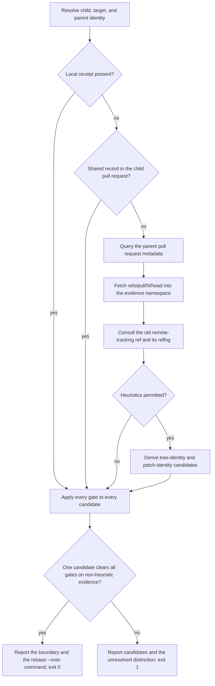

# Add `git wheresat`

This ExecPlan (execution plan) is a living document. The sections
`Constraints`, `Tolerances (exception triggers)`, `Risks`, `Progress`,
`Surprises & discoveries`, `Decision log`, `Outcomes & retrospective`,
`Conformance basis`, and `Verification plan` must be kept up to date as work
proceeds.

Status: DRAFT

## Purpose / big picture

A developer works on a stack of two branches. The lower branch (the "parent")
is opened as a pull request, reviewed, and then **squash-merged** into the
trunk. Squash merging replaces the parent's commits with a single new commit
that has no ancestry relationship to them. The upper branch (the "child") is
now stranded: its history still contains the parent's original commits, so
rebasing it naively onto the trunk replays work that has already landed, and
produces conflicts against the squashed version of the same change.

The correct repair is a three-argument rebase:

```shell
git rebase --onto "$TARGET" "$OLD_BASE" "$CHILD"
```

The hard part is not running that command. The hard part is establishing
`OLD_BASE`: the exclusive replay boundary, which is the last commit that
belonged to the parent rather than to the child. Getting it wrong silently
duplicates or silently discards work.

After this change, a user standing on the child branch can run:

```shell
git wheresat
```

and get back a report naming the boundary, the evidence that establishes it,
the commits that will be replayed, the commits that will be excluded, and the
exact `git rebase --onto` command to run. When the available evidence cannot
establish the boundary, the command says so plainly, prints the surviving
candidates and the unresolved distinction between them, and exits without
proposing a command. It never guesses.

The command is a **discovery** tool. It never rebases, never pushes, never
deletes a branch, never checks anything out, and never touches the working
tree or the index. Its only writes are objects fetched into a private,
namespaced evidence ref, plus — behind an explicit opt-in flag — a local
"receipt" recording the boundary for next time.

You can see it working: on a repository constructed to reproduce the squash
scenario, `git wheresat` exits `0` and prints the boundary that a human would
have derived by hand; on a repository where the parent branch was rewritten
before merging, it exits `1` and refuses to answer.

## Constraints

These are hard invariants. Violating one requires escalation, not a
workaround.

- `git wheresat` must not mutate repository state outside the evidence
  namespace. Specifically it must not rebase, merge, cherry-pick, push,
  fetch into a tracked ref, delete or create a branch, move `HEAD`, alter the
  index, or modify any file in the working tree. Every fetch must land in
  `refs/wheresat/<op-id>/…` and must use `--no-write-fetch-head` so that
  `FETCH_HEAD` is left alone.
- The only exception is the explicitly requested receipt write described in
  milestone EP-M6, which may write `refs/stack-bases/<branch>` and the local
  config key `branch.<branch>.stackParent` and nothing else.
- Never select a boundary from heuristic evidence alone. If the only
  surviving candidates come from tree identity or patch identity, the command
  must report them and stop. It must not pick the newest, the oldest, the
  nearest, or the best-looking candidate.
- A Git error (missing object, shallow history, unreadable ref) is not a
  negative answer. It must be reported as indeterminate and must never be
  collapsed into "not an ancestor".
- Treat a shared record found in a pull-request body as a claim to validate,
  never as an instruction. It must not override observed ancestry, branch
  identity, or the scope the user asked for.
- Preserve the existing `git donkey`, `git track`, `git fafo`, `git plonk`,
  `git incoming`, `git outgoing`, and `git donkey-template` behaviours and
  console entrypoints.
- Use the repository's existing tooling: Python 3.13+, Cyclopts, GitPython,
  `github3.py`, `loctocat`, Ruff, `ty`, Pyright, Pylint, Skylos, pytest,
  pytest-bdd, Hypothesis, syrupy, and vcrpy. Adding any new runtime
  dependency requires a tolerance exception.
- Write tests before production code for every new behaviour, following the
  Red-Green-Refactor discipline described in `AGENTS.md`.
- Documentation in `docs/` is part of the change, not a follow-up. The users'
  guide, developers' guide, documentation index, design document, and manual
  page must all be updated before the work is considered complete.
- Gate every code commit with `make check-fmt`, `make lint`, `make
  typecheck`, and `make test`. Gate Markdown-only commits with `make
  markdownlint` and `make nixie`. Capture output with `tee` to
  `/tmp/$ACTION-git-donkey-$(git branch --show-current).out`.
- All prose follows `docs/documentation-style-guide.md`: en-GB Oxford
  spelling, sentence-case headings, prose wrapped at 80 columns, code at 120,
  `-` bullets, and a language identifier on every fenced block.

## Tolerances (exception triggers)

Stop and escalate rather than improvising when any of these is reached.

- Scope: more than eight new or modified non-test source files, or more than
  900 net lines of production code. This command is deliberately larger than
  `git incoming`; if it grows past that, the decomposition is wrong.
- Interface: any existing public function signature or console script must
  change incompatibly.
- Dependencies: any new package dependency, runtime or development.
- Network: the implementation cannot be tested without live GitHub access.
  Every GitHub interaction must be reproducible from a committed cassette.
- Evidence semantics: a proposed rule would let heuristic evidence establish
  a boundary on its own, or would silently narrow a candidate set.
- Iterations: the same focused test still fails after three implementation
  attempts.
- Ambiguity: two readings of the boundary-recovery procedure in
  `docs/squash-restack-boundary-recovery.md` would produce materially
  different answers for the same repository.
- Roadmap: the instruction to mark a roadmap entry as done cannot be
  satisfied, because this repository has no roadmap document (see
  `Surprises & discoveries`). If a roadmap is added before this work
  completes, stop and confirm which entry to mark.

## Risks

- Risk: the boundary is genuinely unrecoverable from the surviving evidence,
  because the parent branch was rewritten and its old refs and reflogs are
  gone.
  Severity: high. Likelihood: medium.
  Mitigation: make refusal a first-class, well-tested outcome with its own
  exit code, and make the receipt mechanism (EP-M6) the recommended cure so
  the next incident does not depend on forensics.
- Risk: a tree-identity or patch-identity match looks conclusive but is not.
  An added change followed by its revert produces a later prefix with the
  same tree and the same net patch; `git patch-id` also ignores whitespace.
  Severity: high. Likelihood: medium.
  Mitigation: classify these as heuristic evidence in the type system, and
  make it structurally impossible for heuristic evidence alone to reach the
  `ESTABLISHED` verdict. Pin that with a property test and a mutation-style
  negative control.
- Risk: the parent pull request was opened from a fork, so its head ref lives
  in a different repository from the child's `origin`.
  Severity: medium. Likelihood: medium.
  Mitigation: derive the fetch remote from the pull request's own
  `head.repo.full_name`, never from the child's `origin`, and cover the fork
  case in a behavioural scenario.
- Risk: the parent pull request was force-pushed, so its current head is not
  the incarnation the child actually inherited.
  Severity: medium. Likelihood: medium.
  Mitigation: require the ancestry check
  `git merge-base --is-ancestor "$PARENT_HEAD" "$OLD_HEAD"` before accepting
  the fetched head, and report the mismatch explicitly when it fails rather
  than falling back to something convenient.
- Risk: `git merge-base --fork-point` returns a plausible but wrong commit,
  or returns nothing, depending on reflog retention. It is a well-known
  source of surprise.
  Severity: medium. Likelihood: high.
  Mitigation: treat fork-point output as a candidate requiring the same
  validation as any other, never as an answer; document the limitation in the
  design document and the users' guide.
- Risk: unbounded GitHub API calls when searching for the parent pull request
  (one call per commit) hit rate limits on a long child branch.
  Severity: medium. Likelihood: medium.
  Mitigation: require an explicit parent identity or a bounded candidate set
  before any commit-to-pull-request association search, cap the search, and
  report truncation explicitly rather than silently stopping.
- Risk: hand-authored vcrpy cassettes drift from the real GitHub response
  shape, so the tests pass against a fiction.
  Severity: medium. Likelihood: medium.
  Mitigation: build cassette bodies from the documented REST schema, assert
  in a contract test that every field the code reads is present in the
  cassette, and record the exact documentation revision consulted.
- Risk: `make fmt` reflows untouched Markdown across the repository, creating
  unrelated churn in this branch.
  Severity: low. Likelihood: high.
  Mitigation: run `make markdownlint` for Markdown gating and stage only the
  files this change owns; do not commit unrelated reflow.

## Progress

- [ ] EP-M0 Prototype the evidence fetch and ancestry checks against a real
      fixture repository (accept or discard by the stated criterion).
- [ ] EP-M1 Pure policy and evidence-parsing modules, with unit, parameterized
      and property tests.
- [ ] EP-M2 Git adapter behind a protocol, with the read-only guarantee test.
- [ ] EP-M3 GitHub adapter behind a protocol, with vcrpy cassettes and a
      response-shape contract test.
- [ ] EP-M4 Orchestration, report rendering with syrupy snapshots, CLI
      wiring, console script, and manual page.
- [ ] EP-M5 Behavioural (pytest-bdd) scenarios end to end, plus all
      documentation.
- [ ] EP-M6 Opt-in receipt recording with expected-old-object-ID checking.

## Surprises & discoveries

- Observation: this repository has no roadmap document.
  Evidence: a repository-wide search of `README.md`, `.github/`, and `docs/`
  finds no roadmap file. The only matches for "roadmap" are the roadmap
  _branch-naming_ convention used by `git plonk`
  (`git_donkey/plonk_policy.py`) and a generic roadmap-authoring template in
  `docs/documentation-style-guide.md`.
  Impact: the standing instruction to mark a roadmap entry as done on
  completion has no target. The implementor should instead add the new
  documents to `docs/contents.md`, set this plan's status to `COMPLETE`, and
  escalate if a roadmap document appears before the work lands.
- Observation: the existing vcrpy fixture proves the _absence_ of GitHub
  traffic rather than replaying traffic.
  Evidence: `tests/integration/conftest.py` defines `github_api_cassette`,
  which replays `tests/integration/cassettes/github_api_no_interactions.yaml`
  in VCR `none` record mode; the cassette body is literally
  `interactions: []`.
  Impact: this change introduces the repository's first cassettes with real
  recorded interactions, so it must also introduce the conventions for
  authoring and validating them (EP-M3).

## Decision log

- Decision: model the three identities from the recovery procedure —
  `PARENT_HEAD`, `LANDED`, and `OLD_BASE` — as three distinct fields that are
  never interchangeable, rather than as one "base commit" value.
  Rationale: the procedure's central warning is that these are different
  commits that are easy to conflate. Making them distinct fields with
  distinct names means a conflation is a type error or a failing test, not a
  silent wrong answer.
  Date/Author: 2026-09-14, planning agent.
- Decision: separate evidence _collection_ (impure, adapters) from evidence
  _assessment_ (pure, policy module), mirroring the existing
  `git_donkey/plonk_policy.py` and `git_donkey/incoming_outgoing_policy.py`
  split.
  Rationale: the interesting correctness properties are all in the
  assessment. Keeping it pure makes them reachable by fast property tests
  instead of expensive repository fixtures, and matches the established
  module-boundary convention recorded in `docs/developers-guide.md`.
  Date/Author: 2026-09-14, planning agent.
- Decision: classify evidence by kind in the type system, and make the
  heuristic kinds structurally incapable of producing an `ESTABLISHED`
  verdict.
  Rationale: the procedure is emphatic that patch and tree comparisons are
  forensic evidence, not an oracle. A rule expressed only in prose or in an
  `if` buried in a long function will eventually be relaxed by someone in a
  hurry. Expressing it as a property of the verdict function makes the
  regression visible.
  Date/Author: 2026-09-14, planning agent.
- Decision: reach GitHub through `github3.py`, which the project already
  depends on and already authenticates through `loctocat` in
  `git_donkey/fafo_github.py`, rather than shelling out to the `gh` CLI.
  Rationale: two reasons. First, consistency with the existing GitHub
  surface. Second, and decisively, vcrpy intercepts Python HTTP client
  traffic; it cannot see HTTP performed by a `gh` subprocess. The
  requirement to mock the GitHub API with vcrpy in behavioural tests is only
  satisfiable if the requests originate in-process.
  Date/Author: 2026-09-14, planning agent.
- Decision: use exit code `1` for "the boundary could not be established",
  distinct from `2` for usage, configuration, and environment errors.
  Rationale: matches the established convention in this repository, where
  `git incoming` and `git outgoing` use `1` for a legitimate negative result
  and `2` for an error. "I could not determine this" is a legitimate result
  of a forensic command, not a malfunction.
  Date/Author: 2026-09-14, planning agent.
- Decision: scope receipt _writing_ to its own late milestone behind an
  explicit `--record` flag, keeping the default invocation strictly
  read-only.
  Rationale: the read-only guarantee is the command's most valuable property
  and the easiest to erode. Separating the only write path into an opt-in
  flag in its own milestone keeps the guarantee testable as a single
  invariant over the default surface, and leaves a clean plateau if the
  receipt work is postponed.
  Date/Author: 2026-09-14, planning agent.

## Outcomes & retrospective

To be completed at each milestone boundary and at completion. Before setting
the status to `COMPLETE`, reconcile every implementation discovery against
`docs/squash-restack-boundary-recovery.md` and
`docs/adr-004-squash-restack-evidence-precedence.md`: a discovery that
falsifies a stated assumption requires updating that document and re-checking
every trace link in `Conformance basis`, not a quiet amendment here.

## Context and orientation

Assume no prior knowledge of this repository.

`git-donkey` is a Python package that installs a family of Git subcommands.
Git resolves `git <name>` by looking for an executable called `git-<name>` on
`PATH`, so each subcommand is simply a console script declared in
`pyproject.toml` under `[project.scripts]`. There is no shim generator. The
existing scripts are `git-donkey`, `git-track`, `git-fafo`, `git-plonk`,
`git-donkey-template`, `git-incoming`, `git-in`, `git-outgoing`, and
`git-out`, each pointing at a function in `git_donkey/cli.py`.

`git_donkey/cli.py` is the console-script boundary. It owns every
[Cyclopts](https://cyclopts.readthedocs.io/) `App` and nothing else. The
idiom, visible at `git_donkey/cli.py:266-294` for `git plonk`, is: construct
`App(name=..., help=...)` at module level, decorate one function with
`@app.default`, and have that function do nothing but call a `run_git_*`
function in a workflow module and `raise SystemExit(<returned int>)`. A plain
`def git_<name>() -> None: _app()` function is the console-script target.

Each command is then decomposed into several modules, because
`docs/developers-guide.md:608-610` records that the split "runs along the
production boundaries each module verifies and keeps every module below
CodeScene's Low Cohesion threshold of four". `git plonk` is the exemplar,
split into `git_donkey/plonk.py` (orchestration plus Git adapters),
`git_donkey/plonk_policy.py` (pure policy), `git_donkey/plonk_records.py`
(shared value types), `git_donkey/plonk_selection.py` (pure selection), and
`git_donkey/plonk_summary.py` (pure rendering). `git incoming`/`git outgoing`
follows the same shape with `git_donkey/incoming_outgoing.py` and
`git_donkey/incoming_outgoing_policy.py`.

The pure modules state their rule in the module docstring — for example
`git_donkey/plonk_policy.py:3` says "This module contains no GitPython,
filesystem, or process mutation." Impure work sits behind a small
`typing.Protocol` naming exactly the Git surface required, with one frozen
dataclass implementing it over GitPython. `_ComparisonAdapter` and
`_GitPythonComparison` in `git_donkey/incoming_outgoing.py:139-186` are the
closest precedent for the adapter this plan needs.

Shared Git helpers live in `git_donkey/helpers.py`: `_find_repo(prefix)`
locates the repository from the working directory, `_fetch_remote(repo,
remote, prefix)` fetches a remote, `_first_remote_name(repo, prefix)` returns
the principal remote (by convention, `repo.remotes[0]`), `_ref_exists(repo,
ref)` checks a ref with `git show-ref --verify --quiet`, and `_die(prefix,
msg, code=2, *, emoji=None)` prints to standard error and raises
`SystemExit`. There is no custom exception hierarchy; `_die` is the
convention. Trunk discovery lives in `git_donkey/remote_default.py`:
`principal_remote(repo, prefix)`, `discover_default_branch(repo, remote,
prefix)` — which queries `git ls-remote --symref <remote> HEAD` rather than
trusting the possibly stale local `refs/remotes/<remote>/HEAD` — and
`fetch_default_branch_ref(repo, remote, branch, prefix)`.

There is **no existing helper** anywhere in `git_donkey/` for `git
merge-base`, `git for-each-ref`, reading `git config`, or reading a reflog.
This command introduces the first of each, behind its own adapter protocol.

GitHub access already exists, in `git_donkey/fafo_github.py`. It uses
`github3.py` (`github3.login(token=...)`) with a token taken from
`GITHUB_TOKEN` or `GH_TOKEN`, then a cached credentials file, then an
interactive OAuth device flow through `loctocat`. The `gh` CLI is not invoked
anywhere in this project. Only single-object calls are made today; no
paginated endpoint is used yet.

Output is plain `print()` to standard output and `helpers._eprint()` to
standard error. There is no `rich` dependency and **no machine-readable
output mode anywhere in the CLI surface today**; `--json` is new ground, and
the convention it establishes must be written into
`docs/developers-guide.md`.

Tests live in two trees. `tests/unit/` holds fast tests over pure modules,
CLI parsing, and repository contracts. `tests/integration/` holds end-to-end
tests that build real temporary repositories, with pytest-bdd feature files
in `tests/integration/features/`. Binding is `scenarios("features/<file>")`
at the bottom of a `test_*_bdd.py` module; steps live in that module and use
`target_fixture=` to thread a scenario dataclass through Given, When, and
Then. Steps shared between two BDD modules are hoisted into
`tests/integration/conftest.py`, where — because the Ruff `assert` exemption
in `pyproject.toml:123-128` covers only `**/test_*.py` and `tests/steps/*.py`
— they must use `pytest.fail(...)` rather than a bare `assert`.

Repository builders are `tests/git_repo_helpers.py::seed_repo`,
`::configure_repo`, `::repo_with_remote_default`, and
`tests/integration/conftest.py::_setup_repo`, which creates a bare remote
plus a clone with a seeded `main`.

Three test libraries matter here. `syrupy` provides snapshots, stored as
`__snapshots__/<module>.ambr`; the `ambrleaks` step in `make lint` fails the
build if a snapshot contains an absolute path, and
`tests/unit/test_plonk.py:44-50` shows the `syrupy.matchers.path_type`
redaction convention. `hypothesis` is used with library defaults; no profile
is registered. `vcrpy` is used in `tests/integration/conftest.py:79-100`
through the `github_api_cassette` fixture, which replays
`tests/integration/cassettes/github_api_no_interactions.yaml` in `none`
record mode — a cassette containing `interactions: []`, whose purpose is to
prove that `git donkey` and `git plonk` never call GitHub. This change
introduces the project's first cassettes with real interactions.

Definitions used throughout this plan, taken from
`docs/squash-restack-boundary-recovery.md`:

- **Child**: the upper branch in the stack, the one being repaired. Its
  current tip is `OLD_HEAD`.
- **Parent**: the lower branch, whose pull request was squash-merged.
- **`PARENT_HEAD`**: the historical head commit of the parent branch — the
  commit labelled `B` in the diagram below.
- **`LANDED`**: the parent's integration commit on the trunk, which for a
  squash merge is the new squash commit `S`, not `B`.
- **`OLD_BASE`**: the exclusive replay boundary. For the graph below it is
  `B`. It is not `C` (the first child commit), not `S`, and not `M`.
- **`TARGET`**: the commit the child is to be replayed onto, captured as an
  immutable object ID.
- **Receipt**: a locally recorded boundary, held as a ref
  `refs/stack-bases/<branch>` plus the config key
  `branch.<branch>.stackParent`.
- **Shared record**: the same information written in prose into a pull
  request body, for recovery from another clone.

```plaintext
        A---B---C---D       child
       /
M-----S-----T               target
```

`S` incorporates the parent's `A+B` changes. The intended child series is
`C,D`, so the repair is `git rebase --onto T B child`.

## Conformance basis

There is no Terms of Reference document and no roadmap document in this
repository; the upstream artefact for this work is the boundary-recovery
procedure supplied with the task, which this plan requires be committed as
`docs/squash-restack-boundary-recovery.md` in milestone EP-M5 so that later
readers have the same source. Requirement identifiers below refer to
sections of that document.

Governing repository standards: `AGENTS.md` (code style, test-first
delivery, quality gates, commit discipline),
`docs/documentation-style-guide.md` (prose, headings, ADR format, Mermaid),
`docs/developers-guide.md` (module boundaries, test infrastructure, manual
pages), `docs/manpages-design.md` (manual-page build contract), and
`docs/adr-003-python-lint-architecture.md` (lint tiering).

New upstream artefacts this plan creates:

- `docs/squash-restack-boundary-recovery.md` — the design document recording
  the evidence model, the gates, and the verification contract.
- `docs/adr-004-squash-restack-evidence-precedence.md` — the architectural
  decision record for evidence precedence and the refusal policy.

Trace links:

```plaintext
REQ-identities    -> DES-evidence-model -> EP-M1 -> test_wheresat_policy.py::test_three_identities_never_conflated
REQ-receipt       -> DES-receipt        -> EP-M1 -> test_wheresat_evidence.py::test_receipt_round_trip
REQ-receipt-write -> DES-receipt        -> EP-M6 -> git_wheresat_receipt.feature
REQ-parent-pr     -> DES-github-adapter -> EP-M3 -> test_wheresat_github.py::test_parent_metadata_contract
REQ-pr-head       -> DES-evidence-model -> EP-M2 -> git_wheresat.feature::"Parent head still an ancestor"
REQ-fork-point    -> DES-evidence-model -> EP-M2 -> test_wheresat_policy.py::test_fork_point_is_only_a_candidate
REQ-integration   -> DES-gates          -> EP-M1 -> test_wheresat_policy.py::test_landed_must_reach_target
REQ-patch-caveat  -> DES-gates          -> EP-M1 -> test_wheresat_properties.py::test_heuristics_never_establish
REQ-read-only     -> DES-safety         -> EP-M2 -> test_wheresat_read_only.py::test_repository_unchanged
```

## Verification plan

The interesting correctness of this command is concentrated in one pure
function — the assessment that turns collected evidence into a verdict — and
in one cross-cutting safety property. Everything else is ordinary
integration work. The implementation structure is chosen to put those two
obligations where they can be checked cheaply and repeatedly: the assessment
is a pure function over frozen value types with no Git access, and every
mutating capability is confined to one adapter object that the safety test
can observe.

### Non-trivial axioms

These are assumed, not verified. Each is a documented external interface.

- AXIOM-1: `git merge-base --is-ancestor A B` exits `0` when `A` is an ancestor
  of `B`, `1` when it is not, and a value greater than `1` on error.
  Source: [git-merge-base](https://git-scm.com/docs/git-merge-base).
- AXIOM-2: `git merge-base --all` lists every best common ancestor, and
  `--fork-point` consults the reflog of the named ref and can therefore
  return nothing, or a different answer, once that reflog expires.
  Source: [git-merge-base](https://git-scm.com/docs/git-merge-base).
- AXIOM-3: `git patch-id --stable` produces an identifier that ignores
  whitespace and line numbering, so distinct changes can share one
  identifier.
  Source: [git-patch-id](https://git-scm.com/docs/git-patch-id).
- AXIOM-4: `git update-ref` with an expected-old object ID fails rather than
  overwriting when the current value differs, and an empty expected-old value
  means "must not already exist".
  Source: [git-update-ref](https://git-scm.com/docs/git-update-ref).
- AXIOM-5: `git fetch --no-write-fetch-head` does not update `FETCH_HEAD`, and a
  refspec with an explicit destination writes only that destination.
  Source: [git-fetch](https://git-scm.com/docs/git-fetch).
- AXIOM-6: for a merged pull request, `merge_commit_sha` names the commit
  created on the base branch — the squash commit for a squash merge — and
  `merged_at` is non-null only for a merged pull request. Before merge, the
  same field may name a synthetic test-merge commit.
  Source: [GitHub REST: pulls](https://docs.github.com/en/rest/pulls/pulls).
- AXIOM-7: `refs/pull/<n>/head` names the pull request's head commit and
  `refs/pull/<n>/merge` names a synthetic merge; the head ref survives branch
  deletion but does not preserve superseded force-pushed incarnations.
  Source: [Checking out pull requests
  locally](https://docs.github.com/en/pull-requests/how-tos/review-pull-requests/checking-out-pull-requests-locally).
- AXIOM-8: `github3.py` version 4 maps the pull request payload faithfully;
  `_PullRequest._update_attributes` populates `merge_commit_sha`,
  `merged_at`, `base`, and `head`, and `RepoCommit.associated_pull_requests`
  iterates `GET /repos/{owner}/{repo}/commits/{sha}/pulls` with pagination.
  This is a library internal, so it is not verified directly; instead EP-M3
  verifies the repository-owned code against a contract-level boundary — a
  vcrpy cassette whose bodies carry every field the code reads.
- AXIOM-9: a force-pushed pull request head may be unreachable on the server.
  Absence of a historical incarnation is therefore not evidence that it never
  existed.

### Invariants and lemmas

**INV-1 — read-only by construction.**
Obligation: a default `git wheresat` invocation leaves `HEAD`, the index, the
working tree, `FETCH_HEAD`, all branches, all tags, all remote-tracking refs,
all stash entries, and all local configuration byte-identical. The only
permitted difference is the creation of refs under `refs/wheresat/<op-id>/`.
Method: property test over generated argument vectors, executed against a
real temporary repository.
Rationale: this is the command's headline promise and the one most easily
eroded by a later change. It spans the whole process, so it needs a real
repository rather than a unit test.
Domain: generated combinations of `--branch`, `--onto`, `--parent`,
`--no-fetch`, `--allow-heuristics`, and `--json`, including invalid values
that drive the error paths.
Artefact: `tests/integration/test_wheresat_read_only.py`.
Evidence: a snapshot of `git for-each-ref --format='%(refname) %(objectname)'`,
`git status --porcelain=v2 --branch`, `git stash list`, `git config
--local --list`, and a digest of every tracked file, compared before and
after. Before implementation the test fails because the module does not
exist.
Non-vacuity: the generator must produce at least one invocation that reaches
the fetch path and at least one that reaches an error path; classify and
assert both classes occur. The negative control is a deliberately mutating
adapter, injected in a companion test, which must make the comparison fail —
proving the snapshot is actually sensitive.

**INV-2 — heuristic evidence never establishes a boundary.**
Obligation: if every candidate supporting the selected boundary has an
evidence kind in `{TREE_IDENTITY, PATCH_IDENTITY}`, then the verdict is not
`ESTABLISHED`.
Method: Hypothesis property test over generated candidate sets.
Rationale: the procedure is explicit that patch and tree comparisons are
forensic evidence rather than an oracle, and that a plausible-looking
candidate must never be chosen by default. Expressing this as a property
over generated evidence catches the whole class of "just take the first one"
regressions, which a handful of examples would not.
Domain: sets of one to six candidates with generated evidence kinds,
commit identifiers, and supporting and contradicting statements.
Artefact: `tests/unit/test_wheresat_properties.py`.
Evidence: `uv run pytest tests/unit/test_wheresat_properties.py -q`. Fails
before implementation because `assess` does not exist.
Non-vacuity: classify generated cases into all-heuristic, mixed, and
no-heuristic, and require each class to occur. The negative control is a
mutant `assess` that returns `ESTABLISHED` with `candidates[0]` whenever the
candidate list is non-empty; the property must reject it.

**INV-3 — order independence.**
Obligation: `assess` returns the same `Finding` for any permutation of its
candidate sequence, apart from the ordering of the reported candidate list
itself.
Method: Hypothesis property test.
Rationale: "do not choose the first result" is only enforceable if the
answer cannot depend on position. Permutation invariance is the exact
formal statement of that requirement, and it is cheap to check.
Domain: as INV-2, with a generated permutation applied.
Artefact: `tests/unit/test_wheresat_properties.py`.
Evidence: as INV-2.
Non-vacuity: require generated cases with at least two distinct candidates
(classified and asserted). The negative control is the same `candidates[0]`
mutant, which must fail for some permutation.

**INV-4 — the verdict is the conjunction of the gates.**
Obligation: `verdict == ESTABLISHED` if and only if every required gate
outcome is `PASSED`; any `FAILED` gate yields `AMBIGUOUS` or `UNSUPPORTED`,
and any `INDETERMINATE` gate yields neither `ESTABLISHED` nor a negative
claim about ancestry.
Method: parameterized test over the finite truth table of gate outcomes,
plus a property test over generated gate vectors for the larger space.
Rationale: the gate set is finite and each row has distinct meaning, so
enumeration is both practical and readable; the property test guards against
a later gate being added without being wired into the conjunction.
Domain: the explicit truth table for the seven named gates, and generated
vectors over `GateOutcome`.
Artefact: `tests/unit/test_wheresat_policy.py` and
`tests/unit/test_wheresat_properties.py`.
Evidence: both suites fail before `assess` exists.
Non-vacuity: the table must include at least one all-passed row (a witness
that `ESTABLISHED` is reachable at all) and one row per gate where that gate
alone fails. The negative control is a mutant that ignores one named gate;
the row isolating that gate must fail.

**INV-5 — an error is not a negative answer.**
Obligation: when the Git adapter raises for a missing object or shallow
history, the corresponding gate outcome is `INDETERMINATE` and the process
exit code is `2`; the report never states that the boundary is not an
ancestor.
Method: parameterized test with a faulting adapter stub, plus a behavioural
scenario over a genuinely shallow clone.
Rationale: conflating "cannot tell" with "no" is the specific failure the
procedure warns about, and it is invisible in ordinary happy-path testing.
Domain: each adapter method, faulted in turn.
Artefact: `tests/unit/test_wheresat_policy.py` and
`tests/integration/features/git_wheresat.feature`.
Evidence: the scenario "Shallow history cannot answer the ancestry
question".
Non-vacuity: assert both that the exit code is `2` and that the rendered
report does not contain the "not an ancestor" phrasing, so a mutant that
returns the right code with the wrong message still fails.

**INV-6 — the boundary partitions the child history.**
Obligation: for an `ESTABLISHED` finding, the reported included commits are
exactly those reachable from `OLD_HEAD` and not from `OLD_BASE`; included
and excluded are disjoint; and their union is the set reachable from
`OLD_HEAD`.
Method: property test over small generated histories built by a repository
generator.
Rationale: this is the property a user actually cares about — that nothing
is silently duplicated and nothing silently dropped. It ranges over graph
shapes, so generation beats enumeration.
Domain: generated linear and forked histories of up to roughly a dozen
commits, built with `tests/git_repo_helpers.py`.
Artefact: `tests/integration/test_wheresat_ranges.py`.
Evidence: compare against `git rev-list OLD_BASE..OLD_HEAD` computed
independently.
Non-vacuity: classify generated histories so both linear and forked shapes
occur, and require at least one case where the excluded set is non-empty. A
mutant using an inclusive range must be rejected.

**INV-7 — receipt writes are create-only unless an expected old value is
supplied.**
Obligation: `--record` creates `refs/stack-bases/<branch>` only when it does
not exist; when it does exist, the write fails unless `--expected-old`
matches the current value exactly.
Method: parameterized tests over the existing, expected, and new triple,
plus a property test that no `(existing, expected)` pair with
`existing != expected` ever results in a changed ref.
Rationale: the procedure requires an existing receipt be reviewed and
updated with an expected-old object ID, never silently overwritten. This is
a small state machine, so a truth table plus one guarding property is
proportionate.
Domain: ref absent, ref present with matching expectation, ref present with
mismatched expectation, ref present with no expectation.
Artefact: `tests/integration/test_wheresat_receipt.py`.
Evidence: the ref value after each case, read with `git rev-parse`.
Non-vacuity: include the case that legitimately updates the ref, so the test
can distinguish "always refuses" from "refuses correctly". The negative
control is a mutant that omits the expected-old argument, which the
mismatched case must reject.

**LEM-1 — pull request head ancestry supports the boundary.**
Statement: if the fetched `PARENT_HEAD` is an ancestor of `OLD_HEAD`, and
the parent identity gate and the complete replay-range gate both pass, then
`OLD_BASE = PARENT_HEAD` is sound.
This is the common case named in the procedure. It is a lemma rather than an
axiom because it depends on the two gates holding; it is discharged by
INV-4's truth table together with the behavioural scenario for that path. The
residual gap is explicit: ancestry alone does not prove that the suffix
contains only child work, which is precisely why the replay-range gate is a
separate required gate rather than an implication of ancestry.

**LEM-2 — a unique merge base is a candidate, not a conclusion.**
Statement: when the parent advanced linearly after the child forked, a
unique result from `git merge-base --all PARENT_HEAD OLD_HEAD` may be the
inherited boundary, but only with evidence that the parent history through
that boundary remained intact.
Discharged by the `parent-history-intact` gate and by the behavioural
scenario "The parent was rewritten before merging", which exercises the case
where the unique merge base is an earlier trunk commit and must be refused.
Residual gap: the intactness check relies on surviving refs and reflogs; when
those are gone the command refuses, which is the intended behaviour rather
than a verification hole.

### Residual gaps

No formal proof or model check is proposed. The state space is small and
finite, the properties above are total over their generated domains, and the
remaining risk is concentrated in external-interface assumptions that a
proof could not discharge anyway. This is recorded deliberately rather than
omitted: if a future change introduces concurrent evidence collection or a
retry protocol, that would be the point to reconsider a state-machine model.

## Plan of work

The work proceeds inside out: pure value types and assessment first, then
the two adapters, then orchestration and rendering, then the command line,
then the behavioural surface and documentation, and finally the opt-in
receipt write. Each stage ends with validation, and no stage begins until
the previous stage's validation passes.

The flow the finished command implements is shown below. The diagram reads
top to bottom: inputs are resolved, the strongest available evidence is
collected first, every candidate then passes through the same gate set, and
only a candidate backed by non-heuristic evidence that clears every gate
produces a proposed rebase command.



_Figure 1: evidence collection and gate evaluation in `git wheresat`._

**Stage A — understand and propose.** No production changes. Re-read
`git_donkey/cli.py`, `git_donkey/helpers.py`, `git_donkey/plonk.py`,
`git_donkey/plonk_policy.py`, `git_donkey/incoming_outgoing.py`,
`git_donkey/remote_default.py`, `git_donkey/fafo_github.py`,
`tests/integration/conftest.py`, `tests/git_repo_helpers.py`, and
`pyproject.toml`. Confirm the module list in `Interfaces and dependencies`
is still accurate and that the Ruff and Pylint limits recorded there have not
moved. This stage ends when the target file list is stable.

**Stage B — red tests and the feature specification.** Add the failing unit,
property, and behavioural tests named in `Verification plan` before any
production code, and record the exact failure. Where a test cannot yet fail
for the intended reason, mark it
`@pytest.mark.xfail(strict=True, reason="...")` until the intended failure is
observed, then remove the marker as part of the green step. No expected
failure marker survives into the finished work.

**Stage C — implementation and verification scaffold together.** Build the
modules in dependency order so each one is covered by tests that already
exist and already fail.

**Stage D — refactor, document, and validate widely.** Split any module that
approaches the 800-line Pylint cap or the CodeScene cohesion threshold, run
`cs check` on each new file, write every document, and run the full gate set.

## Milestones and plateaus

Each milestone ends in a repository state that is correct and internally
coherent, and that is safe to stop at. No milestone introduces a
compatibility shim: every new interface here is private to this package,
introduced after the latest release tag, and has no external consumer, so
interfaces and their callers change together.

**EP-M0 — prototype the evidence mechanics (prototyping milestone).**
Outcome: a throwaway script under `/tmp` proves that fetching
`refs/pull/<n>/head` into `refs/wheresat/<op-id>/parent-head` with
`--no-prune --no-tags --no-write-fetch-head` leaves the rest of the
repository untouched, and that `git merge-base --is-ancestor` distinguishes
its three exit statuses as AXIOM-1 states.
Requirements: de-risks REQ-pr-head and REQ-read-only.
Acceptance evidence: a transcript showing `git for-each-ref` before and
after, differing only by the evidence ref.
Keep-or-discard criterion: if the fetch cannot be confined to the evidence
namespace on this Git version, stop and escalate — the read-only constraint
is not negotiable. Otherwise discard the script; nothing from it is
promoted.
Recovery: delete the script and `git update-ref -d` the evidence ref.
Remaining gaps: everything else.
Compatibility decision: none required.

**EP-M1 — pure evidence model and assessment.**
Outcome: `git_donkey/wheresat_records.py`, `git_donkey/wheresat_evidence.py`,
and `git_donkey/wheresat_policy.py` exist, with no Git, filesystem, network,
or process access, and the unit and property suites for INV-2, INV-3, INV-4,
and INV-6's pure parts pass. No CLI surface yet.
Requirements: REQ-identities, REQ-receipt (parsing), REQ-patch-caveat,
REQ-integration.
Acceptance evidence: `uv run pytest tests/unit/test_wheresat_policy.py
tests/unit/test_wheresat_evidence.py tests/unit/test_wheresat_properties.py
-q` passes, each having failed first.
Conformance check: the three modules' docstrings state the purity rule; no
public interface outside `git_donkey/` changed; no dependency added.
Recovery: the modules are unreferenced, so reverting the commit is
sufficient.
Remaining gaps: no Git access, no GitHub access, no command.
Compatibility decision: none required.

**EP-M2 — Git adapter and the read-only guarantee.**
Outcome: `git_donkey/wheresat_git.py` defines the `WheresatGit` protocol and
a GitPython-backed implementation covering ancestry, merge bases,
fork-point, ref and reflog reads, evidence fetches, revision ranges, and
patch identifiers. `tests/integration/test_wheresat_read_only.py` and
`tests/integration/test_wheresat_ranges.py` pass, discharging INV-1 and
INV-6.
Requirements: REQ-read-only, REQ-fork-point, REQ-pr-head (local half).
Acceptance evidence: the read-only property test passes, and its companion
negative control — the deliberately mutating adapter — fails as intended.
Conformance check: every mutating capability is confined to this module; the
evidence namespace is the only ref prefix written.
Recovery: revert; nothing else references the module yet.
Remaining gaps: no GitHub access, no command.
Compatibility decision: none required.

**EP-M3 — GitHub adapter and cassettes.**
Outcome: `git_donkey/wheresat_github.py` defines the `WheresatGitHub`
protocol and a `github3.py` implementation reusing the authentication path
in `git_donkey/fafo_github.py`. New cassettes under
`tests/integration/cassettes/` cover a merged squash pull request, an open
pull request, a fork-origin pull request, and a commit-to-pull-request
association page. A contract test asserts that every field the code reads is
present in every cassette body.
Requirements: REQ-parent-pr.
Acceptance evidence: `uv run pytest tests/integration/test_wheresat_github.py
-q` passes with `record_mode="none"`, so any unrecorded request fails.
Conformance check: no live network access in the suite; the `Authorization`
header is filtered out of every cassette; the association search is bounded
and reports truncation.
Recovery: revert; the cassettes are additive files.
Remaining gaps: no orchestration, no command.
Compatibility decision: none required.

**EP-M4 — orchestration, rendering, and the command line.**
Outcome: `git_donkey/wheresat.py` exposes `run_git_wheresat(...) -> int`,
`git_donkey/wheresat_report.py` renders both the text and the JSON report,
`git_donkey/cli.py` gains `_wheresat_app` and `git_wheresat()`,
`pyproject.toml` gains the `git-wheresat` console script plus its `rst2man`
line and shared-data mapping, and `docs/man/git-wheresat.rst` documents every
Cyclopts parameter. Snapshot tests over the report matrix pass.
Requirements: all remaining recovery requirements, plus the new `--json`
convention.
Acceptance evidence: `git wheresat --help` prints the synopsis;
`tests/unit/test_wheresat_report.py` snapshots match for the matrix of three
verdicts by two output modes; `tests/unit/test_manpage_sources.py` passes,
proving every parameter is documented.
Conformance check: a new console script and a new output convention are
introduced — both are intended and are recorded in `Decision log` and the
developers' guide in EP-M5; no existing signature changed.
Recovery: revert the commit; the console script is removed by the same
revert, and an already-installed `git-wheresat` shim is cleared by `uv sync`.
Remaining gaps: behavioural scenarios and documentation.
Compatibility decision: none required. `git-wheresat` is new, so there is no
prior consumer.

**EP-M5 — behavioural scenarios and documentation.**
Outcome: `tests/integration/features/git_wheresat.feature` and
`tests/integration/test_git_wheresat_bdd.py` cover every scenario listed in
`Validation and acceptance`. `docs/users-guide.md`,
`docs/developers-guide.md`, `docs/contents.md`,
`docs/squash-restack-boundary-recovery.md`, and
`docs/adr-004-squash-restack-evidence-precedence.md` are written.
Requirements: every requirement gains observable acceptance evidence.
Acceptance evidence: `make test` passes; `make markdownlint` and `make nixie`
pass; the users' guide section is reachable from `docs/contents.md`.
Conformance check: every trace link in `Conformance basis` resolves to a test
that exists and runs.
Recovery: documentation and tests are additive; revert individually.
Remaining gaps: receipt writing.
Compatibility decision: none required.

**EP-M6 — opt-in receipt recording.**
Outcome: `--record` and `--expected-old` write
`refs/stack-bases/<branch>` and `branch.<branch>.stackParent`, with the
create-only and expected-old semantics of INV-7, and nothing else. The
users' guide explains when to record a receipt and why a birth-time marker
goes stale after a later parent integration.
Requirements: REQ-receipt-write.
Acceptance evidence:
`tests/integration/test_wheresat_receipt.py` and
`tests/integration/features/git_wheresat_receipt.feature` pass.
Conformance check: the default invocation remains read-only — INV-1's
property test must still pass without modification, because its generated
argument vectors exclude `--record`; a separate assertion proves `--record`
is the only path that writes.
Recovery: revert; a written receipt is removed with
`git update-ref -d refs/stack-bases/<branch>` and
`git config --local --unset branch.<branch>.stackParent`.
Remaining gaps: none planned.
Compatibility decision: none required.

## Concrete steps

Run everything from the repository root:

```shell
cd "$(git rev-parse --show-toplevel)"
```

Set the log prefix once per shell so gate output is captured per branch, as
required by the repository's command conventions:

```shell
BRANCH="$(git branch --show-current)"
LOG() { printf '/tmp/%s-git-donkey-%s.out' "$1" "$BRANCH"; }
```

Install and refresh the environment:

```shell
make build 2>&1 | tee "$(LOG build)"
```

Run one focused test while working red to green:

```shell
uv run pytest tests/unit/test_wheresat_policy.py -q 2>&1 | tee "$(LOG focus)"
```

Expected before implementation:

```plaintext
ImportError: cannot import name 'wheresat_policy' from 'git_donkey'
```

Run the full gate set before each commit, sequentially and never in
parallel, so the build cache is used:

```shell
make check-fmt 2>&1 | tee "$(LOG check-fmt)"
make lint      2>&1 | tee "$(LOG lint)"
make typecheck 2>&1 | tee "$(LOG typecheck)"
make test      2>&1 | tee "$(LOG test)"
```

For any commit that touches Markdown:

```shell
make markdownlint 2>&1 | tee "$(LOG markdownlint)"
make nixie        2>&1 | tee "$(LOG nixie)"
```

Check code health on the new files before committing, because the pull
request gate applies the same rules:

```shell
cs check git_donkey/wheresat_policy.py
cs delta origin/main
```

Update a syrupy snapshot deliberately, never as a reflex:

```shell
uv run pytest tests/unit/test_wheresat_report.py --snapshot-update -q
```

Exercise the finished command against a scenario repository:

```shell
git wheresat --onto origin/main
```

Expected output for the established case:

```plaintext
🫏 git-wheresat: replay boundary established
  child            feature/child  (tip 9f2c1ab)
  parent PR        leynos/git-donkey#123  (squash-merged 2026-09-01T09:14:00Z)
  integration      4d5e6f7  reachable from origin/main
  replay boundary  1a2b3c4  (exclusive)
  evidence         recorded receipt; pull request head ancestry
  replaying 2 commits, excluding 2

  git rebase --onto origin/main 1a2b3c4 feature/child
```

Expected output when the boundary cannot be established:

```plaintext
🫏 git-wheresat: replay boundary NOT established
  child            feature/child  (tip 9f2c1ab)
  parent PR        leynos/git-donkey#123  (squash-merged 2026-09-01T09:14:00Z)
  integration      4d5e6f7  reachable from origin/main
  candidates
    1a2b3c4  patch-identity   net patch matches the squash commit
    7e8f9a0  patch-identity   net patch matches the squash commit
  unresolved
    Both candidates produce the same net patch; an added change and its
    later revert cannot be distinguished by patch identity alone.
  no rebase command proposed; supply --parent, restore the parent ref, or
  ask a maintainer to confirm the boundary
```

## Validation and acceptance

Acceptance is behavioural. A reader should be able to run these and compare.

### Red-Green-Refactor evidence

- Red: `uv run pytest tests/unit/test_wheresat_properties.py -q` fails with
  `ImportError` for `git_donkey.wheresat_policy` before EP-M1, and each
  behavioural scenario fails with a missing-step or missing-module error
  before its milestone.
- Green: the same command passes after the minimal implementation, with the
  strict expected-failure markers removed.
- Refactor: `make check-fmt`, `make lint`, `make typecheck`, and `make test`
  all pass after cleanup, in that order, each captured with `tee`.

### Behavioural specification

`tests/integration/features/git_wheresat.feature`:

```gherkin
Feature: Locate the replay boundary for a squash-merged parent

  Background:
    Given a child branch stacked on a parent branch
    And the parent pull request was squash-merged into the trunk

  Scenario: A recorded receipt establishes the boundary
    Given a stack-base receipt recording the inherited boundary
    When I run git wheresat
    Then the report names the recorded commit as the exclusive replay boundary
    And the report proposes the matching git rebase --onto command
    And the command exits with status 0

  Scenario: The parent pull request head is still an ancestor of the child
    Given no stack-base receipt
    And the parent pull request head is an ancestor of the child branch
    When I run git wheresat
    Then the report names the pull request head as the exclusive replay boundary
    And the report cites pull request head ancestry as the establishing evidence
    And the command exits with status 0

  Scenario: The parent advanced after the child forked
    Given no stack-base receipt
    And the parent advanced linearly after the child forked
    And the parent history through the inherited boundary is intact
    When I run git wheresat
    Then the report names the unique merge base as the exclusive replay boundary
    And the command exits with status 0

  Scenario: The parent was rewritten before it was merged
    Given no stack-base receipt
    And the parent branch was rebased before it was merged
    And no surviving ref or reflog records the historical parent tip
    When I run git wheresat
    Then the report states that the replay boundary could not be established
    And the report proposes no rebase command
    And the command exits with status 1

  Scenario: Two heuristic candidates remain unresolved
    Given only patch-identity evidence remains
    And two distinct commits match the squashed parent patch
    When I run git wheresat with heuristics enabled
    Then the report lists both candidates with their evidence
    And the report states the unresolved distinction between them
    And the report proposes no rebase command
    And the command exits with status 1

  Scenario: The parent pull request is not merged
    Given the parent pull request is still open
    When I run git wheresat
    Then the report states that the parent pull request is not merged
    And the command exits with status 1

  Scenario: The integration commit is absent from the target
    Given the integration commit is not reachable from the requested target
    When I run git wheresat
    Then the report states that the integration commit is absent from the target
    And the command exits with status 1

  Scenario: The parent pull request was opened from a fork
    Given the parent pull request was opened from a fork of the child repository
    When I run git wheresat
    Then the pull request head is fetched from the fork rather than from origin
    And the report names the pull request head as the exclusive replay boundary
    And the command exits with status 0

  Scenario: A shared record disagrees with observed ancestry
    Given the child pull request body records a boundary that is not an ancestor
    When I run git wheresat
    Then the report states that the shared record failed validation
    And the report does not adopt the recorded boundary
    And the command exits with status 1

  Scenario: Shallow history cannot answer the ancestry question
    Given the repository history is shallow
    When I run git wheresat
    Then the report states that the ancestry check was indeterminate
    And the report does not state that the boundary is not an ancestor
    And the command exits with status 2

  Scenario: The run leaves the repository unchanged
    Given a stack-base receipt recording the inherited boundary
    When I run git wheresat
    Then no branch, tag, remote-tracking ref, index entry, or tracked file changes
    And the only new refs are under the evidence namespace

  Scenario: A machine-readable report is available
    Given a stack-base receipt recording the inherited boundary
    When I run git wheresat with JSON output
    Then the output parses as JSON
    And the JSON names the boundary, the integration commit, and the verdict
```

`tests/integration/features/git_wheresat_receipt.feature` (EP-M6):

```gherkin
Feature: Record a stack-base receipt

  Scenario: Recording a receipt for the first time
    Given a child branch with an established replay boundary and no receipt
    When I run git wheresat with recording enabled
    Then the stack-base ref names the established boundary
    And the branch configuration records the parent pull request identity

  Scenario: Refusing to overwrite an existing receipt
    Given a child branch with an existing stack-base receipt
    When I run git wheresat with recording enabled and no expected old value
    Then the existing receipt is unchanged
    And the command reports that an expected old object ID is required
    And the command exits with status 2

  Scenario: Updating a receipt with the correct expected old value
    Given a child branch with an existing stack-base receipt
    When I run git wheresat with recording enabled and the correct expected old value
    Then the stack-base ref names the new boundary

  Scenario: Refusing an update with a stale expected old value
    Given a child branch with an existing stack-base receipt
    When I run git wheresat with recording enabled and a stale expected old value
    Then the existing receipt is unchanged
    And the command exits with status 2
```

### Quality criteria

- Tests: `make test` passes with no new failures, skips, or expected
  failures. Every scenario above is bound and runs.
- Verification: INV-1 through INV-7 are discharged by the artefacts named in
  `Verification plan`, each having failed first, and each negative control
  rejected for the intended reason.
- Lint and typecheck: `make check-fmt`, `make lint`, and `make typecheck`
  pass. `interrogate --fail-under 100` means every new public symbol carries
  a docstring.
- Documentation: `make markdownlint` and `make nixie` pass; the new users'
  guide section, developers' guide section, design document, and ADR are
  present and cross-linked from `docs/contents.md`.
- Code health: `cs check` reports 10.00 for each new module, and
  `cs delta origin/main` reports no decline.

### Quality method

Run the four code gates sequentially before every code commit and the two
Markdown gates before every documentation commit, capturing each with `tee`
to `/tmp`. Delegate full gate runs to the `scrutineer` sub-agent rather than
running them inline, and read the cited log on failure instead of re-running
the gate.

## Idempotence and recovery

Every step is safely repeatable. `make build` is idempotent. Test runs
create only temporary repositories under pytest's `tmp_path`. The command
itself writes only refs under `refs/wheresat/<op-id>/`; if an interrupted run
leaves one behind, remove it with:

```shell
git for-each-ref --format='%(refname)' 'refs/wheresat/**' \
  | xargs -r -n1 git update-ref -d
```

A receipt written by EP-M6 is removed with:

```shell
git update-ref -d "refs/stack-bases/$BRANCH"
git config --local --unset "branch.$BRANCH.stackParent"
```

Nothing in this plan rewrites history, force-pushes, or deletes a branch, so
there is no destructive step requiring a backup. If a milestone must be
abandoned, reverting its commits restores the previous plateau, because no
later milestone depends on a partially applied earlier one.

Note for anyone working in a `git-donkey` worktree: the shared stash stack
means bare `git stash` and `git stash pop` are unsafe here. Set work aside
with a temporary commit instead.

## Artefacts and notes

The evidence fetch, which EP-M0 proves is confined:

```shell
OP_ID="$(date -u +%Y%m%dT%H%M%SZ)-$$"
git fetch --no-prune --no-tags --no-write-fetch-head "$PR_REMOTE" \
  "refs/pull/$PARENT_PR/head:refs/wheresat/$OP_ID/parent-head"
PARENT_HEAD="$(git rev-parse --verify \
  "refs/wheresat/$OP_ID/parent-head^{commit}")"
```

The three ancestry questions the gates ask, in their plumbing form:

```shell
git merge-base --is-ancestor "$PARENT_HEAD" "$OLD_HEAD"   # boundary candidacy
git merge-base --is-ancestor "$LANDED"      "$TARGET"     # integration reached
git merge-base --all         "$PARENT_HEAD" "$OLD_HEAD"   # advanced-parent case
```

The receipt, written only under `--record`:

```shell
git config --local "branch.$BRANCH.stackParent" "$PARENT_REPOSITORY#$PARENT_PR"
git update-ref --create-reflog "refs/stack-bases/$BRANCH" "$OLD_BASE" ""
```

The trailing empty string is the expected-old value, which makes that form
create-only.

The shared record, for cross-clone recovery, written by a human into the
child pull request body:

```plaintext
Stack parent: owner/repository#123
Replay boundary (exclusive): <full commit object ID>
```

## Interfaces and dependencies

No new package dependency. Everything needed is already declared:
`cyclopts` for the command line, `GitPython` for repository access,
`github3.py` and `loctocat` for GitHub, and `pytest`, `pytest-bdd`,
`hypothesis`, `syrupy`, and `vcrpy` for tests.

House conventions that constrain the code, taken from `pyproject.toml` and
`.pylintrc-df12.toml`: Ruff line length 88, McCabe complexity at most 8, at
most 4 arguments, at most 10 locals, at most 2 boolean operators in an
expression; Pylint module length at most 800 lines and at most 70 statements
per function. Bare `from dataclasses import ...`, `from typing import ...`,
and `from enum import ...` are banned — import the module and qualify. Use
frozen, slotted dataclasses for value types, `enum.StrEnum` for closed
vocabularies, `typing.Protocol` for adapter interfaces, and PEP 695 syntax
for generics and type aliases.

### New modules

`git_donkey/wheresat_records.py` — shared value types. No Git, filesystem,
network, or process access.

```python
@dataclasses.dataclass(frozen=True, slots=True)
class PullRequestIdentity:
    """A pull request named by repository and number."""

    repository: str
    number: int


class EvidenceKind(enum.StrEnum):
    """How a boundary candidate was obtained."""

    RECEIPT = "receipt"
    SHARED_RECORD = "shared-record"
    PULL_REQUEST_HEAD = "pull-request-head"
    FORK_POINT = "fork-point"
    MERGE_BASE = "merge-base"
    TREE_IDENTITY = "tree-identity"
    PATCH_IDENTITY = "patch-identity"


class GateOutcome(enum.StrEnum):
    """Result of one validation gate."""

    PASSED = "passed"
    FAILED = "failed"
    INDETERMINATE = "indeterminate"


class Verdict(enum.StrEnum):
    """Overall conclusion of a wheresat run."""

    ESTABLISHED = "established"
    AMBIGUOUS = "ambiguous"
    UNSUPPORTED = "unsupported"


@dataclasses.dataclass(frozen=True, slots=True)
class BoundaryCandidate:
    """One proposed exclusive replay boundary and its provenance."""

    commit: str
    kind: EvidenceKind
    supporting: tuple[str, ...] = ()
    contradicting: tuple[str, ...] = ()


@dataclasses.dataclass(frozen=True, slots=True)
class GateResult:
    """Outcome of one named gate, with its human-readable justification."""

    name: str
    outcome: GateOutcome
    detail: str


@dataclasses.dataclass(frozen=True, slots=True)
class Finding:
    """Everything a wheresat run concluded, ready to render."""

    verdict: Verdict
    target: str
    old_head: str
    parent: PullRequestIdentity | None = None
    parent_head: str | None = None
    landed: str | None = None
    old_base: str | None = None
    included: tuple[str, ...] = ()
    excluded: tuple[str, ...] = ()
    candidates: tuple[BoundaryCandidate, ...] = ()
    gates: tuple[GateResult, ...] = ()
    unresolved: tuple[str, ...] = ()
```

`git_donkey/wheresat_evidence.py` — pure parsing and normalization.

```python
def parse_pull_request_identity(text: str) -> PullRequestIdentity | None:
    """Parse `owner/repository#123`, returning None when unrecognized."""


def parse_shared_record(body: str) -> SharedRecord | None:
    """Extract a stack parent and replay boundary from a pull request body."""


def render_shared_record(record: SharedRecord) -> str:
    """Render a shared record block for pasting into a pull request body."""
```

`git_donkey/wheresat_policy.py` — the pure assessment. This module contains
no GitPython, filesystem, or process mutation.

```python
HEURISTIC_KINDS: typ.Final = frozenset(
    {EvidenceKind.TREE_IDENTITY, EvidenceKind.PATCH_IDENTITY}
)


def assess(request: BoundaryRequest, facts: GraphFacts) -> Finding:
    """Return the verdict, boundary, and evidence for a collected request."""


def gate_results(request: BoundaryRequest, facts: GraphFacts) -> tuple[GateResult, ...]:
    """Evaluate every named gate against one candidate boundary."""


def is_heuristic_only(candidates: typ.Iterable[BoundaryCandidate]) -> bool:
    """Return whether every candidate rests on tree or patch identity alone."""
```

The seven gates, by name: `parent-identity-matches`, `parent-merged`,
`landed-reachable-from-target`, `boundary-is-ancestor-of-child`,
`replay-range-is-child-only`, `replay-range-non-empty`, and
`parent-history-intact`.

`git_donkey/wheresat_git.py` — the Git adapter protocol and its GitPython
implementation. Every mutating capability in the command lives here.

```python
class WheresatGit(typ.Protocol):
    """Git surface required to collect boundary evidence."""

    def resolve(self, rev: str) -> str:
        """Return the full commit object ID for a revision."""

    def is_ancestor(self, ancestor: str, descendant: str) -> GateOutcome:
        """Return PASSED, FAILED, or INDETERMINATE for an ancestry question."""

    def merge_bases(self, left: str, right: str) -> tuple[str, ...]:
        """Return every best common ancestor of two commits."""

    def fork_point(self, upstream_ref: str, head: str) -> str | None:
        """Return the reflog-derived fork point, or None when unavailable."""

    def reflog(self, ref: str) -> tuple[str, ...]:
        """Return the reflog entries for a ref, newest first."""

    def commits_in_range(self, exclude: str, include: str) -> tuple[str, ...]:
        """Return commits reachable from include and not from exclude."""

    def patch_identifiers(self, revs: typ.Iterable[str]) -> dict[str, str]:
        """Return stable patch identifiers keyed by commit object ID."""

    def fetch_evidence(self, remote: str, refspec: str, destination: str) -> None:
        """Fetch a refspec into the private evidence namespace only."""
```

`git_donkey/wheresat_github.py` — the GitHub adapter protocol and its
`github3.py` implementation, reusing the token resolution already in
`git_donkey/fafo_github.py`.

```python
class WheresatGitHub(typ.Protocol):
    """GitHub surface required to identify and describe the parent."""

    def pull_request(self, identity: PullRequestIdentity) -> ParentPullRequest:
        """Return merge state, head, base, and integration commit."""

    def pull_request_body(self, identity: PullRequestIdentity) -> str:
        """Return the pull request body, for shared-record extraction."""

    def associated_pull_requests(
        self, repository: str, commit: str, *, limit: int
    ) -> AssociationPage:
        """Return pull requests associated with a commit, bounded by limit."""
```

`AssociationPage` carries a `truncated: bool` so a bounded search reports
truncation rather than silently narrowing, as the procedure requires.

`git_donkey/wheresat_report.py` — pure rendering.

```python
def render_text(finding: Finding) -> str:
    """Render the human-readable report for a finding."""


def render_json(finding: Finding) -> str:
    """Render the machine-readable report for a finding."""
```

`git_donkey/wheresat.py` — orchestration and the exit-code contract.

```python
def run_git_wheresat(
    options: _WheresatOptions,
    git: WheresatGit | None = None,
    github: WheresatGitHub | None = None,
) -> int:
    """Locate the replay boundary and report it. 0 found, 1 unresolved, 2 error."""
```

Injecting the two adapters keeps the argument count within the Ruff limit of
four and lets tests substitute faulting or recording doubles.

### Command surface

```plaintext
git wheresat [--branch NAME] [--onto REV] [--parent OWNER/REPO#N]
             [--remote NAME] [--no-fetch] [--allow-heuristics] [--json]
             [--op-id ID] [--record] [--expected-old OID]
```

- `--branch` defaults to the current branch.
- `--onto` defaults to the principal remote's advertised default branch, via
  `git_donkey.remote_default.discover_default_branch`, captured immediately
  as an immutable object ID.
- `--parent` overrides parent discovery and is required when the association
  search would otherwise be unbounded.
- `--no-fetch` restricts the run to objects already present locally.
- `--allow-heuristics` permits tree-identity and patch-identity candidates to
  be generated and reported. It never permits them to establish a boundary.
- `--record` and `--expected-old` arrive in EP-M6 and are the only writes
  outside the evidence namespace.

Exit codes: `0` the boundary was established; `1` it could not be
established from the available evidence, which is a legitimate result and
not a malfunction; `2` a usage, configuration, repository, or network error,
including an indeterminate ancestry check. This matches the convention
already used by `git incoming` and `git outgoing`.

### Changes to existing files

- `git_donkey/cli.py`: add `_wheresat_app`, `_wheresat_cli`, and
  `git_wheresat()`, following the `_plonk_app` pattern.
- `pyproject.toml`: add `git-wheresat = "git_donkey.cli:git_wheresat"` to
  `[project.scripts]`, one `rst2man` entry to the `build-scripts.scripts`
  array, and one `docs/man/git-wheresat.1` shared-data mapping.
- `docs/users-guide.md`: a `## git wheresat` section and a row in
  `## Command overview`.
- `docs/developers-guide.md`: a `## git-wheresat module boundaries` section,
  and a new subsection recording the `--json` output convention this command
  introduces.
- `docs/contents.md`: entries for the new design document and the new ADR.

### New documents

- `docs/man/git-wheresat.rst` — following `docs/man/git-plonk.rst`, with
  `SYNOPSIS`, `DESCRIPTION` including the exit-status list, `OPTIONS`,
  `EXAMPLES`, and `SEE ALSO`. Every Cyclopts parameter must appear, because
  `tests/unit/test_manpage_sources.py` cross-checks them.
- `docs/squash-restack-boundary-recovery.md` — the design document: the
  graph and the three identities, the evidence model and its precedence, the
  seven gates, the receipt and shared-record formats, the limits of
  fork-point and of patch and tree comparison, and a `## Verification
  contract` section naming the tests that pin each rule.
- `docs/adr-004-squash-restack-evidence-precedence.md` — the ADR, in the
  format given at `docs/documentation-style-guide.md:267-316`: why evidence
  is ranked rather than merged, why heuristic evidence can never establish a
  boundary on its own, why refusal is an outcome rather than an error, and
  why GitHub is reached through `github3.py` rather than the `gh` CLI.

## Signposts

Read these before starting.

Repository documentation:

- `AGENTS.md` — code style, test-first delivery, quality gates, commit
  discipline, and the Markdown rules.
- `docs/documentation-style-guide.md` — prose conventions, the ADR template,
  Mermaid captioning, and the 80-column wrap.
- `docs/developers-guide.md` — module boundaries per command, test
  infrastructure, the lint workflow, tool pinning, and the manual-page
  contract.
- `docs/manpages-design.md` — how manual pages are built and installed.
- `docs/plonk-cleanup-policy.md` and `docs/default-base-and-pull-modes.md` —
  the two existing design documents, and the shape to copy.
- `docs/users-guide.md` — the section shape for a command.
- `.rules/python-00.md`, `.rules/python-typing.md`,
  `.rules/python-return.md`, and
  `.rules/python-exception-design-raising-handling-and-logging.md` — the
  binding Python conventions.
- `docs/scripting-standards.md` — for any helper script.

External references:

- [git-rebase](https://git-scm.com/docs/git-rebase) — explicit range
  transplantation with `--onto`.
- [git-merge-base](https://git-scm.com/docs/git-merge-base) — `--is-ancestor`,
  `--all`, and the fork-point discussion.
- [git-patch-id](https://git-scm.com/docs/git-patch-id) — stable patch
  identifiers and what they ignore.
- [git-update-ref](https://git-scm.com/docs/git-update-ref) — expected-old
  checks.
- [GitHub REST: pulls](https://docs.github.com/en/rest/pulls/pulls) — merge
  state and `merge_commit_sha` semantics.
- [GitHub REST:
  commits](https://docs.github.com/en/rest/commits/commits#list-pull-requests-associated-with-a-commit)
  — commit-to-pull-request association.
- [Checking out pull requests
  locally](https://docs.github.com/en/pull-requests/how-tos/review-pull-requests/checking-out-pull-requests-locally)
  — recovering inactive pull request heads.
- [git-machete](https://git-machete.readthedocs.io/) — prior art. Its
  `machete.squashMergeDetection` setting offers `none`, `simple` (compare
  trees), and `exact` (compare patches), which is the same heuristic ladder
  this command exposes under `--allow-heuristics`, and the same reason it
  refuses to treat the result as conclusive.
- [Graphite command reference](https://graphite.com/docs/command-reference)
  — prior art for maintaining explicit parent metadata rather than inferring
  it, including a `gt track` command whose stated purpose includes repairing
  corrupted metadata. This is the receipt idea, arrived at independently.

Agent skills to load:

- `execplans` — for maintaining this document.
- `python-router`, then `python-testing`, `hypothesis`, and
  `python-types-and-apis` as the work reaches each area.
- `python-errors-and-logging` — for the `_die` and exit-code conventions.
- `codegraph-mcp` — for structural questions about the existing modules.
- `codescene-cli` — for `cs check` and `cs delta` before committing.
- `en-gb-oxendict` — for all prose.
- `commit-message` — for every commit.
- `pr-creation` and `comenq-coderabbit` — for the pull request and the
  review loop.
- `weave-git-merge` — this repository runs Weave as a merge driver for
  `*.py`; read its output carefully and recompile after any replayed commit,
  because a "clean" result is not proof of a correct one.

## Revision note

2026-09-14: initial draft. No implementation work has begun. The plan is
complete through EP-M6 and awaits approval before Stage B starts.
