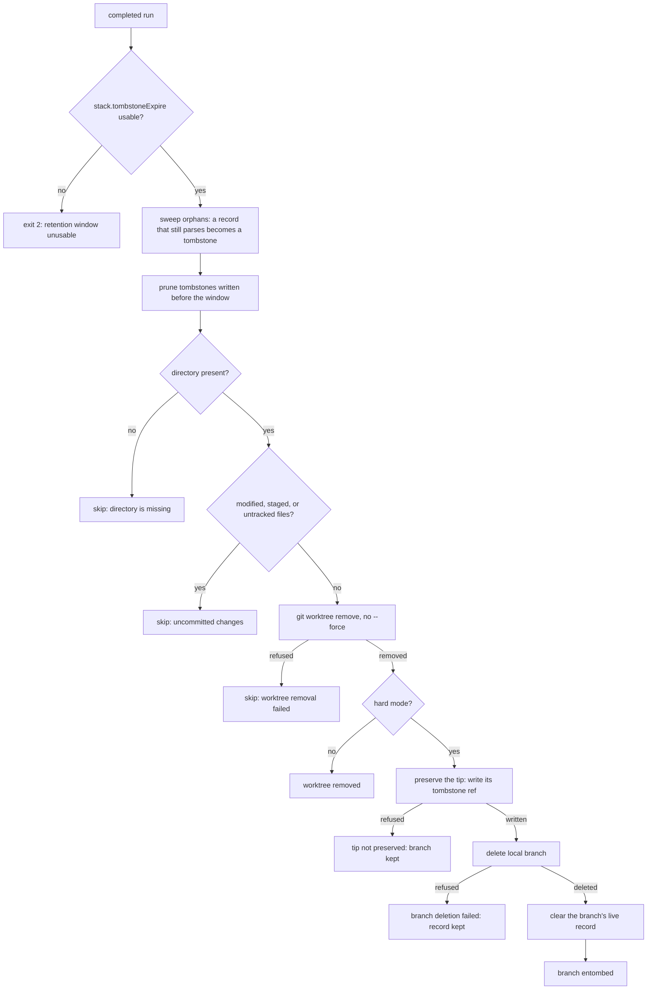

# Plonk cleanup policy

For screen readers: The following flowchart shows what a `git plonk` run does
before it looks at any worktree — check the configured tombstone window, sweep
the records of branches that no longer exist, and prune the tombstones the
window has reached. It then shows how the run decides whether a completed
worktree is removed, and when it is left in place with a reason instead, then
how a hard-mode branch's tip is preserved before the branch is deleted and its
record cleared, and how a deletion Git refuses is reported separately under
`Failed branch deletions:`; a branch whose tip could not be preserved is kept,
the worktree stays removed, the sweep continues, and the run exits 1.

_Figure 1: git-plonk completed-worktree decision flow._

## Decision

`git plonk` removes a completed worktree only when Git would discard it
unprompted. A completed worktree holding modified, staged, or untracked files
is skipped and reported, and the sweep continues with the remaining worktrees.
Nothing in the command forces a removal.

Removing a worktree is irreversible for uncommitted work, while skipping one
costs a later run. A sweep that stopped at the first dirty candidate would
leave every clean worktree behind it untouched, so the sweep steps around the
candidate it cannot remove and reports it. The report is the contract: the user
learns which worktrees were left alone and why, then decides what to do about
each one.

Hard mode does not change this. `--hard` means "delete the matching local
branch", and that branch is deleted only after its worktree has been removed,
so a skipped worktree keeps its branch. There is no `--force`-style option in
0.2.0: discarding uncommitted work remains a deliberate, separate action, such
as `git worktree remove --force` followed by `git branch -D`.

In hard mode, a local branch that Git refuses to delete does not stop the
sweep. The worktree still counts as removed, and the branch is listed under its
own `Failed branch deletions:` heading between the removal sections and the
skip section. The sweep continues with the remaining candidates, and the run
exits with status 1.

## Cleanliness rule

The preflight mirrors the check `git worktree remove` performs itself: a
worktree with modified, staged, or untracked files is refused, while files
matched by `.gitignore` are not counted, so ignored build output never protects
a worktree. Sharing the rule with Git matters in both directions. Refusing
exactly what Git refuses means a candidate is never planned for removal only to
fail, and never left in place when Git would have removed it.

A completed worktree whose directory is gone gets its own reason, because
`uncommitted changes` would be inaccurate for it. The reasons are a fixed
vocabulary:

- `uncommitted changes`: the worktree exists and Git refuses to remove it.
- `worktree directory is missing`: the recorded path is not a worktree.
- `worktree removal failed`: Git refused for another reason; the refusal is
  also reported on stderr and logged.

Skips keep the run's exit code at 0. A skip is a reported decision, not a
failure of the command. A branch Git refuses to delete is reported as a failed
deletion and the run exits 1, unlike a skip.

## Trunk discovery

Completion is judged against the principal remote's advertised default branch,
resolved through `git_donkey.remote_default`, which is the same machinery
`git donkey` uses to select an implicit base. The advertised symbolic `HEAD` is
read with `git ls-remote --symref` and the named branch is fetched explicitly
into `refs/remotes/<remote>/<branch>`; reading the advertisement and fetching
the ref are separate steps, so a query never fetches.

The local `refs/remotes/<remote>/HEAD` alias is never consulted, because a
fetch can leave it naming a branch the remote no longer advertises. Neither is
local `main`, which is not trunk in repositories that default elsewhere.
Sharing the module means the two commands cannot disagree about which branch is
the repository's trunk, which is what makes "completed" mean the same thing to
both.

## Record lifecycle

`git donkey` writes a stack record when it creates a branch from another
branch, and `git plonk` owns the end of that record's life: it is the command
that deletes branches, so it is the command that can preserve what the deletion
would otherwise take with it. A hard-mode branch's tip is written to the
tombstone ref `refs/stack-tombstones/<branch>` while the branch still names it,
the branch is then deleted, and the live record — the four
`branch.<name>.stack*` keys and the `refs/stack-bases/<branch>` anchor — is
cleared last, once the branch has gone. The tombstone is written before the
deletion because the reverse order loses the tip outright: the branch's reflog
and its whole `branch.<name>` configuration section go with the ref. A crash
between the steps therefore leaves a tombstone beside a live record, with the
branch itself still there.

That state is benign rather than something to repair. The branch keeps the
record that attests its own boundary, and the tombstone beside it is evidence
that a deletion started, not that it finished. It is reached deliberately as
well as by a crash: when Git refuses the deletion — the branch is held by
another worktree, or a reference-transaction hook says no — the run stops
before the record is cleared. The sweep leaves it alone, because the sweep
resolves only records whose branch is gone: clearing a live branch's record in
the name of tidying up would destroy the only attestation of that branch's
boundary, and leave the branch in place. The state resolves itself in whichever
direction the branch's fate takes — a later completed run that deletes the
branch rewrites the tombstone with the tip that deletion observed, and a branch
that is kept leaves a tombstone that expires on the usual horizon like any
other.

For the same reason, a branch whose entombment fails is not deleted at all. The
tip is the one thing the deletion was about to make unrecoverable.

A tombstone preserves the tip, not the reflog, and that limit is real: a
tombstone rescues the parent's identity and its boundary commit, but it does
not restore fork-point recovery, because `git merge-base --fork-point` reads a
reflog that went with the branch.

The sweep maintains the record-to-branch subset: the record namespace must
never outlive the branch namespace, or a surviving `refs/stack-bases/<branch>`
can block a ref that shares its path. It runs once per completed run, before
the first worktree is removed, and never in soft mode, whose contract is to
leave Git state untouched. Two kinds of orphan are found and they are not the
same thing. A branch whose ref alone was removed —
`git update-ref -d refs/heads/<name>` — still has a record that parses, so the
sweep converts it into a tombstone naming the tip it recorded. A branch deleted
with plain `git branch -D` takes its configuration with it, leaving an anchor
that names a base and no tip; the sweep clears that orphan without inventing a
tombstone from the anchor, which would record the base as the tip and be
confidently wrong about the very fact the tombstone exists to carry. An orphan
whose tombstone already stands keeps the tombstone it has, because a tip
observed before the deletion is never replaced by one recorded earlier.

Tombstones do not accumulate. The window is `stack.tombstoneExpire`, a Git date
expression defaulting to `90.days.ago`, the same horizon as Git's own
`gc.reflogExpire`. It is resolved and validated before the run touches
anything, because Git reads a date expression it cannot parse as _now_, and a
window of no length would prune every tombstone in the repository: an unusable
value exits 2 with the offending value named. The age of a tombstone is the
time in its own reflog, which is why every tombstone write creates one, and a
tombstone whose age cannot be read is kept, so an unreadable timestamp never
shortens a parent's life.

## Reporting

The summary lists removed worktrees, deleted branches, and removed generated
paths under their own headings, then lists every skipped worktree with its
reason. A branch Git refused to delete is listed under its own
`Failed branch deletions:` heading, between the removal headings and the skip
list. It is deliberately absent from both the removed-branches and
skipped-worktrees lists. Skips are reported in `--dry-run` runs as well,
because a preview that hid them would misrepresent the run it previews. A run
in which every candidate was skipped reports those skips rather than claiming
that no matching worktrees were found.

The record sections follow the failure section: entombed branches, then swept
records split by whether a tip survived, then pruned tombstones. The split is
not cosmetic. Reporting a rescued orphan and a cleared one under one heading
would claim a recovery that never happened, so which of the two sections an
orphan lands in is part of the contract rather than a detail of the rendering.
An entombment that fails is reported beside the branch it kept, and a prune
names the window it applied, so a mistyped `stack.tombstoneExpire` is visible
in the summary rather than silently effective. A section with no entries is
omitted, and a dry run states what a sweep or a prune would do in the same
planned wording the removal sections use.

## Verification contract

Unit tests drive the workflow with recording fakes and assert that removal is
issued without `--force`, that a dirty candidate is skipped while its clean
sibling is still removed, and that a skipped candidate keeps its branch in hard
mode. Tests also assert that a refused branch deletion keeps the later
candidates running, keeps the worktree in the removed list, keeps the branch
out of both the removed-branches and skipped-worktrees lists, exits 1, and
records a bounded failure observation. A parameterized test compares the
preflight against a real `git worktree remove` for clean, modified, staged,
untracked, and ignored files, asserting both the classification and the actual
Git outcome. Behavioural tests run the command against real temporary
repositories for a tracked modification, a staged change, an untracked file,
ignored build output, and mixed clean and dirty batches.

The record lifecycle is covered at both levels. Unit tests pin the ordering —
the tombstone is written while the branch still names the tip, and the record
is cleared only once the branch has gone — that a branch whose tip could not be
preserved is not deleted and exits 1, that a refused deletion keeps the record
beside the branch, that a record Git will not clear after its branch has gone
is reported and the run carries on, that a sweep reports the orphan whose tip
it preserved apart from the one it cleared, that a prune reports the window it
applied, and that an unusable window stops the run before any write. The store
itself is exercised against real repositories, including the read half
`git wheresat` shares, the refusal of an empty expiry, and the rule that a
tombstone whose age cannot be read is kept. Behavioural tests in
`tests/integration/test_git_plonk_stack_bdd.py` run the command over real
repositories and assert the artefacts a sweep leaves behind — the tombstone
naming the tip the branch held, the anchor and record cleared with it, the
record a dry run leaves untouched, both sweep outcomes, and the pruned
tombstone — rather than only the wording of the report.

Trunk discovery is covered by a regression test that points
`refs/remotes/origin/HEAD` at a stale branch and asserts that completion is
still judged against the advertised default, alongside tests for a non-`main`
advertised default, a missing remote, and an unavailable advertisement.
