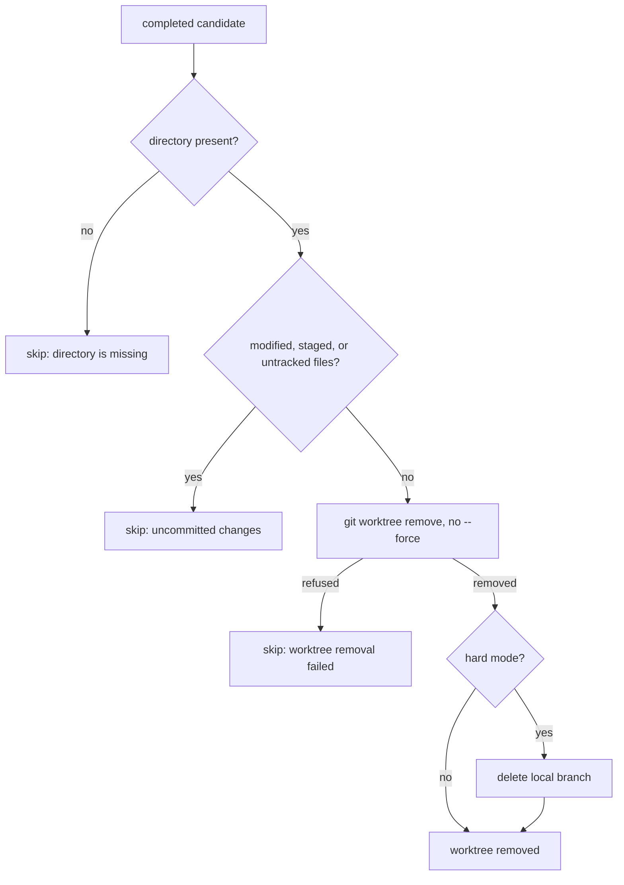

# Plonk cleanup policy

For screen readers: The following flowchart shows how `git plonk` decides
whether a completed worktree is removed, and when it is left in place with a
reason instead.

_Figure 1: git-plonk completed-worktree decision flow._

## Decision

`git plonk` removes a completed worktree only when Git would discard it
unprompted. A completed worktree holding modified, staged, or untracked files
is skipped and reported, and the sweep continues with the remaining worktrees.
Nothing in the command forces a removal.

Removing a worktree is irreversible for uncommitted work, while skipping one
costs a later run. A sweep that stopped at the first dirty candidate would
leave every clean worktree behind it untouched, so the sweep steps around the
candidate it cannot remove and reports it. The report is the contract: the user
learns which worktrees were left alone and why, then decides what to do about
each one.

Hard mode does not change this. `--hard` means "delete the matching local
branch", and that branch is deleted only after its worktree has been removed,
so a skipped worktree keeps its branch. There is no `--force`-style option in
0.2.0: discarding uncommitted work remains a deliberate, separate action, such
as `git worktree remove --force` followed by `git branch -D`.

## Cleanliness rule

The preflight mirrors the check `git worktree remove` performs itself: a
worktree with modified, staged, or untracked files is refused, while files
matched by `.gitignore` are not counted, so ignored build output never protects
a worktree. Sharing the rule with Git matters in both directions.
Refusing exactly what Git refuses means a candidate is never planned for
removal only to fail, and never left in place when Git would have removed it.

A completed worktree whose directory is gone gets its own reason, because
`uncommitted changes` would be inaccurate for it. The reasons are a fixed
vocabulary:

- `uncommitted changes`: the worktree exists and Git refuses to remove it.
- `worktree directory is missing`: the recorded path is not a worktree.
- `worktree removal failed`: Git refused for another reason; the refusal is
  also reported on stderr and logged.

Skips keep the run's exit code at 0. A skip is a reported decision, not a
failure of the command.

## Trunk discovery

Completion is judged against the principal remote's advertised default branch,
resolved through `git_donkey.remote_default`, which is the same machinery
`git donkey` uses to select an implicit base. The advertised symbolic `HEAD` is
read with `git ls-remote --symref` and the named branch is fetched explicitly
into `refs/remotes/<remote>/<branch>`.

The local `refs/remotes/<remote>/HEAD` alias is never consulted, because a
fetch can leave it naming a branch the remote no longer advertises. Neither is
local `main`, which is not trunk in repositories that default elsewhere.
Sharing the module means the two commands cannot disagree about which branch is
the repository's trunk, which is what makes "completed" mean the same thing to
both.

## Reporting

The summary lists removed worktrees, deleted branches, and removed generated
paths under their own headings, then lists every skipped worktree with its
reason. Skips are reported in `--dry-run` runs as well, because a preview that
hid them would misrepresent the run it previews. A run in which every candidate
was skipped reports those skips rather than claiming that no matching worktrees
were found.

## Verification contract

Unit tests drive the workflow with recording fakes and assert that removal is
issued without `--force`, that a dirty candidate is skipped while its clean
sibling is still removed, and that a skipped candidate keeps its branch in hard
mode. A parameterised test compares the preflight against a real
`git worktree remove` for clean, modified, staged, untracked, and ignored
files, asserting both the classification and the actual Git outcome.
Behavioural tests run the command against real temporary repositories for dirty
tracked work, untracked files, ignored build output, and mixed clean and dirty
batches.

Trunk discovery is covered by a regression test that points
`refs/remotes/origin/HEAD` at a stale branch and asserts that completion is
still judged against the advertised default, alongside tests for a non-`main`
advertised default, a missing remote, and an unavailable advertisement.
