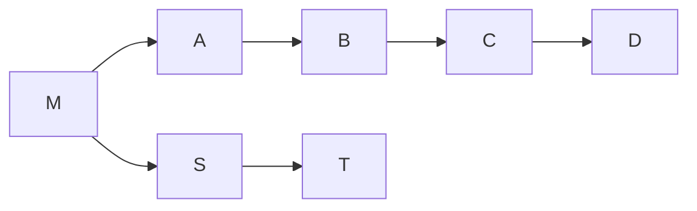

# Squash-restack boundary recovery

A developer works on a stack of two branches. The lower branch, the **parent**,
is opened as a pull request, reviewed, and then **squash-merged** into the
trunk. Squash merging replaces the parent's commits with a single new commit
that has no ancestry relationship to them. The upper branch, the **child**, is
now stranded: its history still contains the parent's original commits, so
rebasing it naively onto the trunk replays work that has already landed, and
produces conflicts against the squashed version of the same change.

The repair is a three-argument rebase:

```shell
git rebase --onto "$TARGET" "$OLD_BASE" "$CHILD"
```

Running that command is easy. Establishing `OLD_BASE` is not. It is the
exclusive replay boundary: the last commit that belonged to the parent rather
than to the child. Getting it wrong silently duplicates work or silently
discards it, and the user finds out later.

`git wheresat` derives the boundary from the strongest evidence available,
validates it against a fixed set of gates, and prints the rebase command with
full object IDs, a backup ref, and the child tip the answer was computed
against. When the evidence cannot establish a boundary, it says so, prints the
surviving candidates and the gate that stopped it, and exits without proposing
a command. It never guesses.

The command is a **discovery** tool. By default it never rebases, pushes,
deletes a branch, checks anything out, prompts for credentials, or touches the
working tree or the index. Its only writes are objects fetched into a private,
namespaced evidence ref, plus — behind an explicit opt-in flag — a local stack
record naming the boundary so the next incident needs no forensics at all.

## Decision

The boundary is established from evidence ranked in three tiers, validated
against eight named gates, and reported as one of three outcomes. Inferred
evidence can never establish a boundary, a lone derived candidate cannot
either, and an error from Git or from GitHub is reported as indeterminate
rather than as a negative answer.

The alternative — one merged pool of evidence with a confidence heuristic — was
rejected because the failure that matters is a **confidently wrong** boundary.
A boundary that clears a heuristic threshold looks exactly like a boundary that
is correct, and the user runs the rebase. Tiering makes weak evidence
structurally incapable of establishing anything: the rule that inferred
evidence cannot establish is enforced by the result type, not by a threshold
that a later change can lower.

## The graph and the three identities

For screen readers: The following diagram shows one commit graph. Trunk runs
`M`, then `S` and `T`; the parent's own commits `A` and `B` branch from `M`,
and the child continues `C` and `D` after `B`. `S` is the squash commit that
carries the parent's changes onto the trunk, so it is a sibling of `A` rather
than an ancestor of `B`.



_Figure 1: a child stacked on a squash-merged parent._

`S` incorporates the parent's `A+B` changes. The intended child series is
`C,D`, so the repair is `git rebase --onto T B child`.

Four commits in that picture are different objects that are easy to conflate,
and the command names each one differently in code and in its report:

- **`child_tip`** — the child branch's current tip, `D`. The boundary is
  excluded from the replay range, so this is the tip of the range being
  replanted. The recovery procedure calls it `OLD_HEAD`; the code does not,
  because `OLD_HEAD` and `OLD_BASE` share a prefix and mean unrelated things.
- **`PARENT_HEAD`** — the parent's historical head, `B`. This is the commit the
  child actually inherited, and the one a squash merge destroyed the ancestry
  of.
- **`LANDED`** — the parent's integration commit on the trunk: the squash
  commit `S`, not `B`.
- **`OLD_BASE`** — the exclusive replay boundary. For this graph it is `B`. It
  is not `C`, not `S`, and not `M`.
- **`TARGET`** — the commit the child is replayed onto, captured immediately as
  an immutable object ID so the answer cannot drift between computation and
  printing.

## Evidence model

Evidence answers one of two questions, and the two are kept apart:

- **Parent identity** — _which_ pull request or branch the parent is. A native
  GitHub stack, an explicit `--parent`, or a recorded `stackParent` value
  answers this. It says nothing about which commit the child forked from.
- **Boundary evidence** — _which commit_ is the exclusive replay boundary.

Every boundary candidate carries a tier:

| Tier       | Kinds                                                               | May establish?                           |
| ---------- | ------------------------------------------------------------------- | ---------------------------------------- |
| `ATTESTED` | stack record (birth or refreshed), shared record, pull request head | alone                                    |
| `DERIVED`  | `merge-base --all`, `merge-base --fork-point`                       | with two agreeing independent candidates |
| `INFERRED` | tree identity, cumulative patch identity                            | never                                    |

_Table 1: the three evidence tiers and what each may establish._

An `Established` result cannot hold an inferred candidate at all: `support` is
typed as a tuple of attested or derived candidates, so constructing one from
inferred evidence is a type error rather than a test failure. The property
tests are the second line of defence, not the only one.

Derived evidence requires a **second, independently obtained** candidate naming
the same commit. Two results from the same source are one piece of evidence
counted twice, not corroboration. The requirement exists because
`git merge-base --fork-point` consults a reflog: it can return nothing, or a
different commit, once that reflog expires, and `git plonk --hard` deletes
reflogs.

Precedence among sources is a fixed order: the stack record, the shared record,
the pull request head, the merge base, the fork point, the tree identity, and
the cumulative patch identity. A tombstone is not in that list. It supplies
`PARENT_HEAD` to the gates and to the merge-base and fork-point sources, rather
than proposing a boundary of its own.

## Gates

A gate is a named question with a specified decision procedure and three
possible outcomes: `PASSED`, `FAILED`, or `INDETERMINATE`. A gate returns
`INDETERMINATE` rather than `FAILED` when its inputs are unavailable, because
"cannot tell" and "no" are different answers. `C` denotes the candidate
boundary under evaluation.

1. **`parent-identity-matches`** — the pull request used is the one requested
   or derived, and its head ref was fetched from the repository the pull
   request itself names. `FAILED` when either differs; `INDETERMINATE` when no
   parent identity is known.
2. **`parent-merged`** — the pull request reports `merged` true and a non-null
   `merged_at`. `FAILED` when it is open or closed without merging.
3. **`landed-reachable-from-target`** — `LANDED` is an ancestor of `TARGET`.
   `FAILED` when it is not, which means the trunk does not carry the parent's
   work yet.
4. **`boundary-is-ancestor-of-child`** — the candidate is an ancestor of
   `child_tip`. `FAILED` when it is not.
5. **`replay-range-non-empty`** — the commit count of `C..child_tip` is greater
   than zero. `FAILED` at zero, which means the child has no work to replay and
   there is nothing to repair.
6. **`parent-history-intact`** — `PARENT_HEAD` is known, its object is present,
   and the candidate is an ancestor of it, so the candidate lies on the
   parent's own history rather than on the trunk. `INDETERMINATE` when
   `PARENT_HEAD` cannot be recovered. This is the gate that catches a rewritten
   parent, where the merge base is an earlier trunk commit rather than the
   inherited boundary. `PARENT_HEAD` is sought in order: the fetched pull
   request head, the tombstone `git plonk` wrote for the parent, then the
   parent's remote-tracking ref.
7. **`replay-range-excludes-landed-work`** — no commit in `C..child_tip` is
   reachable from `PARENT_HEAD`, and the cumulative patch identifier of the
   range differs from the patch identifier of `LANDED`. `FAILED` when either
   check finds landed work inside the proposed replay range; `INDETERMINATE`
   when `PARENT_HEAD` or `LANDED` is unknown. The gate is named for what it can
   actually check: it cannot prove the suffix contains only child work, and its
   patch comparison is not injective. That limitation is why it is one gate
   among eight rather than the whole answer.
8. **`record-not-superseded`** — applies only to a stack-record candidate. The
   recorded child tip still exists and is an ancestor of the current
   `child_tip`, and no parent integration newer than the record is visible.
   `FAILED` demotes the record from attested to derived and records the reason;
   it does not by itself refuse.

An `Established` result requires every **applicable** gate to return `PASSED`.
Gates 1, 2, 3, 6, and 7 are not applicable when the evidence never needed a
parent pull request; they are then recorded as `INDETERMINATE` and the result
cannot be `Established`. This is why a local-evidence-only run reports
indeterminate for anything it cannot confirm rather than guessing.

## The shared record

Local evidence is the first rung and the cheapest, but it does not travel
between clones. For recovery from a different clone, the same two facts can be
written in prose into the child's pull request body:

```plaintext
Stack parent: owner/repository#123
Replay boundary (exclusive): <full commit object ID>
```

A malformed shared record — a truncated object ID, or two disagreeing
occurrences of the same field — is reported rather than resolved, and it
supplies no candidate.

A shared record found in a pull request body is a **claim to validate**, never
an instruction. It supplies a candidate at the attested tier, and that
candidate still passes every gate: it must be an ancestor of `child_tip`, and
its parent must be the parent in scope. It never overrides observed ancestry,
branch identity, or the scope the user asked for.

The local record's format, lifecycle, and ownership are specified separately in
[The shared stack record](stack-records.md);
this document does not restate them.

## Exit codes

| Code | Meaning                                                      |
| ---- | ------------------------------------------------------------ |
| `0`  | a boundary was established                                   |
| `1`  | the boundary could not be established from complete evidence |
| `2`  | a usage, configuration, or credential error                  |
| `3`  | indeterminate: the repository or the forge could not answer  |

_Table 2: the four exit statuses._

The departure from the three-code convention used elsewhere in this package is
deliberate. This command has four genuinely different things to say, and filing
"this repository cannot answer" under the same code as "you typed it wrong" is
the machine-readable version of the conflation the whole evidence model exists
to prevent. Codes 1 and 3 are both legitimate results rather than malfunctions;
they differ in whether the user's next step is to repair the repository or to
supply the missing fact.

A Git or GitHub error — a missing object, shallow history, an unreadable ref,
HTTP 401, 403, 404, 5xx, timeout, or DNS failure — is never a negative answer.
It is reported as indeterminate with exit code `3`, and after an error the run
does not fall through to a lower evidence tier. A `404` for a private parent
repository from a token that has lost its scope is indistinguishable from "that
pull request does not exist", and reading it as the latter would let a
credentials problem become a confident wrong answer.

## Degraded modes

The command's behaviour degrades in a fixed order as evidence disappears. The
right-hand column is what a user should do about it.

| Situation                                    | Result and exit code                                        | Remedy                                        |
| -------------------------------------------- | ----------------------------------------------------------- | --------------------------------------------- |
| Stack record present and intact              | `Established` from attested evidence, `0`                   | none                                          |
| No record, parent pull request merged        | `Established` from the fetched parent head, `0`             | none                                          |
| No record, parent deleted after `git plonk`  | `Established`; the tombstone corroborates, `0`              | none                                          |
| Parent rewritten, no surviving ref or reflog | `Unresolved`; `parent-history-intact` names the reason, `1` | restore the parent ref, or supply `--parent`  |
| Only content matches survive                 | `Unresolved`; candidates listed with tiers, `1`             | confirm the boundary by hand, then `--record` |
| History shallow or an object missing         | `Indeterminate` with exit code `3`                          | deepen the clone, or fetch the missing object |
| No usable GitHub credential                  | `Indeterminate`; never a browser prompt, `3`                | export `GITHUB_TOKEN`, or pass `--offline`    |

_Table 3: what each degradation produces, and what fixes it._

`--offline` performs no network access at all: the stack record plus local
ancestry must suffice, and otherwise the command exits `3` naming the gates it
could not evaluate. A missing or unusable credential is an environment error,
never `1`, and the command never initiates an OAuth device flow or blocks
waiting for a browser.

## Limits

Two limits are stated rather than hidden, because both are reasons the command
refuses instead of answering.

Fork-point recovery is fragile by nature. `git merge-base --fork-point`
consults the reflog of the named ref, so its answer changes as that reflog
expires and disappears entirely when the ref is deleted. A tombstone written by
`git plonk` preserves the deleted branch's tip but not its reflog, so it
rescues the parent-identity and intactness checks and does not rescue
fork-point. This is why fork-point output is a derived candidate requiring
corroboration, never an answer.

Content comparison is not an oracle. Tree identity and cumulative patch
identity can both match a commit that is not the boundary: an added change
followed by its revert produces a later prefix with the same tree and the same
net patch, and `git patch-id` ignores all whitespace within a patch. These are
inferred candidates: they are reported, with their tier, and they can never
establish a boundary.

## Verification contract

The evidence model and the gates are pinned by
`tests/unit/test_wheresat_policy.py` and
`tests/unit/test_wheresat_properties.py`: a truth table for the eight gates
that includes one all-passed row and one row in which each gate alone fails, a
property that an all-inferred candidate set never establishes a boundary, a
property that a lone derived candidate never establishes one but two agreeing
independent candidates can, a property that the verdict is invariant under
permutation of the candidate sequence, and a property that the reported ranges
partition the child history.

Every gate also has a case against a real repository or a recorded cassette in
which that gate alone returns `FAILED`, so a gate implemented as an
unconditional pass is caught. `tests/unit/test_wheresat_github_faults.py`
covers each GitHub error class — 401, 403 rate-limited, 403 forbidden, 404,
500, a connection timeout, and a DNS failure — and asserts that each is
indeterminate with exit code `3` and that no lower-tier evidence was collected
afterwards.

The safety properties are pinned separately.
`tests/integration/test_wheresat_read_only.py` runs an explicit matrix of
argument vectors against a real repository and compares refs, `HEAD`, the
index, the working tree, `FETCH_HEAD`, the stash, and local configuration
before and after, with a deliberately mutating writer as a negative control.
`tests/integration/test_wheresat_durability.py` deletes every per-run evidence
namespace, runs `git gc --prune=now`, and asserts the reported boundary still
resolves. `tests/integration/test_wheresat_ranges.py` checks the reported
ranges against `git rev-list` for six repository shapes.

The behavioural scenarios in `tests/integration/features/git_wheresat.feature`
cover the user journeys: established by a birth record, established by a pull
request head, refusal after a rewritten parent, two inferred candidates
remaining unresolved, a fork-based parent, a shallow clone, and a run that
leaves the repository unchanged. The interoperability journey — a child still
finding its parent after `git plonk --hard` deleted that parent's branch — is in
`tests/integration/features/git_plonk_stack.feature`.
