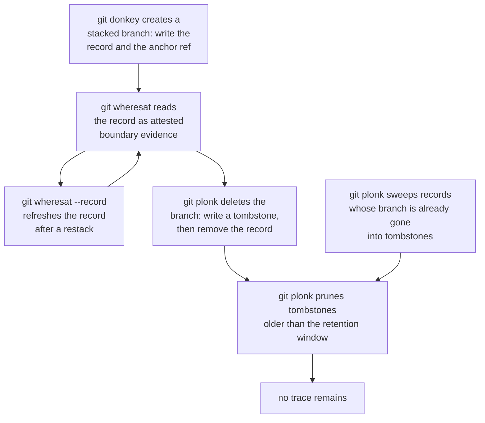

# The shared stack record

Three commands in this package now agree about one artefact. `git donkey`
writes a **stack record** when it creates a branch from a base that is not the
trunk; `git wheresat` reads that record as its strongest evidence and refreshes
it under `--record`; `git plonk` converts it into a **tombstone** before it
deletes the branch and sweeps records whose branch has gone.

The record exists because the two commands either side of it used to undo each
other. `git donkey` resolved the base commit at branch birth and then discarded
it, so the only way to recover the fact later was forensics. `git plonk --hard`
deletes a completed branch with `git branch -D`, which removes the branch ref,
its reflog, and the whole `branch.<name>` configuration section with it, so the
forensics had nothing left to read. One observation made at the instant it was
true is worth more than any amount of reconstruction, and one preserved tip is
worth more than a reflog that no longer exists.

For screen readers: The following diagram traces one stack record from the
branch birth that creates it, through the reads and refreshes `git wheresat`
performs, to the tombstone `git plonk` writes when it deletes the branch, and
finally to the prune that removes the tombstone after the retention window.



_Figure 1: the stack-record lifecycle across three commands._

## Decision

There is exactly one record format, one pair of owning modules, and one
lifecycle. No command parses a record key, builds a record ref path, or decides
the lifecycle for itself; each command reaches the artefact through
`git_donkey.stack_records` for the format and its pure decisions, and
`git_donkey.stack_store` for every read and every write.

The alternative — a private format per command — was rejected because three
private parsers of one artefact diverge, and the divergence is silent: the
writer and the reader disagree about a key name, and the reader reports a
missing record rather than a bug. One format module and one store module cannot
diverge from themselves.

The commands stay ignorant of each other. Neither `git donkey` nor `git plonk`
learns anything about pull requests, squash merges, or evidence tiers; they
read and write one small versioned record through the same interface
`git wheresat` reads it through. That is the whole interoperability contract,
and it is a hard constraint rather than a follow-up.

## Record format

A record is split across two artefacts with different lifetimes, and each is
authoritative for the thing it is actually good at.

Configuration holds the **values**, under four keys in the branch's own
configuration section:

| Key                                     | Holds                                 |
| --------------------------------------- | ------------------------------------- |
| `branch.<branch>.stackParent`           | the parent's identity, versioned      |
| `branch.<branch>.stackBase`             | the boundary commit, a full object ID |
| `branch.<branch>.stackBaseRecordedFrom` | the child tip observed when written   |
| `branch.<branch>.stackBaseEvidence`     | the evidence kind that established it |

_Table 1: the four configuration keys that carry a record's values._

The anchor ref `refs/stack-bases/<branch>` holds the same boundary commit as
`stackBase`. It exists to keep that commit reachable, so `git gc` cannot
collect the object a surviving child depends on. It is the reachability anchor
and nothing more.

A tombstone is the ref `refs/stack-tombstones/<branch>`, alone. It names the
tip the branch had when it was deleted, and it carries no configuration,
because the configuration section is already gone by the time it is written.

`stackParent` values are versioned so that a later revision can add a field
without a reader from this revision misinterpreting it:

```plaintext
v1:branch:<branch-name>
v1:pr:<owner>/<repository>#<number>
```

Git returns configuration variable names in lower case, so every lookup is
case-insensitive and the canonical spellings above are the lower-case ones. The
object IDs are full, never abbreviated; a record that named an abbreviation
would stop resolving as soon as an unrelated object shared the prefix.

The branch name in a `v1:branch:` value is the base ref **as it was selected**,
not a normalized branch name. When a caller names a base explicitly the stored
value is that name — so a base selected as `refs/remotes/origin/main` is stored
as such, and so is a local `main`. Reads treat it as the name of a ref, which is
what it is, and never as a name to be looked up in one particular namespace.

## Who writes what

- **Birth — `git donkey`.** When it creates a branch from a base that is not
  the trunk, it writes a record naming the parent branch and the frozen base
  commit. This is the strongest possible evidence, because it is an exact
  observation made at the instant the fact was true. A branch created from the
  trunk is not stacked and gets no record: writing one would make every branch
  look stacked, and a boundary would be offered for branches that never had a
  parent.
- **Life — `git wheresat`.** It reads the record as its highest-precedence
  evidence, validates it against everything else it can observe, and under
  `--record` refreshes it after a restack, with an expected-old check so a
  concurrent writer loses rather than silently overwriting.
- **Death — `git plonk`.** Before deleting a branch it writes
  `refs/stack-tombstones/<branch>` naming that branch's tip, then removes the
  live record. On every run it sweeps records orphaned by a plain
  `git branch -d`, and prunes tombstones older than the retention window.
  Cleanup is already plonk's job; this makes it the garbage collector for the
  stack namespace too.

A branch with no record of its own is still entombed. That is the common case,
not an edge case: a parent created from the trunk is not itself stacked, so it
has no record, yet its tip is exactly what a surviving child needs. Placing the
tombstone write before the branch deletion is required rather than optional,
because `git branch -D` always succeeds when the branch exists and there is no
refusal to fall back on.

## Reconciliation

The reader combines the two artefacts into one result, and the result is a
first-class state rather than an error:

- `StackRecord` — the configuration holds a complete, parseable record, and the
  anchor either agrees with `stackBase` or is absent. An absent anchor leaves
  the record usable, because configuration is authoritative for values; the
  caller reports it, because the boundary's object is then reachable only
  through the branch itself.
- `RecordAbsent` — no configuration and no anchor, for a branch that exists or
  does not. This is the ordinary state of most branches.
- `RecordMalformed` — an anchor without configuration, a value that does not
  parse, or an anchor that disagrees with `stackBase`. A disagreement is
  reported, never resolved by preferring one artefact.
- `RecordOrphaned` — a record whose branch no longer exists. It is reported and
  swept, and it is never used as evidence.

Configuration being authoritative for values is forced by measurement rather
than chosen for symmetry. `git branch -m <old> <new>` carries the whole
`branch.<old>` section to `branch.<new>` and leaves `refs/stack-bases/<old>`
exactly where it was, so a ref-authoritative design would silently lose the
record on every rename. Conversely `git branch -D` destroys the configuration
section entirely, which is why the tombstone has to be a ref. Splitting the
roles makes each artefact authoritative for what it is good at, and turns the
one case where they disagree into a reportable malformed record rather than a
coin toss.

## Namespace invariant

The record namespace is a subset of the branch namespace: after any
`git donkey` or `git plonk` run, every `refs/stack-bases/<branch>` has a
corresponding `refs/heads/<branch>`.

The subset matters because a Git reference and a reference directory cannot
share a path. With `refs/stack-bases/alpha` present, creating
`refs/stack-bases/alpha/beta` fails with "cannot lock ref … 'alpha' exists".
Git forbids the branches `alpha` and `alpha/beta` from coexisting for the same
reason, so while the record namespace stays a subset of the branch namespace,
the collision cannot arise. The subset is the invariant; the absence of
collisions is a consequence, and it lapses the moment a record outlives its
branch.

Three mechanisms maintain it. The reader reports a record with no branch as
orphaned and never uses it as evidence. `git plonk` sweeps orphans into
tombstones on every run. And the writer detects a directory/file collision and
reports it rather than crashing. A leaf-suffixed layout such as
`refs/stack-bases/<branch>/base` would make collisions impossible by
construction; it was rejected in favour of the flat form specified by the
boundary-recovery procedure, and it remains the recorded fallback if the subset
proves fragile in practice.

## Retention

Tombstones expire. `git plonk` prunes those older than `stack.tombstoneExpire`,
which defaults to 90 days: the same horizon as Git's own `gc.reflogExpire`, so
a tombstone lasts exactly as long as the reflog it stands in for would have.

Tombstones preserve the tip only, not the reflog. The consequence is stated
plainly because it is a real limitation: a tombstone rescues the parent's
identity and the `parent-history-intact` gate for a surviving child, but it
does not restore fork-point recovery, because `git merge-base --fork-point`
reads a reflog and the reflog was deleted with the branch.

Preserving every incarnation a branch's reflog held would need one ref per
incarnation and an expiry policy per ref, for a case — recovering a superseded
force-push of a deleted parent — that a pull request's head ref covers better.

## Operational notes

A record is local to one clone. Neither the configuration keys nor the anchor
ref travels to another clone, so recovery from elsewhere still depends on the
forensic ladder in
[Squash-restack boundary recovery](squash-restack-boundary-recovery.md), or on
a shared record written into a pull request body.

A record is removed with:

```shell
git update-ref -d "refs/stack-bases/$BRANCH"
git config --local --remove-section "branch.$BRANCH" 2>/dev/null || true
```

Prefer unsetting the four individual keys when the branch section holds other
settings, because `--remove-section` takes all of them. Removing the record for
a branch that still exists leaves nothing to clean up; the sweep only concerns
records whose branch is already gone.

A deletion through plain Git is the one case the record cannot answer for.
`git branch -D` removes the whole `branch.<name>` section along with the branch,
so the only artefact left is the anchor, which holds the base and not the tip.
The sweep reports such an orphan and clears it, but there is no recorded tip
left for it to preserve, and `git plonk` cannot tombstone a branch nobody asked
it to delete. A deletion that removes only the ref — `git update-ref -d
refs/heads/<name>`, as some scripts and other tools do — leaves the
configuration behind, and there the sweep does salvage the tip it recorded.

## Verification contract

The format and its decisions are pinned by `tests/unit/test_stack_records.py`:
round-tripping a record through render and parse, rejecting a truncated or
unversioned `stackParent`, returning `RecordAbsent` for a branch with neither
artefact, and returning `RecordMalformed` for each disagreement in the
reconciliation table. `tests/unit/test_stack_store.py` pins the namespace
invariant by comparing `git for-each-ref refs/stack-bases/` against
`refs/heads/` after each lifecycle operation.

The lifecycle is pinned by `tests/integration/test_stack_record_lifecycle.py`,
a Hypothesis `RuleBasedStateMachine` over the operations create, refresh,
rename, entomb, delete-via-plonk, delete-via-git, delete-by-ref-surgery, sweep,
and prune, run against a real temporary repository. After every step it reads
`refs/heads/`, `refs/stack-bases/`, and `refs/stack-tombstones/` in one
`for-each-ref` and the `branch.*` sections in one `config --list`, reconciles
them, and asserts that for any branch exactly one of the three states holds — no
record, a live record, or a tombstone — that the records whose branch has gone
are exactly the orphans the store reports, and that the subset invariant still
holds. Its `start` rule reaches a tombstone, a refresh, and an orphan before the
first step is generated, because the generator does not reach them reliably: a
generated step draws one of a subset of the enabled rules, and over twenty runs
a refresh was reached in fifteen of them. The negative control is a record
written beside a tombstone by hand, which the exclusivity check must reject.

The three commands' use of the record is pinned behaviourally:
`tests/integration/features/git_donkey_stack.feature` covers birth in both
directions, `tests/integration/features/git_plonk_stack.feature` covers
tombstoning, sweeping, pruning, and the dry run, and
`tests/integration/features/git_wheresat.feature` covers a child still finding
its parent after `git plonk --hard` has deleted that parent's branch.
